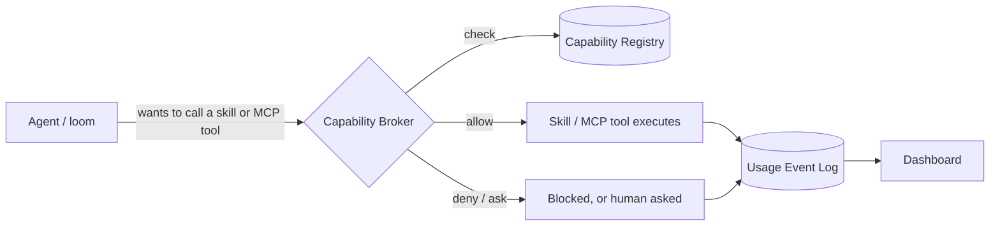

# Windrow

A registry + broker + usage-event log sitting between agents and the skills /
MCP tools they call, so access is granted on purpose and every call leaves a record. Answers the
question nothing else on this field can: "who used the Gmail MCP last week."



Full design rationale: [`docs/design/skill-mcp-governance.md`](docs/design/skill-mcp-governance.md).

## The four things being tracked

| Entity | What it is | Example |
|---|---|---|
| **Capability** | One skill or one MCP server/tool | `mcp__claude-design__write_files`, skill `code-review` |
| **Principal** | Who is asking — an agent *role* (default grants) or a specific *instance* (a real loom) | role `design-agent`, loom `claude-msqvb0zl-4` |
| **Grant** | A principal's permission to use a capability, with optional constraints/expiry | rate limit, expiry, read-only-only |
| **UsageEvent** | One invocation: who, what, when, outcome, latency | `denied`, `ok (240ms)`, `error` |

## Status

Real, not a demo: capabilities are discovered from this environment's actual skills/MCPs,
principals map to this field's real loom roster, and enforcement is live — Claude Code's
`PreToolUse`/`PostToolUse` hooks (`server/hooks/`) call the broker on every tool call and log the
real outcome. Destructive-tier capabilities with no active grant surface Claude Code's native
"ask" permission prompt instead of a silent deny, so the human answers on the loom's own card. A
second backend, Antigravity, is wired the same way (`server/hooks/agy-*.js`, see
[`docs/design/agy-adapter.md`](docs/design/agy-adapter.md)) — smoke-tested, not yet run against a
live Antigravity loom. A third, Codex CLI (`server/hooks/codex-*.js`), is scaffolded the same way
but unverified against Codex's real hook contract. See
[`docs/design/integration-todo.md`](docs/design/integration-todo.md)
for the full roadmap (items 1–8 done, item 9 — multi-backend — in progress) and
[`docs/design/deployment-boundary-decision.md`](docs/design/deployment-boundary-decision.md)
for the per-field-vs-shared tradeoff and this workspace's actual choice (shared — see below).

Usage that used to be invisible is now tracked too: any process with no Wispfield loom id (a bare
terminal running Claude Code, Antigravity, or Codex) resolves to a real "standalone" principal
instead of going ungoverned. See
[`docs/design/cross-field-and-standalone.md`](docs/design/cross-field-and-standalone.md) for that,
plus the **Fleet** dashboard page (per-field rollup + standalone breakdown) it's still useful for.

**This server is shared across every field on this machine**, not just `windrow` — other
fields (`infrastructure`) point their own hooks at this `server/hooks/*.js` by absolute path
instead of running their own copy, so all their governed usage lands in this same
`governance.db` too. See the `deploy-capability-governance-server` skill (user skills dir) to
wire up another field, or to see the per-field-isolation alternative this workspace didn't pick.

## Layout

```
server/            Express + SQLite API — registry, broker, usage log
  app.js             route wiring
  store.js           SQLite store (server/data/governance.db)
  auth.js            bearer-token check (server/data/api-token)
  config.js           discovery + hook-install paths, overridable via env var
  discovery/          scans skills + MCP config to build the capability catalog
  principals/          maps real Wispfield loom identities to principals
  hooks/               PreToolUse/PostToolUse — the real enforcement point
  rollup/              cross-field usage rollup, read-only against other fields' db files (Fleet page)
  daemon/              Windows-service wrapper files (winsw), written by service:install
  seed.js             one-time bootstrap of capabilities/principals (no fake usage events)
  migrate-json-to-sqlite.js   one-time import from the old db.json store
  backfill-inherited-grants.js   one-time backfill of inherited grants for pre-existing principals

client/             React + Vite dashboard
  src/pages/           Dashboard, Capability Catalog, Grants, Principals, Fleet, Docs
  src/components/       charts, stat tiles, invoke panel, and other shared UI
  src/api/             typed fetch client against the server API

mcp/                MCP server exposing the governance API as tools (mcp/README.md) — query and
                     manage capabilities/principals/grants/usage from inside a conversation
                     instead of curl or the dashboard. Registered project-wide via `.mcp.json`.

docs/design/        design docs — read these for the "why", not just the "what"
```

## Quality-of-life tools for agents on this field

Two things make working with this registry from inside Wispfield nicer than hitting the REST API
directly:

- **`governance` MCP server** (`mcp/`) — tools like `who_can_use`, `whoami`, `get_drift`,
  `get_usage_summary`, `grant_capability`/`revoke_grant`. See [`mcp/README.md`](mcp/README.md).
- **Skills** — `governance-lookup` (project skill, answers registry questions inline using the MCP
  tools above) and `open-capabilities-dashboard` (user skill, opens the real dashboard as a field
  card instead of a browser tab). Use the lookup skill for a specific answer folded into
  conversation; the dashboard skill when the ask is to actually *see* charts or tables.

## Setup

### Prerequisites

- **Node.js 18+** and npm (the server uses `better-sqlite3`, which needs a version Node still
  ships prebuilt binaries for; if `npm install` tries to compile from source, update Node first
  rather than installing build tools).
- **Windows** for the service-install path below; the server and client themselves are plain
  Node/Vite and run fine on any OS in dev mode.
- Nothing else to provision up front — there's no external database or service to stand up.
  SQLite lives in a single file (`server/data/governance.db`) created on first run.

### First-time dev setup

```bash
git clone <this repo>
cd windrow
npm run install:all   # npm install in both server/ and client/, from the repo root
```

Then, in two terminals:

```bash
# terminal 1 — server (http://localhost:4000/api)
cd server
npm run seed     # first run only: bootstrap capabilities + principals from this environment
npm start

# terminal 2 — client (http://localhost:5173, proxies /api to :4000)
cd client
npm run dev
```

Open `http://localhost:5173`. The dashboard should load with the capabilities/principals `npm run
seed` just created; the in-app **Setup guide** (top nav) walks through the same steps interactively
if anything looks empty.

What happens on that first run, in order:
1. `npm run seed` reads this environment's actual skills directories and MCP config
   (`server/discovery/`) to populate the capability catalog, and creates default role principals —
   no fake/demo data.
2. `npm start` creates `server/data/governance.db` (SQLite) if it doesn't exist yet, and generates
   a random API bearer token into `server/data/api-token` (gitignored) if that file is missing.
3. The Vite dev server proxies `/api/*` to `:4000` and reads the same token file automatically, so
   the client authenticates without any manual config. Every request needs `Authorization: Bearer
   <token>`; see [`docs/design/api-contract.md`](docs/design/api-contract.md) for the full endpoint
   list, request/response shapes, and the principal-mapping scheme.

### Enforcement (governance hooks)

The dashboard and API work standalone, but nothing is actually *enforced* until the PreToolUse/
PostToolUse hooks (`server/hooks/`) are wired into an agent backend's own hook config (Claude
Code's `settings.json`, Antigravity's `hooks.json`, …). That wiring is a separate step, done by the
`deploy-capability-governance-server` skill (user skills dir) rather than by `npm start` itself —
see the **Layout** section above for what the skill sets up, and
[`docs/design/deployment-boundary-decision.md`](docs/design/deployment-boundary-decision.md) for
whether to point a given field at this server directly or deploy its own copy.

### Configuration (env vars)

Everything below is optional — an unconfigured server behaves exactly as this workspace already
does. Set these only for a deployment that differs from the defaults baked into `server/config.js`:

| Env var | Purpose | Default |
|---|---|---|
| `SKILL_DIRS` | `;`-separated list of directories scanned for `SKILL.md` files | this workspace's Claude Code + Antigravity skill dirs |
| `HOOK_INSTALL_PATHS` | JSON object overriding where each backend's hook config lives, e.g. `{"claude":"C:\\...\\settings.json"}` | user-level `settings.json` (Claude), `~/.gemini/config/hooks.json` (agy) |
| `PORT` | Port the combined server (API + built client) listens on | `4000` |

### Troubleshooting

- **"npm run seed" finds nothing / empty catalog** — check `SKILL_DIRS` points somewhere with
  `SKILL.md` files, or that the default paths in `server/config.js` exist on this machine.
- **Client shows 401s against `/api`** — `server/data/api-token` may have been deleted/regenerated
  after the client cached an old one; restart `npm run dev` so the Vite proxy re-reads it.
- **Hooks aren't logging any usage** — enforcement wiring (see above) is separate from running the
  server; confirm the target backend's hook config actually points at `server/hooks/*.js` by
  absolute path.
- **Port 4000 already in use** — another instance of this server (or another field's copy, see
  "shared across every field" above) is likely already running; either stop it or set `PORT`.

### Running as a Windows service

Production deployment on this machine is the combined build (`npm run build` then `npm start` at
the repo root), registered as a Windows service so it starts on boot and restarts on crash instead
of only running in a terminal someone leaves open:

```bash
npm install                # once: pulls in node-windows
npm run build               # builds client/dist with the real API token baked in
npm run service:install      # from an ELEVATED (Run as Administrator) terminal
```

Or just double-click **`install-service.bat`** at the repo root — it re-launches itself elevated
(prompting for UAC) if it isn't already, then runs `npm run service:install` for you.
`uninstall-service.bat` does the same for removal.

`service:install` registers a service named `Windrow` running `server/index.js`
(API + `client/dist` on `http://localhost:4000`) and starts it immediately. It must be run
elevated — the Windows Service Control Manager rejects service creation from a non-admin process,
which is why this repo can prepare the service scripts but can't register the service itself.
`npm run service:uninstall` (also elevated) removes it. Manage it afterwards like any other
Windows service — `services.msc`, or `sc query Windrow` / `sc stop
Windrow` from an admin shell.

## Design docs

- [`docs/design/skill-mcp-governance.md`](docs/design/skill-mcp-governance.md) — why this exists, the data model, the broker sequence.
- [`docs/design/api-contract.md`](docs/design/api-contract.md) — endpoints, store shape, auth, principal mapping.
- [`docs/design/integration-todo.md`](docs/design/integration-todo.md) — the roadmap from "hardcoded seed data" to real enforcement, item by item.
- [`docs/design/deployment-boundary-decision.md`](docs/design/deployment-boundary-decision.md) — why per-field, not one central server, for now.
- [`docs/design/agy-adapter.md`](docs/design/agy-adapter.md) — the second enforcement backend: Antigravity's own PreToolUse/PostToolUse hooks.
- [`docs/design/cross-field-and-standalone.md`](docs/design/cross-field-and-standalone.md) — tracking usage across multiple fields (Fleet page) and standalone usage outside Wispfield.
- [`docs/design/governance-vulnerability-review.md`](docs/design/governance-vulnerability-review.md) — attack-surface review of the broker/hooks/API as currently built, ranked by severity.
- [`docs/design/adding-a-provider.md`](docs/design/adding-a-provider.md) — step-by-step workflow for wiring up a new backend adapter (the pattern `agy-adapter.md` established, generalized).
- [`docs/design/unified-interception.md`](docs/design/unified-interception.md) — whether there's a better interception point than per-provider hook JSON, and what's still manual today.
