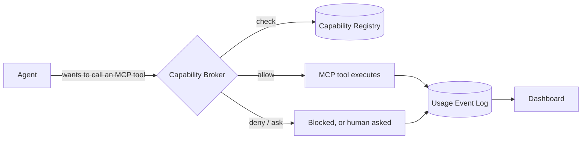
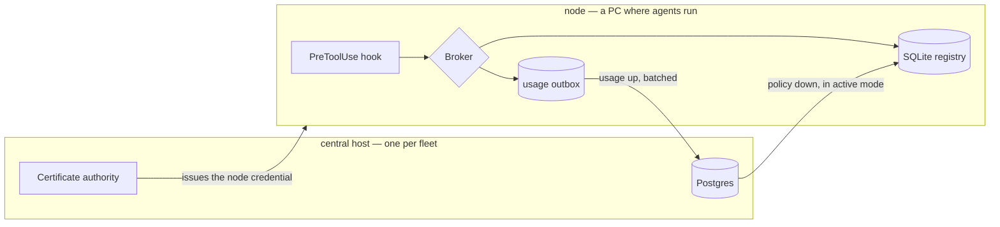

# Windrow

Windrow is a governance layer for AI agents. It sits between agents and the MCP tools they call,
so every capability is granted on purpose and every call leaves a record. It answers questions
that nothing else in an agent stack can: *who is allowed to use the Gmail MCP tools? Who actually
used them last week? What's been silently denied?* It also keeps a centralized, cross-provider
catalog of every skill available in the environment, for discoverability — skills aren't gated by
a grant the way MCP tools are, since there's no per-call hook to enforce one against.



## Quickstart

```bash
npm run install:all      # server + client dependencies
npm run setup            # one question: what is this machine?
npm start                # API on :4000, dashboard build served from client/dist
npm run dev:client       # dashboard at http://localhost:5173
```

Then wire the hooks into an agent backend and watch a call get governed —
**[docs/quickstart.md](docs/quickstart.md)** walks that end to end in about ten minutes.

> [!note]
> The dashboard lives at `http://localhost:5173`, not `:4000`. The `:4000` listener is loopback
> plaintext and grants exactly one scope — `agent`, for hooks — so a browser loads the shell there
> and then 401s on every `/api` call. See [docs/architecture.md](docs/architecture.md#two-listeners).

## Why Windrow

As agents pick up more skills and MCP tools, it gets harder to answer basic questions about who
can do what, and impossible to reconstruct what actually happened after the fact. Windrow gives
an agent environment:

- **A registry** of every MCP tool available, and who (which agent role or specific agent
  instance) is allowed to use each one — plus a catalog of every skill available, for browsing.
- **A broker** that enforces MCP tool permissions live, via Claude Code's `PreToolUse`/
  `PostToolUse` hooks (with Antigravity and Codex CLI support in progress) — so a capability with
  no grant is either denied outright or surfaced as an inline confirmation prompt to a human,
  never a silent pass-through.
- **A usage log** of every MCP tool invocation — who, what, when, and the outcome — so access can
  be audited, unused grants can be cleaned up, and denials can be investigated.
- **A dashboard** to see all of this: capabilities, principals, grants, and usage, browsable and
  filterable instead of pieced together from logs.

Full design rationale: [`docs/design/skill-mcp-governance.md`](docs/design/skill-mcp-governance.md)
(see §0 for why skills and MCP tools are governed so differently).

## The four things being tracked

| Entity | What it is | Example |
|---|---|---|
| **Capability** | One MCP server/tool. (Skills share the catalog but aren't granted or logged — see above.) | `mcp__claude-design__write_files` |
| **Principal** | Who is asking — an agent *role* (default grants) or a specific *instance* (a real running agent) | role `design-agent`, instance `claude-msqvb0zl-4` |
| **Grant** | A principal's permission to use a capability, with optional constraints/expiry | rate limit, expiry, read-only-only |
| **UsageEvent** | One invocation: who, what, when, outcome, latency | `denied`, `ok (240ms)`, `error` |

## How a deployment is shaped

A **node** is a machine where agents run. It holds a SQLite registry, serves the dashboard, and
enforces every tool call through its hooks. One node on its own is a complete, correct install.

A **fleet** adds exactly one **central host**: a Postgres, the fleet's certificate authority, and
the fleet-wide view. Central enforces nothing and no hook ever talks to it, so it is never on the
hot path of a tool call.



Nodes join by enrolling: they spend a single-use token to obtain a client certificate signed by
central's CA, and every batch afterwards travels over mutual TLS. The private key is generated on
the node and never leaves it.

| Fleet mode | Central holds | Nodes | Use it when |
|---|---|---|---|
| **Shadow** | usage, the fleet view | keep their own policy authority | Always, first. Nothing a node decides depends on central being up. |
| **Active** | the canonical capabilities and grants | read a replica, plus the deny-list | You have measured agreement with `npm run shadow:compare`. |

In **both** modes a node keeps enforcing from its local tables when central is unreachable — a
tool call never waits on the network. Switching modes is a re-run of `npm run setup`, not a
migration. See [`docs/design/global-identity-and-central-db.md`](docs/design/global-identity-and-central-db.md)
for the architecture and [`docs/setup.md`](docs/setup.md) for how to stand one up.

## Use cases

- **Least-privilege by default.** New capabilities don't sit ungranted until someone notices —
  they're picked up by a capability package with a sane default policy per risk tier, and
  mutating or destructive tools stay behind an explicit grant.
- **Answering "who can do X" without guessing.** Query the registry directly instead of grepping
  hook configs or asking each agent what it thinks it's allowed to do.
- **Auditing what actually happened.** Every call — allowed, denied, or errored — lands in the
  usage log with latency and outcome, so a security review or an incident writeup has a real
  record to pull from.
- **Finding stale or risky access.** Grants unused for 90+ days and capabilities with a high
  denial rate surface as drift, so permissions can be pruned instead of accumulating forever.
- **Governing multiple agent backends from one place.** Claude Code, Antigravity, and (in
  progress) Codex CLI all enforce through the same registry, and one server can be shared across
  every workspace on a machine rather than run per-project.
- **Working with the registry from inside a conversation.** The bundled `governance` MCP server
  and `governance-lookup`/`open-capabilities-dashboard` skills let an agent ask "who can use the
  Gmail MCP" or grant/revoke access inline, without leaving the conversation for `curl` or the
  dashboard.

## Status

Real, not a demo: capabilities are discovered from the actual skills/MCP configuration on the
machine it runs on, principals map to the real agent roster, and enforcement is live for Claude
Code. Antigravity support is smoke-tested but not yet run against a live Antigravity agent; Codex
CLI support is scaffolded but unverified against Codex's hook contract.

The fleet half is real too, and newer: a node enrolls against central, ships usage over mutual TLS,
and pulls policy from it. Shadow mode is the tested default; active mode — central as the policy
authority — works and is what `npm run shadow:compare` exists to give you confidence to switch to.
See the [issue tracker](https://github.com/ejbrahms/Windrow/issues) for the roadmap and
[`docs/design/setup-after-central.md`](docs/design/setup-after-central.md) for what the two-host
shape still assumes.


## Documentation

| | |
|---|---|
| **[Quickstart](docs/quickstart.md)** | Ten minutes from clone to a governed tool call |
| **[Architecture](docs/architecture.md)** | How the node, central and the two listeners fit together |
| **[Setup](docs/setup.md)** | Every topology, the wizard, services, troubleshooting |
| **[Configuration](docs/reference/configuration.md)** | Every environment variable |
| **[Design notes](docs/design/)** | The decision record — why the code is shaped this way |

## Built with

Node.js and Express, SQLite (`better-sqlite3`) on a node and PostgreSQL on central, React and Vite
for the dashboard, and mutual TLS for everything that is not a hook.

## License

[MIT](LICENSE).
