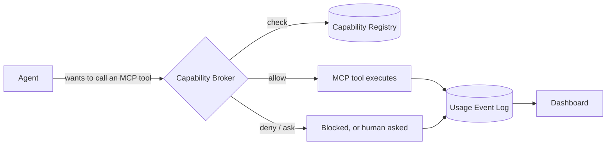

# Windrow

Windrow is a governance layer for AI agents. It sits between agents and the MCP tools they call,
so every capability is granted on purpose and every call leaves a record. It answers questions
that nothing else in an agent stack can: *who is allowed to use the Gmail MCP tools? Who actually
used them last week? What's been silently denied?* It also keeps a centralized, cross-provider
catalog of every skill available in the environment, for discoverability — skills aren't gated by
a grant the way MCP tools are, since there's no per-call hook to enforce one against.



## Why Windrow

As agents pick up more skills and MCP tools, it gets harder to answer basic questions about who
can do what, and impossible to reconstruct what actually happened after the fact. Windrow gives
an agent environment:

- **A registry** of every MCP tool available, and who (which agent role or specific agent
  instance) is allowed to use each one — plus a catalog of every skill available, for browsing.
- **A broker** that enforces MCP tool permissions live, via Claude Code's `PreToolUse`/
  `PostToolUse` hooks (with Antigravity and Codex CLI support in progress) — so a capability with
  no grant is either denied outright or surfaced as an inline confirmation prompt to a human,
  never a silent pass-through.
- **A usage log** of every MCP tool invocation — who, what, when, and the outcome — so access can
  be audited, unused grants can be cleaned up, and denials can be investigated.
- **A dashboard** to see all of this: capabilities, principals, grants, and usage, browsable and
  filterable instead of pieced together from logs.

Full design rationale: [`docs/design/skill-mcp-governance.md`](docs/design/skill-mcp-governance.md)
(see §0 for why skills and MCP tools are governed so differently).

## The four things being tracked

| Entity | What it is | Example |
|---|---|---|
| **Capability** | One MCP server/tool. (Skills share the catalog but aren't granted or logged — see above.) | `mcp__claude-design__write_files` |
| **Principal** | Who is asking — an agent *role* (default grants) or a specific *instance* (a real running agent) | role `design-agent`, instance `claude-msqvb0zl-4` |
| **Grant** | A principal's permission to use a capability, with optional constraints/expiry | rate limit, expiry, read-only-only |
| **UsageEvent** | One invocation: who, what, when, outcome, latency | `denied`, `ok (240ms)`, `error` |

## Use cases

- **Least-privilege by default.** New capabilities don't sit ungranted until someone notices —
  they're picked up by a capability package with a sane default policy per risk tier, and
  mutating or destructive tools stay behind an explicit grant.
- **Answering "who can do X" without guessing.** Query the registry directly instead of grepping
  hook configs or asking each agent what it thinks it's allowed to do.
- **Auditing what actually happened.** Every call — allowed, denied, or errored — lands in the
  usage log with latency and outcome, so a security review or an incident writeup has a real
  record to pull from.
- **Finding stale or risky access.** Grants unused for 90+ days and capabilities with a high
  denial rate surface as drift, so permissions can be pruned instead of accumulating forever.
- **Governing multiple agent backends from one place.** Claude Code, Antigravity, and (in
  progress) Codex CLI all enforce through the same registry, and one server can be shared across
  every workspace on a machine rather than run per-project.
- **Working with the registry from inside a conversation.** The bundled `governance` MCP server
  and `governance-lookup`/`open-capabilities-dashboard` skills let an agent ask "who can use the
  Gmail MCP" or grant/revoke access inline, without leaving the conversation for `curl` or the
  dashboard.

## Status

Real, not a demo: capabilities are discovered from the actual skills/MCP configuration on the
machine it runs on, principals map to the real agent roster, and enforcement is live for Claude
Code. Antigravity support is smoke-tested but not yet run against a live Antigravity agent; Codex
CLI support is scaffolded but unverified against Codex's hook contract. See
[`docs/design/integration-todo.md`](docs/design/integration-todo.md) for the full roadmap.

## Setup

### Prerequisites

- **Node.js 18+** and npm (the server uses `better-sqlite3`, which needs a Node version that
  still ships prebuilt binaries; if `npm install` tries to compile from source, update Node first
  rather than installing build tools).
- **Windows** for the service-install path below; the server and client themselves are plain
  Node/Vite and run in dev mode on any OS.
- Nothing else to provision — there's no external database to stand up. SQLite lives in a single
  file (`server/data/governance.db`), created on first run.

### Quick start

```bash
git clone <this repo>
cd windrow
npm run install:all   # npm install in both server/ and client/
```

Then, in two terminals:

```bash
# terminal 1 — server (http://localhost:4000/api)
cd server
npm run seed     # first run only: bootstrap capabilities + principals from this environment
npm start

# terminal 2 — client (http://localhost:5173, proxies /api to :4000)
cd client
npm run dev
```

Open `http://localhost:5173`. The dashboard loads with the capabilities and principals `npm run
seed` just created; the in-app **Setup guide** (top nav) walks through the same steps
interactively if anything looks empty.

On that first run: `npm run seed` scans the environment's skills directories and MCP config to
populate the capability catalog and default role principals (no demo data). `npm start` creates
`server/data/governance.db` and a random API bearer token at `server/data/api-token` if they
don't already exist. The Vite dev server proxies `/api/*` to `:4000` and reads that token
automatically, so the client authenticates with no manual config. See
[`docs/design/api-contract.md`](docs/design/api-contract.md) for the full API reference.

### Enforcing it

The dashboard and API work standalone, but nothing is actually *enforced* until the
`PreToolUse`/`PostToolUse` hooks (`server/hooks/`) are wired into an agent backend's own hook
config (Claude Code's `settings.json`, Antigravity's `hooks.json`, …). That wiring is done by the
`deploy-capability-governance-server` skill rather than by `npm start` itself — see
[`docs/design/deployment-boundary-decision.md`](docs/design/deployment-boundary-decision.md) for
whether to point a workspace at a shared server or deploy its own copy.

### Configuration

Everything below is optional; an unconfigured server uses sane defaults for a single local
workspace:

| Env var | Purpose | Default |
|---|---|---|
| `SKILL_DIRS` | `;`-separated list of directories scanned for `SKILL.md` files | this workspace's Claude Code + Antigravity skill dirs |
| `HOOK_INSTALL_PATHS` | JSON object overriding where each backend's hook config lives, e.g. `{"claude":"C:\\...\\settings.json"}` | user-level `settings.json` (Claude), `~/.gemini/config/hooks.json` (Antigravity) |
| `PORT` | Port the combined server (API + built client) listens on | `4000` |

### Troubleshooting

- **`npm run seed` finds nothing / empty catalog** — check `SKILL_DIRS` points somewhere with
  `SKILL.md` files, or that the default paths in `server/config.js` exist on this machine.
- **Client shows 401s against `/api`** — `server/data/api-token` may have been regenerated after
  the client cached an old one; restart `npm run dev` so the Vite proxy re-reads it.
- **Hooks aren't logging any usage** — enforcement wiring (above) is separate from running the
  server; confirm the target backend's hook config points at `server/hooks/*.js` by absolute path.
- **Port 4000 already in use** — another instance of this server is likely already running;
  either stop it or set `PORT`.

### Running as a Windows service

For production use on a given machine, build the combined server + client and register it as a
Windows service so it starts on boot and restarts on crash:

```bash
npm install                 # once: pulls in node-windows
npm run build                # builds client/dist with the real API token baked in
npm run service:install       # from an ELEVATED (Run as Administrator) terminal
```

Or double-click **`install-service.bat`** at the repo root — it re-launches itself elevated
(prompting for UAC) if needed, then runs `npm run service:install`. `uninstall-service.bat` does
the same for removal.

This registers a service named `Windrow` running `server/index.js` (API + `client/dist` on
`http://localhost:4000`) and starts it immediately; it must be run elevated, since the Windows
Service Control Manager rejects service creation from a non-admin process. Manage it afterward
like any other Windows service — `services.msc`, or `sc query Windrow` / `sc stop Windrow` from
an admin shell.

## Project layout

```
server/            Express + SQLite API — registry, broker, usage log
  app.js             route wiring
  store.js           SQLite store (server/data/governance.db)
  auth.js            bearer-token check (server/data/api-token)
  config.js           discovery + hook-install paths, overridable via env var
  discovery/          scans skills + MCP config to build the capability catalog
  principals/          maps real agent identities to principals
  providers.js         install/uninstall a backend's PreToolUse/PostToolUse hooks into its own config file
  packages.js          capability packages — default grant policy per capability owner
  hooks/               PreToolUse/PostToolUse — the real enforcement point
  rollup/              cross-workspace usage rollup (Fleet page)
  daemon/              Windows-service wrapper files (winsw)
  seed.js             one-time bootstrap of capabilities/principals

client/             React + Vite dashboard
  src/pages/           Dashboard, Capability Catalog, Grants, Principals, Providers & Integrations, Fleet, Docs
  src/components/       charts, stat tiles, invoke panel, capability filter bar, and other shared UI
  src/api/             typed fetch client against the server API

mcp/                MCP server exposing the governance API as tools (mcp/README.md) — query and
                     manage capabilities/principals/grants/usage from inside a conversation

docs/design/        design docs covering the rationale behind the system
```

## Further reading

- [`docs/design/skill-mcp-governance.md`](docs/design/skill-mcp-governance.md) — why this exists, the data model, the broker sequence.
- [`docs/design/api-contract.md`](docs/design/api-contract.md) — endpoints, store shape, auth, principal mapping.
- [`docs/design/integration-todo.md`](docs/design/integration-todo.md) — the roadmap toward full multi-backend enforcement.
- [`docs/design/deployment-boundary-decision.md`](docs/design/deployment-boundary-decision.md) — per-workspace vs. shared server deployment.
- [`docs/design/agy-adapter.md`](docs/design/agy-adapter.md) — the Antigravity enforcement backend.
- [`docs/design/cross-field-and-standalone.md`](docs/design/cross-field-and-standalone.md) — tracking usage across workspaces and outside any tracked agent runtime.
- [`docs/design/adding-a-provider.md`](docs/design/adding-a-provider.md) — how to wire up a new backend adapter.
- [`docs/design/unified-interception.md`](docs/design/unified-interception.md) — interception-point tradeoffs and what's still manual today.
- [`docs/design/capability-packages.md`](docs/design/capability-packages.md) — default-grant packages and per-risk-tier policy.
- [`mcp/README.md`](mcp/README.md) — the `governance` MCP server's tools.
