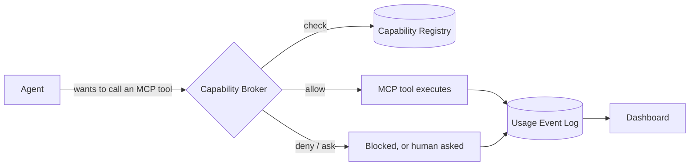
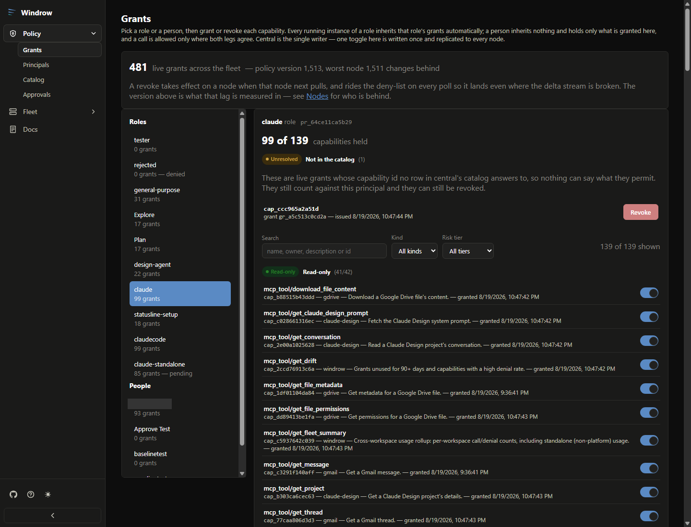
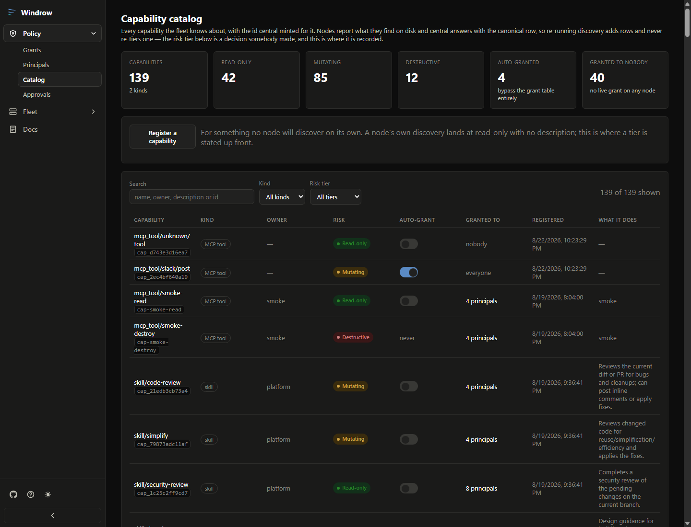
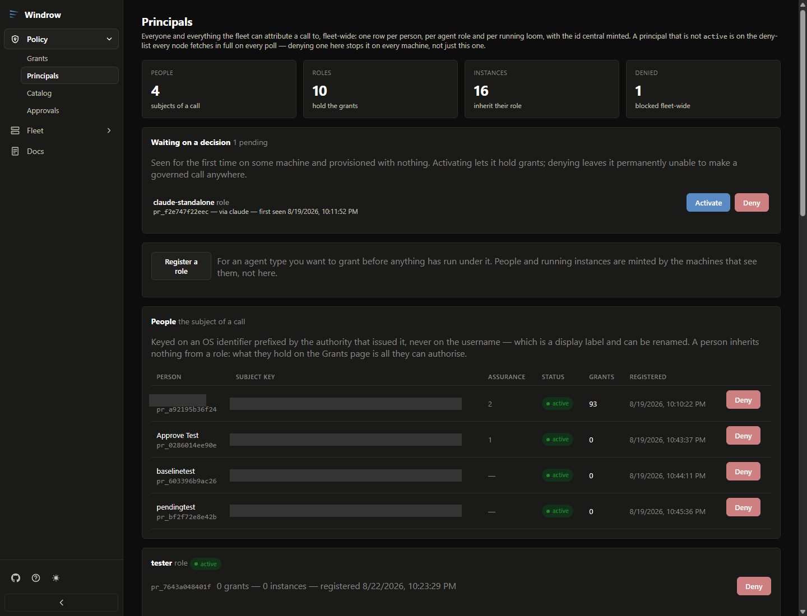
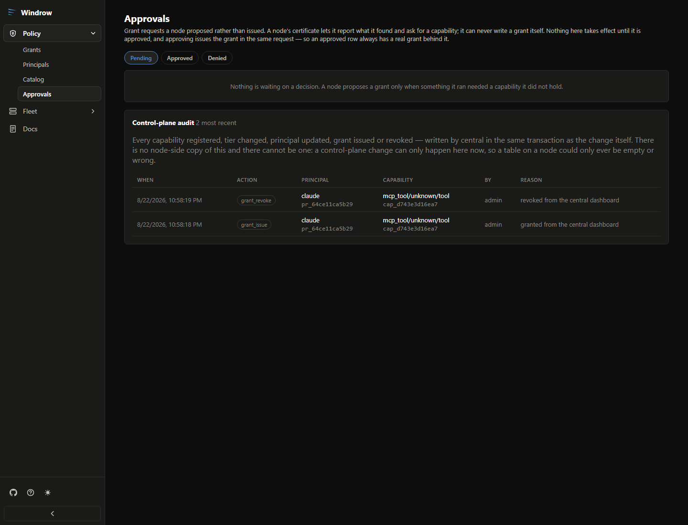
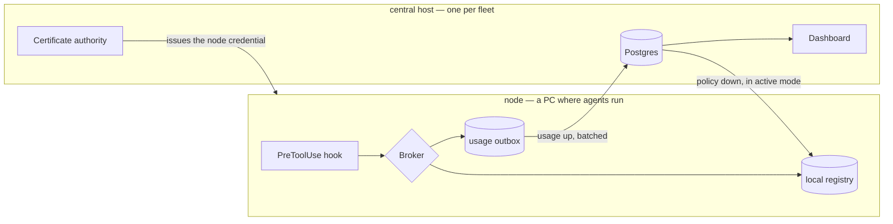

# Windrow

[](https://github.com/ejbrahms/Windrow/actions/workflows/ci.yml)
[](LICENSE)
[-339933?logo=node.js&logoColor=white)](https://nodejs.org)
[](CONTRIBUTING.md)
[](https://windrow-gray.vercel.app)

**Platforms:** the server and client are plain Node and Vite and run on **any OS** (macOS, Linux,
Windows). Only the node's `service:install` is Windows-only; central runs as a Docker container
anywhere Docker does. See [docs/setup.md](docs/setup.md#every-machine).

Windrow is a governance layer for AI agents. It sits between agents and the MCP tools they call,
so every capability is granted on purpose and every call leaves a record. It answers questions
that nothing else in an agent stack can: *who is allowed to use the Gmail MCP tools? Who actually
used them last week? What's been silently denied?* It also keeps a centralized, cross-provider
catalog of every skill available in the environment, for discoverability — skills aren't gated by
a grant the way MCP tools are, since there's no per-call hook to enforce one against.



## Quickstart

```bash
npm run install:all          # server + client dependencies
npm run setup                # one question: what is this machine?
npm start                    # node API on :4000 (hooks), mTLS admin on :4443
npm run providers:install claude   # wire the enforcement hook into the agent backend
```

Then start an agent, call a tool, and watch it get governed —
**[docs/quickstart.md](docs/quickstart.md)** walks that end to end in about ten minutes.

> [!note]
> **A node serves no dashboard.** It is an enforcement point and an API — `:4000` is loopback
> plaintext for hooks (scope `agent` only), `:4443` is mutual-TLS for the CLI and MCP. The dashboard
> is served by **central**, the fleet's control plane; a standalone node has no dashboard at all, and
> everything it used to do in a browser is now a command (`npm run providers:install`,
> `npm run verify:topology`, `npm run denials:off`, `npm run node:retire`). See
> [docs/architecture.md](docs/architecture.md#two-listeners) and
> [docs/design/dashboard-placement.md](docs/design/dashboard-placement.md).

## Why Windrow

As agents pick up more skills and MCP tools, it gets harder to answer basic questions about who
can do what, and impossible to reconstruct what actually happened after the fact. Windrow gives
an agent environment:

- **A registry** of every MCP tool available, and who (which agent role or specific agent
  instance) is allowed to use each one — plus a catalog of every skill available, for browsing.
- **A broker** that enforces MCP tool permissions live, via Claude Code's `PreToolUse`/
  `PostToolUse` hooks (with Antigravity and Codex CLI support in progress) — so a capability with
  no grant is either denied outright or surfaced as an inline confirmation prompt to a human,
  never a silent pass-through.
- **A usage log** of every MCP tool invocation — who, what, when, and the outcome — so access can
  be audited, unused grants can be cleaned up, and denials can be investigated.
- **A dashboard** to see all of this: capabilities, principals, grants, and usage, browsable and
  filterable instead of pieced together from logs.

Full design rationale: [`docs/design/skill-mcp-governance.md`](docs/design/skill-mcp-governance.md)
(see §0 for why skills and MCP tools are governed so differently).

## The four things being tracked

| Entity | What it is | Example |
|---|---|---|
| **Capability** | One MCP server/tool. (Skills share the catalog but aren't granted or logged — see above.) | `mcp__claude-design__write_files` |
| **Principal** | Who is asking — an agent *role* (default grants) or a specific *instance* (a real running agent) | role `design-agent`, instance `claude-msqvb0zl-4` |
| **Grant** | A principal's permission to use a capability, with optional constraints/expiry | rate limit, expiry, read-only-only |
| **UsageEvent** | One invocation: who, what, when, outcome, latency | `denied`, `ok (240ms)`, `error` |

## The dashboard

> [!tip]
> **Try it: [windrow-gray.vercel.app](https://windrow-gray.vercel.app)** — the real Fleet console,
> read-only, against seeded demo data. No login, no credential, and no mutating route: a blanket
> `GET`-only guard answers every other method with `405` before routing, and the database behind it
> is a synthetic three-node fleet on a `SELECT`-only role. The Policy tabs shown below are node-only
> and so are absent there. How it is built and why it is safe to leave open:
> [docs/design/vercel-supabase-demo.md](docs/design/vercel-supabase-demo.md).

Served by **central** (a node serves none), the dashboard is where those four entities are read and
changed — one Policy tab each. It is read-only against the fleet's live state: every grant, principal,
and capability below is real data, and every write goes through central as the single writer.

| | |
|---|---|
| **Grants** — pick a role or person, toggle each capability; central writes once and replicates to every node. | **Catalog** — every capability the fleet knows about, its risk tier, and who holds it. |
| [](docs/images/dashboard-grants.png) | [](docs/images/dashboard-catalog.png) |
| **Principals** — every person, role, and running instance the fleet can attribute a call to. | **Approvals** — grant requests a node proposed rather than issued, plus the control-plane audit. |
| [](docs/images/dashboard-principals.png) | [](docs/images/dashboard-approvals.png) |

## How a deployment is shaped

A **node** is a machine where agents run. It holds a local registry, enforces every tool call
through its hooks in single-digit milliseconds, and answers whether or not the network exists. It
serves **no dashboard** — a node is an enforcement point and an API. One node on its own is a
complete, correct install.

A **fleet** adds exactly one **central host**: a Postgres, the fleet's certificate authority, the
fleet-wide view, and the **dashboard** (served by central alone since
[`dashboard-placement.md`](docs/design/dashboard-placement.md)). Central enforces nothing and no
hook ever talks to it, so it is never on the hot path of a tool call.



Nodes join by enrolling against a token minted at central, obtaining a client certificate signed by
central's CA; every batch afterwards travels over mutual TLS. The private key is generated on the
node and never leaves it. A token can be **single-use** (a machine installed once) or a
**re-provisionable join credential** with a bounded use count (a fleet member expected to be rebuilt
— it keeps its name and place in the roster rather than arriving as a stranger). Certificates renew
themselves against the node's own current one, well before the year is out, with no admin in the
loop.

| Fleet mode | Central holds | Nodes | Use it when |
|---|---|---|---|
| **Shadow** | usage, the fleet view | keep their own policy authority | Always, first. Nothing a node decides depends on central being up. |
| **Active** | the canonical capabilities and grants | read a replica, plus the deny-list | You have measured agreement with `npm run shadow:compare`. |

In **both** modes a node keeps enforcing from its local tables when central is unreachable — a
tool call never waits on the network. Switching modes is a re-run of `npm run setup`, not a
migration. See [`docs/design/global-identity-and-central-db.md`](docs/design/global-identity-and-central-db.md)
for the architecture and [`docs/setup.md`](docs/setup.md) for how to stand one up.

## Use cases

- **Least-privilege by default.** New capabilities don't sit ungranted until someone notices —
  they're picked up by a capability package with a sane default policy per risk tier, and
  mutating or destructive tools stay behind an explicit grant.
- **Answering "who can do X" without guessing.** Query the registry directly instead of grepping
  hook configs or asking each agent what it thinks it's allowed to do.
- **Auditing what actually happened.** Every call — allowed, denied, or errored — lands in the
  usage log with latency and outcome, so a security review or an incident writeup has a real
  record to pull from.
- **Finding stale or risky access.** Grants unused for 90+ days and capabilities with a high
  denial rate surface as drift, so permissions can be pruned instead of accumulating forever.
- **Governing multiple agent backends from one place.** Claude Code, Antigravity, and (in
  progress) Codex CLI all enforce through the same registry, and one server can be shared across
  every workspace on a machine rather than run per-project.
- **Working with the registry from inside a conversation.** The bundled `windrow` MCP server and
  `governance-lookup`/`open-capabilities-dashboard` skills let an agent ask "who can use the Gmail
  MCP" or grant/revoke access inline, without leaving the conversation for `curl` or the dashboard.

## Status

Real, not a demo: capabilities are discovered from the actual skills/MCP configuration on the
machine it runs on, principals map to the real agent roster, and enforcement is live for Claude
Code. Antigravity support is smoke-tested but not yet run against a live Antigravity agent; Codex
CLI support is scaffolded but unverified against Codex's hook contract.

The fleet half is real too, and newer: a node enrolls against central, ships usage and native
tool-call observations over mutual TLS, and pulls policy from it. Shadow mode is the tested default;
active mode — central as the policy authority — works and is what `npm run shadow:compare` exists to
give you confidence to switch to. The node is now built to be **disposable**: identity comes from
the credential rather than the database, retiring a node flushes what it owes central first
(`npm run node:retire`), certificates renew themselves, and policy parameters (like the staleness
bound that decides when a partitioned node stops enforcing) are pushed from central. The one item
still open is retiring `better-sqlite3` on the node — see
[`docs/design/disposable-nodes.md`](docs/design/disposable-nodes.md) for the full status, and
[`docs/design/setup-after-central.md`](docs/design/setup-after-central.md) for what the two-host
shape still assumes.


## Documentation

| | |
|---|---|
| **[Quickstart](docs/quickstart.md)** | Ten minutes from clone to a governed tool call |
| **[Architecture](docs/architecture.md)** | How the node, central and the two listeners fit together |
| **[Setup](docs/setup.md)** | Every topology, the wizard, services, troubleshooting |
| **[Configuration](docs/reference/configuration.md)** | Every environment variable, and [`windrow.env.example`](windrow.env.example) is the annotated template of the file that holds them |
| **[API reference](docs/reference/api.md)** | Every HTTP route, its auth guard, and what it returns |
| **[Live demo](https://windrow-gray.vercel.app)** | The Fleet console on seeded data, read-only |
| **[Design notes](docs/design/)** | The decision record — why the code is shaped this way |

## Built with

Node.js and Express, SQLite (`better-sqlite3`) on a node and PostgreSQL on central, React and Vite
for the dashboard (served by central), and mutual TLS for everything that is not a hook.

## Contributing

Contributions are welcome — see **[CONTRIBUTING.md](CONTRIBUTING.md)** for how to get set up, run the
suites, and where the enforcement path lives. To report a vulnerability, see
**[SECURITY.md](SECURITY.md)** (please use GitHub's private reporting, not a public issue).

## License

[GPL-3.0-or-later](LICENSE).
