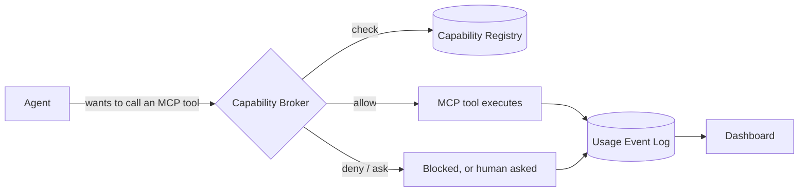
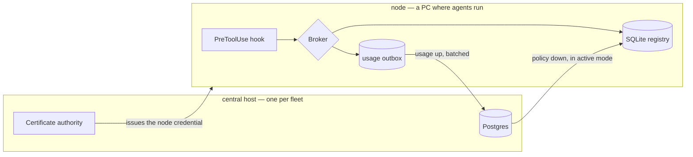

# Windrow

Windrow is a governance layer for AI agents. It sits between agents and the MCP tools they call,
so every capability is granted on purpose and every call leaves a record. It answers questions
that nothing else in an agent stack can: *who is allowed to use the Gmail MCP tools? Who actually
used them last week? What's been silently denied?* It also keeps a centralized, cross-provider
catalog of every skill available in the environment, for discoverability — skills aren't gated by
a grant the way MCP tools are, since there's no per-call hook to enforce one against.



## Why Windrow

As agents pick up more skills and MCP tools, it gets harder to answer basic questions about who
can do what, and impossible to reconstruct what actually happened after the fact. Windrow gives
an agent environment:

- **A registry** of every MCP tool available, and who (which agent role or specific agent
  instance) is allowed to use each one — plus a catalog of every skill available, for browsing.
- **A broker** that enforces MCP tool permissions live, via Claude Code's `PreToolUse`/
  `PostToolUse` hooks (with Antigravity and Codex CLI support in progress) — so a capability with
  no grant is either denied outright or surfaced as an inline confirmation prompt to a human,
  never a silent pass-through.
- **A usage log** of every MCP tool invocation — who, what, when, and the outcome — so access can
  be audited, unused grants can be cleaned up, and denials can be investigated.
- **A dashboard** to see all of this: capabilities, principals, grants, and usage, browsable and
  filterable instead of pieced together from logs.

Full design rationale: [`docs/design/skill-mcp-governance.md`](docs/design/skill-mcp-governance.md)
(see §0 for why skills and MCP tools are governed so differently).

## The four things being tracked

| Entity | What it is | Example |
|---|---|---|
| **Capability** | One MCP server/tool. (Skills share the catalog but aren't granted or logged — see above.) | `mcp__claude-design__write_files` |
| **Principal** | Who is asking — an agent *role* (default grants) or a specific *instance* (a real running agent) | role `design-agent`, instance `claude-msqvb0zl-4` |
| **Grant** | A principal's permission to use a capability, with optional constraints/expiry | rate limit, expiry, read-only-only |
| **UsageEvent** | One invocation: who, what, when, outcome, latency | `denied`, `ok (240ms)`, `error` |

## How a deployment is shaped

A **node** is a machine where agents run. It holds a SQLite registry, serves the dashboard, and
enforces every tool call through its hooks. One node on its own is a complete, correct install.

A **fleet** adds exactly one **central host**: a Postgres, the fleet's certificate authority, and
the fleet-wide view. Central enforces nothing and no hook ever talks to it, so it is never on the
hot path of a tool call.



Nodes join by enrolling: they spend a single-use token to obtain a client certificate signed by
central's CA, and every batch afterwards travels over mutual TLS. The private key is generated on
the node and never leaves it.

| Fleet mode | Central holds | Nodes | Use it when |
|---|---|---|---|
| **Shadow** | usage, the fleet view | keep their own policy authority | Always, first. Nothing a node decides depends on central being up. |
| **Active** | the canonical capabilities and grants | read a replica, plus the deny-list | You have measured agreement with `npm run shadow:compare`. |

In **both** modes a node keeps enforcing from its local tables when central is unreachable — a
tool call never waits on the network. Switching modes is a re-run of `npm run setup`, not a
migration. See [`docs/design/global-identity-and-central-db.md`](docs/design/global-identity-and-central-db.md)
for the architecture and [`docs/setup.md`](docs/setup.md) for how to stand one up.

## Use cases

- **Least-privilege by default.** New capabilities don't sit ungranted until someone notices —
  they're picked up by a capability package with a sane default policy per risk tier, and
  mutating or destructive tools stay behind an explicit grant.
- **Answering "who can do X" without guessing.** Query the registry directly instead of grepping
  hook configs or asking each agent what it thinks it's allowed to do.
- **Auditing what actually happened.** Every call — allowed, denied, or errored — lands in the
  usage log with latency and outcome, so a security review or an incident writeup has a real
  record to pull from.
- **Finding stale or risky access.** Grants unused for 90+ days and capabilities with a high
  denial rate surface as drift, so permissions can be pruned instead of accumulating forever.
- **Governing multiple agent backends from one place.** Claude Code, Antigravity, and (in
  progress) Codex CLI all enforce through the same registry, and one server can be shared across
  every workspace on a machine rather than run per-project.
- **Working with the registry from inside a conversation.** The bundled `governance` MCP server
  and `governance-lookup`/`open-capabilities-dashboard` skills let an agent ask "who can use the
  Gmail MCP" or grant/revoke access inline, without leaving the conversation for `curl` or the
  dashboard.

## Status

Real, not a demo: capabilities are discovered from the actual skills/MCP configuration on the
machine it runs on, principals map to the real agent roster, and enforcement is live for Claude
Code. Antigravity support is smoke-tested but not yet run against a live Antigravity agent; Codex
CLI support is scaffolded but unverified against Codex's hook contract.

The fleet half is real too, and newer: a node enrolls against central, ships usage over mutual TLS,
and pulls policy from it. Shadow mode is the tested default; active mode — central as the policy
authority — works and is what `npm run shadow:compare` exists to give you confidence to switch to.
See [`docs/design/integration-todo.md`](docs/design/integration-todo.md) for the full roadmap and
[`docs/design/setup-after-central.md`](docs/design/setup-after-central.md) for what the two-host
shape still assumes.

## Setup

```bash
git clone <this repo>
cd windrow
npm run setup        # interactive: asks what this machine is, then does it
npm start            # http://localhost:4000 — API and dashboard on one port
```

`npm run setup` is the front door, and it asks one question — what this machine is:

| You answer | It sets up | Needs |
|---|---|---|
| **a node, on its own** | the single-machine install: SQLite, its own policy, no central | nothing else |
| **a node that joins a fleet** | ports, database, dashboard, then enrolls against a central and configures shipping and policy pull | a central already running, and an enrollment token minted there |
| **the central host** | Postgres, the schema, the fleet's certificate authority, the listeners, the catalog | Docker, or a Postgres you already have |
| **both, on this machine** | central and a node side by side, for developing the fleet shape without a second PC | Docker, or a Postgres you already have |

It writes one file — `windrow.env` at the repo root, read by `server/config.js` at startup — so
the configuration survives the terminal it was typed into. Every step is idempotent: re-running it
to join a fleet you did not have last month is the normal case, not a recovery.

```bash
npm run setup -- --role central   # skip the question
npm run setup -- --show           # what is this host, according to what it can actually read
npm run setup -- --dry-run        # print every command it would run, run none of them
npm run verify:topology           # does any of that configuration actually work
```

> **[`docs/setup.md`](docs/setup.md) is the full walkthrough** — prerequisites per deployment type,
> what the wizard asks at each step and in what order, enrolling the first admin and each node,
> installing the Windows services, how to read `npm run verify:topology`, and a symptom-by-symptom
> troubleshooting section. Read it instead of this section if you are setting a machine up rather
> than looking a value up.

Prerequisites, in short: **Node.js 18+** and npm on every machine; **Windows** only for the
service-install paths; **Postgres 16** only on a fleet's central host, which
`server/central/docker-compose.yml` will stand up for you if you have Docker. A standalone node
needs no external database at all — SQLite lives in a single file, created on first run.

### Enforcing it

The dashboard and API work standalone, but nothing is actually *enforced* until the
`PreToolUse`/`PostToolUse` hooks (`server/hooks/`) are wired into an agent backend's own hook
config (Claude Code's `settings.json`, Antigravity's `hooks.json`, …). That wiring is done by the
`deploy-capability-governance-server` skill rather than by `npm start` itself — see
[`docs/design/deployment-boundary-decision.md`](docs/design/deployment-boundary-decision.md) for
whether to point a workspace at a shared server or deploy its own copy.

### Configuration

Everything below is optional; an unconfigured server uses sane defaults for a single local
workspace. `npm run setup` writes what it decides into `windrow.env` at the repo root, which
`server/config.js` reads at startup — **a real environment variable always wins over a line in
that file**, so a sandbox, a one-off `VAR=… npm start`, and the values captured onto a Windows
service all still override it. `npm run setup -- --show` prints the effective configuration and
says where each value came from.

**A node** — the machine agents run on:

| Env var | Purpose | Default |
|---|---|---|
| `PORT` | Port the supervisor listens on; hooks connect here | `4000` |
| `WINDROW_UPSTREAM_PORT` | Private port the supervisor runs the API child on | `4100` |
| `WINDROW_PARK_MS` | How long the supervisor parks a request across a backend restart | `5000` |
| `WINDROW_TLS_PORT` | Mutual-TLS listener for the dashboard and CLI | `4443` |
| `WINDROW_DB_PATH` | The SQLite registry | `server/data/windrow.db` |
| `WINDROW_USER_HOME` | The real user's home, so a `LocalSystem` service reaches `~/.claude` | `os.homedir()` |
| `SKILL_DIRS` | `;`-separated directories scanned for `SKILL.md` files | this workspace's Claude Code + Antigravity skill dirs |
| `HOOK_INSTALL_PATHS` | JSON object overriding where each backend's hook config lives | user-level `settings.json` (Claude), `~/.gemini/config/hooks.json` (Antigravity) |
| `WINDROW_SHADOW_EVAL` | Evaluate the central verdict alongside the local one; `0` disables | on |
| `WINDROW_OBSERVE_NATIVE_TOOLS` | Record native (non-MCP) tool calls | off |

**A node in a fleet** — everything above, plus:

| Env var | Purpose | Default |
|---|---|---|
| `WINDROW_CENTRAL_URL` | Where usage is shipped and policy pulled from. **Unset means standalone** — this single variable is what makes a machine part of a fleet | unset |
| `WINDROW_POLICY_AUTHORITY` | `node` or `central`. `central` is ignored unless `WINDROW_CENTRAL_URL` is also set, and the process says so at startup | `node` |
| `WINDROW_CREDENTIAL_DIR` | Where the enrollment credential (key, cert, CA) lives | `server/data/credentials` |
| `WINDROW_CA_DIR` | The enrollment CA this node issues its own `:4443` certificate from | `server/data/ca` |
| `WINDROW_NODE_ID` | The id this node ships under; normally minted at enrollment | from the store |
| `WINDROW_SHIP_INTERVAL_MS` | How often the usage outbox drains to central | see `server/usageShipper.js` |
| `WINDROW_ROLLUP_SOURCE` | Whether rollups are computed locally or fetched from central | local |

**The central host:**

| Env var | Purpose | Default |
|---|---|---|
| `WINDROW_CENTRAL_DB_URL` | The Postgres. Also accepts `DATABASE_URL` or the `PG*` set | none — central refuses to start without one |
| `WINDROW_CENTRAL_TLS_PORT` | The mutual-TLS listener nodes connect to | `5443` |
| `WINDROW_CENTRAL_PORT` | Loopback plaintext listener, only with the next variable | `5000` |
| `WINDROW_CENTRAL_ALLOW_INSECURE` | `1` opens that plaintext listener. **Development only** — a batch on it is attributed to whatever node id it claims | off |
| `WINDROW_SERVER_SANS` | Hostnames/IPs baked into central's server certificate | this host's hostname |
| `WINDROW_CENTRAL_RETENTION_MONTHS` | Months of usage to keep; unset keeps everything | keep everything |
| `WINDROW_CENTRAL_DB_POOL_MAX` | Connection pool size | `10` |

The full surface is larger than this table; `grep -rn "envCompat(" server` is the authoritative
list, and every name it produces is `WINDROW_` + the string passed in.

### Troubleshooting

Start with `npm run verify:topology` — it checks this host end to end, from outside all three
halves, and names what is wrong rather than leaving you to infer it.
[`docs/setup.md`](docs/setup.md#troubleshoot) works through each failure it can report, symptom
first. The three that come up most:

- **`npm run seed` is refused with `PolicyReadOnlyError`** — this node is in active mode, where
  central owns the catalog. Seed at central instead: `npm run seed:central`.
- **Central rejects a node with `UNABLE_TO_VERIFY_LEAF_SIGNATURE`** — that node enrolled against
  its own server rather than against central, so it holds a certificate signed by the wrong CA.
  Re-enroll against central with a fresh token, and never copy `server/data/ca/` to work around it.
- **A node installed as a service stopped shipping** — a service that lacks `WINDROW_CENTRAL_URL`
  comes back up standalone and looks healthy while shipping nothing. Re-run
  `npm run service:install` with `windrow.env` in place, and read what it prints.

Not covered there, because they are about running rather than installing:

- **Hooks aren't logging any usage** — enforcement wiring (above) is separate from running the
  server; confirm the target backend's hook config points at `server/hooks/*.js` by absolute path.
- **The catalog is empty after seeding** — check `SKILL_DIRS` points somewhere with `SKILL.md`
  files, or that the default paths in `server/config.js` exist on this machine.
- **The client shows 401s against `/api`** — `server/data/api-token` may have been regenerated
  after the client cached an old one; restart `npm run dev:client` so the Vite proxy re-reads it.

### Running as a Windows service

A node and a central are different deployments with different failure domains, so they register
under different service names — and both may legitimately be installed on one machine, which is
how a single-box fleet is developed. Each `.bat` re-launches itself under UAC, so double-clicking
is enough.

| Double-click | npm | Registers | Service name | Serves |
|---|---|---|---|---|
| `install-service.bat` | `service:install` | `server/supervisor.js` | `Windrow` | API + dashboard on `:4000` |
| `central-install.bat` | `central:install` | `server/central/index.js` | `WindrowCentral` | the fleet API on `:5443` |

Removal is `uninstall-service.bat` / `central-uninstall.bat`, and each removes only its own
service. Manage them afterward like any other Windows service — `services.msc`, or
`sc query Windrow`. The step-by-step is in [`docs/setup.md`](docs/setup.md#install-as-a-windows-service).

Two things about them are load-bearing:

**A service does not inherit the environment of the shell that installed it**, so `service:install`
snapshots this node's fleet configuration — `WINDROW_CENTRAL_URL`, `WINDROW_POLICY_AUTHORITY`, the
credential and database paths, the ports — and hands it to the service explicitly. It prints what
it captured *and what it omitted*; read that list. A node configured for a fleet in a terminal and
then installed without those variables comes back up standalone, ships nothing, pulls no policy,
and reports itself perfectly healthy, because a node with no central is a valid deployment.

**The UAC re-launch starts a fresh elevated process**, which does not inherit variables set in the
terminal you ran the `.bat` from — configuration typed into a shell is gone before the capture
happens. `windrow.env` survives that hop, which is the other reason to keep it there.
`central:install` additionally refuses to register at all when no database is configured, and waits
for the database to answer before starting the service.

### Restarting without a fleet-wide fault

`server/supervisor.js` binds `:4000` and runs the API as its own child on a private port. A
PreToolUse hook is a fresh process that lives ~20 ms and has no retry loop, so an ECONNREFUSED
during a restart reaches the agent as a *denial* — the 2026-08-19 incident. The supervisor never
lets go of the port: while the backend is down it holds incoming requests for up to 5 s and replays
them against the new process, which turns a restart into latency instead of a fault
(`docs/design/upgrade-resilience.md` §3.4).

```bash
npm run restart          # bounce the backend; :4000 stays bound the whole time
npm run restart:status   # what the supervisor thinks is running
```

`sc stop Windrow` still drops the port, because it stops the supervisor too — use `npm run restart`
for a code reload, and reserve the service stop for taking Windrow down deliberately.

## Project layout

```
server/            Express + SQLite API — registry, broker, usage log. THE NODE.
  supervisor.js      owns :4000 and runs index.js as a child, so a restart parks rather than denies
  app.js             route wiring
  store.js           SQLite store (server/data/windrow.db)
  auth.js            bearer-token check (server/data/api-token)
  config.js           discovery + hook-install paths, and the windrow.env loader
  envFile.js          writes windrow.env (the reading half is in config.js — hook latency)
  discovery/          scans skills + MCP config to build the capability catalog
  principals/          maps real agent identities to principals
  providers.js         install/uninstall a backend's PreToolUse/PostToolUse hooks into its own config file
  packages.js          capability packages — default grant policy per capability owner
  hooks/               PreToolUse/PostToolUse — the real enforcement point
  enrollment/          the per-node credential: CA, issuing, the enroll client, the routes
  policy/              which end is authoritative, and the replica a node enforces from
  rollup/              cross-workspace usage rollup (Fleet page)
  daemon/              Windows-service wrapper files (winsw)
  seed.js             one-time bootstrap of capabilities/principals on a node
  central/           THE CENTRAL HOST — a separate entry point, not a mode of the above
    index.js           the central process (npm run central)
    centralMigrations.js  the Postgres schema, one versioned ledger
    routes.js          ingest, fleet queries, the policy control plane, enrollment
    docker-compose.yml Postgres 16, one container
  seed-central.js    the phase-4 counterpart to seed.js

scripts/            setup and lifecycle
  setup.js           `npm run setup` — the wizard: node, node-in-a-fleet, central, or both
  enroll.js          `npm run enroll` — obtain a per-node credential from central
  verify-topology.js `npm run verify:topology` — is this host actually wired up
  seed / start / restart / build-client / sandbox / oobe
  service-install.js   register the node as a Windows service, with its fleet configuration
  central-install.js   the same for the central host

client/             React + Vite dashboard
  src/pages/           Dashboard, Capability Catalog, Grants, Principals, Providers & Integrations, Fleet, Docs
  src/components/       charts, stat tiles, invoke panel, capability filter bar, and other shared UI
  src/api/             typed fetch client against the server API

mcp/                MCP server exposing the governance API as tools (mcp/README.md) — query and
                     manage capabilities/principals/grants/usage from inside a conversation

docs/design/        design docs covering the rationale behind the system
```

## Further reading

- [`docs/setup.md`](docs/setup.md) — the full setup guide: prerequisites, the wizard for each deployment type, verification, troubleshooting.
- [`docs/design/skill-mcp-governance.md`](docs/design/skill-mcp-governance.md) — why this exists, the data model, the broker sequence.
- [`docs/design/api-contract.md`](docs/design/api-contract.md) — endpoints, store shape, auth, principal mapping.
- [`docs/design/integration-todo.md`](docs/design/integration-todo.md) — the roadmap toward full multi-backend enforcement.
- [`docs/design/deployment-boundary-decision.md`](docs/design/deployment-boundary-decision.md) — per-workspace vs. shared server deployment.
- [`docs/design/global-identity-and-central-db.md`](docs/design/global-identity-and-central-db.md) — the two-host architecture: central's Postgres, the schema, and what a node ships.
- [`docs/design/per-node-enrollment-credentials.md`](docs/design/per-node-enrollment-credentials.md) — what a node credential is, what it authorises, and where the CA lives.
- [`docs/design/setup-after-central.md`](docs/design/setup-after-central.md) — the audit the setup wizard was built from, and what a two-host install still assumes.
- [`docs/design/grant-resolution-semantics.md`](docs/design/grant-resolution-semantics.md) — how a grant is resolved when node and central disagree.
- [`docs/design/upgrade-resilience.md`](docs/design/upgrade-resilience.md) — restarts, upgrades, and why the supervisor holds the port.
- [`docs/design/agy-adapter.md`](docs/design/agy-adapter.md) — the Antigravity enforcement backend.
- [`docs/design/cross-field-and-standalone.md`](docs/design/cross-field-and-standalone.md) — tracking usage across workspaces and outside any tracked agent runtime.
- [`docs/design/adding-a-provider.md`](docs/design/adding-a-provider.md) — how to wire up a new backend adapter.
- [`docs/design/unified-interception.md`](docs/design/unified-interception.md) — interception-point tradeoffs and what's still manual today.
- [`docs/design/capability-packages.md`](docs/design/capability-packages.md) — default-grant packages and per-risk-tier policy.
- [`mcp/README.md`](mcp/README.md) — the `governance` MCP server's tools.
