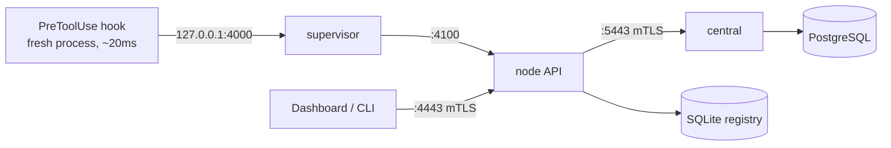
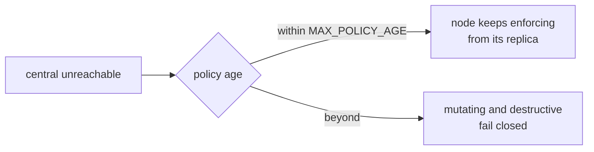

# Architecture

Windrow is two deployments with different failure domains, not one program with two modes. A
**node** is the per-machine enforcement point; **central** is the fleet's control plane. Everything
below follows from that split.



## The node

The node answers one question in single-digit milliseconds: *may this agent call this tool?* It has
to answer it whether or not the network exists, so everything it needs is local — a SQLite registry,
a policy replica and a deny-list.

It runs as two processes. `server/supervisor.js` owns `:4000` permanently and runs the real API as
a child on a private `:4100`.

> [!important]
> The split exists because a hook is a fresh process that lives ~20 ms with no retry loop and
> nowhere to wait. When the backend restarted, hooks firing in that window got `ECONNREFUSED`,
> which classifies as `FAULT.UNREACHABLE` and becomes a **deny on every mutating call on the
> field**. The supervisor holds the connection for up to 5 s and replays it, so a restart is
> latency rather than a fault.

Alongside the API the node runs eight background workers:

| Worker | Cadence | Job |
|---|---|---|
| `policyClient` | 30s poll + stream | pull the replica and deny-list from central |
| `usageShipper` | 5s | drain the usage outbox to central |
| `nativeObservations` | 15s | drain native tool-call observations |
| `cacheWarmer` | 30s TTL | keep the capability cache hot |
| `nodeEngine` | 60s sweep | evaluate alert rules locally |
| `nodeShipper` | on fire | forward alerts to central |
| `hookWatcher` | 250ms debounce | watch hook config for tampering |
| `enforcementPause` | heartbeat | the bounded debugging window |

## Two listeners

This is the part that surprises people, so it is worth stating plainly.

| Bind | Scope | For |
|---|---|---|
| `127.0.0.1:4000` | `agent` only, bearer token | hooks, and nothing else |
| `127.0.0.1:4100` | private | supervisor → child |
| `0.0.0.0:4443` | client certificate | dashboard, CLI, admin |

`:4000` is bound to loopback **explicitly**, and that bind is what makes the agent token
machine-local *by construction rather than by convention* — it is the property that replaced an
earlier fleet-wide shared token. `requireAuth` will only ever grant `agent` scope there, so admin
authority cannot travel over it even if an admin credential were presented.

`:4443` binds every interface, which is correct: the client certificate is the access control, not
the network boundary. It is created with `requestCert: true, rejectUnauthorized: false` so an
unauthenticated caller gets a readable JSON 401 instead of a bare TLS alert.

> [!warning]
> The static dashboard and its SPA fallback are mounted **ahead of** `requireAuth`, so a fresh page
> load on `/fleet` gets the HTML shell rather than a 401. That is why opening `:4000` in a browser
> renders chrome and no data: the shell loads, and then every `/api/*` call returns
> `401 missing or invalid agent token`. Use `:5173` in development, where the Vite proxy presents a
> client certificate on the browser's behalf.

## Central

Central is one host with PostgreSQL behind it. The database decides what it is: with migration 3
applied it is the **authority** for grants and capabilities — it mints the ids and owns the
canonical rows, and every node runs a read replica plus the deny-list.

The property that matters most is what does *not* happen when central is down.



Nothing a node does is blocked on central. Central buys a bound on how long a revoked grant can
survive; it does not put a network hop on any tool call.

Central also runs the enrollment CA. On a single machine the node's CA directory and central's
verification root are the **same directory**, which is why a containerised central bind-mounts
`server/data/ca` rather than taking a volume of its own — see
[`design/deployment-boundary-decision.md`](design/deployment-boundary-decision.md).

## Decisions, not denials

A refusal that means "you lack a grant" and one that means "the registry did not answer" are
different facts, and conflating them is how an outage looks like a permissions problem. Windrow
names the second kind a **fault** and runs a ladder over it.

| Tier | Registry unreachable, no lease |
|---|---|
| read-only | allow |
| mutating | deny — `no-lease` |
| destructive | deny — `destructive-no-lease` |

A maintenance **grace lease**, taken while the server is still up, changes that: faults fall back to
the local grant replica instead of denying. That is what makes an upgrade cost latency instead of a
fleet-wide denial — see [`design/upgrade-resilience.md`](design/upgrade-resilience.md).

## Where the time goes

Measured from real usage events, not estimated. Every call writes its own timings to
`usage_events`, which is what makes this answerable at all.

```bars
principalResolveMs   31
grantCheckMs         12
capabilityLookupMs    2
brokerMs              0
```

The server side is not the cost — `brokerMs`, the grant lookup itself, is under a millisecond. See
[`design/latency-breakdown.md`](design/latency-breakdown.md).

## Project layout

```
server/            Express + SQLite API — THE NODE
  supervisor.js      owns :4000, runs index.js as a child
  app.js             route wiring
  store.js           SQLite store (server/data/windrow.db)
  auth.js            certificate and agent-token checks
  hooks/             the enforcement point — one adapter per agent backend
    lib.js             all the policy, shared by every adapter
    pre-tool-use.js    Claude Code
    agy-*.js           Antigravity
    codex-*.js         Codex
  policy/            replica, deny-list, authority resolution
  principals/        identity: who is calling
  enrollment/        the CA, credentials, tokens
  central/           THE CONTROL PLANE — Postgres, fleet, alerts
client/            React + Vite dashboard
docs/design/       the decision record
```

## Further reading

- [`design/global-identity-and-central-db.md`](design/global-identity-and-central-db.md) — the two-host architecture and the Postgres schema
- [`design/per-node-enrollment-credentials.md`](design/per-node-enrollment-credentials.md) — what a credential is and what it authorises
- [`design/unified-interception.md`](design/unified-interception.md) — one policy core, three backend adapters
- [`design/grant-resolution-semantics.md`](design/grant-resolution-semantics.md) — how a grant is matched
