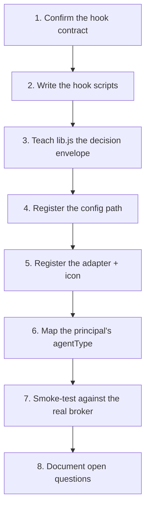

# Workflow: adding a new provider adapter

> A "provider" here is a backend agent harness (Claude Code, Antigravity, Codex, …) that this
> workspace's governance server can enforce against — item 9 in `docs/design/integration-todo.md`.
> This doc generalizes the pattern `docs/design/agy-adapter.md` established when Antigravity was
> added, into steps for the *next* one. Read that doc first if you want the worked example this is
> abstracted from.



## 1. Confirm the hook contract

Find out whether the new backend has its own pre/post-tool-call hook mechanism, and if so:
- Where its config file lives (workspace-level vs. global — matters for step 4).
- The JSON shape it sends on stdin (tool name, args, session/conversation id, anything else).
- The JSON shape it expects back on stdout, and its decision vocabulary (`allow`/`deny`/`ask`, or
  something richer that needs collapsing down to those three — see the agy doc's
  `force_ask`/`deny_unless_prior_grant` note).

If there's no hook mechanism at all yet (the Codex adapter's current state — see
`server/providers.js` ADAPTERS.codex), stop here and register it anyway with
`detectInstalled: () => false, install: null, uninstall: null` so it's visible on the Providers
page as "not installable yet" rather than missing entirely. Resume at step 1 once a mechanism
exists.

## 2. Write the hook scripts

Two new files, `server/hooks/<id>-pre-tool-use.js` / `server/hooks/<id>-post-tool-use.js`,
following `server/hooks/agy-pre-tool-use.js` / `agy-post-tool-use.js` as the template. Their only
job is pulling `toolName`/`toolInput`/a session-correlation id out of this backend's differently
shaped stdin and handing them to the shared core in `server/hooks/lib.js`
(`findCapability`/`resolvePrincipal`/`invoke`/`patchUsageEvent`) — those functions are already
backend-agnostic and shouldn't need changes.

## 3. Teach `lib.js` the decision envelope

If the new backend's expected stdout shape doesn't match either existing `decide()` (Claude) or
`decideAgy()` (Antigravity), add a sibling `decide<Id>()` in `server/hooks/lib.js` alongside them.
Don't touch the existing two — this is additive per backend, not a shared formatter.

## 4. Register the config path

Add an entry to `hookInstallPaths()` in `server/config.js`, defaulting to wherever step 1 found the
config file lives relative to the repo root. Leave it `null` if unconfirmed (see the Codex
precedent) rather than guessing — `null` renders correctly as "no known hook-install location yet"
end to end; a wrong guess would silently write to the wrong file.

## 5. Register the adapter + icon

Add an entry to `ADAPTERS` in `server/providers.js`:

```js
myBackend: {
  id: 'myBackend',
  label: 'My Backend',
  icon: 'myBackend', // matches a key in ProviderIcon.tsx — see below
  hookFiles: ['server/hooks/myBackend-pre-tool-use.js', 'server/hooks/myBackend-post-tool-use.js'],
  detectInstalled: myBackendInstalled,
  install: myBackendInstall,
  uninstall: myBackendUninstall,
},
```

`detectInstalled`/`install`/`uninstall` read/merge/strip just this adapter's hook entries in an
already-parsed config object, leaving everything else in that file (permissions, other hook
groups, unrelated keys) untouched — see `claudeInstalled`/`claudeInstall`/`claudeUninstall` in
`server/providers.js` for the pattern with a config file that has other things living in it, or
the flatter `agyInstalled`/`agyInstall`/`agyUninstall` for one that doesn't.

This is also all that's needed for it to show up on the Providers page — `GET /api/providers`
(`server/app.js`) and `ProvidersPage.tsx` both iterate `listProviders()`'s output generically, no
per-adapter frontend code required.

**Icon:** add a matching key to the `ICONS` map in `client/src/components/ProviderIcon.tsx` — the
vendor's actual logomark as a single-color `currentColor` fill path (20×20 viewBox scaled to fit),
sourced from the vendor's own brand assets or the Simple Icons project (CC0) where available. If
no distinct public logomark exists yet for that product, fall back to its parent company's mark
(see `agy`, which uses Google's "G" pending Antigravity getting its own). If you skip this step
the provider still renders correctly, just with the generic "unknown adapter" glyph as a
placeholder — not a blocker, but worth coming back to before calling the adapter finished.

## 6. Map the principal's `agentType`

`server/principals/fromEnv.js`'s `deriveAgentType()` falls back to `` `${LOOM_PROVIDER}-unknown` ``
for any `LOOM_PROVIDER` value it hasn't seen. Add an explicit case mapping this backend's
`LOOM_PROVIDER` string to a clean `agentType` — otherwise the dashboard/drift views group every
instance of it under the `-unknown` bucket instead of its own.

## 7. Smoke-test against the real broker

Run both hook scripts directly with simulated stdin (matching step 1's shape) against a running
`server/index.js`, with the relevant `LOOM_PROVIDER` env var set. Confirm: a real capability
lookup, a real principal gets created with the right `backend`, a real deny for an ungranted
mutating capability, a real `ask` for an ungranted destructive one, and a real allow + usage-event
patch for a granted read-only capability. This is the same checklist `agy-adapter.md`'s "Smoke-
tested" section ran through — copy its shape rather than reinventing one.

## 8. Document open questions

New file, `docs/design/<id>-adapter.md`, following `agy-adapter.md`'s structure: why it was
needed, the hook contract as used, what's shared vs. per-backend, and — importantly — an "Open
questions / unverified" section for anything confirmed only against docs rather than a live
session of that backend (skill-call shape, MCP tool naming, what env vars the hook process
inherits). Update `docs/design/integration-todo.md` item 9's row to mention the new adapter.
