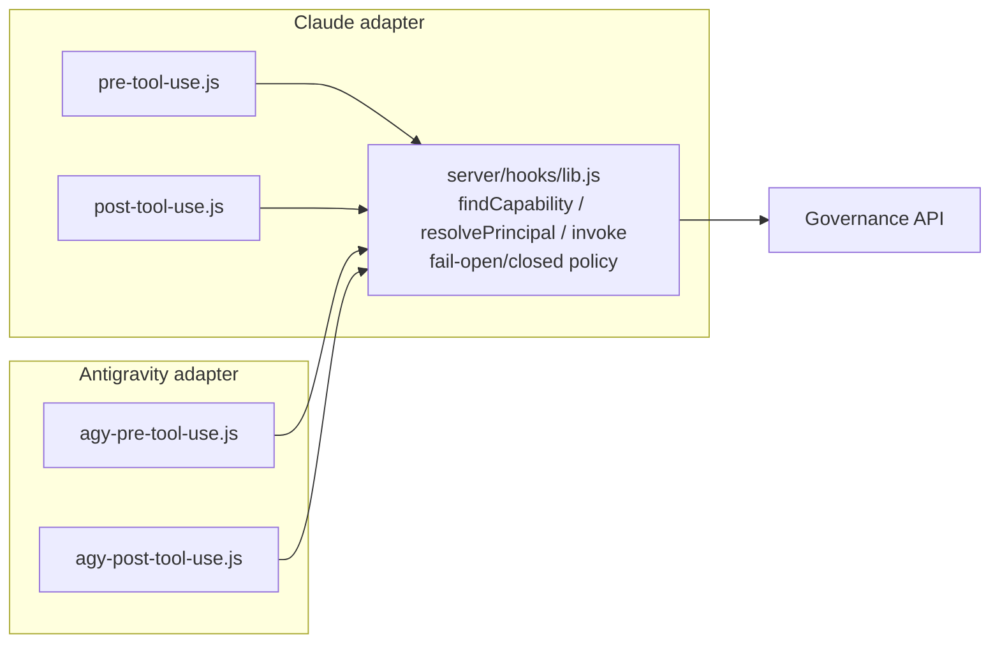

# The Antigravity ("agy") enforcement adapter

> Extends `docs/design/skill-mcp-governance.md` item 3 (real enforcement) to a second backend.
> Everything in that doc about the registry/broker/usage-log stays true unchanged — this only
> adds a second edge that calls the same broker.

## Why this was needed

`server/hooks/pre-tool-use.js` / `post-tool-use.js` are written against **Claude Code's own**
`PreToolUse`/`PostToolUse` hook contract — the JSON shape it feeds a hook process on stdin and
expects back on stdout. That contract is Claude Code's, not the broker's. A loom whose `backend`
is `antigravity` (`LOOM_PROVIDER=antigravity`, set by Wispfield — see
`server/principals/fromEnv.js`) was a correctly-attributed principal but had **no enforcement
path at all**: nothing ever called the broker for its tool calls. Ungoverned, not denied — an
invisible gap, not a safe default.

Antigravity CLI turns out to have its own `PreToolUse`/`PostToolUse` hook mechanism, close enough
in shape (stdin JSON in, stdout JSON decision out, `allow`/`deny`/`ask` vocabulary) that the same
broker logic reuses almost unchanged — only the edges differ.

Sources: [Antigravity hooks docs](https://antigravity.google/docs/hooks) (JSON schema below),
[atamel.dev — where agy looks for hooks](https://atamel.dev/posts/2026/07-16_where_agy_hooks/)
(config file locations).

## What's shared vs. what's per-backend



`server/hooks/lib.js` already didn't know about Claude Code except in two spots:
- `decide()` — prints Claude's `{hookSpecificOutput: {hookEventName, permissionDecision, ...}}`
  envelope. Left untouched; added a sibling `decideAgy()` for Antigravity's flatter
  `{decision, reason}` shape.
- `readHookInput()`, `normalizeToolCall()`, `findCapability()`, `resolvePrincipal()`, `invoke()`,
  `patchUsageEvent()`, `pendingKey()` — all backend-agnostic already (they operate on plain
  strings/objects the caller extracts, or on Wispfield's own env vars, which are backend-neutral
  by construction). Reused as-is by both adapters.

So the new files are thin: `server/hooks/agy-pre-tool-use.js` / `agy-post-tool-use.js` just pull
`toolName`/`toolInput`/`sessionId` out of Antigravity's differently-shaped input and hand them to
the same core functions the Claude adapter calls.

## Antigravity's hook contract (as used here)

Config (`~/.gemini/config/hooks.json`, user-level — moved off the project-local
`.agents/hooks.json` once a confirmed global equivalent turned up, same reasoning as the Claude
adapter's move to a user-level `settings.json`; see
[plugin docs](https://antigravity.google/docs/cli/plugins) and
[atamel.dev](https://atamel.dev/posts/2026/07-16_where_agy_hooks/)):

```json
{
  "capability-governance": {
    "enabled": true,
    "PreToolUse": [{ "matcher": "*", "hooks": [{ "type": "command", "command": "node \"C:\\...\\windrow\\server\\hooks\\agy-pre-tool-use.js\"" }] }],
    "PostToolUse": [{ "matcher": "*", "hooks": [{ "type": "command", "command": "node \"C:\\...\\windrow\\server\\hooks\\agy-post-tool-use.js\"" }] }]
  }
}
```

PreToolUse stdin:
```json
{ "toolCall": { "name": "...", "args": {} }, "stepIdx": 5, "conversationId": "uuid",
  "workspacePaths": ["..."], "transcriptPath": "...", "modelName": "..." }
```
PreToolUse stdout: `{ "decision": "allow|deny|ask|force_ask|deny_unless_prior_grant", "reason": "..." }`
— the adapter only ever emits `allow`/`deny`/`ask`, matching the Claude adapter's vocabulary;
`force_ask`/`deny_unless_prior_grant` have no equivalent in the broker's model and aren't used.

PostToolUse stdin adds `error` (a string, empty/absent on success) in place of Claude's
`tool_response` object — that's the one real shape difference `agy-post-tool-use.js` accounts for.

`conversationId` stands in for Claude's `session_id` as the task/turn correlation boundary;
`correlationId` construction (loom name + node id, both Wispfield-set env vars, backend-neutral)
is unchanged from the Claude adapter.

## Principal mapping

`server/principals/fromEnv.js`'s `deriveAgentType()` previously fell back to
`` `${LOOM_PROVIDER}-unknown` `` for any backend it hadn't mapped. Added an explicit case:
`LOOM_PROVIDER === 'antigravity'` → `agentType: 'antigravity'`. `backend` was already correctly
populated for every loom regardless of this mapping — this only fixes the `agentType` grouping the
dashboard/drift views use.

## Open questions / unverified

- **Skill-call shape.** `normalizeToolCall()`'s `toolName === 'Skill'` branch is a Claude Code
  convention (the `Skill` tool takes a `{skill: "..."}` arg). Whether/how Antigravity surfaces a
  skill invocation as a distinct tool call — same shape, a different tool name, or not
  distinguishable from a normal tool call at all — wasn't confirmed against a real Antigravity
  session, only against its published hook docs. Until verified, an Antigravity skill call that
  doesn't match this shape falls through to `null` (ungoverned pass-through), same as any
  unrecognized native tool — not a silent misclassification, but worth confirming before treating
  skill-tier grants as enforced for this backend.
- **MCP tool naming** (`mcp__<server>__<tool>`) is assumed unchanged across backends since it's
  an MCP-protocol convention, not a Claude Code one — confirmed by matching the Claude adapter's
  existing regex logic, not independently verified against a live Antigravity MCP call.
- **Env vars available to the hook process.** Antigravity's own docs don't list what env vars a
  hook process inherits beyond stdin; this adapter relies entirely on Wispfield's own
  `LOOM_NODE_ID`/`LOOM_AGENT_NAME`/`LOOM_PROVIDER` (set on the loom process itself, inherited by
  any child it spawns) rather than anything Antigravity-specific, so this should hold regardless.

## Smoke-tested (not yet run against a live Antigravity loom)

Ran `agy-pre-tool-use.js`/`agy-post-tool-use.js` directly with simulated stdin against the real
running governance API (`server/index.js` on `localhost:4000`), with `LOOM_PROVIDER=antigravity`
env set: confirmed real capability lookup, real principal creation (`backend: antigravity`), real
deny for an ungranted mutating capability, real `ask` for an ungranted destructive one, real allow
+ usage-event outcome patch for a granted read-only skill, and silent pass-through for an
unregistered native tool (`run_command`). Not yet exercised by an actual Antigravity CLI process —
the `.agents/hooks.json` wiring is unverified against the real harness invoking it.
