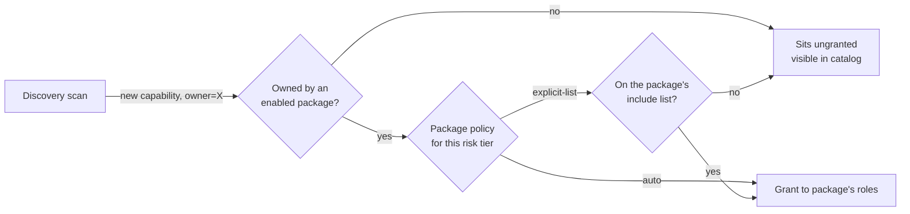
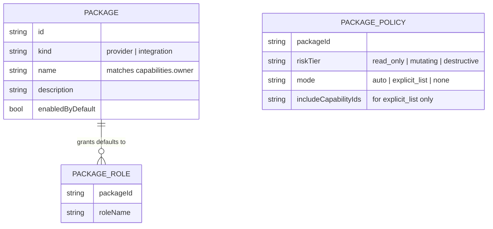
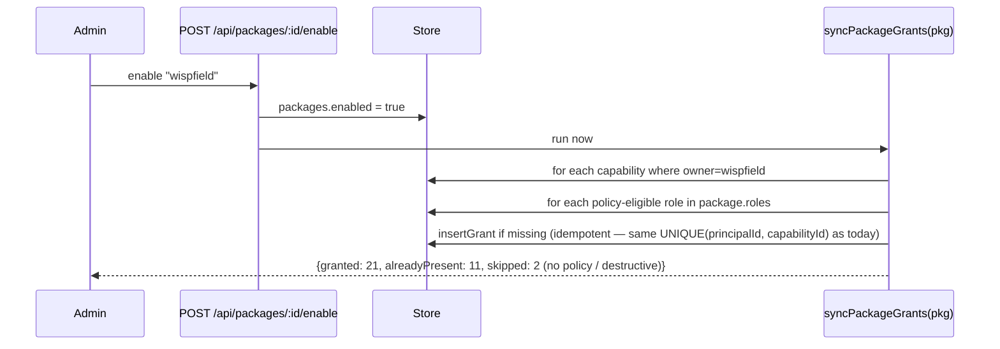
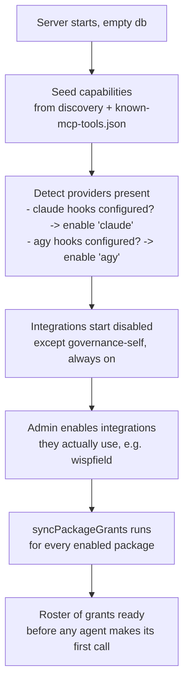

# Capability packages: modular defaults for first-time setup

> [!warning]
> Today's defaults are one hand-maintained script. `server/seed.js` has an `addGrants(roleClaudecode, [...])`
> call per capability group, edited by hand every time a new tool ships. It missed 21 capabilities —
> including `wispfield_report_task_complete`, which the harness requires calling every task — because
> nothing forced the script to stay in sync with `server/data/known-mcp-tools.json`. This design replaces
> the script with declarative **packages** so a new capability lands with a default policy instead of
> silence.



## 1. Two kinds of package

```stats
Provider packages: 4 (claude, agy, codex, claude-standalone)
Integration packages: 5 (wispfield, gmail, gdrive, claude-design, governance-self)
Capabilities owned by a package today: 32 of 32 audited
```

| Kind | What it groups | Enabled by | Example |
|---|---|---|---|
| **Provider** | The agent runtime itself — the roles a backend creates | Which backend is actually running here (auto-detected, like `discoveryPaths()` already does per-backend) | `claude` → roles `claudecode`, `claude-standalone`, `general-purpose`, `Explore`, `Plan`... |
| **Integration** | One MCP server / tool family, or the governance tool's own skills | An admin turning it on (like a `discovery_sources` row), or discovery seeing it show up in a config | `wispfield`, `gmail`, `gdrive`, `claude-design`, `governance-self` |

A capability belongs to exactly one package, by `owner` — the column that already exists
(`capabilities.owner`: `'wispfield'`, `'gmail'`, `'platform'`, ...). No new column on `capabilities`;
a package is just a name plus a policy over "all capabilities where `owner = X`".

## 2. Package = owner + a policy per risk tier



This is the same three-tier table the existing design already documents (`skill-mcp-governance.md`
§4: read-only auto-grants, mutating is explicit, destructive is explicit-plus-notify) — packages just
give that table a place to live per-owner instead of being re-decided by hand in `seed.js` every time.

```
wispfield package policy:
  read_only   -> auto            (wispfield_view, wispfield_get_field_status, wispfield_recall,
                                   wispfield_await_task, wispfield_read_loom_output)
  mutating    -> explicit_list   (wispfield_spawn_agent, wispfield_dispatch_command,
                                   wispfield_report_progress, wispfield_report_task_complete,
                                   wispfield_claim_files, wispfield_navigate_loom,
                                   wispfield_organize_field, wispfield_show_document,
                                   wispfield_start_loom, wispfield_ask_user, wispfield_add_want)
  destructive -> explicit_list   (wispfield_clear_field, wispfield_halt_agents)
                 none            (wispfield_close_loom stays out of the default — matches today's
                                  deliberate "stays ungranted everywhere" choice in seed.js)
```

`explicit_list` still has to be maintained by hand, same as today — but now the **read_only** tier
(where most of this audit's misses lived — `wispfield_await_task`, `wispfield_read_loom_output`, and
all 9 governance lookup tools are read-only) is `auto` and self-heals the moment a new read-only
capability with that owner is discovered. Mutating/destructive stay a deliberate include-list, because
those are exactly the ones a human should be looking at before they go out by default.

## 3. What "enabled" changes

> [!tip]
> Enabling a package doesn't create a new grant table — it runs the same `grant_capability` call this
> conversation just made 21 times by hand, driven by the policy instead of a person.



`syncPackageGrants` is the re-runnable version of what I just did with 21 individual
`grant_capability` calls — it's the standing fix for "someone starts a brand-new server and the
needed defaults aren't there," and it's also what an admin re-runs after any release that adds
capabilities, instead of relying on a human noticing a `denied` in the usage log first.

## 4. Bootstrap order on a fresh server



Providers auto-enable (an agent can't do anything at all otherwise); integrations start off, since
"not everyone uses wispfield" was the exact case that prompted this — a fresh server for someone who
only wired up Gmail shouldn't carry 18 ungranted wispfield capabilities cluttering the catalog's
"missing" view.

## 5. Surfacing it (reuses the dashboard, not a new page)

```bars
Packages enabled       6
Packages available     9
Drift since last sync  0
```

- **Packages tab** (new, next to Catalog/Usage/Drift): one row per package, enabled toggle, policy
  summary, and a "Sync now" button that calls `syncPackageGrants` and reports the same
  granted/alreadyPresent/skipped counts as the sequence diagram above.
- `get_drift` gets one more signal for free: a capability whose owner is an **enabled** package but
  whose policy says `auto` and it still has zero grants is a sync that never ran — surfaced the same
  way an unused grant is today.

## 6. Rollout

| Phase | Delivers |
|---|---|
| 1 | `packages` + `package_policies` tables; hardcode the 9 packages above (providers + integrations) with the policies already implied by today's `seed.js`, so behavior doesn't change on migration |
| 2 | `syncPackageGrants` + `POST /api/packages/:id/enable\|disable\|sync`; wire provider auto-detection into `deploy-capability-governance-server` |
| 3 | Packages tab on the dashboard; `get_drift` flags un-synced auto-policy capabilities |
| 4 | Retire `seed.js`'s hand-written `addGrants` calls in favor of package policies — seed only writes capabilities + the initial provider/integration roster |

> [!note]
> Phase 1 is a pure refactor — the 9 packages encode exactly the grants `seed.js` issues today, so a
> migrated server ends up with the same grant set it has now. The payoff is entirely in phase 2 onward:
> the next new `wispfield_*` read-only tool gets granted the day it's discovered, not the next time
> someone happens to audit by hand.
