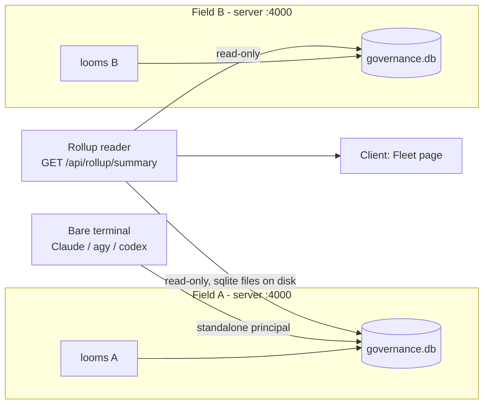

# Cross-field and standalone usage tracking

> [!note]
> **This workspace now runs a single shared server across fields** (`docs/design/deployment-
> boundary-decision.md`'s "Status update: switched to shared") rather than one per field, so the
> rollup below is no longer how `infrastructure`'s usage reaches `tps_reports`'s dashboard — it
> already lands in the same `governance.db` directly. The rollup mechanism stays real and useful
> for: standalone-usage breakdown (unaffected by which mode fields use), and any future field that
> deliberately chooses per-field isolation instead of the shared server — see
> `deploy-capability-governance-server` (user skills dir) for both modes.

> Extends `docs/design/skill-mcp-governance.md` and delivers the migration path
> `docs/design/deployment-boundary-decision.md` already promised: "ship a rollup, not a
> rewrite." Also closes the gap `docs/design/api-contract.md`'s Principal mapping section
> flagged and accepted as a limitation: `identityFromEnv()` returning `null` outside Wispfield
> meant standalone Claude Code / Antigravity / Codex usage was invisible to governance —
> ungoverned, not denied, per `pre-tool-use.js`'s own fail-open comment.

## 1. Standalone usage (no Wispfield loom at all)

**Problem.** `identityFromEnv()` returned `null` whenever `LOOM_NODE_ID` was absent — a bare
terminal running Claude Code, Antigravity, or Codex CLI outside Wispfield. `resolvePrincipal()`
propagated that `null` up to the hooks, which then applied the destructive-tier
fail-open/fail-closed policy blind, with **no usage event, no principal, no record it happened
at all**.

**Fix.** `identityFromEnv()` (`server/principals/fromEnv.js`) now never returns `null`. When no
`LOOM_NODE_ID` is present it synthesizes a **standalone identity** instead of giving up:

- `backend` — detected from env (`CLAUDECODE`/`CLAUDE_CODE_ENTRYPOINT` → `claude`; best-effort
  Codex signals → `codex`; explicit `backendHint` passed by a backend-specific hook script, the
  same way `agy-pre-tool-use.js` already knows it's Antigravity by virtue of being *the*
  Antigravity hook entry point). Falls back to `unknown` rather than guessing wrong.
- `loomId` — **deterministic, not random**: `standalone-<backend>-<hostname>-<osUsername>`. Built
  from stable OS identity so repeated standalone invocations on the same machine accumulate
  usage against one principal instead of minting a new one per process (there is no
  `LOOM_NODE_ID` to key off, and a random id would make every single call its own principal —
  useless for a usage view).
- `agentType` — `${backend}-standalone` (e.g. `claude-standalone`), a distinct role bucket from
  both the real Wispfield loom roles (`claudecode`, `antigravity`) and the Task-tool subagent
  roles (`claude`, `Explore`, ...). Gets the same default-grant treatment every new role gets
  (`grantInherited` in `server/principals/registry.js`: read-only capabilities auto-granted) —
  no special-casing needed in the broker.
- `field` / `fieldPath` — `null`. Standalone usage isn't attributed to any field by construction.
- `standalone: true` — new field on both the identity and the persisted `instance` principal
  (`server/store.js` principals table gained a `standalone` column, migrated in place with an
  `ALTER TABLE ... ADD COLUMN` guard so existing `governance.db` files upgrade without a reseed).

Everything downstream — `resolvePrincipal()`, `/api/invoke`, grant inheritance, usage summary,
drift — needed **no changes**: a standalone identity is just another `instance` principal with a
role, which is exactly the shape the broker already understood. The only behavior change is in
`pre-tool-use.js`'s dead-code path: the `if (!principal)` branch ("not running under Wispfield")
now only fires on an actual principal-resolution error, not on every standalone call — left in
place as the genuine error-handling fallback it always was.

### Codex adapter

`server/hooks/codex-pre-tool-use.js` / `codex-post-tool-use.js` mirror the Antigravity adapter
(`docs/design/agy-adapter.md`) — same shared core (`server/hooks/lib.js`), same
`decide()`-equivalent output shape question. **Unverified, same posture as agy was before its
first smoke test**: no confirmed Codex CLI `PreToolUse`/`PostToolUse` hook contract was available
to check against in this session. The adapter is written defensively — it accepts several
plausible stdin field-name variants (`tool_name`/`toolName`/`tool`, `tool_input`/`toolInput`/
`arguments`) rather than committing to one guessed shape, and it always calls
`identityFromEnv(env, { backendHint: 'codex' })` so a Codex principal is attributed correctly
even before the exact stdin shape is confirmed. Treat this the way `agy-adapter.md` treats its
own open questions: real, wired to the real broker, not yet run against a live Codex session.

## 2. Cross-field usage (multiple Wispfield fields)

**Problem.** Each field runs its own governance server against its own
`server/data/governance.db` (`docs/design/deployment-boundary-decision.md`, decided: per-field).
Nothing answers "who used the Gmail MCP across the whole fleet last week" — the question the
per-field decision explicitly deferred until there were "≥2 fields worth comparing."

**Fix — a read-only rollup, not a rewrite**, exactly as that doc's "rollout implication"
predicted: `server/rollup/index.js` discovers sibling fields on disk and merges their SQLite
files directly. No new write path, no shared write contention, no auth/network problem to solve
(the whole point of staying per-field) — a rollup only ever opens other fields' `governance.db`
files `readonly: true`.

- **Discovery.** `WISPFIELD_FIELDS_ROOT` (default: the parent directory of this field, i.e. the
  Wispfield workspace root — `path.dirname(path.resolve(__dirname, '..'))`) is scanned one level
  deep for sibling directories containing `server/data/governance.db`. Each match is a "field":
  `{ field: <dirname>, fieldPath, dbPath }`.
- **Read.** Each discovered db is opened with `better-sqlite3` `{ readonly: true, fileMustExist:
  true }` — a field whose server is mid-write is still safely readable (WAL mode, per
  `server/store.js`), and a rollup can never corrupt or lock a field it doesn't own.
- **Merge.** Principals/usage events from every reachable field, plus this field's own live data,
  combine into one summary tagged by `field` (already a column on every `instance` principal —
  `docs/design/deployment-boundary-decision.md` called this out as the reason a later rollup
  would be additive). Standalone principals (`standalone: true`) are broken out separately in the
  merged view rather than attributed to any one field, since by construction they aren't one.
- **Unreachable fields** (db missing, locked, or unopenable) are reported, not silently dropped —
  `reachable: false` on that field's row — so a rollup gap is visible instead of quietly
  undercounting.

### New endpoints

| Method | Path | Returns |
|---|---|---|
| GET | `/api/rollup/fields` | `{ root, fields: [{ field, fieldPath, dbPath, reachable, principalCount, eventCount, lastEventAt }] }` |
| GET | `/api/rollup/summary` | `{ fields, totals, byField, byPrincipal, standalone }` — see `server/rollup/index.js` for the exact shape |

Both are additive reads over existing per-field data — no change to the per-field API contract in
`docs/design/api-contract.md`, matching the decision doc's promise.

## 3. Dashboard

New **Fleet** page (`client/src/pages/FleetPage.tsx`): fields table (reachable/unreachable,
principal & event counts), a per-field calls/denied bar chart, and a standalone-usage panel
broken out by backend (`claude-standalone`, `antigravity-standalone`, `codex-standalone`,
`unknown-standalone`) — the two things this doc adds that the existing per-field Dashboard page
structurally can't show.

## What deliberately isn't here

- **No shared write path.** A rollup that could grant/revoke across fields would resurrect the
  exact auth/network/blast-radius problems `deployment-boundary-decision.md` decided to defer.
  This stays read-only.
- **No polling/push.** The rollup endpoint computes on request from on-disk files; there's no
  background sync job. Fine at today's scale (a handful of fields on one machine); revisit if
  fields start living on separate machines, at which point "read the sqlite file directly" stops
  working and the doc's original "ship each field's deltas to a shared store" idea is the next
  step.
- **Codex adapter is unverified**, as stated above — flagged, not hidden.
