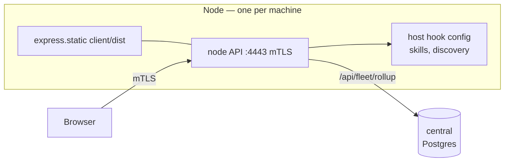
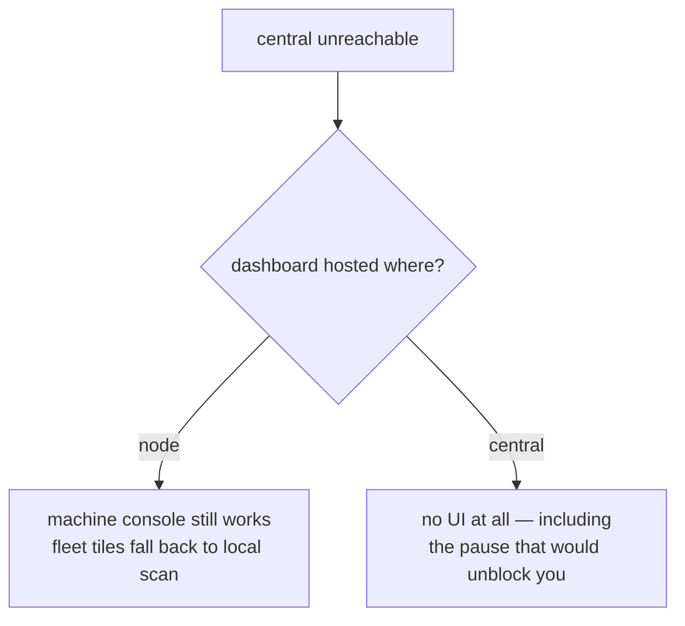

# Where the dashboard lives: on every node, or in central

> [!caution]
> **Superseded 2026-08-22 by [`dashboard-placement.md`](dashboard-placement.md). Do not implement
> this note.** Both analyses are sound; they were written to different premises. This one evaluates
> the system as it stands, where a node is a long-lived machine someone opens a browser against.
> The decision went the other way against a stated target of one container holding central's
> frontend and backend, with nodes as disposable services holding only a thin local config.
>
> Two things here survived into that design and are credited in it: the objection that moving the
> dashboard off the node must first explain how onboarding, provider install and enforcement-pause
> reach the host, and the observation that central's nine fleet endpoints have no UI anywhere —
> which became step 10, and the recommended place to start.
>
> Kept rather than deleted because it records why the alternative was considered and rejected. The
> analysis below is unedited.



> [!important]
> The dashboard is **not one surface serving one dataset**. It is a machine console that also
> shows two fleet tiles. Move it wholesale to central and the machine console stops working; leave
> it only on nodes and central's fleet data stays unreachable without a healthy node. The question
> answers itself as *both*, and the cost of both is one `express.static` line and one `COPY`.

## What is actually true today

```stats
Client bundle: 332 KB (1 JS, 1 CSS)
API paths the dashboard calls: 38
Of those, fleet-scope: 2
Central endpoints with no UI at all: 9
```

The dashboard is built to `client/dist` and served by the node from `server/app.js:368-374` —
`express.static` plus an SPA fallback, both mounted **ahead of** `requireAuth` so a cold page load
gets the shell rather than a 401. No second process, no second port.

The two fleet-scope paths (`/api/rollup/fields`, `/api/rollup/summary`) already reach central.
`server/rollup/central.js` proxies them to `/api/fleet/rollup` over the node's own mTLS
credential, with three modes (`auto` / `central` / `local`) and a labelled `source` on every
payload. Fleet data is already centralised; only its *transport* runs through a node.

## The part that decides it: some pages cannot leave the machine

These are not "easier locally." They read and write the host's own filesystem, and a container or a
remote host has no access to it — the central `Dockerfile` says so itself in its opening comment.

| Route family | What it touches on the host |
|---|---|
| `/api/discovery/browse`, `/discovery/run` | `fs.readdirSync` over the user's real directories |
| `/api/providers/:id/install`, `/uninstall` | writes `~/.claude/settings.json`, `~/.gemini/config/hooks.json` |
| `/api/skills`, `/skills/targets` | writes skill files into the host's skill directories |
| `/api/hook-integrity` | the 250 ms tamper watcher over that machine's hook config |
| `/api/enforcement/pause` | the bounded debugging window, heartbeated locally |
| `/api/invoke` | the local broker, the thing being demonstrated |

The onboarding wizard (`OnboardingWizard`, `DirectoryPickerDialog`) is built entirely out of the
first two rows. A central-hosted dashboard could not run setup on the machine being set up.

## Failure domains — the argument `architecture.md` already makes



A node keeps enforcing when the network is gone; past `MAX_POLICY_AGE` it starts failing mutating
and destructive calls **closed**. That is exactly the moment an operator needs the enforcement-pause
card — and exactly the moment a central-hosted dashboard is unreachable. Hosting the console on the
far side of the partition it exists to debug inverts the design.

## The four criteria, scored

| | Node hosts it (today) | Central hosts it | Both host the same bundle |
|---|---|---|---|
| **Deployment** | Nothing to do — one process, one port, already shipped | Needs `COPY client/dist` in the Dockerfile, a static mount in `routes.js`, and a browser cert story on `:5443` | The central-side work above, once; nodes unchanged |
| **Resources** | 332 KB of static assets on an already-running Express app. Immeasurable | Saves that 332 KB per machine — a rounding error against `node_modules` | Same as node, plus 332 KB in the image |
| **Maintenance** | One artifact, one mount, versioned with the node that serves it | One artifact, but every host-bound route needs an agent-on-the-node protocol invented to replace it | Two mounts of **one** build; skew is possible and visible in the footer |
| **UX** | Works offline, works during a partition, runs onboarding. Fleet view needs a node up | Bookmarkable fleet console; useless for setting up or rescuing a machine | Machine work on the node, fleet work on central, same UI both ways |

## Recommendation

> [!tip]
> **Keep the dashboard on every node — it is already correct — and additionally mount the identical
> bundle on central as a fleet console.** One build artifact, two mounts. Node stays canonical for
> anything that touches a machine; central answers the fleet questions that currently have no UI.

Ranked, so a smaller appetite still lands somewhere defensible:

1. **Do nothing to the node.** Its hosting is right for the reasons above. Any proposal that moves
   the dashboard off the node has to first explain how onboarding, provider install and
   enforcement-pause reach the host.
2. **Mount `client/dist` on central** (`server/central/routes.js` + `COPY client/dist` in
   `server/central/Dockerfile`). Central already terminates mTLS on `:5443` against the same
   enrollment CA, so the auth story is the one that exists, not a new one.
3. **Have the bundle detect its host** and hide what it cannot serve. The honest version is a
   `/health`-style discriminator, not a build flag: one artifact, and a page that says "open this on
   the node" beats a button that 404s.
4. **Surface central's nine orphan endpoints** — `fleet/nodes`, `fleet/alerts`, `fleet/shadow`,
   `fleet/storage`, `fleet/events` and friends have no UI anywhere today. That is the actual
   payoff of a central-hosted console, and it is a bigger win than relocating anything.

### What would change this

If the host-bound routes ever moved behind a node-side agent that central could call, the machine
console could in principle be centralised. That is a real protocol with a real attack surface
(central mutating a user's `~/.claude/settings.json` remotely), and nothing in the current design
asks for it.

### The one risk of hosting both

Version skew: a node on build *N* and central on build *N-1* render the same UI over different API
shapes. Mitigate by stamping the build into the footer and having the bundle read the server's
version from `/health` — cheap, and it makes skew a visible fact instead of a confusing bug report.
