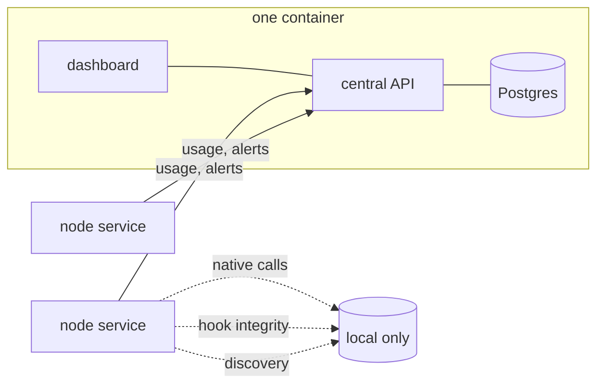
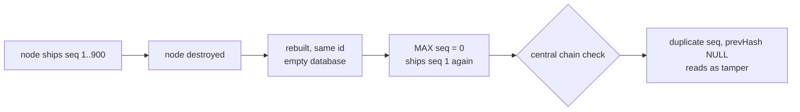

# Should the dashboard live on each node, or on central?

> [!important]
> **Decided 2026-08-22: this is the design to build.** It supersedes
> [`dashboard-hosting-decision.md`](dashboard-hosting-decision.md), which analysed the same question
> and concluded the opposite — keep the dashboard on every node, and add a central console beside it.
>
> The difference was the premise, not the reasoning. That note evaluated the system as it stands,
> where a node is a long-lived machine someone opens a browser against. This one is written to the
> stated target — **one container carrying central's frontend and backend, and nodes as disposable
> background services holding nothing but a thin local config** — under which a per-node UI is not a
> feature to preserve but state to eliminate.
>
> Two things from that note are carried forward rather than discarded. Its objection is the right
> one — *"any proposal that moves the dashboard off the node has to first explain how onboarding,
> provider install and enforcement-pause reach the host"* — and step 3 plus the config table below
> are that explanation. And its best observation is now step 10: central has nine fleet endpoints
> with no UI anywhere, and surfacing them is a larger win than relocating anything.

> [!important]
> **Yes — the node should have no dashboard at all.** Target model: one Docker deployment carrying
> central's frontend and backend, and a node that is a background service with a thin configuration
> layer. That is the right shape and it removes the hedge in the first draft of this note. It is
> also **not reachable today**: three signals never leave the node, and the one thing a node must
> still do locally has no interface except the UI being removed.

The dotted arrows are the problem. Everything else about the model is sound.

## What actually reaches central

The premise "all data flows back to central" is true of the audit log and nothing else. Checked
against the code rather than assumed:

| Signal | Ships? | Where it lives |
|---|---|---|
| `usage_events` — governed decisions | **yes** | `usageShipper` → `/api/ingest/usage` |
| Alerts | **yes** | `nodeShipper` → `/api/ingest/alerts` |
| Capabilities, grants, principals | **yes**, central owns them in active mode | `central/policyRoutes.js` |
| **Native tool calls** | **no** | own table on the node, trimmed on a cap |
| **Hook integrity** | **no** | node-local only |
| **Discovery / sources / skills scan** | **no** | node-local only |

> [!warning]
> **Native tool observation is the big one, and it is deliberate.** `nativeObservations.js` puts
> native calls in their own table on purpose: they are unenforced, best-effort, arrive out of order,
> and *"outnumber governed ones by one to two orders of magnitude, so every drift number, usage
> summary and denial rate computed off `usage_events` would silently change meaning."*
>
> That reasoning is correct and must survive. It argues for a **separate ingest path and a separate
> table at central** — not for folding native calls into the audit stream, and not for leaving them
> stranded on the node.

`/api/ingest/reconcile` exists but no node calls it; its only caller is `central/shadow-compare.js`,
a manual comparison tool. Catalog reconciliation is not a live flow.

## What the node must still do locally

"Thin configuration layer" is the right instinct. Most of it already exists as CLI:

| Task | Today |
|---|---|
| Choose topology, write `windrow.env` | `npm run setup` ✅ |
| Verify the install end to end | `npm run verify:topology` ✅ |
| Pause enforcement to debug | `npm run denials:off` ✅ |
| Take a maintenance lease | `npm run upgrade:begin` ✅ |
| **Install hooks into `~/.claude/settings.json`** | **UI only** ❌ |

> [!caution]
> Installing hooks is the one genuinely machine-local write, and it has no CLI. It is reachable
> only through `POST /api/providers/:id/install` on the node's mTLS API, which the onboarding
> wizard drives. Remove the node UI without replacing this and a fresh node cannot be wired up at
> all.

## Revised recommendation

Four pieces of work, in order. The first three are prerequisites; only then is the fourth safe.

1. **Ship native observations to central** on their own ingest path into their own table, preserving
   the separation `nativeObservations.js` argues for. This is the largest item and the one that
   makes "central is the data sink" true rather than aspirational.
2. **Ship hook integrity as node health.** Central already has a node roster with `lastSeen`; hook
   installed/tampered/missing belongs beside it. This is small and high value — it turns "is
   governance actually wired on that box" into a fleet-wide question instead of a per-machine visit.
3. **Give hook installation a CLI** — `npm run providers:install claude`. It is a thin wrapper over
   `installProvider`, which already exists; only the entry point is missing. This is what lets the
   node be a service with no UI.
4. **Then delete the node's dashboard.** Serve `client/dist` only from central, and drop the static
   mount from the node's app so `:4000` and `:4443` are API-only.

Three more follow from treating the node as disposable rather than merely headless, and they are
covered in the next section:

5. **Take node identity out of the database** — from configuration or the credential, never minted
   into `kv` — and **chain on `(nodeId, incarnation, seq)`**, or the tamper detector fires on every
   rebuild.
6. **Make retiring a node flush the outbox**, so destroying one cannot silently drop queued audit.
7. **Replace single-use enrollment with a re-provisionable join credential.**
8. **Make `/api/ready` false until the first policy pull completes**, so a cold node parks instead
   of denying.
9. **Retire SQLite on the node** once 1–3 land: an in-memory replica index for reads, append-only
   spools for writes. This is the step that makes a node image `node:22-slim` and a rebuild a
   `docker rm`.
10. **Build UI for central's orphan endpoints** — `fleet/nodes`, `fleet/alerts`, `fleet/shadow`,
    `fleet/storage`, `fleet/events` and their siblings have no interface anywhere today. Carried
    forward from `dashboard-hosting-decision.md`, whose author is right that this is a larger win
    than relocating anything. Nothing blocks it, so it can start immediately and in parallel.

> [!tip]
> **Where to start.** Step 10 has no prerequisites and delivers something visible, so it is the
> natural first task. Step 3 (`providers:install` CLI) is the smallest self-contained item on the
> critical path — a thin wrapper over `installProvider`, which already exists. Step 1 is the
> largest and gates 4 and 9.

Discovery is the one I would *not* ship. Scanning skill directories is inherently about the machine,
and its output is capabilities — which already reach central through the catalog in active mode. The
scan can stay a node-local job whose results are what travel.

## Two things this buys beyond tidiness

**It solves the browser-certificate problem by deleting it.** No production browser can authenticate
to any dashboard today — Chrome only presents a client certificate from the OS store, and nothing
exports a PKCS#12 bundle. With one dashboard on one host that is one import instead of one per
machine, and central's container can terminate TLS however it likes without touching the node's
enforcement path.

**It makes nodes disposable.** A node with no UI, no local state worth reading and a config file is
something you reinstall rather than debug. That is the operational model the architecture already
implies — the node is an enforcement point, not a place anyone should be logging into.

## Disposability: what the node holds today

If a node is disposable, it may hold a **cache** — something central can rebuild — but never
**state**, meaning the only copy of something. Measured against the live node on this machine, most
of it is already cache. The exceptions are the whole problem.

| Table / file | Rows | Verdict |
|---|---|---|
| `capabilities`, `grants`, `principals` | 139 / 524 / 27 | **cache** — replica of central in active mode |
| `policy-replica.json`, `hook-*-cache.json`, deny-list | — | **cache** — signed, epoch-gated, refetchable |
| `discovery_sources` | 9 | **cache** — a rescan reproduces it |
| `native_tool_events` | **2248** | **state** — never ships. Destroying the node destroys it |
| `usage_outbox` | **8** | **state** — governed decisions in flight, right now |
| `usage_events` | 1772 | state until drained; the chain head lives in `usage_chain_heads` |
| `windrow_audit`, `policy_changes` | 496 / 293 | state — node-side control-plane history |
| `hook-fault-journal.jsonl` | 75 kB | state — every fault-time decision, local only |
| `kv.node_id`, `credentials/`, tokens | — | identity — see below |

> [!caution]
> **`native_tool_events` is the largest table on the node and it is the one that never leaves.**
> More rows than the audit log. A disposable node loses all of it on every rebuild, which makes
> native tool observability a per-machine, per-lifetime feature — the opposite of what it was built
> for. This is the strongest argument for item 1 in the plan above, independent of the dashboard.

### Three things that block disposability outright

**The outbox is a durability hole.** There are 8 governed decisions queued for central as this is
written. "Disposable" means destroyable at any moment, and at this moment that costs 8 audit rows.
Either the outbox drains synchronously before a node can be retired, or retiring a node has to be a
command that flushes first — not a `docker rm`.

**Node identity is minted locally.** `kv.node_id` is generated by the node on first use and only
overridden by `WINDROW_NODE_ID`. A rebuilt node gets a fresh identity, so central's roster
accumulates ghosts — this fleet already shows **5 nodes, 1 seen in the last 24 hours**. Under the
target model the node id has to come *from configuration or the credential*, never from the
database. The `kv` table already carries `outbox_seq:` counters for two different node ids on this
machine, which is that drift made visible.

**Enrollment is a single-use human step.** Re-creating a node needs an admin to mint a token
through central. That is correct for a machine someone installs once and wrong for a fleet member
that is expected to be replaced. Disposability implies automated re-provisioning, which implies
something like a join token with a TTL and a bounded use count rather than one-shot minting.

### Stable identity and rebuild are in direct conflict

Step 5 says take the node id out of the database. On its own that breaks the audit chain, and it
breaks it in the worst possible way — by making normal operation look like tampering.

`seq` is assigned from `MAX(seq) FROM usage_events WHERE nodeId = ?` — the node's **own** table. A
rebuilt node with a stable id and an empty database starts again at 1. Central does not ignore
this: `central/queries.js` verifies the shipped stream is *dense*, using `LAG(seq) OVER (ORDER BY
seq)` to find missing ranges and checking each row's `prevHash` against the previous row's `hash`.

> [!caution]
> The tamper detector would fire on every rebuild. A fleet of disposable nodes with stable ids
> would generate a continuous stream of chain violations that are all false, which is worse than no
> detector — an alarm that always rings gets switched off, and then the real one is missed too.

Three ways out, and only one of them is right:

| Option | Verdict |
|---|---|
| Recover `seq` and the head hash from central at startup | Makes cold start depend on central reachability, which §2.8 exists to avoid |
| A fresh id per rebuild | Correct chains, but restores the ghost roster this was meant to fix |
| **Chain on `(nodeId, incarnation, seq)`** | **Stable logical identity for the roster, a fresh dense chain per lifetime, no central dependency at boot** |

An incarnation is minted at startup and never read back from the database, so a rebuild is a new
chain rather than a broken one, while the roster still groups every incarnation under one node.
Central's density check then runs *within* an incarnation, which is the only scope where density was
ever a meaningful claim.

### Cold start is an availability event

A freshly built node has no policy replica. The fault ladder denies mutating and destructive calls
when the registry cannot answer and no lease is in force — which is correct for a fault, and wrong
as a greeting. `policy last refreshed never` already appears in this node's logs from exactly that
state.

On a long-lived node that window is once. On a disposable one it is every rebuild, for every agent
on that machine.

> [!tip]
> The fix is to make readiness mean *ready*: a node that has never completed a policy pull should
> not report healthy on `/api/ready`. The supervisor already parks requests for a backend that is
> not up, so parking a cold start is a delay measured in seconds rather than a wave of denials.
> Failing to start is a better failure than starting and denying.

### Does a disposable node still need SQLite?

Probably not — but the reads and the writes need different answers, and the read side is where the
existing design has already argued against change.

**The read side is a replica, and a replica does not need a database.** Under central authority
`policy/centralPolicyStore.js` splits the contract: writes proxy to central, reads stay on local
SQLite, *synchronously*, on purpose —

> "`findActiveGrant` is still two prepared statements and the hot path never touches the network …
> making them async would put a microtask on the decision path of every governed tool call to no
> purpose — a promise around a `better-sqlite3` statement buys nothing and costs the one thing this
> system measures."

That reasoning is right and rules out reading JSON off disk per call. It does **not** rule out an
in-memory index. The server is long-lived, the whole replica is 524 grants, 139 capabilities and 27
principals, and it is already refetched wholesale on every policy pull. Hydrating a `Map` at pull
time is synchronous, smaller than two prepared statements in latency terms, and needs no durability
at all — because losing it means refetching something central already owns.

**The write side is the real question, and it is smaller than it looks.** Strip the replica and the
node's durable writes reduce to three streams, all append-only:

| Stream | Today | Disposable-node form |
|---|---|---|
| `usage_events` + `usage_chain_heads` | tables, hash-chained | append-only spool + head |
| `native_tool_events` | table, trimmed on a cap | append-only spool, shipped |
| `usage_outbox` | table, written in the event's transaction | **disappears** — the spool *is* the queue |

That third row is the interesting one. The outbox exists so that an event which committed locally
cannot fail to be queued, which today needs both rows in one transaction. If the spool is the queue
and shipping is a cursor over it, there is nothing to keep in sync — one append is the event *and*
its place in line. The invariant gets stronger by having fewer moving parts, not weaker.

`hook-fault-journal.jsonl` already proves the pattern in this codebase.

> [!tip]
> **The payoff is concrete: dropping `better-sqlite3` removes the only native module.** That is what
> forces a build toolchain into any container image — the central Dockerfile carries a discarded
> `python3 make g++` stage purely because `npm ci` builds a dependency central never loads. A node
> image would become `node:22-slim` plus source, which is exactly the shape a disposable node wants.

It also deletes a category of work that makes no sense on a node you rebuild: this database carries
17 schema migrations. You never migrate something you can throw away and refetch.

### What the thin local config should be

Everything above says the node's durable footprint should reduce to: `windrow.env` (or the service
environment), a credential it can re-obtain, and the hook wiring in the backend config files it
governs. Everything else is either a cache it can refill from central or a stream it should be
shipping.

## Status — 2026-08-23: nine of the ten items are built

Verified against files rather than git history, and stated here because this note read as though
none of it existed while most of it did. The assessment that measured the gap, and the design for
what was left, is [`disposable-nodes.md`](disposable-nodes.md).

| Item | Status |
|---|---|
| 1. Native observations ship to central | **built** — `server/nativeShipper.js`, partitioned `native_tool_events` |
| 2. Hook integrity ships as node health | **built** — `server/nodeHealth.js`, 9 hook columns on `nodes` |
| 3. Hook installation has a CLI | **built** — `npm run providers:install` |
| 4. Node dashboard deleted | **built** — non-`/api/` GETs return a 404 naming the CLIs |
| 5. Identity out of the database, chain per incarnation | **built** — and the re-enrolment half is closed: central resolves a stable `nodeId` (§2.1), and `scripts/enroll.js` records it where `setup.js` does |
| 6. Retiring a node flushes the queues | **built** — and its drain now sees rows queued under a PREVIOUS id, which it used to report as "nothing is owed" |
| 7. Re-provisionable join credential | **built**, and now reachable: the re-provisioning path was unreachable on the only topology that matters until §2.1 landed |
| 8. `/api/ready` gates on the first policy pull | **built** — and a standalone node's mirror-image window (an unseeded registry reading as "ungoverned") now fails closed on the decision path |
| 9. Retire SQLite on the node | **not started** — designed in [`retiring-sqlite-on-the-node.md`](retiring-sqlite-on-the-node.md) |
| 10. UI for central's fleet endpoints | **built** — `client/src/pages/fleet/`, `client/src/pages/policy/` |

Three things `disposable-nodes.md` added on top of the ten, because the ten did not make a node
disposable on their own:

- **Certificates renew themselves** (§2.2). `ca.js` asserted this in a comment and no code did it;
  at expiry a node stopped shipping and stopped pulling silently. `server/enrollment/renewal.js`.
- **Local divergence is reported** (§5). An enforcement pause could overturn a healthy central deny
  for thirty minutes and central never learned. It now rides the node-health report, with the fault
  journal beside it as evidence of what the pause let through.
- **Policy parameters come from central** (§6). `MAX_POLICY_AGE` and the pause and lease ceilings
  ride the policy response beside the deny-list, and a local setting may only tighten them.

## What the first draft of this note got wrong

It recommended central hosting the primary dashboard while each node kept "a small local console",
justified by hook integrity and enforcement pause needing to work when central is down. That was a
hedge dressed as a design. Enforcement pause already has a CLI; hook integrity should be shipped
rather than displayed locally; and a console nobody opens is cost without benefit. The stated target
model is better, and the honest objection is not "keep a small UI" but "three things do not ship
yet."
