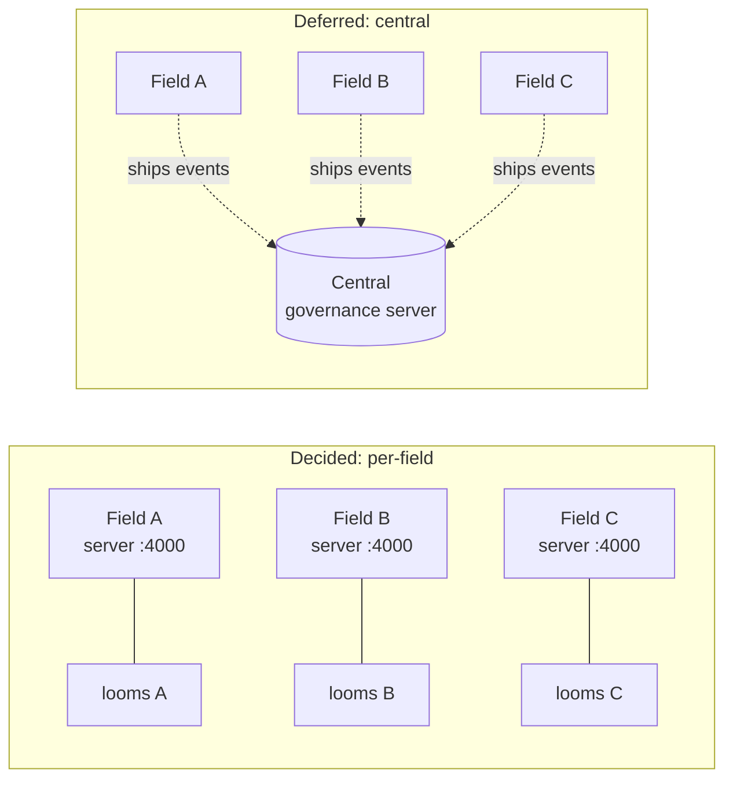

# Deployment boundary: per-field vs. one central governance server

> Decision for `docs/design/integration-todo.md` item 7. **Originally decided per-field; revised
> 2026-08-13 to a single shared server** once its own revisit conditions were met — see "Status
> update: switched to shared" below. The per-field reasoning stays in this doc because Mode A
> (per-field) is still the right call for anyone who wants per-field isolation instead; it just
> isn't what this workspace runs.

> [!note]
> **Packaged as one service (2026-08-14).** `server/app.js` now serves the built `client/dist`
> directly (static assets + a `/^\/(?!api\/).*/` SPA fallback, both ahead of `requireAuth` so the
> UI shell stays public while `/api/*` still needs the bearer token) — backend and frontend run as
> one `node index.js` process on one port instead of two things (`vite dev` + the API) that could
> be started, stopped, and go stale independently. `npm run build` at the repo root (`package.json`
> → `scripts/build-client.js`) builds the client with the server's real token baked in
> (`VITE_GOVERNANCE_API_TOKEN`, read from `server/data/api-token`) and `npm start` runs the
> combined service. `npm run dev:client` / `dev:server` still exist for local development with
> hot reload, unchanged.
>
> [!warning]
> **Incident (2026-08-14): the shared server died when its host looms were closed.** "Shared
> across fields" was only ever a claim about *data/code* coupling (one db, no per-field write
> path, principal `field` read from env not from which server instance answered) — it said
> nothing about *process* supervision, and nothing was ever built for that. The server had been
> started with `npm start`/`npm run dev` run directly from a loom's own Bash tool (both are in
> `windrow/.claude/settings.json`'s `permissions.allow`, which is how this kept happening) —
> that makes `node index.js` a child of that loom's shell process tree, so closing the loom (or
> its shell exiting) killed the server with it, same as it would for any ordinary foreground
> command. `server/index.js` has no signal handling, no daemonization, and nothing in this repo
> ever wrapped it in one (no pm2, no Windows service, no Scheduled Task). Fix applied: restarted
> via `Start-Process -WindowStyle Hidden` (PowerShell), which detaches the child from the
> launching process entirely — verified by confirming the launcher's PID had already exited while
> `node.exe` kept running and serving `/api/rollup/fields`. **Anyone restarting this server should
> use the same detached-launch pattern (or a real service manager), never `npm start` typed
> directly into a loom's terminal** — that always ties its lifetime back to whichever loom typed
> it, regardless of which server-sharing mode is in use.
>
> [!note]
> **Status update: switched to shared (2026-08-13).** This workspace now runs **Mode B** —
> one governance server (`windrow`'s own `server/`, unchanged) shared across every field on
> this machine, chosen deliberately over per-field isolation: "utilize the governance on a system
> level, not just on each field." How-to: `deploy-capability-governance-server` skill (user skills
> dir). What changed operationally: `infrastructure` (`C:\Projects`), `site`, and
> `theme-park-predictor` (both `C:\Users\ejbra\workspace` — a different root entirely, proving
> this is machine-wide, not tied to one workspace directory) each got a `.claude/settings.json` /
> `.agents/hooks.json` pointing their hook commands at `windrow`'s `server/hooks/*.js` by
> absolute path instead of running their own copy — `theme-park-predictor` already had an
> unrelated `PreToolUse` hook (an advisory subagent-prompt reviewer), so its governance hook was
> added as a second matcher entry alongside it rather than overwriting the file. Verified
> end-to-end for all three (a simulated hook call from each field landed a real principal + usage
> event in `windrow`'s `governance.db`, then cleaned up). No code changed to make this work:
> `GOVERNANCE_API_BASE` already defaulted to one shared origin, and a principal's `field` already
> came from Wispfield's own `LOOM_FIELD_NAME`, not the server instance. The **Fleet** cross-field
> rollup (`docs/design/cross-field-and-standalone.md`) is now largely redundant for fields on this
> machine — they already share one `governance.db` — but stays useful for any future field that
> chooses per-field isolation instead, and for the standalone-usage breakdown either way.
>
> **Correction (same day): per-project hook config doesn't reach git worktrees, so it's
> consolidated to one user-level hook instead.** A real call
> (`mcp__wispfield__wispfield_report_progress`) made in `theme-park-predictor` never showed up.
> Root cause: `theme-park-predictor` runs most of its actual work inside `git worktree` checkouts
> under `.claude/worktrees/<name>/` (~29 of them) — each has **its own** `.claude/settings.json`,
> a separate file frozen at whatever commit that worktree branched from, entirely independent of
> the field root's copy. Editing the root's `settings.json` (as the earlier wiring did) never
> reached any of them. Fix: moved the governance hook to `C:\Users\ejbra\.claude\settings.json`
> (**user-level**, applies to every project *and* every worktree on this machine automatically —
> confirmed against Claude Code's own docs: hooks merge additively across user/project/local
> scopes, they don't override, so a project-level copy left in place would have double-counted
> every call). Removed the now-redundant project-level governance hooks from `windrow`,
> `infrastructure`, and `site` (and restored `theme-park-predictor`'s `.claude/settings.json` to
> its original pre-existing hook only) so nothing double-fires. Verified by simulating a call from
> inside an actual worktree directory (`.claude/worktrees/plan-your-day`) — landed correctly, then
> cleaned up. The `.agents/hooks.json` (Antigravity) per-field files were left as-is at the time:
> separate config namespace from Claude Code's settings, no double-count risk, and no confirmed
> user-level equivalent to move them to.
>
> [!note]
> **Follow-up (2026-08-14): Antigravity's user-level equivalent confirmed and adopted.**
> `~/.gemini/config/hooks.json` — per [atamel.dev — where agy looks for
> hooks](https://atamel.dev/posts/2026/07-16_where_agy_hooks/), hooks "can be applied globally or
> per workspace," saved to that path for all three Antigravity flavors (AGY, AGY CLI, AGY IDE).
> `server/config.js`'s `hookInstallPaths` now defaults `agy` there instead of the project-local
> `.agents/hooks.json`, closing the worktree gap this doc left open. Since the config is no longer
> guaranteed to live alongside the repo, `server/providers.js`'s installed command also switched
> from a repo-relative `node server/hooks/agy-pre-tool-use.js` to an absolute,
> `REPO_ROOT`-anchored path — the same fix Claude's adapter gets from `$CLAUDE_PROJECT_DIR`,
> which Antigravity has no confirmed equivalent for. `windrow`'s own stale project-level
> `.agents/hooks.json` was removed after reinstalling at the new location.

## Why not central now

| Concern | State today | Implication |
|---|---|---|
| **Store** | `server/data/db.json`, a single file, no locking (item 6 flags races under concurrent writers) | A central server means *every field's* hooks writing that file concurrently — the race item 6 already calls out, just wider. Fix that first. |
| **Auth** | None — "anything on localhost can currently `POST /grants` and self-grant" | Fine when "localhost" means one machine's own field. A shared server reachable from N fields is a shared secret / real auth problem, not an afterthought. |
| **Network reachability** | Each field's hook talks to `localhost:4000` | A central server needs every field's machine to reach it (VPN/hosting/firewall) — plumbing that doesn't exist and isn't this project's problem yet. |
| **Enforcement itself** | Item 3 (real `PreToolUse`/`PostToolUse` wiring) isn't done | Centralizing before a single field's enforcement is proven correct multiplies an unproven system instead of hardening it once. |
| **Blast radius** | N/A yet | A central broker is a single point of failure for every field's tool calls. Per-field, one field's broker being down blocks only that field. |

## Why the schema doesn't have to change later

The data model already carries what central rollup would need, so choosing per-field now isn't
a dead end:

- `Principal.instance` already stores `field` (`server/principals/fromEnv.js` /
  `registry.js`) — every principal is field-attributed today even though nothing reads that
  across fields yet.
- `correlationId` is `<loom name>(<loom node id>):<session id>` — globally unique, not
  field-scoped by construction, so events from different fields never collide if merged later.
- `UsageEvent`/`Grant` records carry no field-relative ids (no auto-increment, just
  `genId('pr'|'ev'|...)` random hex) — safe to concatenate two fields' `db.json` files without
  a rewrite.

That means the migration path to central is **ship a rollup, not a rewrite**: point a periodic
job (or a `PostToolUse` hook variant) at each field's `/usage` and `/grants` endpoints, or ship
each field's `db.json` deltas to a shared store keyed by the `field` attribute already present.
None of that requires touching the per-field API contract in `docs/design/api-contract.md`.

## What "central" would actually buy, and when to revisit

Central answers a question per-field deployments structurally can't: "who used the Gmail MCP
across the whole fleet last week." That's real value — but only once there's more than one field
worth comparing and enforcement (item 3) has been live long enough to trust the numbers. Revisit
after:

1. Item 6 lands (SQLite or equivalent + real auth) — a prerequisite either way, per-field or
   central. **Done** as of the SQLite migration + `server/auth.js` bearer token.
2. Item 3 has run in production on at least one field and the drift/usage views have been
   validated against real traffic, not seed data. **Done** — real hook-driven events, not seed
   data, have been accumulating in `windrow` since enforcement went live.
3. There are actually ≥2 fields worth comparing — centralizing for one field is pure overhead.
   **Met**: `infrastructure` exists as a second field, and the explicit ask was governance "on a
   system level, not just on each field."

All three conditions this doc set for revisiting are satisfied, which is why the status note at
the top of this doc records the actual switch rather than leaving this section purely
hypothetical.

## Rollout implication for item 7 (superseded — see status note above)

*Historical: at the time this was written, the call was "decided, not deferred" — build item 6
(hardened per-field store) as the real target, not as a stepping stone to a central server that
may never be built, with a rollup as the additive fallback if centralizing was ever wanted.* That
fallback is what got exercised: once items 6 and 3 actually landed and a second field existed, the
condition to revisit was met and this workspace switched to a single shared server rather than a
rollup over separate ones — see the status note for what that involved (hook rewiring only, no
broker/schema redesign, exactly as predicted here).
