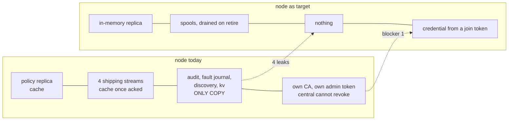
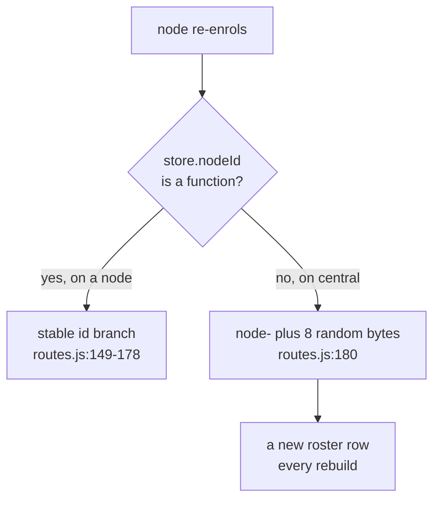
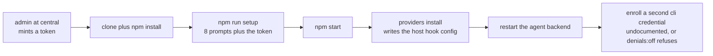
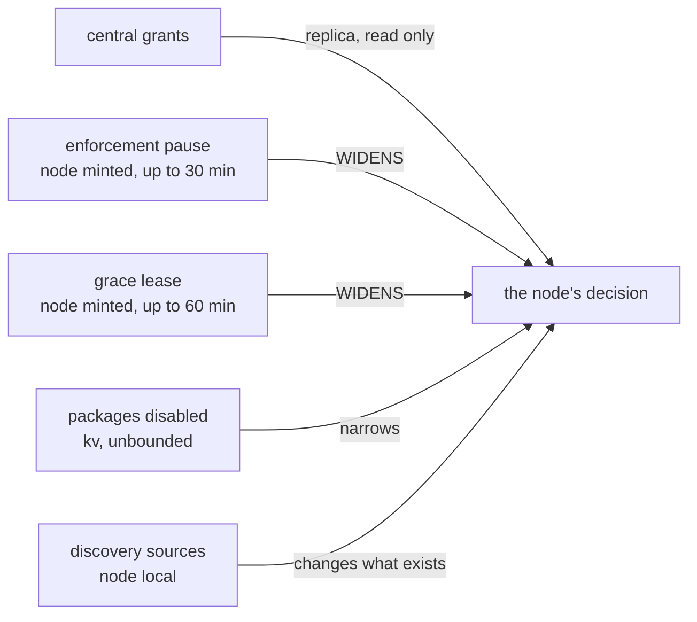
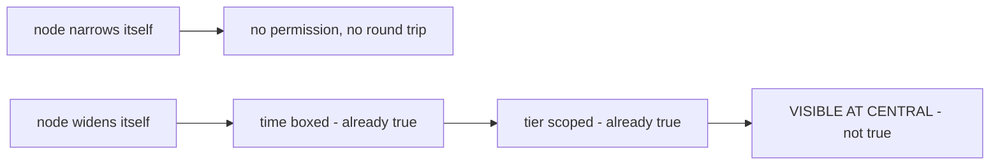
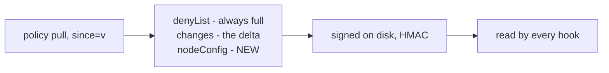
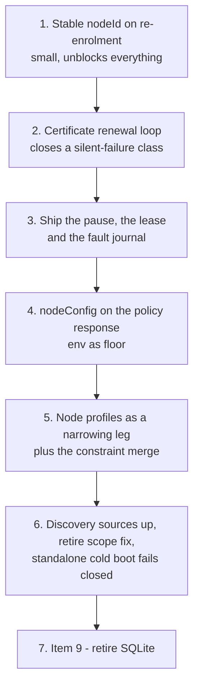

# Disposable nodes: what remains, and two design calls

> [!important]
> **The node is much closer than the design record says.** Seven of the ten items in
> [`dashboard-placement.md`](dashboard-placement.md) are implemented in the working tree — that note
> reads as though none of them are. What is left is **four blockers, four leaks, and two decisions**,
> and the highest-value fix is roughly ten lines: central mints a fresh `nodeId` every time a node
> re-enrols, which quietly undoes the whole point of taking identity out of the database.

```stats
dashboard-placement items landed: 7 of 10
Node routes that must survive: 14 of ~60
Node config keys read: 77
Grant columns carrying a node dimension: 0
```



---

## 1. What already landed

Verified against files, not git history. The whole of this section is new since the design note was
written and none of it is recorded there.

| Item | Status | Where |
|---|---|---|
| 1. Native observations ship to central | **done** | `server/nativeShipper.js`; `POST /api/ingest/native`; partitioned `native_tool_events` at central |
| 2. Hook integrity ships as node health | **done** | `server/nodeHealth.js`; 5 min timer **and** immediate on tamper; 9 hook columns on `nodes` |
| 3. Hook installation has a CLI | **done** | `npm run providers:install` → `scripts/providers.js` |
| 4. Node dashboard deleted | **done** | `server/app.js:412-453` — static mount gone, non-`/api/` GETs return a 404 explainer naming the CLIs |
| 5. Identity out of the database, chain per incarnation | **half** | `nodeId()` is env → credential → mint-into-`windrow.env`; chain is `(nodeId, incarnation, seq)`. **Re-enrolment still mints a fresh id** — §2.1 |
| 6. Retiring a node flushes the queues | **done** | `npm run node:retire` drains both queues, deletes nothing, exits non-zero if anything is owed |
| 7. Re-provisionable join credential | **done in code** | `enrollment_tokens.maxUses`/`uses`, TTL, atomic spend. `docs/setup.md:206` still says "single-use" |
| 8. `/api/ready` gates on the first policy pull | **done** | `app.js:388-397`, 503 `policy-never-pulled`; the supervisor parks rather than denying |
| 9. Retire SQLite on the node | **not started** | `better-sqlite3` still the store; migrations are now at **20**, not fewer |
| 10. UI for central's fleet endpoints | **in flight, uncommitted** | `client/src/pages/fleet/` (10 pages) plus `client/src/pages/policy/` (4) |

> [!tip]
> **Item 5's chain half is the quiet win.** `incarnation` is minted at startup, never persisted, and
> sits inside the canonical hash. Central's density check runs *within* an incarnation, so a rebuild
> starts a fresh dense chain rather than reading as tamper. The failure mode the note feared — an
> alarm that always rings — does not exist.

---

## 2. What still blocks disposability

### 2.1 Re-enrolling at central always mints a new identity



`server/central/enrollmentStore.js:26-33` deliberately omits `nodeId()`, so central always takes the
random branch. The entire re-provisioning path — the already-enrolled lookup, the `reprovisionable`
check, the "re-provisioning" log — is **unreachable on the only topology that matters**, and
`store.js:3016 adoptNodeId` has no caller anywhere in the tree.

> [!caution]
> **This is the single highest-value fix in the document.** Item 7 built a join token with a use
> count precisely so a machine could re-provision itself; item 5 moved identity out of the database
> precisely so a rebuild could keep its name. Neither delivers while central cannot resolve a stable
> id, and the ghost roster the design note measured stays.

A second, smaller trap sits beside it: `scripts/enroll.js` does not write `windrow.env`, only
`setup.js` does. Re-enrolling with the CLI leaves the old `WINDROW_NODE_ID` in place, which wins over
the new credential — and every shipped batch is then rejected whole as `NODE_IDENTITY_MISMATCH`.

### 2.2 Certificates expire in a year and nothing renews them

```bars
Leaf certificate lifetime (days)      365
Renewal code in the tree (lines)        0
```

`enrollment/ca.js:33-34` asserts renewal is automatic. It is not implemented. At expiry
`client.load()` returns **null**, which every caller reads as "no credential" — so the node **stops
shipping and stops pulling, silently**. Enforcement then continues off a frozen replica until
`MAX_POLICY_AGE`, fails closed, and nothing anywhere says why. `verify-topology.js` is the only
detector and it has to be run by hand.

### 2.3 The hook runs on the host, and its data directory is hardcoded

`scripts/providers.js:44` writes the hook command into the host's `~/.claude/settings.json`. That
process reads the deny-list, three signed caches, the subject marker and the agent token from
`DATA_DIR = path.join(__dirname,'..','data')` — **not env-overridable** — and dials the loopback
listener directly.

> [!warning]
> This is the structural containerization blocker and it does not go away by wanting it to. The hook
> must be co-located with the agent, and the agent is on the host. "A node in a container" therefore
> means the *service* containerizes and the hook stays a host-side thin client sharing a volume — and
> a non-overridable `DATA_DIR` is exactly what stops that today.

### 2.4 `better-sqlite3` and twenty migrations

Item 9, untouched, and [`retiring-sqlite-on-the-node.md`](retiring-sqlite-on-the-node.md) already
designs it. It is the only native module, and it is what forces a build toolchain into any image —
central's `Dockerfile` carries a `python3 make g++` stage under protest for a dependency it never
loads. Nothing above depends on it; it is the largest item and the last one.

---

## 3. Four things that still never leave the machine

| What | Size / shape | Why it matters |
|---|---|---|
| `hook-fault-journal.jsonl` | 84 kB live, append-only | Every degraded decision **and every denial an enforcement pause suppressed**, with the pause id. The only record that a node stopped enforcing |
| `discovery_sources` | 9 rows, admin-editable | A rescan reproduces the *defaults*; it does not reproduce sources someone added or disabled |
| `kv.hook_integrity.everInstalled` | a map | Which adapters were ever turned on — the input to `hookHealth`'s "expected" set. Lose it and a **missing** hook reads as **unknown** |
| `kv.packages_enabled` | a map | Which capability packages this workspace runs. Lose it and every package silently reverts to `enabledByDefault` |

Two more are lost on rebuild but are dead weight under central authority rather than leaks:
`windrow_audit` and `policy_changes` — nothing writes them once authority moves, and central's copies
are the only ones that can be right.

> [!caution]
> **The fault journal is the important one, and §5 explains why.** It is the evidence for the one
> mechanism by which a node can overturn central's decision, and it is the only copy.

### Three smaller correctness gaps found on the way

**`npm run node:retire` scopes its drain to the *current* `nodeId`.** Rows queued under a previous id
— exactly the drift the design note observed as two `outbox_seq:` counters in one `kv` — are orphaned
and reported as "nothing is owed." The gate is right; its query is one predicate too narrow.

**A rebuild that skips the gate loses the outbox silently.** `retire.js` composes correctly with a
`&&` and a destroy command, but nothing obliges anyone to type it. That is a process, not a mechanism.

**A fresh standalone node fails OPEN.** With no central configured, an empty database makes
`policyPosture.replicating` false, so an unknown capability takes the "allow, ungoverned" branch and
**every governed call is permitted** until discovery and seeding repopulate — while `/api/ready`
returns 200. Item 8 fixed the mirror image of this for the central case; the standalone case is still
a fresh-install window in which nothing is governed.

---

## 4. Bootstrapping a fresh node



Eleven steps, and **not one of them is automated end to end**. The hard human gates are the admin at
central minting a token, and hook installation on the host filesystem. The last step is a silent trap:
`setup.js` never enrols the local `cli` credential, so `denials:off`, `denials:on` and
`upgrade:begin` all refuse until someone runs a hand-assembled snippet the CLI was written to replace.

> [!note]
> **A node mints its own CA and its own bootstrap admin token on first boot.** So a node holds two
> unrelated credentials — a leaf signed by central's CA for shipping, and a local admin cert signed by
> its own root. **Central can neither issue nor revoke the second one.** Every local divergence lever
> in §5 is gated on that credential, which is why central cannot forbid any of them today.

**What has to change for unattended re-provisioning:** a stable id at central (§2.1); a way for the
join token to reach the machine, since `WINDROW_ENROLLMENT_TOKEN` is read but nothing populates it;
`enroll.js` writing the resulting id where `setup.js` does; a renewal loop (§2.2); and `--ca` supplied
so the first hop is not trust-on-first-use across the network.

---

## 5. Design call 1 — how granular should a node's grants be?

### The honest restatement



Both of these are true at once. A node **cannot write a grant** — `PolicyReadOnlyError` refuses every
policy mutator from every caller including code written next year. And a node **can overturn a
healthy central deny for thirty minutes at a time**, on its own signature, and central never learns.

```stats
Node columns on a grant row: 0
Ways a node can widen its effective grants: 2
Of those, visible at central: 0
```

### Recommendation, in four parts

**1. Never put a node dimension on the grant row.** Three independent reasons, any one sufficient:

| Objection | Why it settles it |
|---|---|
| Semantics | Under most-restrictive intersection a node-scoped grant is a *widening* — the union model [`grant-resolution-semantics.md`](grant-resolution-semantics.md) rejected because it stops the role being a ceiling |
| Ambiguity | A nullable `nodeId` needs a precedence rule against the fleet-wide row, which is the "whichever it finds first" defect that doc exists to kill |
| Enforcement | The replica ships wholesale, so the scope would be enforced by each node choosing to respect its own id — the one field a compromised node controls |

**2. Express node variation as a ceiling, in the constraint vocabulary already specified.**
Intersection already has two legs, user ∩ role. A node profile is a third that **can only narrow**.
AND commutes, so it needs no precedence rule. And `constraints` is already stored, already documented
and evaluated nowhere — §2.1 of the semantics note already specifies the merge (field-by-field
intersection, unknown key denies). Building the ceiling and building the merge is one job, not two.

**3. Granularity: profile-level, tier and capability, narrowing only.**

| Dial | Example | Direction |
|---|---|---|
| Tier ceiling on a profile | `laptop` may not host `destructive` at all | narrows |
| Capability allowlist on a profile | the deploy MCP only on `ci` | narrows |
| Per-`nodeId` anything | — | **no** |

Key it on a **class label on `nodes`**, never on `nodeId`. Per-machine policy is per-machine state,
which is the thing disposability deletes; a rebuilt node re-enrols *into* a profile rather than
carrying one. Central has `nodes.label` today but it is display-only and has no policy effect.

**4. Ship the profile to the node; do not filter the delta server-side.** Filtering is a
confidentiality win — a laptop stops learning what the CI box may do — and an **enforcement no-op**,
because a node that ignores its own ceiling is a node that ignores its own deny-list, and that threat
is not new. It also costs the single global monotonic `policy_changes` version that makes the delta
stream and the `reset` rule work. Revisit only if fleet-shape disclosure becomes a stated requirement.

> [!caution]
> **Order the profile ceiling *before* `autoGrant`, not after.** `autoGrant` is the model's only
> blanket allow, it answers alone, and it has no per-principal exception. A profile that forbids a
> tier must not be bypassable by an auto-granted capability sitting inside it.

### The rule that follows: narrowing is free, widening is reported



The fix is small and reuses a file that already exists. `nodeHealth.js` reports on a 5-minute timer
**and flushes immediately on a hook tamper** — a pause is precisely that shape of event: deliberate,
bounded, security-relevant, machine-local. Add the pause and the lease to that payload, and ship
`hook-fault-journal.jsonl` beside it as the evidence of what a pause actually suppressed.

**If central should be able to *forbid* a pause rather than merely learn of one, that also lives on
the profile** — `allowPause: false`, or a `maxPauseTier` — and it works for the same reason the
ceiling does: it can only narrow. Today central has no lever at all here, because the pause needs a
node-local admin cert that central cannot issue or revoke.

---

## 6. Design call 2 — configuration from the node side

> [!important]
> **Hybrid, but split on who bears the consequence rather than on which file is convenient.** Today's
> split is hybrid by accident: 77 config names are read across the tree, central knows the value of
> **none** of them, and there is no config channel in either direction.

The sharpest example: `WINDROW_MAX_POLICY_AGE_MS` is the bound on how long a partitioned node keeps
enforcing stale policy. It is a fleet security property, and it is an environment variable on the
machine it constrains. This codebase already made exactly this argument once, for the pause — *"a hook
reading its own bypass flag out of the agent's environment would be a bypass every governed process
could set for itself."* The argument extends.

### Three tiers

| Tier | Owner | Examples | Why |
|---|---|---|---|
| **Bootstrap** — how to *find* central | node only | `WINDROW_CENTRAL_URL`, join token, ports | You cannot fetch config from a place you do not know how to reach. Keep it small; the smaller it is, the closer a rebuild gets to working |
| **Machine facts** — what is true about this box | node, authoritative, **reported up** | skill dirs, hook install paths, discovery sources, `WINDROW_USER_HOME` | Central cannot know them and should not guess — but it should *see* them. Discovery sources are the one signal in the whole flow table that still never leaves |
| **Policy parameters** — numbers that decide whether governance holds | **central, pushed** | `MAX_POLICY_AGE`, poll cadence, pause floor/cap/default tiers, grace-lease cap and leasable tiers, alert thresholds, trim caps, retention | A node choosing its own staleness bound is a node choosing when to stop being governed |

### The mechanism already exists — add one field to it



Put `nodeConfig` beside `denyList` on the same response. Same channel, same credential, same signing,
same staleness bound, no new endpoint and no new failure mode. The deny-list already rides every
response in full because it is small and monotone; policy parameters are the same shape. A node that
cannot reach central then ages out its parameters exactly as it ages out its policy — which is the
correct behaviour, and it comes free.

> [!important]
> **Precedence: the env var is a floor, not an override.** Where central states a value, a local
> setting may only make it *more* restrictive — a shorter `MAX_POLICY_AGE`, a tighter pause cap — never
> less. A local override that can only tighten is safe in an operator's hands; one that can loosen is
> a bypass wearing a config file's name.

That is the same narrowing-only rule as §5, and the repetition is the point: one principle, two
surfaces.

### And then shrink the bootstrap tier

```bars
WINDROW names read across the tree     77
Captured by the Windows service        21
Present in windrow.env today           11
Target bootstrap surface                3
```

Identity should come from the **credential**, and the credential from a **join token the orchestrator
injects**. `windrow.env` then reduces to central URL, join token, and ports — three values, all
injectable as plain environment variables by any container platform, none of them needing a file.
That is the shape where a rebuild genuinely works, and §2.1 is exactly what stands between here and
there.

**Why not fully central-managed?** The bootstrap and machine-fact tiers make it a fiction — you cannot
push config to a node that does not know where you are, and central cannot invent a filesystem path.
Better to name the local tier and hold it to three keys than to pretend it is not there.

**Why not fully local?** Forty nodes is forty places to check when a threshold is wrong, and the
threshold that matters most is the one that decides when a node stops being governed.

---

## 7. Recommended order



| # | Work | Size | Ships value alone |
|---|---|---|---|
| 1 | Resolve a stable `nodeId` for a `node`-scoped enrolment at central; wire `adoptNodeId`; have `enroll.js` write the id where `setup.js` does | ~10 lines plus tests | yes — ends the ghost roster and makes item 7 real |
| 2 | Renewal: re-enrol against the current certificate before expiry, and make an expired credential loud rather than absent | small | yes — removes a year-fuse with a silent failure |
| 3 | Add pause and lease state to the node-health payload; ship the fault journal | small, reuses `nodeHealth.js` | yes — "is that box still enforcing" becomes a fleet question |
| 4 | `nodeConfig` block on the policy response; env becomes a floor | medium | yes — one place to set the staleness bound for forty nodes |
| 5 | `nodes.profile`; a third narrowing leg in resolution; implement the specified constraint merge | large; gated on the §1.7 subject flip | the design call this document answers |
| 6 | Ship discovery sources; widen retire's drain across incarnations; make a fresh standalone node fail closed | small each | yes, independently |
| 7 | In-memory replica index, then append-only spools, then drop `better-sqlite3` | largest | per [`retiring-sqlite-on-the-node.md`](retiring-sqlite-on-the-node.md) |

> [!important]
> **Built 2026-08-23: items 1–6 of the table above are implemented.** What was an assessment is now
> the record of a change. Item 7 — retiring `better-sqlite3` — is the one row still open, and it has
> its own design in [`retiring-sqlite-on-the-node.md`](retiring-sqlite-on-the-node.md).
>
> Where the build departed from the recommendation, it says so in the code rather than here. Two
> departures are worth naming:
>
> - **§2.1's stable id needed an authentication story the recommendation did not state.** A caller
>   that could name its own `nodeId` could enrol as somebody else's node, which is the forgery
>   per-node credentials exist to prevent. So an id claim is honoured for one nobody holds, and for
>   one the caller PROVES it holds by signing the new enrolment's public key with the key its current
>   certificate attests. That proof also removes the need for a token on a renewal, which is what
>   makes §2.2's loop possible without an admin awake once a year per node.
> - **§3's "a fresh standalone node fails OPEN" is fixed on the decision path, not on `/api/ready`.**
>   Item 8 could park a replica node because the policy client was going to make it ready anyway.
>   Nothing does that for a standalone one — it is seeded through its own CLI — so parking it means
>   an install that can never be finished. The hook fails an unknown capability closed while the
>   registry is empty; `/api/ready` reports the state and serves.
>
> `dashboard-placement.md` has been updated to say which of its ten items exist.

### What each item became

| # | Landed as |
|---|---|
| 1 | `server/enrollment/routes.js` resolves a claimed or proven id; `client.js` sends one; `scripts/enroll.js` calls `adoptNodeId`, which now records into `windrow.env` rather than `kv`. Tested in `enrollment/reprovision-test.js` against a central-shaped store — the topology no existing test covered |
| 2 | `server/enrollment/renewal.js`: a daily check, renewal at a third of the leaf's life, tokenless via proof of possession, and an enrolment from an injected `WINDROW_ENROLLMENT_TOKEN` for a container that has never been enrolled. `enrollment/renewal-test.js` |
| 3 | `nodeHealth.js` carries `divergence`, `credential`, `facts` and an incremental slice of `hook-fault-journal.jsonl` behind a byte cursor; central migration 9 adds the roster columns and `node_fault_journal`; `GET /api/fleet/divergence` is the short list |
| 4 | `server/policy/nodeConfig.js` is the policy-parameter tier and the merge; the block rides `/api/policy` beside the deny-list and lands in the same signed file. `policy/narrowing-test.js` |
| 5 | Central migration 10 adds `node_profiles` and `nodes.profile`; `server/policy/constraints.js` implements `grant-resolution-semantics.md` §2.1's merge; the profile runs as a third leg in the SHADOW evaluator (that document gates the enforced flip on §1.7), and its tier ceiling and capability allowlist are enforced in the hook BEFORE `autoGrant` |
| 6 | `store.usageOutboxStatsByNode()` and a widened `npm run node:retire`; discovery sources, `everInstalled` and `packages_enabled` ride the health report; `WINDROW_DATA_DIR` is now honoured, which is §2.3's containerisation blocker |
