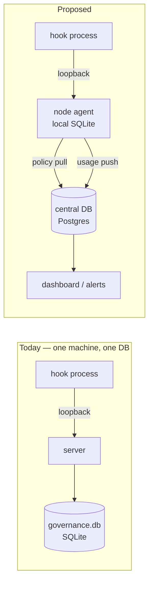
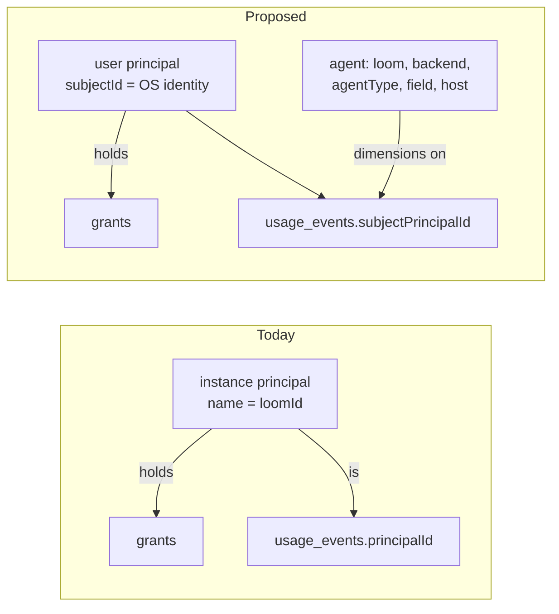
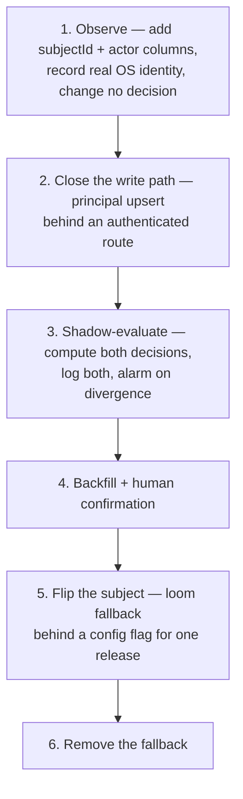
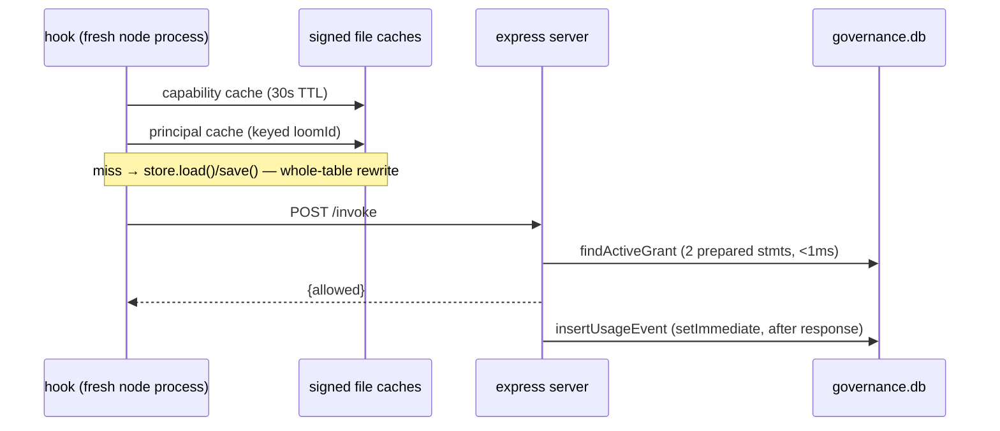
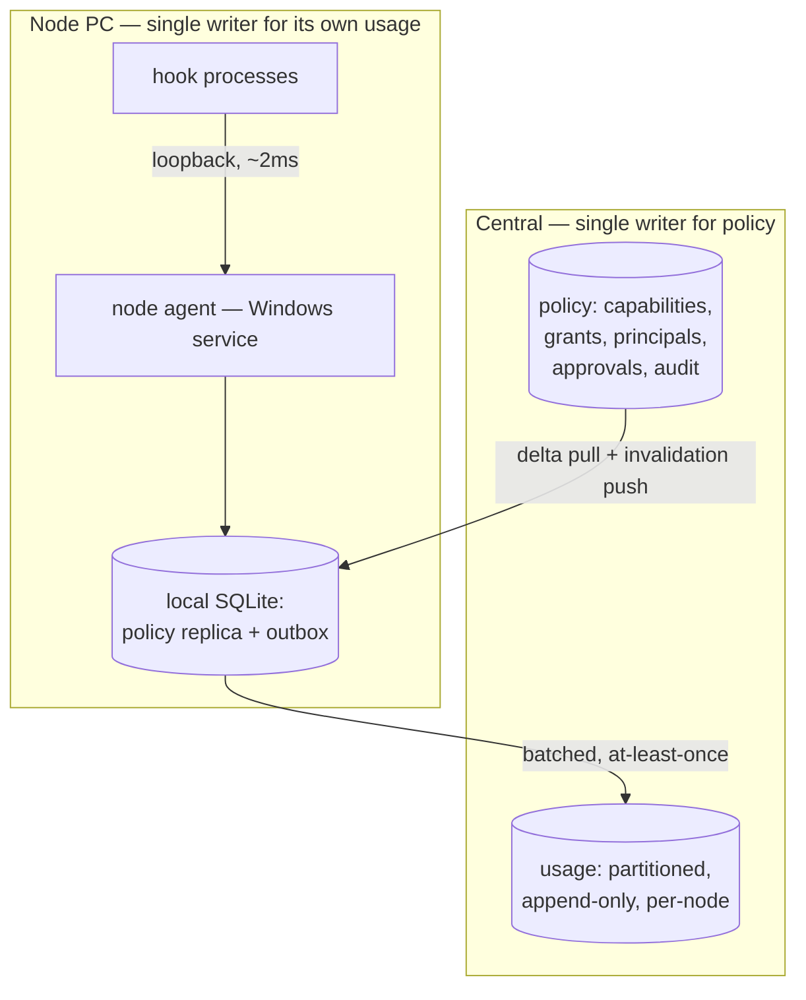
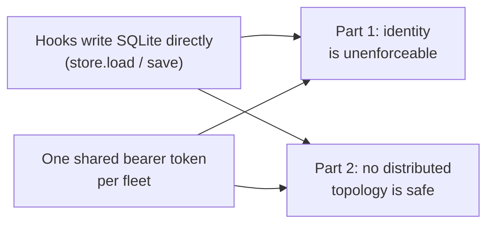

# Global identity + central DB: research

> Two proposed architectural changes for windrow, researched together because they share one
> blocker. Nothing here is implemented — this is a design-space map, not a plan of record.



```stats
Hot-path budget today: 15-25 ms, all loopback
Typical WAN round trip: 20-80 ms + fresh TLS
Tables to reclassify central vs local: 8
Shared secrets that do not survive: 3
```

> [!important]
> **The two changes share one blocker.** Both are held up by `resolvePrincipal()` in
> `server/hooks/lib.js`, which on a cache miss calls `store.load()` → mutate → `store.save(db)`,
> and `store.save` **replaces every table's contents in one transaction** (`server/store.js`,
> `replaceAll`). A whole-registry rewrite triggered by an agent's first tool call is tolerable
> with one writer on one machine and is unshippable in any topology with more than one. Neither
> change is safe until that call site becomes a narrow upsert.

---

# Part 1 — The user is the tracking key; the agent is a dimension

> [!important]
> **One sentence version.** A grant is held by a *person*; a call is made by an *agent on that
> person's behalf*. Windrow currently conflates the two into a single row keyed on a loom id, and
> every downstream problem — the fake per-person dashboard, the principal-per-respawn explosion,
> the self-minting principal — follows from that conflation.



## 1.1 What the key is today

`identityFromEnv()` (`server/principals/fromEnv.js`) reads inherited environment variables and
returns `{loomId, humanName, backend, agentType, field, standalone, osUser, hostname}`.
`upsertPrincipalFromIdentity()` turns that into two rows: a **role** keyed on `agentType`, and an
**instance** whose `principals.name` *is* the loom id. Grants attach to either; instances inherit
their role's grants dynamically at authorization time.

> [!warning]
> **`humanName` is not a human.** It is a cast-pack nickname the platform assigns — "Finn",
> "Cole", "Mira". `server/app.js`'s usage summary, `server/rollup/index.js` and the Principals
> page all used to **group by display name**, so the dashboard presented these as people: two
> different humans whose agents both drew "Finn" merged into one row, and one human respawned four
> times split into four. **Fixed (`want-mszgwgcd-15`)** — all three now key on `principalId`,
> `groupPrincipalsByDisplayName` is gone, and the nickname is a label only. That is an honest view
> of what the registry knows today; making these rows mean *people* still needs §1.4's subject key.

Sites that would have to move:

| Site | What it does today |
|---|---|
| `server/principals/registry.js` `principalDisplayName()` | `humanName \|\| name`; shared by `server/app.js` and `server/rollup/index.js` |
| `server/app.js` usage summary | groups by `principalId`; returns the nickname as `name` and the agent/role name as `agentName` (was: grouped by display name) |
| `server/rollup/index.js` | uses the shared function for the fleet view |
| `client/src/api/principal.ts` | same fallback; `groupPrincipalsByDisplayName` removed |
| `client/src/pages/DashboardPage.tsx` | builds a `principalId → humanName` map |
| `client/src/pages/PrincipalsPage.tsx` | one row per instance id; `humanName` is a label beside the agent id, not the identity |
| `docs/design/api-contract.md` "Principal mapping (v1)" | documents the whole scheme — and is already stale on the off-platform `null` return |

Schema surface: `principals` (`name`, `humanName`, `backend`, `agentType`, `field`, `standalone`,
`parentRole`, `kind`), `grants.principalId` plus its partial unique index, `usage_events`
(`principalId`, `osUser`, `hostname`), `governance_audit`, and the `POST /api/invoke`,
`POST /api/grants`, `POST /api/principals`, `PATCH /api/usage/:id` request bodies.

## 1.2 The split: subject vs actor

| | Subject — **who is accountable** | Actor — **what made the call** |
|---|---|---|
| Identified by | the OS user (§1.3) | loom id, backend, agentType, field, hostname |
| Lives on | a `principals` row | columns on `usage_events` |
| Stable across | respawns, backends, machines, sessions | nothing — it is per-call by design |
| Answers | "who may do this", "who is over budget" | "which agent did it", "on which machine" |
| Cardinality | one per person | unbounded, and that is fine — it is log data |

**The agent stops being a registry row.** `usage_events` already sets the precedent: `osUser` and
`hostname` are event columns *because* they describe the call rather than the subject. The change
inverts which of the two is the subject. `usage_events` gains `subjectPrincipalId` and
`actorLoomId` / `actorAgentType` / `actorBackend` / `actorField`, joining the `hostname` already
there; `principals` for a user carries none of `backend`/`agentType`/`field`/`standalone`.

> [!note]
> **Do not add an "agent acting for user" principal kind.** It multiplies principals back out to
> one per (user × loom) — the exact cardinality problem this escapes. The one case that genuinely
> wants its own principal is an agent granted *less* than its user; `findActiveGrant`'s existing
> instance-overrides-role fallback is the mechanism for it, and it can wait.

### What the dimension model buys

These are all one `GROUP BY` away once the actor is a set of columns, and all impossible today:

| Question | Grouped by |
|---|---|
| Who is spending the most destructive-tier calls? | `subjectPrincipalId` |
| Which backend does this person actually work in? | `subjectPrincipalId`, `actorBackend` |
| Is one agent shape responsible for most denials? | `actorAgentType`, `outcome` |
| Did this person's usage move to a new machine? | `subjectPrincipalId`, `hostname` |
| Which fields does this capability get used from? | `capabilityId`, `actorField` |

Today the first of those is unanswerable — usage groups by principal, and a principal is an agent
instance, not a person — and the rest require
joining out to a principal row, so they describe the agent as *registered*, not the call being
counted.

> [!warning]
> **That overwrite was a live correctness bug, not just a modelling wart.**
> `upsertPrincipalFromIdentity` refreshed `humanName`/`backend`/`agentType`/`field` in place on
> every call, so any historical report reading those fields off the principal attributed old
> events to the agent's current attributes.
>
> **Shipped (`want-mszgwf94-14`):** those attributes are now write-once in both upsert paths
> (`principals/registry.js`, `store.js`'s `upsertPrincipalIdentity`) — set at creation, NULLs
> back-filled, a differing observation returned as `identityDrift` and logged by
> `/api/principals/resolve` instead of written. That stops the re-attribution; it does not yet
> record the new observation anywhere. `want-mszgwhfj-16` (actor columns on the event) is what
> gives a genuine rename somewhere to live, and moving them onto the event still fixes the whole
> class by construction.

## 1.3 Resolving the user

Measured on this machine (2026-08-18):

```stats
os.userInfo(): {username:"ejbra", uid:-1, gid:-1}
whoami /user: S-1-5-21-2963395615-2330981250-1484618637-1001
WindowsIdentity: DESKTOP-VBALV8J\ejbra (down-level)
Domain-joined: no — WORKGROUP
```

| Mechanism | Gives | Spoofable by the agent? |
|---|---|---|
| `USERNAME` / `USER` env var | a string | **yes, trivially** — and `fromEnv.js` reads env *before* `os.userInfo()` |
| `os.userInfo()` | a username; `uid` is real on POSIX, `-1` on Windows | no, but it is a display name on Windows, not a key |
| `whoami /user` child process | the real SID of the calling process | not the value, but `PATH` can substitute the binary |
| `WindowsIdentity::GetCurrent()` via a native binding | the real token SID | no |
| POSIX `getuid()` / `process.getuid()` | the real uid | no |

> [!caution]
> **Every one of these answers "who am I?" as asked by the process itself.** That is sufficient
> for a local hook talking to a local service on the same machine, and worthless across a trust
> boundary — a remote server has no reason to believe the answer. §1.5 is where that bites, and
> Part 2's central deployment is where it stops being theoretical.

**The env-var-first ordering is the single cheapest fix in this document.** `currentOsUser()`
prefers `env.USERNAME || env.USER` and only falls back to `os.userInfo()`. Hooks run as child
processes with an inherited environment, so the agent controls the value on the path that is
actually taken. Inverting that ordering — real OS call first, env only as a last resort — is a
few lines and removes the trivial spoof, whatever else is or is not built.

**Federated identity is a later layer, not a prerequisite.** If windrow ever needs one person to
be the same principal across machines they do not share an OS account on, that is a
server-verified token (OIDC-shaped) mapped onto the same `subjectId` column — an additional
authority prefix, not a redesign. Nothing below depends on it, and the design should not wait for
it. Off-machine identity is deliberately out of scope here.

## 1.4 The stable key

The rule is general and does not depend on which identity authority is in play: **key on the
opaque identifier, never on the display name.** Names get reused and renamed; the audit trail
outlives both. Windrow's grants already carry `expiresAt` and soft-delete tombstones precisely so
"who had what, when" survives — a mutable key undoes that guarantee.

Put the key in a new `principals.subjectId`, `UNIQUE`, prefixed by authority so heterogeneous
sources cannot collide, with `name` demoted to a mutable display label:

```
win-sid:S-1-5-21-2963395615-2330981250-1484618637-1001
posix:1000@<hostId>
federated:<opaque>          # reserved — see §1.3
```

> [!warning]
> **A Windows SID's uniqueness lives in the machine prefix, not the RID.** `…-1001` is the first
> ordinary account on *every* Windows machine, and `uid` 1000 is the first ordinary account on
> most Linux ones. Store the whole value. Any later display-shortening to "user 1001" merges every
> developer's primary account into a single principal.

A per-machine OS account is machine-scoped by nature, which is why `posix:` carries a host
qualifier and why the same person on two machines is two principals until a federated authority
says otherwise. That is the honest model, and it is strictly better than today, where the same
person on two machines is *N loom ids per machine*.

Record an `assuranceLevel` — on the principal *and* on the event, since it can differ per call:

```bars
Server-verified over an authenticated channel   3
OS-read identity, same machine                  2
Env-derived username — display only             1
```

Windrow is at tier 1 everywhere today. Making the tier explicit is what lets the migration ship
incrementally without pretending tier 1 is tier 3.

## 1.5 The trust problem

Three facts, all verified in code:

1. **The hook self-asserts everything.** `POST /api/invoke` takes `principalId`, `osUser` and
   `hostname` straight from the request body; `server/app.js`'s own header comment says it "trusts
   a caller-supplied osUser/hostname because the *hook* is the one that actually ran on the
   calling machine." Sound for a same-machine server. False for a shared one.
2. **The only credential is a shared static bearer token** that carries no identity — it says
   "a hook," not "whose hook." `server/auth.js` documents `GOVERNANCE_AGENT_TOKEN` as the way to
   share tokens across a fleet of hosts: one secret, everyone.
3. **The hook writes the database directly.** `resolvePrincipal` does `require('../store')` →
   `load()` → upsert → `save()`. Principal creation never passes `requireAuth` at all, and
   `save()` replaces every table.

So what stops user A claiming to be user B? Nothing — and not merely because the assertion is
unauthenticated. Tightening `osUser` to a real SID read still fails, because A can simply POST any
`principalId` with the shared token.

| Option | Verdict |
|---|---|
| **Stop letting hooks write SQLite**; move principal upsert behind an authenticated route | **do this first.** Until it lands no identity scheme is enforceable, because the enforcement point is bypassable by design. Also a hard prerequisite for Part 2 |
| **Read the OS identity, not the environment** (§1.3) | cheap, immediate, and independent of everything else |
| Per-machine service credential — the privileged local service reads the caller's real token and attests upward over mTLS | the shape that survives Part 2's central deployment; windrow already installs as a service |
| Hook signs its own assertion | dismiss it. The key lives on the disk being protected — `hooks/lib.js` already concedes this about its HMAC cache signing |

State plainly in any implementation plan: the `usage_events` hash chain is tamper-**evident**, not
tamper-proof, and says so itself. A shared deployment moves the threat from "a user edits their
own log" to "a user edits everyone's," which raises what the chain is worth without making it
sufficient.

## 1.6 Migration

**There is no recorded link from a loom instance to a human being.** The closest thing is
`usage_events.osUser`, which is nullable, recent, and written from an unauthenticated request body.

| | |
|---|---|
| **Derivable** | the modal non-null `osUser` per instance principal gives a *probable* owner — a dashboard suggestion for a human to confirm, never an automatic remap |

> [!note]
> **Shipped (`want-mszgwmvq-21`).** `GET /api/principals/owner-proposals` ranks the OS accounts each
> instance's calls were made under and proposes the modal one; the dashboard's *Agent owners* card
> shows it beside the evidence (share of identified calls, how many calls carry no account at all,
> the other accounts seen, and any existing `user` principal it matches) and
> `POST /api/principals/:id/owner` records what a human chose — confirm, correct, or "no owner".
> The proposal is computed per request and stored nowhere, only `instance` principals have one, and
> confirming changes no authorization decision: `findActiveGrant` still resolves instance →
> `parentRole`. It records the mapping phase 5 flips onto, which is the whole of what "never an
> automatic remap" permits.
| **Unrecoverable** | events predating the `osUser` column; `humanName` values (nicknames, zero relation to a person — so existing "per-person" dashboard numbers cannot be retroactively made real); any spoofed or `'unknown-user'` value; the machine-scoping of every identity, since `osUser` is a bare username with no SID or host qualifier |
| **Grants** | roles map forward unchanged. Instance-level grants: **4,681 of them, across 88 instance principals** — counted in the live db 2026-08-18, not estimated. But **every one is redundant**: zero grant a capability the instance's `parentRole` does not already grant, so none needs a human decision. The migration drops them; see below |

#### The instance-grant count, measured (`want-mszgwsej-27`)

```
4,681 instance grants          88 instance principals hold them (14 hold none)
        │                      84 distinct capabilities, 0 duplicate pairs, 0 revoked
        │
        ├── 4,681  redundant — parentRole already grants the same capability
        └──     0  unique — would lose an authorization if dropped
```

| | |
|---|---|
| Shape | not scattered — a near cross-product. 26 instances hold all 84 caps, 12 hold 72, 45 hold 34; the tier tracks `parentRole` (`claudecode` 87 instances / 4,664 grants, `claude-standalone` 1 / 17) |
| Provenance | pre-F6 residue. 4,634 of the 4,681 were minted 2026-08-14→17 by the old auto-provision that materialized a per-instance copy of the role's grants at creation. No `governance_audit` row exists for any of them |
| Still happening? | **No.** The newest is `2026-08-17T02:28:36Z`; every instance principal created since holds zero. The F6 fix works — this is a backlog, not a leak |
| Load-bearing today? | **Yes, but only nominally.** `findActiveGrant` checks the direct grant *before* the role fallback (`server/app.js:115`), so these rows are the ones actually authorizing. Since all 4,681 are covered by the role, deleting them changes no decision |

So the migration's *decision* burden is **zero** — the "each needs a human decision" worry does not
apply to a single row. The burden is mechanical only: 4,681 rows to delete, and any UI that renders
grants per principal is showing a 53-row list per instance that means nothing.

> A cleanup here is independent of the migration and can land first: deleting every instance grant
> whose `parentRole` covers it is a no-op for authorization today, and it shrinks the table the
> migration has to reason about to the roles alone.

Phased so the hook path never breaks — it fails open only for `read_only`, so a broken resolve
denies real work:



Step 1 uses the guarded-`ALTER TABLE` idiom `server/store.js` already establishes, and is fully
reversible — the actor columns alone make the dashboard honest before any decision changes.

Two rollout hazards specific to this codebase: the HMAC-signed **hook principal cache is keyed by
`loomId`** and must be invalidated at step 5 or hooks keep resolving stale principals — the
mechanism is in place (`GRANT_SUBJECT_EPOCH` in `server/principals/subject.js`, stamped into the
cache by both writers and checked on every read, plus a per-entry subject stamp that misses when a
different OS account drives a warm loom), so step 5 bumps that constant in the same commit that
moves the subject; and
`server/rollup/index.js` opens *sibling workspaces'* `governance.db` files read-only, so a schema
change lands in windrow before neighbours migrate — the rollup must tolerate both shapes for the
whole rollout window. (§2.7 phase 5 narrows that window rather than closing it: a node with a
central configured answers from one query and never opens a sibling file, but the scan is still the
fallback, so its tolerance layer stays load-bearing wherever there is no central.)

## 1.7 What happens to roles

Windrow's roles do not go away and do not become a user concept. They keep answering a different
question, and the two compose:

> [!tip]
> **The user principal answers "what is this person allowed to do." The role answers "what is this
> agent shape allowed to do." The effective grant is the intersection.** An agent can then never
> exceed its operator — which is the containment story the whole product is arguing for.

| Concept | Keyed on | Example | Grants |
|---|---|---|---|
| user | `subjectId` | `win-sid:S-1-5-21-…-1001` | what this person may do |
| role (agent shape) | `agentType` | `claudecode`, `claude-standalone`, `Explore`, `Plan` | ceiling for any agent of that shape |
| instance | — | gone; becomes event dimensions | — |

Resolution becomes: **user grant ∩ role ceiling**, replacing today's instance → `parentRole`
fallback. Two things to settle explicitly rather than let loop order decide, both of which the
current code leaves ambiguous because it returns the *first* match it finds:

- **Multiple grants for one subject** — **settled: most-restrictive.** Every leg must allow; there
  are no widening fallbacks. `constraints` merges as a field-by-field intersection, and a
  constraint key with no evaluator denies.
- **Negative grants** — **settled: no such thing, ever.** Under intersection every deny is already
  an absence, and an allow-vs-deny precedence rule would reintroduce the same first-match ambiguity
  this settles.

Both in [grant-resolution-semantics.md](grant-resolution-semantics.md), which also records what
`findActiveGrant` has to return instead of a grant row.

> [!note]
> **This kills the F7 class of bug outright.** Today an unrecognised `agentType` string mints its
> own principal on first sighting; F7 had to patch that by landing new roles `status: 'pending'`
> with zero grants. Once the grant subject is an OS user that must already exist on the machine,
> there is no self-minting path to patch — a new agent shape can only ever *narrow* what its
> operator already holds.

## 1.8 Burndown

```stats
Open: 16
p1: 7
p2: 9
Shipped: 1
```

Every work item Part 1 implies is on the field's wants list. This table is the index — the wants
list is the source of truth for state, and the `Done` column here is updated when one closes.

> [!tip]
> **Three of these stand alone.** `want-…-11`, `-13` and `-14` are defects in the system as it
> runs today — an environment variable the caller controls deciding identity, a whole-registry
> rewrite on an agent's first tool call, and historical events reported under an agent's current
> attributes. They are worth fixing whether or not the identity change ever ships, which makes
> them the right place to start.

### Phase 1-2 — observe, and close the write path

| Want | § | Pri | Item | Done |
|---|---|---|---|---|
| `want-mszgwbgf-11` | 1.3, 1.5 | p1 | `currentOsUser()` reads the real OS identity before the env vars | ☐ |
| `want-mszgwjmn-18` | 1.3, 1.4 | p1 | resolve the full OS security identifier, never truncated to the RID | ☐ |
| `want-mszgwij4-17` | 1.4 | p1 | `UNIQUE principals.subjectId`; `name` demoted to a display label | ☐ |
| `want-mszgwhfj-16` | 1.2 | p1 | `actorLoomId`/`actorAgentType`/`actorBackend`/`actorField` on `usage_events` | ☐ |
| `want-mszgwf94-14` | 1.2 | p1 | stop overwriting `humanName`/`backend`/`agentType`/`field` in place | ☑ |
| `want-mszgwd2n-12` | 1.5 | p1 | principal upsert behind an authenticated route | ☐ |
| `want-mszgwe5x-13` | 1.5 | p1 | narrow upsert instead of `store.save()`'s whole-table replace | ☐ |
| `want-mszgwkq3-19` | 1.4 | p2 | `assuranceLevel` on the principal and the event | ☐ |

### Phase 3-4 — shadow-evaluate, then backfill

| Want | § | Pri | Item | Done |
|---|---|---|---|---|
| `want-mszgwlsi-20` | 1.6 | p2 | shadow mode: compute both decisions, log both, alarm on divergence | ☐ |
| `want-mszgwq5d-24` | 1.7 | p2 | settle union vs most-restrictive, and whether negative grants exist | ☑ |
| `want-mszgwsej-27` | 1.6 | p2 | count instance-level grants in the live db | ☑ |
| `want-mszgwmvq-21` | 1.6 | p2 | dashboard flow proposing an owner per instance principal | ☑ |

### Phase 5-6 — flip the subject, then remove the fallback

| Want | § | Pri | Item | Done |
|---|---|---|---|---|
| `want-mszgwgcd-15` | 1.1 | p1 | stop grouping usage and Principals by `humanName` | ☑ |
| `want-mszgwnz1-22` | 1.6 | p2 | invalidate the `loomId`-keyed hook principal cache | ☑ |
| `want-mszgwp2a-23` | 1.6 | p2 | rollup tolerates both principal schema shapes | ☐ |

### Not phase-bound

| Want | § | Pri | Item | Done |
|---|---|---|---|---|
| `want-mszgwqow-25` | 1.1 | p2 | de-duplicate `principalDisplayName` across three files | ☑ |
| `want-mszgwrs8-26` | 1.1 | p2 | update `api-contract.md`'s "Principal mapping (v1)" | ☐ |

> [!note]
> **Part 2 has no wants yet, deliberately.** Its phases 0-2 are the same work as this table's
> phase 1-2 rows — `want-…-12` and `-13` *are* Part 2's phase 0. Nothing central-specific should
> be filed until those close, because the shape of the node/central seam depends on what the
> authenticated upsert route ends up looking like.

---

# Part 2 — Central DB + distributed nodes

*Read Part 1 as the schema and this as the transport: identity decides what the central DB is
keyed on.*

## 2.1 What is actually here today



| Property | Value | Where |
|---|---|---|
| Store | SQLite via `better-sqlite3`, WAL, `synchronous=NORMAL` | `server/store.js` |
| DB path | `server/data/windrow.db`, `WINDROW_DB_PATH` override | `server/store.js` |
| Tables | capabilities, principals, grants, windrow_audit, usage_events, kv, approvals, discovery_sources | `server/store.js` |
| Row ids | random hex `genId('pr'\|'ev'\|…)` — no autoincrement | `server/id.js` |
| Audit integrity | usage_events hash chain, **global, in rowid order** | `server/store.js` `hashUsageEvent`/`rechainFrom` |
| Hot-path write | response sent *before* the insert (`setImmediate`) | `server/app.js` `/api/invoke` |
| Cache freshness | server-side warmer at 60% of the 30s TTL | `server/cacheWarmer.js` |
| Cross-machine today | `server/rollup/index.js` opens sibling fields' `.db` files read-only — since §2.7 phase 5 this is the FALLBACK, and a configured central answers with one query instead | `server/rollup/index.js`, `server/rollup/central.js` |
| Auth | three shared bearer tokens (admin / agent / proposer) | `server/auth.js` |

Three of these are load-bearing for the split, in descending order of pain.

> [!warning]
> **The global hash chain is the hardest constraint.** `hash = sha256(prevHash | canonical(row))`
> over `rowid` order, and `rechainFrom()` rewrites every subsequent row when a `PATCH /usage/:id`
> lands. One totally-ordered chain cannot be produced by N nodes ingesting concurrently without
> serialising every node behind a single writer — precisely the latency the split exists to
> avoid. **The chain must become per-node**: `(nodeId, seq)`, one head per node, verified per
> node. A fleet-wide verify becomes N chain walks instead of one.

**Random ids are a gift.** No autoincrement anywhere means two nodes' rows never collide on a
primary key — `docs/design/deployment-boundary-decision.md` already banked on this ("safe to
concatenate two workspaces' files without a rewrite") and it still holds. The only natural-key
collisions are `capabilities(kind, name)` and `principals(kind, name)`, both of which need a real
`UNIQUE` constraint centrally and central-assigned ids on the node.

**A fresh Node process per tool call forbids a WAN hop on the hot path.** This is not a tuning
question. `docs/design/latency-breakdown.md` records that merely using `fetch()` instead of
`http.request()` cost ~20 ms, because undici built its agent lazily *in every process*. A TLS
handshake to a central server has the same shape and is worse, and connection pooling cannot help
a process that exits after one request.

```bars
loopback to local node agent      2 ms
current local server round trip   20 ms
WAN + fresh TLS, same LAN         60 ms
WAN + fresh TLS, cross-region     180 ms
```

## 2.2 The shape that works: policy down, usage up

The design that avoids conflict resolution entirely splits the data so **neither direction ever
has two writers for the same row**.



| Plane | Direction | Writer | Conflict model |
|---|---|---|---|
| **Control** — capabilities, grants, principals, approvals, audit | central → node | central only | none; the node replica is read-only |
| **Data** — usage_events | node → central | that node only | none; partitioned append-only log |
| **Discovery** — skills/MCP found on a PC | node → central | node *proposes*, central decides | dedupe on `(kind, name)` |

Discovery is the one genuinely bidirectional path, and the move is to make it explicit rather than
clever: a node reports what it found, central owns the canonical capability row and its id, the
node keeps the mapping. No CRDTs, no vector clocks, no last-writer-wins — the moment those are
needed, two writers have landed on one row and the row should move instead.

### Table-by-table placement

| Table | Home | On the node | Notes |
|---|---|---|---|
| `capabilities` | central | full read replica | needs `UNIQUE(kind,name)`; ids minted centrally |
| `grants` | central | read replica + deny-list | revocation latency is the security number — see 2.4 |
| `principals` (role) | central | read replica | becomes the user/role model of Part 1 |
| `principals` (instance) | — | — | should stop being a registry row at all — see Part 1 |
| `approvals` | central | read-only view | the `ask` flow reads; only central writes |
| `governance_audit` | central | none | control-plane changes only happen centrally |
| `usage_events` | central sink | **outbox + local retention** | per-node hash chain |
| `discovery_sources` | node | authoritative | filesystem paths are machine-local by nature |
| `kv` | node | authoritative | local runtime state |

## 2.3 Fast writes to central, without paying for them on the hot path

The ask is "maintain fast writes to the central DB for usage tracking and alert triggers." Those
are two requirements with different deadlines, and conflating them is the trap.

| Requirement | Real deadline | Mechanism |
|---|---|---|
| The hook's allow/deny decision | **~20 ms**, blocking a human's tool call | local grant check against the replica — never touches the network |
| Usage durability | seconds; must survive reboot and offline | local outbox write, then batched ship |
| Alert triggers | seconds to a minute | evaluated **twice** — locally on the outbox, centrally on the aggregate |
| Dashboard freshness | tens of seconds | central query |

**Local outbox, background shipper.** The node agent already has the right shape to host it: the
server installs as a Windows service (`scripts/service-install.js`, `server/daemon/windrow.xml`),
so a long-lived process with a warm HTTPS connection pool already exists. The hook keeps writing
to loopback; the service ships. Batched NDJSON over HTTPS, at-least-once, idempotent ingest keyed
on `(nodeId, seq)` with `ON CONFLICT DO NOTHING`. `/api/invoke`'s existing respond-first-write-
after trick is unchanged and still correct.

**Two lanes, not one.** Batching every event on a 5-second timer is right for the 95% and wrong
for exactly the events an alert exists to catch. Flush immediately on any `denied` outcome, any
`destructive`-tier call, and any consent correction; everything else rides the timer. That mirrors
the fail-open/fail-closed split by `riskTier` that `runPreToolUse` already implements, so it is
one policy expressed twice rather than a new concept.

**Evaluate alerts at both ends.** A node-local rule engine catches "this user just ran 40
destructive calls" while the WAN is down; central catches "this user is on five PCs and the total
crossed the threshold." Dedupe on a stable alert key `(ruleId, subjectId, window)` so a breach
seen from both sides fires once.

> [!note]
> **Trust node clocks for nothing.** Record the node-assigned `ts` *and* a central `observedAt`,
> and keep the delta. Skew is what turns an audit log into plausible-looking fiction, and every
> node here is a user's own PC with a clock they can set.

## 2.4 Revocation — the number that decides the design

With one DB a revoke is instant. With a cached replica it is not, and "how long can a revoked
grant still be used" is the security property this topology has to state out loud.

| Option | Revocation window | Cost |
|---|---|---|
| Poll on a TTL (30s, matching the existing capability cache) | ≤ 30s | trivial — N nodes × 2 req/min |
| Poll + **push invalidation** (SSE / long-poll / NATS) | < 1s typical, ≤ TTL worst case | one held connection per node |
| Separate **deny-list channel**, cached indefinitely | < 1s, and survives a stale replica | revocations are small and monotone — cheap to broadcast in full |
| Synchronous central check per call | 0 | reintroduces the WAN hop the design exists to remove |

Take the first three together. A monotonic `policy_version` centrally; the node pulls
`GET /policy?since=<v>` for deltas; SSE pokes it to pull now; revocations additionally ride a
small always-full deny-list, so a node whose delta stream broke still denies correctly. Then bound
the failure: past `MAX_POLICY_AGE`, fail **closed** for `mutating`/`destructive` and stay open for
`read_only` — the exact policy `server/hooks/lib.js` already applies to an unreachable API,
extended from "cannot reach" to "cannot trust."

## 2.5 Technology choices

| Layer | Recommend | Alternatives considered | Why |
|---|---|---|---|
| Central store | **PostgreSQL 16**, `usage_events` range-partitioned by month | SQL Server, CockroachDB/Yugabyte (multi-region), ClickHouse/Timescale (usage only) | boring; partitioning, `ON CONFLICT`, `LISTEN/NOTIFY` all built in. Split usage out to ClickHouse only if volume forces it |
| Node store | **keep SQLite / better-sqlite3** | LMDB, plain files | zero hot-path change; WAL already handles the reader/writer mix |
| Transport | **HTTPS + batched NDJSON** | gRPC, NATS JetStream, Kafka, Azure Event Hubs | survives corporate proxies and TLS inspection; a real queue is warranted only past roughly 10k events/s |
| Invalidation | **SSE** on the same HTTPS origin | WebSocket, NATS, long-poll | one direction, one connection, no extra port to argue through a firewall |
| Change capture | **outbox table** in the node's SQLite | SQLite session extension, triggers, WAL tailing | the node already owns its write path; an outbox is explicit and testable |
| Schema migration | **one versioned migrator** for both stores — **shipped**, see below | today's ad-hoc guarded `ALTER TABLE` blocks | `server/store.js` hand-rolled these; N nodes at mixed versions makes that untenable |
| Node credential | **mTLS client cert issued at enrollment** | per-node bearer token, shared token | see below |

> [!note]
> **The migrator shipped, before there are any nodes to strand.** `server/schema/migrator.js` is
> the dialect-agnostic core — a `schema_migrations` ledger, one transaction per migration covering
> both the change and its ledger row, and a driver seam (`exec`/`get`/`all`/`transaction` plus
> `hasTable`/`columns`/`createLedger`) so the central Postgres store reuses the same file with its
> own list. `server/schema/sqliteDriver.js` is the SQLite half; `server/schema/nodeMigrations.js`
> holds the node's schema as 14 ordered migrations, which are `server/store.js`'s former
> `CREATE TABLE IF NOT EXISTS` block and its dozen `PRAGMA table_info` guards, statement for
> statement. Three things follow that the inline blocks could not do:
>
> - **The version is a number.** `store.schemaVersion()` reads it, so a node can report where it is
>   and central can tell a fleet at mixed versions from a fleet that is merely quiet (§2.6).
> - **A downgrade is refused.** A database migrated by a *newer* build throws `SchemaTooNewError`
>   before a statement runs, rather than an older build writing rows it does not understand — the
>   failure mode a guard can never see, since every guard reads "already present, nothing to do."
> - **An up-to-date database costs one indexed read**, not a PRAGMA sweep per table on every CLI,
>   hook and server start.
>
> Migrations stay idempotent by construction (`ctx.addColumn` is the one guard, in one place), so
> an existing un-ledgered database is baselined by running the list from the top with nothing
> rewritten and nothing dropped — verified in `npm run smoke:schema --prefix server`, which builds
> a legacy-shaped database and asserts it reaches a schema byte-identical to a fresh one, with the
> audit rows surviving the `governance_audit` rename and the grants surviving the soft-delete
> rebuild. The two hash-chain backfills that used to be `let` flags reassigned from inside the
> guards are now signals raised only by a migration that actually ran.

> [!warning]
> **The three shared bearer tokens do not survive this change.** `server/auth.js` explicitly
> contemplates setting `GOVERNANCE_AGENT_TOKEN` to share tokens across a fleet of hosts. A central
> ingest endpoint accepting one fleet-wide agent token means **any node can forge any other node's
> usage events and any user's attribution** — which is exactly the property Part 1 exists to
> establish. Node credentials must be per-node and enrollment-issued.

## 2.6 Version skew

N nodes on user PCs update at N different times. Two rules make that survivable, and both are
cheap to adopt now, before there are any nodes:

- **Ingest is additive-only and tolerant.** An unknown field on an event is stored, never
  rejected; a missing field is null, never fatal. An old node must keep reporting to a new central.
- **Policy payloads carry a schema version**, and a node refuses to *apply* a delta it does not
  understand rather than half-applying it — falling back to its last-good replica and the
  staleness bound from 2.4.

> [!note]
> **Both rules are adopted, at zero nodes — which is the only cheap time to do it.** Neither can be
> retrofitted once a fleet exists: the whole point is that the *older* build already behaves
> correctly when it meets a newer one, and a rule added later is a rule the installed base does not
> have.
>
> **Ingest** is `server/ingest/usageEvent.js`, and it is one pure function rather than a few
> `?? null`s at the insert because there are two ingest points that have to agree — today's
> `store.insertUsageEvent`, and phase 3's central `/api/ingest/usage` fed by N nodes at N versions.
> Adopting it only at central would mean the rule was never exercised until the moment it had to
> work; adopting it at the node's own insert means every event ever written went through it.
>
> - **A missing field is null.** `usage_events` now has no `NOT NULL` below `id`: migration 15
>   relaxed `principalId`/`capabilityId`/`ts`/`outcome`/`latencyMs`. A `NOT NULL` column leaves an
>   ingest meeting an unfamiliar build two answers, reject or invent, and inventing is the worse
>   one — `'unknown'` and `0` are indistinguishable at query time from a real outcome and a real
>   latency, so fleet-wide skew would read as healthy traffic. `id` stays required because it is
>   not a field but the key an at-least-once redelivery arrives holding; the normalizer refuses
>   such an event rather than minting one, which is the single refusal in the file.
> - **An unknown field is stored** in `usage_events.extra`, one canonical sorted-key JSON object,
>   **inside the hash chain** — an unrecognised field is evidence like any other, and evidence
>   outside the chain can be rewritten for free. It is merged rather than nested on re-ingest, so
>   shipping and snapshot-restore are lossless, and a field that later *gains* a column is promoted
>   out of `extra` instead of living in two places free to disagree. Tolerance is not a bypass:
>   every name this build knows, and the writer-assigned `nodeId`/`seq`/`hash`, are decided by the
>   server and dropped from the body — `extra` cannot be used to set your own `outcome`.
>
> **Policy skew** was already enforced by `server/policy/replica.js`'s `applyDelta` (a delta whose
> `schemaVersion` is unknown — *including absent* — is refused whole, leaving the last-good replica
> byte-identical) with the deny-list persisted first and unconditionally, so revocation still lands
> through a refusal. What was missing was the second half of this section's own sentence about
> telling a mixed-version fleet from a quiet one: a skewed node polls on schedule, refreshes its
> deny-list on schedule and reports no transport failure while its replica silently stops moving.
> `policyClientStatus()` now carries `schemaSkew` — when it started, what central is stamping, what
> this node understands, and the version it is frozen at — and it is cleared only by an *applied*
> delta, never by a merely successful request.
>
> `npm run test:skew --prefix server` asserts both rules as staged mismatches, including the two
> that would otherwise fail silently: that a refused delta leaves the replica untouched rather than
> half-applied, and that editing an unknown field in `extra` breaks the hash chain.

## 2.7 Phasing

| Phase | Work | Ships value alone? |
|---|---|---|
| 0 | Remove `store.load()/save()` from `resolvePrincipal`; narrow upsert instead | yes — removes a real lost-write race that exists today |
| 1 | ~~Add `nodeId`; make the usage hash chain `(nodeId, seq)`; add `observedAt`~~ **shipped** | yes — makes today's `rollup` merge sound |
| 2 | ~~Introduce a `policyStore` (read) / `usageSink` (write) seam behind `app.js`'s direct `store.*` calls~~ **shipped** | no — pure refactor, but it is the seam everything else needs |
| 3 | ~~Stand up central Postgres; run **shadow mode** — node stays authoritative, ships everything up, compare~~ **shipped** | yes — a real fleet dashboard at zero risk |
| 4 | ~~Flip authority for `grants`/`capabilities` to central; node becomes replica + deny-list~~ **shipped** | the actual change |
| 5 | ~~Retire `rollup/index.js`'s sibling-`.db` scan into a central query~~ **shipped** | cleanup — and the first fleet-wide answer the rollup has ever given |


> [!note]
> **Phase 5 shipped.** The rollup is now a source seam, not a directory walk. `queries.rollup` in
> `server/central/queries.js` is the whole of it — four `GROUP BY`s over `usage_events` joined to
> `principals` — and `server/rollup/central.js` translates its answer into the shape
> `listFields()`/`summary()` have always returned, so no route and no page had to learn which source
> replied.
>
> ```mermaid
> flowchart LR
>   R["/api/rollup/summary"] --> S{"WINDROW_ROLLUP_SOURCE"}
>   S -->|"central, or auto + a central"| Q["GET /api/fleet/rollup<br/>one query, every node"]
>   S -->|"local, or auto + none"| L["scan N sibling .db files<br/>this machine only"]
>   Q -.->|"unreachable, auto only"| L
> ```
>
> **The scan is kept, and it is the fallback rather than the default.** A node with no central still
> answers exactly as it did — phase 5 must not turn a working standalone install into one that
> reports nothing — and `WINDROW_ROLLUP_SOURCE=local` forces it back without unsetting
> `WINDROW_CENTRAL_URL` and taking usage shipping down with it.
>
> **Every payload says which source produced it**, and a fall back says why. The two sources answer
> different questions — "every workspace on this disk" and "every workspace in the fleet" — so one
> machine's rows returned silently under fleet headings would be a wrong number that looks like a
> right one. `WINDROW_ROLLUP_SOURCE=central` therefore *errors* rather than falling back; `auto`
> falls back and puts the reason in `centralError`, which the Fleet page shows as a banner.
>
> **`/api/fleet/rollup` is the only fleet route a node certificate reaches, and it is pinned to that
> node's own rows** — asking for another node's does not widen it, because the certificate decides
> and not the query string. An admin certificate gets the fleet. The rollup names people's
> workspaces, their agents and their call volumes, and "every node may read every other node's
> usage" is the disclosure half of the fleet-wide shared token §2.5 exists to retire.
>
> **Three things the scan could not do**, all of them free here: it spans machines; `duplicatesSkipped`
> has nothing to count, because ingest is idempotent on `(nodeId, seq)` before a duplicate can become
> a row; and an event whose workspace cannot be established at all is *reported* as
> `unattributedCalls` rather than filed under whichever directory it happened to be read from. Three
> things it could that central cannot: `fieldPath`, `dbPath` and `reachable` are facts about a node's
> disk, and they come back null rather than invented.
>
> Asserted in `npm run test:rollup --prefix server` (source choice, fallback semantics, payload
> contract and the certificate scoping — no Postgres, because that half runs on every user's PC) and
> in the phase-5 section of `npm run smoke:central --prefix server` (the SQL, against a real
> Postgres).

Phases 0-2 are worth doing whether or not central ever happens; phase 3 is reversible by
configuration. Nothing before phase 4 changes the hook contract — and phase 4's change to it is one
branch, described in its note below.

> [!note]
> **Phase 4 shipped.** Central mints the ids and owns the canonical rows; every node runs a read
> replica plus the deny-list. The flip is one environment variable and it is reversible by unsetting
> it: `WINDROW_POLICY_AUTHORITY=central`, which `server/policy/authority.js` refuses unless a
> `WINDROW_CENTRAL_URL` is also set — asking for an authority with nowhere to get one downgrades a
> node silently, which is the state this phase exists to end.
>
> ```mermaid
> flowchart LR
>   subgraph N["Node PC"]
>     H["hook<br/>~2ms loopback"] --> B["broker<br/>server/app.js"]
>     B -->|"read"| M[("mirror:<br/>capabilities, principals,<br/>grants — LOCKED")]
>     B -->|"write, awaited"| W["centralPolicyStore"]
>     D["hook-policy-deny.json"] --> H
>   end
>   W -->|"HTTPS + mTLS"| C[("central Postgres<br/>single writer<br/>mints cap_/pr_/gr_ ids")]
>   C -->|"delta + SSE poke"| M
>   C -->|"always-full deny-list"| D
> ```
>
> **Four pieces, and each closes a different way the flip could look right and not be:**
>
> - **Central is the writer.** `server/central/policyStore.js` + migration 3 in
>   `centralMigrations.js`. `UNIQUE(COALESCE(kind,''), name)` on capabilities and `UNIQUE(kind,
>   name)` on principals are now *fleet-wide*, so `role/claude` is one row approved once rather
>   than one per machine, and the active-grant partial index is enforced in one place instead of
>   forty that cannot see each other. `POST /api/policy/capabilities/resolve` is §2.2's discovery
>   direction: a node reports what it found, central answers with the id. A node re-reporting a known
>   tool **cannot retier it** — otherwise "what may this tool do" would be decided by whichever
>   machine rescanned its filesystem most recently — and a discovered tool with no stated tier lands
>   at `read_only`, the least it could be.
> - **The node cannot write policy at all.** Not "does not" — `server/store.js`'s
>   `PolicyReadOnlyError` refuses every policy mutator from every caller, including a script or a
>   route written next year, and `applyPolicyReplica` is the one way in. Without that the flip
>   would be a convention holding only for code that happens to go through the seam, and the first
>   caller to reach around it would mint a row central has never heard of that no later delta can
>   correct. The applier also **displaces locally-minted rows that collide with central's** on the
>   natural key, which every phase-3 node is guaranteed to have.
> - **The hot path did not move.** The mirror is the same tables with the same indexes, so
>   `findActiveGrant` is still two prepared statements and no governed tool call touches the
>   network. The WAN is on the *write* path, where a human is waiting on a dashboard — not on the
>   *decision* path, where an agent is waiting on a tool call. That is why every policy-mutating
>   route in `server/app.js` is now `async`, and why an unhandled rejection in one is turned into
>   a response rather than a hung request: that failure mode did not exist while they were all
>   synchronous, so it arrives with this phase.
> - **The hook contract changed in exactly one branch**, and it is the one §2.7 warns about. "This
>   capability is not in the registry" used to be a complete answer — there was nowhere else it could
>   be. On a replica there is, and this node's copy can be behind. So the absence is now read against
>   the copy's freshness: a **current** replica means genuinely ungoverned (allow, as before), a
>   **stale** one means *cannot tell* → `FAULT.NOT_REPLICATED`, deny. The ladder cannot help here
>   and that is not an oversight: it branches on `riskTier`, and the tier is exactly what is
>   missing. Failing an unknown tool closed costs a call; treating an unreplicated destructive
>   capability as ungoverned costs the guarantee. `/invoke` also now stamps every response with
>   `{authority, version, ageMs}`, so a denial an agent receives says *whose* policy denied it and
>   how current the copy was — asking the admin of one replica out of forty does not help.
>
> **What did not change, and is where the safety argument still lives.** Revocation does not go
> through any of the above: it rides the always-full deny-list on every poll, so it lands on a node
> whose delta stream is broken, whose replica is frozen for schema skew, and whose SSE connection a
> proxy closed an hour ago. Past `MAX_POLICY_AGE` the node fails closed for mutating/destructive and
> open for read_only, exactly as §2.4 prices it. A node partitioned from central keeps enforcing; it
> does not keep enforcing *forever*, and that bound is what phase 4 buys.
>
> **Verified three ways, because the halves can each be right while the seam between them is not.**
> `npm run test:authority --prefix server` asserts the node half with no network (the lock per
> mutator, the collision, a revoke replicating as a row rather than a deletion, a reset removing what
> central no longer has, and both directions of the unknown-capability rule).
> `npm run smoke:central-policy --prefix server` asserts central against a real Postgres — including
> that its delta is applied *unmodified* by the node's own `server/policy/replica.js`, which is the
> check that catches a field renamed on one side. `npm run e2e:authority --prefix server` runs a
> live node against a live central and follows one grant out and back. The first runs everywhere; the
> other two **skip loudly** rather than passing when there is nothing to talk to.

> [!note]
> **Phase 3 shipped.** `server/central/` is the other half of §2.2's topology: a **separate process,
> separate entry point and separate database** (`npm run central --prefix server`), speaking to
> PostgreSQL 16 through the same `server/schema/migrator.js` the node uses — via `migrateAsync`,
> which exists because there is no synchronous PostgreSQL client for Node and making the one runner
> async would put a promise on the boot path of every hook process. Contract in
> `docs/design/api-contract.md`, "Central ingest and the fleet view".
>
> **`usage_events` is `PARTITION BY RANGE ("observedAt")`, one partition per UTC month.** The key is
> central's arrival clock and not the node's `ts`, and that is this section's own note arriving as a
> schema decision rather than a sentence: `ts` is nullable per §2.6 (Postgres requires the key NOT
> NULL) and it is a clock on a user's own PC, so partitioning on it would let any node bury a month
> of its own denials in a partition nobody queries, or blow a hole in the fleet's storage layout by
> shipping events dated 2031. Both clocks are stored — the node's own `observedAt` unmodified,
> because it is inside its hash chain — and the delta is kept in `clockSkewMs`. Partitions are
> maintained three months ahead and one behind on an hourly timer, with a DEFAULT partition so that a
> lapse degrades to a diagnostic instead of the fleet-wide ingest outage §2.8 says must not exist.
>
> **§2.3's `(nodeId, seq)` ingest key needed the shipment number to be *shipped*.** It was not:
> `enqueueOutbox` put the shipment number on the outbox row and the payload carried only the event.
> Keying on the event's chain seq instead would have made every **consent correction** — the most
> security-relevant write this system makes, and the reason §2.3 has an immediate lane at all —
> arrive looking like a redelivery of the row it corrects, and be discarded silently. The envelope is
> now `{nodeId, seq, kind, event}`. Idempotency is enforced in `usage_shipments`, not by a unique
> index on `usage_events`: Postgres requires a partitioned table's unique index to contain the
> partition key, the partition key is assigned at arrival, and a redelivery is by definition a second
> arrival — so that constraint would have looked correct and caught nothing.
>
> **Shadow mode's deliverable is the comparison, not the collection.** `npm run shadow:compare
> --prefix server` runs *on a node*, reads that node's own database and POSTs its account of itself;
> central compares and records a verdict in `shadow_reconciliations`. The node reports rather than
> being interrogated, deliberately — a channel *into* a user's PC, once it exists, is the obvious
> place for phase 4's authority to arrive through before anyone has decided it should. Four verdicts:
> `match`, `lagging` (behind by no more than the node's own outbox depth — the timer working),
> `gap` (shipments central will never receive) and `divergent` (a disagreement no lost shipment
> explains). A gap and a chain break are usually one fault seen twice, so a known gap *explains* a
> missing link and only an unexplained break reads as divergence; without that, every ordinary
> trimmed outbox would report as divergence and the verdict would stop being read. **`gap` is the
> number that has to stay at zero for phase 4 to be safe.**
>
> Central serves **no policy**, and that absence is the phase's reversibility rather than an
> unfinished edge: there is no `/api/policy`, no `grants` table and no `capabilities` table on the
> central side, so stopping the process leaves every node enforcing exactly as before and costs only
> the fleet view. `npm run smoke:central --prefix server` asserts 51 properties against a real
> Postgres — including that a redelivery does not double-count, that a correction is not mistaken for
> one, that an unknown field survives, that a missing field reads null rather than invented, and that
> a batch claiming another node's id is refused whole — and *skips* with an explanation when no
> central database is configured.


> [!note]
> **Phase 1 shipped.** `usage_events` carries `nodeId`, `seq` and `observedAt`; the chain is keyed
> `(nodeId, seq)` with one row per node in `usage_chain_heads`; `GET /usage/verify` reports per
> node and now detects truncation, which a rowid chain could not. `rollup` dedupes the merge on
> `(nodeId, seq)` — the shared-db deployment was counting one call once per workspace pointing at
> the db — and reports measured `clockSkew` from `observedAt - ts`. Contract in
> `docs/design/api-contract.md`, "The node, and the per-node hash chain". The rest of §2.7 is
> unchanged: this is the whole of phase 1, and phase 0's `resolvePrincipal` write path is still
> the shared blocker for everything after it.

> [!note]
> **The §2.4 channel is built.** `policy_changes` is the monotonic log (AUTOINCREMENT, one row per
> mutation, seeded from existing rows once at boot); `GET /api/policy?since=<v>` serves deltas,
> `reset`s a node it cannot catch up incrementally, and carries the **always-full** deny-list on
> every response including a no-op poll; `GET /api/policy/events` is the SSE poke;
> `server/policy/policyClient.js` is the node half — poll, push, backoff, and a §2.6 refusal to
> apply an unknown `schemaVersion`. `server/hooks/lib.js`'s `policyChannelGate` enforces both ends
> of §2.4 on the decision path: a deny-list hit denies every tier, and past `MAX_POLICY_AGE` the
> call goes down the *existing* degradation ladder as `FAULT.STALE_POLICY` — read_only open,
> mutating/destructive closed. Contract in `docs/design/api-contract.md`, "The policy distribution
> channel"; `npm run test:policy-channel --prefix server` asserts it, including the property this
> exists for: with the delta stream refusing to apply, a revoked grant is still denied.
>
> This is the *channel*, not phase 4. Authority has not moved: the node still decides from its own
> tables, and `policy-replica.json` is filled but read by nothing on the hot path. What phase 4 does
> is point the decision at the replica the channel is already keeping.

> [!note]
> **Phase 2 shipped.** `server/policy/` holds the seam: `policyStore` (25 members — capabilities,
> principals, grants, approvals, and the `GrantConflictError`/`CapabilityConflictError` classes
> callers branch on) and `usageSink` (13 — usage events, audit rows, the native-tool summaries, and
> the node's `nodeId`/chain heads). `server/app.js` names `store` directly for exactly ten things
> now, all of them node-local: the discovery-source CRUD and its conflict error, `getDiscovery`,
> `getHookIntegrity`, and the `load()`/`save()` pair phase 0 deletes. Both halves are rebindable at
> runtime (`setBackends`), and the facades resolve per call, so a replacement is picked up by routes
> required long before it — that is what phase 3 shadow mode and phase 4's authority flip attach to.
> Behaviour is unchanged by construction: the local adapters are delegates to `server/store.js`,
> and `npm run smoke:policy --prefix server` asserts it — a static pass that every member
> `app.js` names is defined and nothing policy-shaped still reaches around the seam, then 42
> route checks against a scratch database.

## 2.8 What this costs

| Risk | Mitigation |
|---|---|
| Central becomes a fleet-wide single point of failure | it is never on the hot path — a node fully partitioned from central still enforces from its replica for `MAX_POLICY_AGE` |
| A revoked grant is usable up to the staleness bound | 2.4's three channels, plus fail-closed past the bound |
| Per-node hash chains weaken the audit story | they do not weaken it per node; they remove the *illusion* of a fleet-wide total order a distributed system never had |
| Operational surface goes from "a Node process" to "a Node process, a Postgres, a network path, an enrollment CA" | phase 3 shadow mode proves the value before any of it is load-bearing |
| Users' PCs hold a full policy replica | already true — grants are readable in the local DB today; the replica is not new exposure |

---

# Where the two changes meet



| | Part 1 needs it | Part 2 needs it |
|---|---|---|
| Principal upsert behind an authenticated route | the enforcement point is otherwise bypassable | a node cannot be a read replica if hooks rewrite the registry |
| Per-node / per-caller credentials replacing the shared token | otherwise A can POST as B | otherwise a node can forge another node's events |
| Narrow upserts instead of `save()`'s whole-table replace | — | last-writer-wins across a fleet |
| A stable, authority-prefixed subject key | the point of the change | it is what central partitions and aggregates on |

Do them in this order, and each step is worth shipping on its own:

```bars
0. Close the hook write path              1
1. Per-node credentials + subjectId       2
2. Observe-only identity recording        3
3. Central in shadow mode                 4
4. Flip grant subject, then authority     5
```

> [!tip]
> **Neither change should go first as a whole.** The shared prerequisite — hooks stop writing the
> database, and credentials stop being fleet-wide — is one piece of work that unblocks both, and
> it removes a real lost-write race that exists today regardless.

---

## Provenance

Part 1 was researched by Mickey; Part 2 by Cole. Verified by reading code: every "today" claim in
both parts, all `humanName` call sites, `findActiveGrant`'s shape, the hash-chain implementation,
the hot-path sequence, and the three-token auth model. Verified by running on this machine
(2026-08-18): `os.userInfo()` output, the real SID, and the machine's non-domain-joined state.
**Inferred, not verified:** all target designs, option rankings, the subject-key scheme, both
phasings, the alerting design, and every latency figure attributed to a WAN
(the loopback numbers come from `docs/design/latency-breakdown.md`; the WAN numbers are typical
values, not measurements). The live `governance.db` contents **were** checked (2026-08-18,
`want-mszgwsej-27`): the instance-grant count and its full redundancy against `parentRole` are
measured, not estimated.
