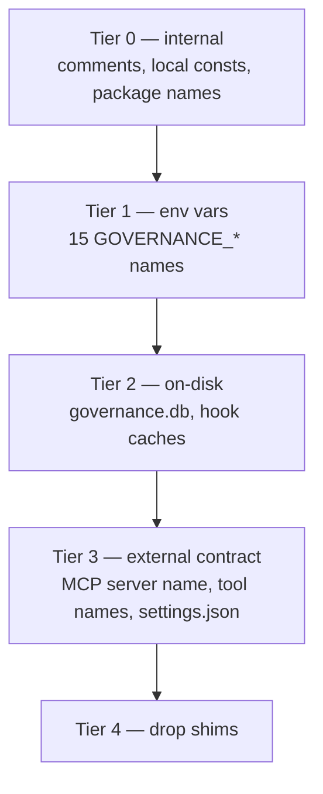
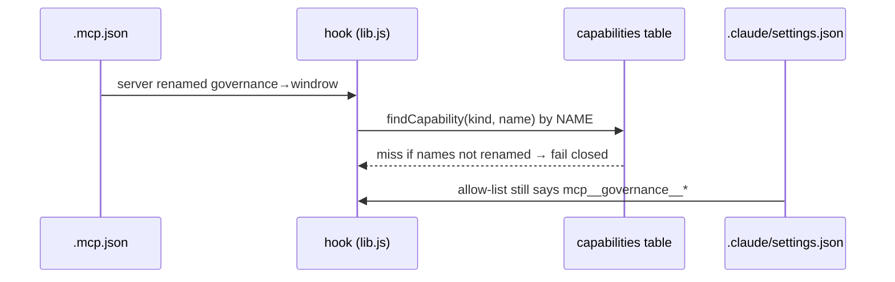
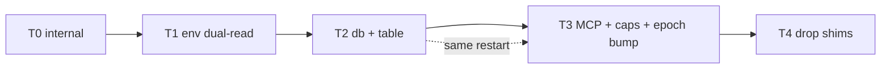

# Renaming `governance` → `windrow`

```stats
Code files touched: 43
Distinct GOVERNANCE_ env vars: 15
Identifier references in code: 247
Doc files mentioning it: 17
Grants at risk if done wrong: all of them
```

> [!important]
> Grants reference `capabilities.id` (an opaque `cap_…` hash), and the `usage_events` hash chain
> covers `capabilityId` — **not** capability *name*. So a capability can be renamed in place with
> `UPDATE` and nothing breaks. Re-**discovering** it under the new name mints a fresh `cap_…`,
> orphans every grant, and splits its history in two. Rename rows; never re-seed.

## 1. The distinction the whole plan rests on

"Governance" is two different words in this repo, and only one of them is the product.

| | Meaning | Action |
|---|---|---|
| **Product name** | this service, its env vars, its db, its MCP server | → `windrow` |
| **Domain noun** | capability governance as a discipline; "a governance decision" | **leave alone** |

A blind `sed -i s/governance/windrow/g` destroys the second category — `docs/design/skill-mcp-governance.md`
becomes `skill-mcp-windrow.md`, which names nothing. Scope the rename to **identifiers**, per the
brief's "in the code".

> [!warning]
> Three doc files are gitignored (`.gitignore:25-26`: `governance-vulnerability-review.md`,
> `governance-review-*.md`). Renaming those filenames silently un-ignores them and commits security
> review material. Leave those names as they are.

## 2. What changes, by blast radius



Each tier is independently shippable. Tiers 0–2 are invisible to agents; **tier 3 is the only one
that can break a running field.**

### Tier 0 — internal, no compatibility surface

| Item | From | To |
|---|---|---|
| `server/package.json` name | `capability-governance-server` | `windrow-server` |
| `mcp/package.json` name | `governance-mcp-server` | `windrow-mcp-server` |
| `server/hooks/lib.js` const | `GOVERNANCE_API_HOST` | `WINDROW_API_HOST` |
| `server/hooks/lib.js` const | `GOVERNANCE_TOKEN_BASENAME_PATTERN` | `WINDROW_TOKEN_BASENAME_PATTERN` |
| `server/hooks/lib.js` fn | `isGovernanceSelfCallAttempt` | `isWindrowSelfCallAttempt` |
| `server/seed.js` local | `capDeployGovernanceServer` | `capDeployWindrowServer` |
| `mcp/server.js` McpServer | `name: 'capability-governance'` | `name: 'windrow'` |

Root `package.json` (`windrow`), `client/package.json` (`windrow-client`) and the Windows service
(`name: 'Windrow'`, `WINDROW_USER_HOME` — `scripts/service-install.js:15,28`) are **already renamed**.
This tier finishes a job that is half done, which is the argument for doing it at all.

### Tier 1 — the 15 environment variables

> [!important]
> **Shipped 2026-08-19.** `envCompat` is in `server/config.js`, and every runtime env read now goes
> through it. Two corrections to what this section originally listed. First, the fifteen names were
> not fifteen *reads*: `GOVERNANCE_AGENT_TOKEN`, `GOVERNANCE_API_TOKEN_PATH` and
> `GOVERNANCE_PROPOSER_TOKEN_PATH` appear only in prose describing a design that was rejected
> (`server/auth.js` header, `server/enrollment/ca.js`), and `GOVERNANCE_API_HOST` /
> `GOVERNANCE_TOKEN_BASENAME_PATTERN` are local consts derived from `API_BASE`, not env vars —
> tier 0 renamed those. Second, five reads the list predates were also routed:
> `NATIVE_JOURNAL_MAX_BYTES`, `OBSERVE_NATIVE_TOOLS`, `NATIVE_DRAIN_INTERVAL_MS`,
> `NATIVE_RETENTION_DAYS` and `NATIVE_DRAIN_MAX_LINES` (`server/hooks/lib.js`,
> `server/nativeObservations.js`). `scripts/sandbox.js`, `scripts/upgrade.js`,
> `server/enrollment/{e2e,integration}-test.js` were on the call-site list too and are not named
> above. `grep -rn 'process\.env\.GOVERNANCE_'` now returns nothing.


`GOVERNANCE_API_TOKEN` · `GOVERNANCE_AGENT_TOKEN` · `GOVERNANCE_PROPOSER_TOKEN` ·
`GOVERNANCE_API_TOKEN_PATH` · `GOVERNANCE_AGENT_TOKEN_PATH` · `GOVERNANCE_PROPOSER_TOKEN_PATH` ·
`GOVERNANCE_API_BASE` · `GOVERNANCE_API_URL` · `GOVERNANCE_API_HOST` · `GOVERNANCE_DB_PATH` ·
`GOVERNANCE_SHADOW_EVAL` · `GOVERNANCE_CAPABILITY_CACHE_TTL_MS` · `GOVERNANCE_CACHE_WARM_INTERVAL_MS` ·
`GOVERNANCE_TOKEN_BASENAME_PATTERN` · `VITE_GOVERNANCE_API_TOKEN`

These live in `server/auth.js`, `server/store.js`, `server/app.js`, `server/hooks/lib.js`,
`server/cacheWarmer.js`, `mcp/server.js`, `scripts/oobe.js`, `scripts/build-client.js`,
`client/src/api/client.ts`.

Read them through one helper rather than renaming 15 call sites independently:

```js
// server/config.js — new WINDROW_* wins; GOVERNANCE_* still honoured, once, loudly.
function envCompat(name, { fallback } = {}) {
  const next = process.env[`WINDROW_${name}`];
  if (next !== undefined) return next;
  const prev = process.env[`GOVERNANCE_${name}`];
  if (prev !== undefined) {
    warnOnce(`GOVERNANCE_${name} is deprecated — rename it to WINDROW_${name}`);
    return prev;
  }
  return fallback;
}
```

> [!caution]
> `VITE_GOVERNANCE_API_TOKEN` is **baked into the client bundle at build time**
> (`client/src/api/client.ts:38`). It is read by Vite, not by `config.js`, so the shim above cannot
> cover it — the rename must land in `scripts/build-client.js` and the build re-run in the same
> commit, or the dashboard ships with an undefined token and every request 401s.
>
> Done: `VITE_WINDROW_API_TOKEN` in both files, `node scripts/build-client.js` re-run, and the
> bundle checked for the baked token rather than assumed — `client/dist` is gitignored
> (`client/.gitignore:2`), so "in the same commit" can only mean *rebuilt in the same change*; the
> bundle is never a committed artifact.

### Tier 2 — on-disk artifacts

> [!important]
> **Shipped 2026-08-19.** Both halves are in `server/store.js`, and the live db has been through
> them: `windrow.db` + `-wal` + `-shm` moved, `windrow_audit` carries all 73 audit rows with
> `idx_windrow_audit_{createdAt,grantId}` rebuilt, and 220 grants / 39 capabilities / 1,404 usage
> events are unchanged with `verifyUsageEventChain()` returning `ok` — no `rechainFrom` needed.
> Three things this section did not anticipate:
>
> - **The file move cannot be assumed to succeed.** Windows refuses to rename a file another
>   process holds without `FILE_SHARE_DELETE`, and every dev script, CLI and sandbox that
>   `require`s this module runs while `:4000` is up. A bare `renameSync` there turns a routine
>   `node -e "require('./store.js')"` into a crash. It is wrapped: if *nothing* moved, the run
>   uses the old filename — the exact pre-migration state — and the next boot retries. A **partial**
>   move rethrows, because falling back would open a fresh empty db beside the WAL of the one that
>   just moved.
> - **The table rename must run before the schema block, not with the other migrations after it.**
>   `CREATE TABLE IF NOT EXISTS windrow_audit` would otherwise win: it creates the new table empty,
>   the rename then finds its destination occupied, and every existing audit row is stranded in
>   `governance_audit` with nothing reading it. It sits between the pragmas and the `db.exec`.
> - **`ALTER TABLE RENAME` carries indexes across but keeps their old names**, so the two
>   `idx_governance_audit_*` are explicitly dropped and recreated — otherwise the new table would
>   be indexed under names the schema block never creates and tier 4 could not find to clean up.
>
> The rename is scoped to the default path only: an explicit `WINDROW_DB_PATH` names a file the
> operator chose, which is what `scripts/sandbox.js` and `scripts/oobe.js` depend on. Callers that
> resolve the file *by name* rather than through this module take both names for now —
> `scripts/sandbox.js`'s copy source, and `server/rollup/index.js`, which reads **sibling fields'**
> dbs and so will see a mix of migrated and un-migrated fields until each one's own server reboots.
>
> [!caution]
> **The running `:4000` service needs a restart.** SQLite opens with share-delete on Windows, so
> the rename succeeded *underneath the live process* — it still holds the moved inode and keeps
> serving reads. But its code prepares `INSERT INTO governance_audit`, and that table is gone, so
> issuing or revoking a grant will throw until the service restarts on this code. It runs elevated
> as the `windrow.exe` Windows service and cannot be restarted without admin rights.


| Artifact | From | To | Migration |
|---|---|---|---|
| SQLite file | `server/data/governance.db` | `server/data/windrow.db` | rename at boot if new absent |
| Audit table | `governance_audit` | `windrow_audit` | `ALTER TABLE … RENAME TO` |
| Audit indexes | `idx_governance_audit_*` | `idx_windrow_audit_*` | drop + recreate |

The db rename must move **three** files, not one — WAL mode means `-wal` and `-shm` sit beside it,
and moving only the `.db` loses every committed-but-uncheckpointed transaction:

```js
for (const suffix of ['', '-wal', '-shm']) {
  if (fs.existsSync(OLD + suffix) && !fs.existsSync(NEW + suffix)) {
    fs.renameSync(OLD + suffix, NEW + suffix);
  }
}
```

Do this **before** `new Database(NEW)` opens anything, while the service is stopped. `ALTER TABLE
RENAME` is a schema-only operation in SQLite — rowids and content are untouched, so the audit rows
survive byte-identical.

> [!warning]
> The hook capability cache (`server/data/hook-capability-cache.json`) is keyed by **capability
> name**. After tier 3 renames names, every hook holding a warm cache resolves the old names and
> fails closed. Bump `GRANT_SUBJECT_EPOCH` (`server/principals/subject.js:50`) in the same commit —
> `hooks/lib.js:294` discards any cache whose epoch does not match, which is exactly the
> invalidation this needs and costs one integer.

### Tier 3 — the external contract (the breaking one)

This is the only tier that can take a field down. Three things move together:



| Surface | From | To |
|---|---|---|
| `.mcp.json` server key | `governance` | `windrow` |
| Tool names (derived) | `mcp__governance__*` | `mcp__windrow__*` |
| `.claude/settings.json` | 9 `mcp__governance__*` permission entries | rewrite in lockstep |
| `known-mcp-tools.json` | `"owner": "governance"` × 11 | `"owner": "windrow"` |
| `server/packages.js:90` | `owners: ['platform','governance','capability-governance']` | add `'windrow'` (keep the old strings — other fields' dbs still carry them) |
| `capabilities.owner` × 11 | `governance` | `windrow`, by `UPDATE` at boot (`store.js`) |
| `server/principals/subject.js:50` | `GRANT_SUBJECT_EPOCH = 1` | `2` — invalidates name-keyed hook caches |

> [!caution]
> `server/packages.js:90` matches package membership by **owner string**. Rename the owner in
> `known-mcp-tools.json` without adding `'windrow'` to that list and all eleven lookup tools drop
> out of their package silently — no error, they simply stop being granted.

Because `findCapability` matches on `(kind, name)` (`server/hooks/lib.js`), the DB rename and the
`.mcp.json` rename **must ship in the same restart**. A migration handles the rows:

```sql
UPDATE capabilities SET owner = 'windrow' WHERE owner = 'governance';
```

> [!important]
> **Shipped 2026-08-19 — the name rewrite this section originally prescribed was wrong and is not
> in the migration.** `normalizeToolCall` (`hooks/lib.js:87-98`) splits on `__` and keeps only
> `parts.slice(2)`, discarding the server segment before lookup. So MCP capabilities are stored
> under **bare** tool names — `list_capabilities`, `whoami` — and the registry never held an
> `mcp__governance__%` row to rewrite. Capability names are already independent of which server
> key exposes them; only `owner` had to move. The note below is likewise superseded: by the time
> tier 3 ran, all eleven MCP tools had been discovered, carrying 463 grants between them, which is
> exactly why this is an `UPDATE` and not a re-seed.

The two governance-named **skill** capabilities (`governance-lookup`,
`deploy-capability-governance-server`) were deliberately left alone. A skill capability's name is
its directory name, so renaming them means renaming directories under `.claude/skills/`, updating
`packages.js`'s `mutating.include` list in lockstep, and re-running discovery — a separate change
with its own failure mode, not something to fold into the restart that moves the server key.

### Tier 4 — remove the shims

One release after tier 1 ships: delete the `GOVERNANCE_*` branch of `envCompat`, delete the db
rename block, turn the deprecation warning into a startup error naming the new variable.

> [!important]
> **Env half shipped 2026-08-19. The db rename block is deliberately still in place** — see the
> caution below. `envCompat` (`server/config.js`) no longer has a `GOVERNANCE_*` branch: an old
> name is now a `throw` whose message names its `WINDROW_*` replacement, and
> `grep -rn 'GOVERNANCE_' --include=*.js --include=*.ts` returns comments only, no reads.
>
> Two things this section did not anticipate:
>
> - **A per-read throw is not enough on its own.** `envCompat` only fires when something actually
>   reads that name, so a process taking a different code path would start clean and misbehave
>   later — precisely the silent-default failure the throw exists to prevent. `assertNoLegacyEnv()`
>   scans the whole environment at boot and names *every* offender in one message, so an operator
>   fixes them in one restart rather than one per restart. It is called as the first statement of
>   `server/index.js` and `mcp/server.js`, before any `require()` that reads configuration. The
>   other entrypoints (hooks, `resolve-cli.js`, `scripts/*`) keep the lazy check alone: they set
>   `WINDROW_*` themselves or inherit it, and an eager throw in a PostToolUse hook would convert an
>   unrelated stale variable into a field-wide deny.
> - **The eager scan is stricter than the lazy one, on purpose.** `envCompat` returns the
>   `WINDROW_*` value when both spellings are set — a read is unambiguous. `assertNoLegacyEnv`
>   refuses anyway, because a process holding both names carries a dead variable that will drift
>   out of sync with the live one and be believed by whoever reads the config next.
>
> `GOVERNANCE_API_TOKEN` needed no `WINDROW_*` counterpart: per-node mTLS
> ([per-node-enrollment-credentials](per-node-enrollment-credentials.md)) removed the read entirely
> while tier 1 was in flight. `api-contract.md`, `native-tool-observability.md`,
> `grant-resolution-semantics.md` and `global-identity-and-central-db.md` were corrected in the
> same change — each still documented a `GOVERNANCE_*` name as live configuration, and
> `native-tool-observability.md` specifically promised the old spellings "still work for one
> release", which this release is the end of.

> [!caution]
> **The db rename block in `server/store.js` stays for now, and this is not an oversight.** Tier 4
> is defined as one release after **tier 1**; tier 2 shipped the *same day*, so its shim has not
> had that release yet. Deleting it now would break three things at once:
>
> - `server/rollup/index.js:45` resolves `['windrow.db', 'governance.db']` across **sibling
>   fields'** data directories. Each field migrates only when its own server reboots, so
>   un-migrated `governance.db` files demonstrably still exist off this machine.
> - The live `:4000` service runs elevated and **has not been restarted onto the tier-2 code**, so
>   on this machine the migration has not everywhere run even once.
> - `scripts/sandbox.js:55` still resolves the legacy name as its copy source for the same reason.
>
> Drop it when every field has rebooted past tier 2 — i.e. when `governance.db` no longer resolves
> on any node the rollup reads. That is a tier-4 pass of its own, gated on a fleet fact rather than
> on a release count, and it takes `LEGACY_DB_PATH`, the `renameSync` loop and its `catch`, the
> `governance_audit` → `windrow_audit` transaction, the `idx_governance_audit_*` drops, and the two
> legacy-name fallbacks named above.

## 3. Rollout order and the one hard constraint



> [!important]
> The service runs elevated as the `windrow.exe` Windows service and **cannot be restarted without
> admin rights**. Every tier that changes on-disk or contract state needs an elevated restart, and
> until it happens hooks fail closed field-wide — the exact failure this repo hit on 2026-08-19,
> when the working tree gained `POST /api/principals/resolve` and the live service did not have it.
> Schedule tiers 2 and 3 for a window when someone can restart the service.

## 4. Backward-compatibility summary

| Concern | Verdict |
|---|---|
| Existing grants | **Safe** — keyed on opaque `cap_…`, renames are `UPDATE`s |
| Usage-event hash chain | **Safe** — `canonicalizeUsageEvent` covers `capabilityId`, not name |
| Audit rows | **Safe** — `ALTER TABLE RENAME` preserves content |
| Token files | **Safe** — basenames are `api-token`/`agent-api-token`, no rename needed |
| Self-call guard | **Safe** — derived from `path.basename(TOKEN_PATH)`, follows automatically |
| Hook caches | **Needs epoch bump**, else fail-closed after tier 3 |
| Client bundle token | **Needs rebuild** in the same commit |
| Gitignored review docs | **Do not rename** — un-ignores security material |
| Third-party env vars | Dual-read for one release, then hard error |

## 5. Verification gate

1. `npx tsc --noEmit` in `client/` — clean.
2. `node server/index.js` on a **copy** of the db at an alt port; confirm boot and `/api/health`.
3. `node server/principals/resolve-cli.js` against that instance — expect a principal id, not HTML.
4. Query the copy: `SELECT COUNT(*) FROM grants` unchanged before/after migration.
5. Chain check: existing `hash`/`prevHash` still validate — no `rechainFrom` should be needed.
6. `grep -rn "GOVERNANCE_" --exclude-dir=node_modules .` returns comments and the db-rename
   block only — no `process.env.GOVERNANCE_*` read anywhere (tier 4 removed the `envCompat` shim
   this step was originally written to expect).

Step 4 is the one that actually proves the thesis. If the grant count moves, a capability was
re-discovered instead of renamed, and the migration is wrong.
