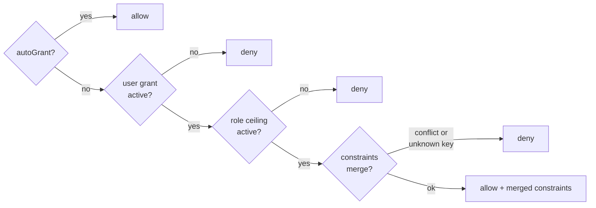

# Grant resolution semantics

Settles `want-mszgwq5d-24` (`global-identity-and-central-db.md` §1.7): **multiple grants for one
subject — union or most-restrictive**, and **whether negative grants exist**. Decided 2026-08-18.

> [!important]
> **Most-restrictive, always. Negative grants do not exist, ever.**
> Every leg of resolution must say yes. Nothing anywhere in the model says *no* — the only way to
> deny is an absence, and the only way to take something away is to revoke or narrow the leg that
> granted it.



## 1. What was actually ambiguous

The question names "multiple grants for one subject", but the database already forbids the reading
that sounds most alarming.

| Reading | Can it happen? | Why |
|---|---|---|
| Two active grant rows for the same (principal, capability) | **No** | Partial `UNIQUE` index on `grants(principalId, capabilityId) WHERE revokedAt IS NULL` (`server/store.js`) |
| Two *paths* that both reach a decision — user, role, instance | **Yes** | This is the real question |
| A row that says "deny" | **No** | No such column, no such value |

So `findActiveGrant` "returning whichever it finds first" is not a duplicate-row race. It is an
**ordered fallback across paths**: instance grant wins, else the parent role's grant
(`server/app.js:121`). That order is a *widening* — a principal is allowed if **any** path allows —
and it is precisely what §1.7 replaces.

## 2. Decision 1 — most-restrictive (intersection)

The effective decision is the **AND of every leg that applies**, in a fixed order with no
short-circuit ambiguity:

```stats
Legs: user grant AND role ceiling
Order: fixed, and order-independent (AND commutes)
Widening fallbacks: none
```

- **`autoGrant` is checked first and answers alone.** It is capability-scoped and
  principal-independent, so no leg can disagree with it. Unchanged from today.
- **User leg** — an active grant on the principal keyed by `subjectId`. Absent → deny.
- **Role leg** — an active grant on the `role` principal for the agent shape that made the call.
  Absent → deny. This is the ceiling §1.7 describes: *an agent can never exceed its operator*.
- **Instance leg is deleted, not demoted.** Today it is an override that can widen past the role.
  Under intersection there is no coherent place for it — it becomes an event dimension, per §1.7's
  table.

Union was rejected for one reason: under union, adding a grant anywhere can only ever *increase*
what an agent may do, so the role stops being a ceiling and the containment claim the product
makes is false. Intersection is also what the shadow evaluator already computes
(`evaluateUserKeyedGrant`, `server/app.js:190`), so phase 3's measured divergence numbers stay
valid as the live semantics rather than being thrown away at phase 5.

### 2.1 Merging `constraints`

`constraints` is stored, documented and never evaluated today — which is exactly why the merge has
to be written down before an evaluator lands. When two legs both allow and both carry constraints,
the merged constraint is the **intersection, field by field**:

| Constraint shape | Merge | Example |
|---|---|---|
| Time bound (`expiresAt`) | earlier of the two | 30d ∩ 7d = 7d |
| Numeric ceiling (rate limit, spend cap) | lower of the two | 100/hr ∩ 10/hr = 10/hr |
| Allowlist (paths, hosts, models) | set intersection | empty intersection = **deny** |
| Boolean permission (`readOnly`) | logical AND of the *restrictions* | either says read-only → read-only |
| Key present on one leg only | applies as written | a restriction is never dropped by the other leg's silence |

> [!warning]
> **An unrecognised constraint key denies.** A key with no evaluator is a restriction nobody
> enforced, and treating it as absent is how a documented limit silently becomes decoration — the
> failure mode `governance-review-2026-08-16.md` already records for `constraints` today.
> Implementing this needs an inventory pass over live `grants.constraints` first, so the switch
> from "inert" to "fail-closed" does not deny calls that work now.

## 3. Decision 2 — negative grants do not exist

**No such thing, ever.** Not deferred, not "later if needed".

- **Redundant under intersection.** Every deny is already expressible as an absence: revoke the
  user grant, or narrow the role ceiling. A negative row buys no expressiveness.
- **It reintroduces the exact defect being settled.** Allow-vs-deny precedence is the same
  "whichever it finds first" ambiguity in a new place, and this time with two rows that both look
  authoritative.
- **Revocation is already modelled, with provenance.** `revokedAt`/`revokedBy` plus the
  append-only `governance_audit` trail answer "who had this and who took it away". A negative grant
  is a second, worse way to say the same thing, with the removal invisible in the grants list.

There is no wildcard grant in the model — grants are per-capability rows — so the usual argument
for negative grants ("allow everything except X") has no premise here.

> [!caution]
> **The one real gap this leaves is `autoGrant`, and it is closed by not using it.** `autoGrant` is
> the model's only blanket allow and it is deliberately not subtractable: there is no per-principal
> exception to it. If any principal must be excluded from a capability, that capability is not
> auto-grantable — clear the flag and issue explicit grants. The flag stays barred from
> `destructive` capabilities.

## 4. What this changes in code

`findActiveGrant` currently returns a **grant row or null**, and the fallback chain *is* its return
value. Under this decision the answer is a composition of several rows, so the row is no longer a
truthful thing to return.

| Change | Where | Cost |
|---|---|---|
| Return `{ allowed, constraints, legs }` instead of a grant row | `server/app.js:121` | Low — the enforcement path uses only `Boolean(grant)` (`app.js:1130`) |
| Drop the instance → `parentRole` fallback; resolve user ∩ role | same | Gated on §1.7 phase 5 (subject flip) |
| `legs[]` on the denial reason | `app.js` event `reason` | The shadow path already builds this string; reuse it |
| Constraint merge + fail-closed unknown keys | new | Needs the inventory pass in §2.1 first |

> [!note]
> **Nothing here ships on its own.** This is the semantics phase 5 flips *to*; until then
> `findActiveGrant` stays the enforced decision and the intersection runs in shadow only
> (`WINDROW_SHADOW_EVAL`). Bump `GRANT_SUBJECT_EPOCH` (`server/principals/subject.js`) in the
> same commit that moves the subject, or the loomId-keyed hook cache keeps resolving stale
> principals.
