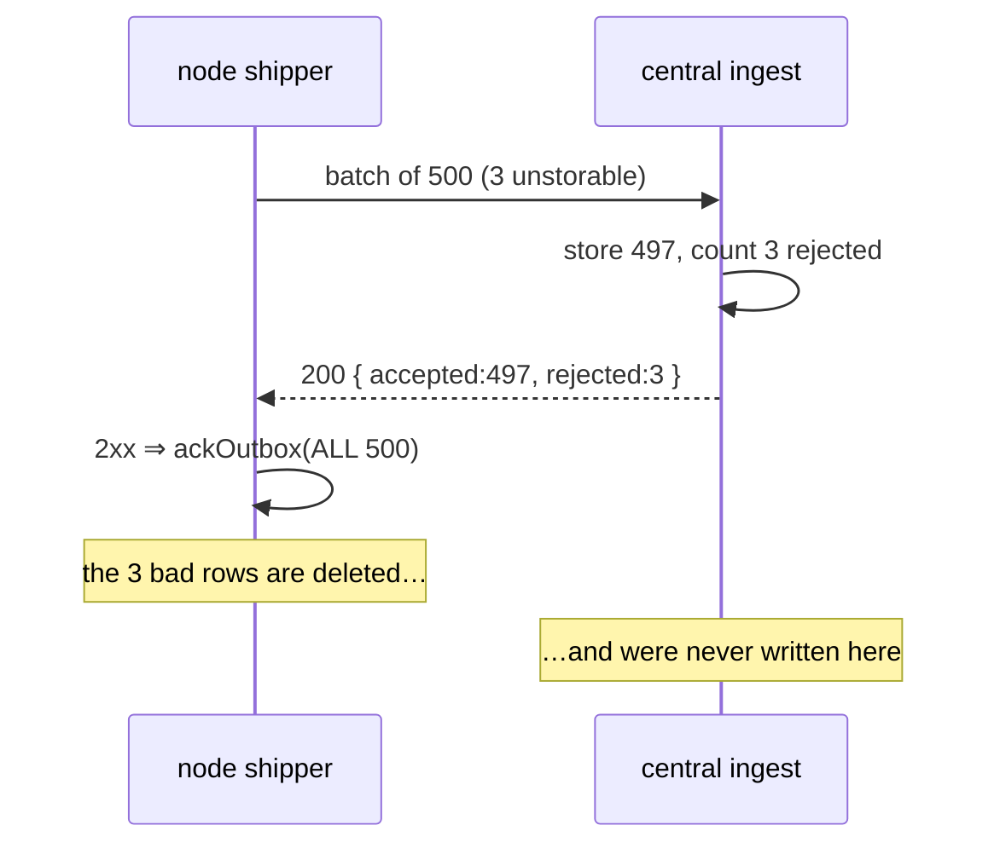
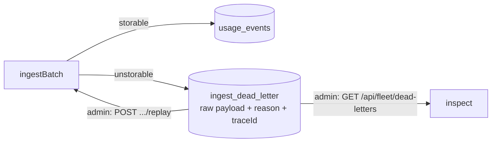

# Ingest data resilience — closing the receive-side loss hole

> [!important]
> The node→central transport is already resilient. The remaining data-loss hole is at the
> **receiving** end: a packet central *cannot store* is counted, acked, and dropped — gone from
> the node's outbox and never written at central, with no durable trace. This adds a dead-letter
> queue, a batch trace id, and a replay path so no packet is lost and every drop is inspectable.

## What already exists (the happy path is fine)

```mermaid
flowchart LR
  A[governed call] --> B[usage_outbox<br/>durable SQLite queue]
  B -->|5s timer / urgent flush| C[usageShipper<br/>retry + backoff]
  C -->|NDJSON over mTLS| D[/api/ingest/usage]
  D --> E[ingestBatch<br/>one transaction]
  E -->|idempotent: usage_shipments| F[(usage_events)]
```

```stats
Durable queue on the node: usage_outbox (rows deleted only on ack)
Retry: exponential backoff, capped, urgent lane flushes immediately
Idempotency: usage_shipments keyed (nodeId, incarnation, seq, kind)
Delivery: at-least-once — a lost ack is a free duplicate, never a loss
```

## The gap

A shipment central cannot store — a malformed NDJSON line, an envelope with no event, an event
with no `id`, a shipment with no `seq` — is pushed into `result.rejected`/`result.malformed` and
the endpoint still returns **HTTP 200**.



The only trace is the first 20 rejections in one response body that nobody persists. That
violates "if central errors we don't lose data packets and maintain traceability."

## The fix — a dead-letter queue at central



| Piece | What it does | Why |
|---|---|---|
| `ingest_dead_letter` table (migration 12) | Quarantines the raw payload + reason + node + trace id, in the **same transaction** as the batch | A rolled-back batch dead-letters nothing; a committed one loses nothing |
| Idempotent DLQ key | `sha256(nodeId\|kind\|payload)`, `ON CONFLICT` bumps `occurrences` | A redelivered bad packet does not multiply rows |
| Batch trace id | `x-windrow-trace-id` header (node) or generated (central), returned in ack, stamped on every DLQ row and log line | Ties a quarantined packet back to the exact request that dropped it |
| `GET /api/fleet/dead-letters` | List quarantined packets (filter by node/status) | Inspection |
| `POST /api/fleet/dead-letters/replay` | Re-run stored payloads through `ingestBatch`, mark `replayed` on success | Recovery after a transient central bug is fixed |
| Node shipper | Sends the trace header; reads `rejected`/`deadLettered` from the ack and logs them (escalating) | The drop stops being silent |

## Why the poison packet is *acked*, not retried forever

> [!note]
> An event with no `id` is rejected on **every** retry. Keeping it on the node's outbox would
> block every good packet behind it (head-of-line). The dead-letter queue is the standard answer:
> move the poison packet aside — preserved, with its reason — so good traffic flows, and let an
> operator inspect or replay it. Acking + central DLQ *is* the no-loss path.

The one case deliberately **not** dead-lettered: `NODE_IDENTITY_MISMATCH` (a 403 rejecting the
whole batch). That is a forgery signal, not a malformed packet — it keeps the rows on the node and
must stay loud, not be quietly quarantined.
