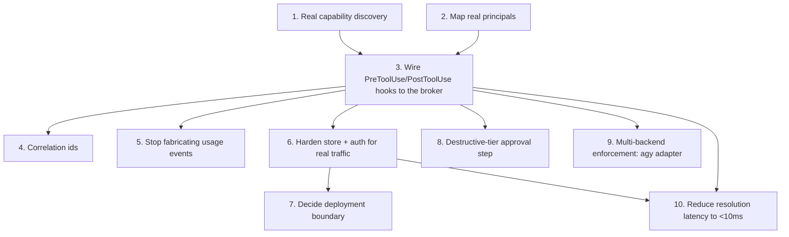

# TODO: wiring the capability-governance system to real platform data

> [!warning]
> Nothing observed by the running system today is real. Capabilities match this environment's
> actual skills/MCPs, and instance principals now map to this workspace's real agent roster (name,
> agent type/backend, workspace — see item 2), but every grant and usage event is still synthetic,
> generated by `server/seed.js`. Step 3 below — a real `PreToolUse`/`PostToolUse` hook calling the
> broker — is the one change that makes the rest of this matter. Everything else is
> infrastructure around a system nothing feeds until that's wired.

## Steps

| # | Step | What | Depends on |
|---|---|---|---|
| 1 | Real capability discovery | Replace hardcoded seed list: scan skill directories (`.claude/skills/*/SKILL.md`, the wispfield skills dir, **and a user-level skills directory** — see note below) and read each MCP server's live tool list (`.mcp.json` or a `ListTools` call). Run periodically; new tools land ungranted by default, removed ones flag as stale rather than vanish. | — |
| 2 | Map real principals | ✅ Done — see "Principal mapping (v1)" in `docs/design/api-contract.md`. `server/principals/` pulls real agent name/agent type/backend/workspace from the platform's own env vars into instance principals, id scheme is role-per-agentType + instance-per-agent-id. Still open: nothing yet marks an instance principal `stale` when its agent leaves the workspace. | — |
| 3 | **Wire real enforcement** | `PreToolUse` hook calls the governance API with `{principalId, capabilityId, correlationId}`, translates the allow/deny into the hook's block/allow exit code; `PostToolUse` logs the real outcome/latency. Needs a name-normalization layer (`mcp__wispfield__wispfield_spawn_agent`, `Bash`, etc. → stable capability id) and a fail-open/fail-closed policy per risk tier. | 1, 2 |
| 4 | Correlation ids | ✅ Done — `correlationId` is now `<agent name>(<agent node id>):<session id>` (see `server/hooks/pre-tool-use.js`). The platform doesn't expose a dispatched-task id to an agent's child processes, so the session id (the task/turn boundary within that agent) is the closest real proxy; revisit if the platform ever surfaces a true task id to hooks. | 3 |
| 5 | Stop fabricating usage events | `seed.js` bootstraps capabilities/principals/grants once only; real events accumulate from the hook instead. | 3 |
| 6 | Harden store + auth | Move off the JSON-file store (races under concurrent writers) to SQLite before real traffic; add at minimum a shared-secret/local-only binding on the API — anything on localhost can currently `POST /grants` and self-grant. | 3 |
| 7 | Deployment boundary | **Decided: per-workspace**, see `docs/design/deployment-boundary-decision.md` — schema already carries `field` on instance principals and globally-unique `correlationId`s, so a central rollup later is additive, not a rewrite. Revisit central once item 6 lands and there are ≥2 workspaces worth comparing. | 6 |
| 8 | Destructive-tier approval | ✅ Done — see "Destructive-tier approval (v1)" below. | 3 |
| 9 | Multi-backend enforcement | 🟡 First adapter done — `agy-pre-tool-use.js`/`agy-post-tool-use.js` wire Antigravity's own `PreToolUse`/`PostToolUse` hooks to the same broker (`server/hooks/lib.js`), config at `.agents/hooks.json`. Smoke-tested directly, not yet run against a live Antigravity agent. See `docs/design/agy-adapter.md` for the schema and open questions (skill-call shape unverified). Codex/Kimi adapters still unbuilt. | 3 |
| 10 | Reduce resolution latency | Get principal and grant-check resolution (the `PreToolUse` round trip to `/invoke`) under 10ms. Matters more once step 6 lands (SQLite) and step 3 is live on real traffic — every gated tool call blocks on this path. | 3, 6 |

## Destructive-tier approval (v1)

Item 8 asked for a real pause on the human, not just a logged denial, the first time an ungranted
destructive capability gets called. Implemented in `server/hooks/pre-tool-use.js`: when `/invoke`
comes back `allowed:false` **and** `capability.riskTier === 'destructive'`, the hook returns
`permissionDecision: "ask"` instead of `"deny"`.

`wispfield_ask_user` was the tool named in the original TODO, but a hook is a bare Node child
process spawned per tool call — it has no MCP access, so it can't call it directly. `"ask"` is the
harness-native equivalent and is actually the tighter integration: Claude Code's own permission
prompt is what the platform already renders on the agent's card, so the human sees and answers it in
the same place they're already watching the agent, with no separate dashboard tab or push
notification to check. The `/invoke` call still logs the attempt as `denied` before the ask is
returned — that stays the audit trail, and a principal that keeps getting asked-and-approved for
the same capability is exactly the drift signal (`GET /drift`) that says it should get a real
grant instead.

Not covered by this pass: correcting the logged `denied` usage event to reflect a human override
if the ask is approved (the hook process exits before the harness resolves the prompt, so it has
no way to observe the outcome) — the event stands as "governance denied, human may have overridden
at the harness level." Revisit if that distinction turns out to matter once real usage accumulates.

## Note on step 1: a user skills directory

Skill discovery today only has one shape in mind: project/system skills like the ones under
`.claude/skills/` or the wispfield skills dir. There may also be a **user-level skills
directory** (personal skills a human has authored for themselves, not tied to a project) that
the discovery job needs to enumerate separately — worth resolving where that directory lives
before step 1 is implemented, since it changes the capability `owner` field (project vs personal)
and probably its default grant policy (personal skills likely shouldn't auto-grant to every role
the way project skills do).

> [!tip]
> Start with step 3 on a single low-risk capability (e.g. one read-only skill) behind a feature
> flag, confirm real events show up correctly in the dashboard, then widen — rather than flipping
> enforcement on for everything at once.
