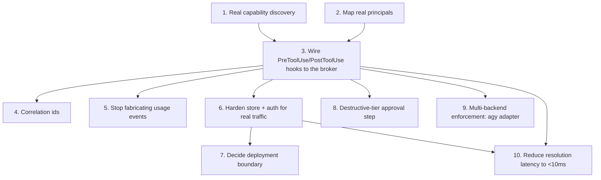

# TODO: wiring the capability-governance system to real platform data

> [!note]
> This doc is stale in places — several items below were marked open before enforcement actually
> landed. Verified against the code as of this pass: capability discovery (1), enforcement wiring
> (3), and store/auth hardening (6) are all done, not open. See the per-item notes below for what's
> actually left.

## Steps

| # | Step | What | Depends on |
|---|---|---|---|
| 1 | Real capability discovery | ✅ Done — `server/discovery/scan.js` walks real skill directories for `SKILL.md` files and reads MCP config for live tool lists; `server/discovery/merge.js` reconciles against the registry so new tools land ungranted and removed ones flag as stale rather than vanish. | — |
| 2 | Map real principals | ✅ Done — see "Principal mapping (v1)" in `docs/design/api-contract.md`. `server/principals/` pulls real agent name/agent type/backend/workspace from the platform's own env vars into instance principals, id scheme is role-per-agentType + instance-per-agent-id. Still open: nothing yet marks an instance principal `stale` when its agent leaves the workspace. | — |
| 3 | **Wire real enforcement** | ✅ Done — `server/hooks/pre-tool-use.js`/`post-tool-use.js` call the governance API with `{principalId, capabilityId, correlationId}` via the shared `runPreToolUse` in `server/hooks/lib.js`, translate allow/deny into the hook's block/allow decision, and log the real outcome/latency. Name normalization and fail-open/fail-closed-per-risk-tier are both implemented there. | 1, 2 |
| 4 | Correlation ids | ✅ Done — `correlationId` is now `<agent name>(<agent node id>):<session id>` (see `server/hooks/pre-tool-use.js`). The platform doesn't expose a dispatched-task id to an agent's child processes, so the session id (the task/turn boundary within that agent) is the closest real proxy; revisit if the platform ever surfaces a true task id to hooks. | 3 |
| 5 | Stop fabricating usage events | ✅ Done — `seed.js` bootstraps capabilities/principals/grants once only; real events accumulate from the hook instead, logged via `POST /invoke`/`PATCH /usage/:id`. | 3 |
| 6 | Harden store + auth | ✅ Done — `server/store.js` is SQLite (`better-sqlite3`, WAL mode), and `server/auth.js` requires a bearer token on every request, split into a mutation-capable **admin** token and a restricted **agent** token that hook processes use and that's rejected on every registry-mutating route. | 3 |
| 7 | Deployment boundary | **Decided: per-workspace**, see `docs/design/deployment-boundary-decision.md` — schema already carries `field` on instance principals and globally-unique `correlationId`s, so a central rollup later is additive, not a rewrite. Revisit central once there are ≥2 workspaces worth comparing (see the Fleet page rollup for the read-only cross-workspace view built in the meantime). | 6 |
| 8 | Destructive-tier approval | ✅ Done — see "Destructive-tier approval (v1)" below. | 3 |
| 9 | Multi-backend enforcement | 🟡 Two of three adapters built — `agy-pre/post-tool-use.js` wires Antigravity's hooks to the same broker (smoke-tested, not yet run against a live Antigravity agent; see `docs/design/agy-adapter.md`). `codex-pre/post-tool-use.js` does the same for Codex CLI, written defensively against several plausible input shapes since no confirmed hook contract was available to verify against — wired, unverified. Kimi adapter still unbuilt. | 3 |
| 10 | Reduce resolution latency | 🟡 In progress — two fixes landed (`localhost`→`127.0.0.1`, `fetch()`→`http.request()`) dropped end-to-end `findCapability`/`invoke` round trips from ~50ms to ~15-25ms; see `docs/design/latency-breakdown.md` for the phase-by-phase numbers. Still open: the ~40-50ms `principalResolveMs` cost on a cache miss, and the fixed per-process Node startup floor. Not yet under the 10ms target. | 3, 6 |

## Destructive-tier approval (v1)

Item 8 asked for a real pause on the human, not just a logged denial, the first time an ungranted
destructive capability gets called. Implemented in `server/hooks/pre-tool-use.js`: when `/invoke`
comes back `allowed:false` **and** `capability.riskTier === 'destructive'`, the hook returns
`permissionDecision: "ask"` instead of `"deny"`.

`wispfield_ask_user` was the tool named in the original TODO, but a hook is a bare Node child
process spawned per tool call — it has no MCP access, so it can't call it directly. `"ask"` is the
harness-native equivalent and is actually the tighter integration: Claude Code's own permission
prompt is what the platform already renders on the agent's card, so the human sees and answers it in
the same place they're already watching the agent, with no separate dashboard tab or push
notification to check. The `/invoke` call still logs the attempt as `denied` before the ask is
returned — that stays the audit trail, and a principal that keeps getting asked-and-approved for
the same capability is exactly the drift signal (`GET /drift`) that says it should get a real
grant instead.

Not covered by this pass: correcting the logged `denied` usage event to reflect a human override
if the ask is approved (the hook process exits before the harness resolves the prompt, so it has
no way to observe the outcome) — the event stands as "governance denied, human may have overridden
at the harness level." Revisit if that distinction turns out to matter once real usage accumulates.

## Note on step 1: a user skills directory

Skill discovery today only has one shape in mind: project/system skills like the ones under
`.claude/skills/` or the wispfield skills dir. There may also be a **user-level skills
directory** (personal skills a human has authored for themselves, not tied to a project) that
the discovery job needs to enumerate separately — worth resolving where that directory lives
before step 1 is implemented, since it changes the catalog entry's `owner` field (project vs
personal). This doesn't touch grant policy the way it would for an MCP tool — see "Skills vs.
tools" below, skill catalog entries are never granted or gated in the first place.

## Skills vs. tools: why skill usage isn't tracked

Skills and MCP tools share a catalog table but are governed very differently — see
`docs/design/skill-mcp-governance.md` §0 for the full breakdown. The short version, since it's
easy to misread items 1 and 3 above as "wire up enforcement for skills and MCP tools alike":

- **MCP tool calls** pass through a real `PreToolUse`/`PostToolUse` choke point per call
  (`normalizeToolCall`'s `mcp__*` branch in `server/hooks/lib.js`), so they get a real grant check
  and a real usage event.
- **Skill invocations have no equivalent per-call hook to intercept.** There's nothing for the
  broker to sit in front of, so a skill is never granted and never logged — by design, not an
  unfinished step. `normalizeToolCall`'s `toolName === 'Skill'` branch (a pre-this-decision
  holdover that didn't correspond to a real enforcement path) has been removed from
  `server/hooks/lib.js`. `docs/design/agy-adapter.md`'s "Skill-call shape" open question is moot
  for the same reason — there's no cross-backend skill-call shape to confirm, since no backend's
  skill invocation is ever gated.
- Skills stay in the catalog purely as a **centralized, cross-provider index** — "what skills
  exist, where, described how" — populated by step 1's discovery scan, same as always. That part
  of step 1 is unchanged; only the "and therefore they need grants/enforcement too" assumption is
  the thing this note corrects.

> [!tip]
> Start with step 3 on a single low-risk **MCP tool** capability behind a feature flag, confirm
> real events show up correctly in the dashboard, then widen — rather than flipping enforcement on
> for everything at once. (Not a skill — see above, there's no enforcement path to flip on for one.)
