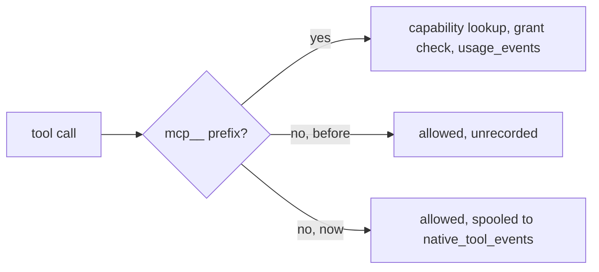
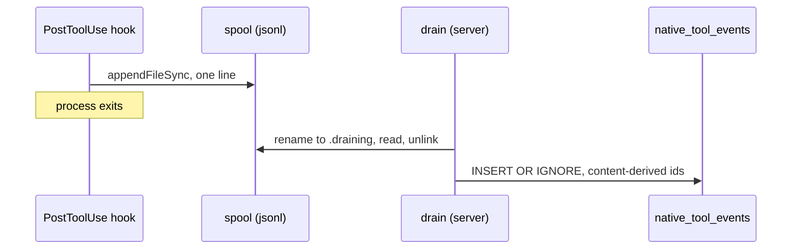

# Native tool observability

```stats
Tool calls a Claude loom makes: mostly native
Previously recorded: 0
Added cost on the blocking path: 0 round trips
Enforcement changed: none
```

> [!important]
> This records native tool calls. It does not govern them. Every `Read`, `Edit` and `Bash` that was
> allowed yesterday is allowed today, by the same code path, with the same decision. The only thing
> that changed is that afterwards you can see it happened.

## The gap this closes

`normalizeToolCall` (`server/hooks/lib.js`) maps a tool name to a registered capability. It returns
a capability only for names starting with `mcp__`. Everything else — the overwhelming majority of
what a loom actually does — returned `null`, and `runPreToolUse` then allowed the call and returned
without ever calling `POST /api/invoke`. No invoke, no `UsageEvent`, no row in any table.

So the dashboard could answer "which MCP tools did this agent call" precisely, and "what did this
agent *do*" not at all.



## Where the record is written, and why not in `usage_events`

| | `usage_events` | `native_tool_events` |
|---|---|---|
| What a row means | a decision this system made | a call that happened |
| Enforced | yes — grant checked | no, and not intended to be |
| Written | synchronously, in the call | batched, later, by a drain |
| Hash-chained | yes, per node, verified | no |
| Volume | one per governed call | one to two orders of magnitude more |
| Droppable | never | yes, at the spool cap |

`usage_events` is hash-chained for tamper evidence (`canonicalizeUsageEvent` / `rechainFrom`,
verified by `GET /api/usage/verify`). Chaining rows that arrive late, out of order, and are droppable
under load would weaken the one claim that log exists to make.

It would also swamp it. Native calls outnumber governed ones heavily, so every drift number, usage
summary and denial rate computed off `usage_events` would silently change meaning the day this
shipped. Two tables keep "what was governed" and "what happened" as two honest answers.

## Why it costs nothing on the blocking path

> [!note]
> The observation is written from **PostToolUse**, not PreToolUse. PreToolUse is the hook the harness
> blocks on; PostToolUse runs after the tool has already produced its result.

Two further constraints shaped the write itself:

- **`decide()` ends the process with `process.exit(0)`.** An un-awaited request is killed outright,
  and an awaited one puts a ~10-15 ms round trip plus TCP setup on every file read. So the hook
  writes one `appendFileSync` line (~0.1 ms) and `server/nativeObservations.js` drains it.
- **`subjectFromOs` memoizes per process, and every hook is a fresh process.** On Windows the first
  call in each one spawns `whoami.exe`. Affordable on a path that already makes an HTTP request;
  not affordable on one that fires for every `Grep`. Observation rows therefore carry
  `subjectId: null` — recorded as "not known", never guessed.



## What a row carries, and what it deliberately does not

The one place this path could leak something it shouldn't is the argument detail. The rule is
per-tool, not "stringify `tool_input`":

| Tool | Recorded |
|---|---|
| `Read` `Write` `Edit` `NotebookEdit` | the file path |
| `Glob` `Grep` | the pattern |
| `WebFetch` `WebSearch` | the url / query |
| `Bash` `PowerShell` | **the first token only** — `git`, `npm`, `curl` |
| anything unrecognized | the tool name, and no arguments at all |

A full shell command line routinely carries tokens, passwords and heredoc'd file content, into a log
that is read casually, sits unencrypted in a db file on disk, and is a plain `SELECT` away for
anything that can open it. The program name answers "what is this loom reaching for" without any of
that. An unrecognized tool records nothing, so a tool added upstream tomorrow cannot start leaking
through this by default.

## The deny that had no audit row

`isGovernanceSelfCallAttempt` blocks a `Bash` command that targets the governance API host or reads
its token files — the one native-tool decision this system does enforce. Until now its only trace was
a line on the hook's own stderr, because the deny happens before any capability exists to hang a usage
event off.

> [!warning]
> A security-relevant block that leaves no record is indistinguishable from one that never fired.
> That deny is now spooled with `outcome: "denied"` and the reason.

## Failure modes, and what each one costs

| If | Then |
|---|---|
| the server is down | hooks keep spooling; the drain catches up on next start |
| the spool passes 16 MB | the hook stops appending — observability drops, the machine does not fill |
| a backlog exceeds 20,000 lines in one drain | the **oldest** excess is dropped, and logged loudly |
| the drain crashes mid-batch | the `.draining` file is re-claimed; content-derived ids make the retry a no-op |
| a hook dies mid-append | the torn final line fails to parse and is skipped; the batch survives |
| rows age past 14 days | pruned on the next drain |

Every one of those degrades the *record*. None of them can fail, delay or change a tool call.

## Turning it off

`WINDROW_OBSERVE_NATIVE_TOOLS=0` stops the hook appending, without touching hook wiring. The
tuning knobs — `WINDROW_NATIVE_JOURNAL_MAX_BYTES`, `WINDROW_NATIVE_DRAIN_INTERVAL_MS`,
`WINDROW_NATIVE_RETENTION_DAYS`, `WINDROW_NATIVE_DRAIN_MAX_LINES` — all have working defaults.

All five are read through `envCompat` (`server/config.js`). The `GOVERNANCE_*` spellings no longer
work: tier 4 of [governance-to-windrow-rename](governance-to-windrow-rename.md) turned them from a
warning into a startup error that names the `WINDROW_*` replacement, so a field still setting one
stops rather than silently falling back to the default.

## Not done: the cross-workspace view

> [!warning]
> `server/rollup/index.js` does not read this table. Native calls are visible on the workspace they
> happened in, and nowhere else — a machine running several workspaces sees them one at a time.

That is a deliberate deferral, not an oversight, and the reason is shape rather than effort. The
rollup loads every `usage_events` row from every sibling db into memory and aggregates in JavaScript.
That is affordable for governed calls and is not affordable here: this table carries one row per file
read, so the same approach would pull hundreds of thousands of rows across N workspaces on a
dashboard poll.

The fix is a different read, not a bigger one — `SELECT COUNT(*), SUM(outcome = 'denied')` per sibling
db, as its own `nativeCalls`/`nativeDenied` pair on each field bucket. Kept separate from `calls` and
`denied` for the same reason the table is separate from `usage_events`: those two numbers mean
"governed", and folding a larger, weaker stream into them would change what every existing reader of
that payload is looking at.

## What this sets up next

Finding #2 in [governance-vulnerability-review](governance-vulnerability-review.md) asks for native
tools to be *governed*, not merely seen. That is still open, and still a larger design effort —
mapping shell commands to capabilities has no spec. But it now has the thing it was missing: a
measurement. You cannot tier what you have never counted, and `byTool` over a fortnight is where the
tiering argument starts.
