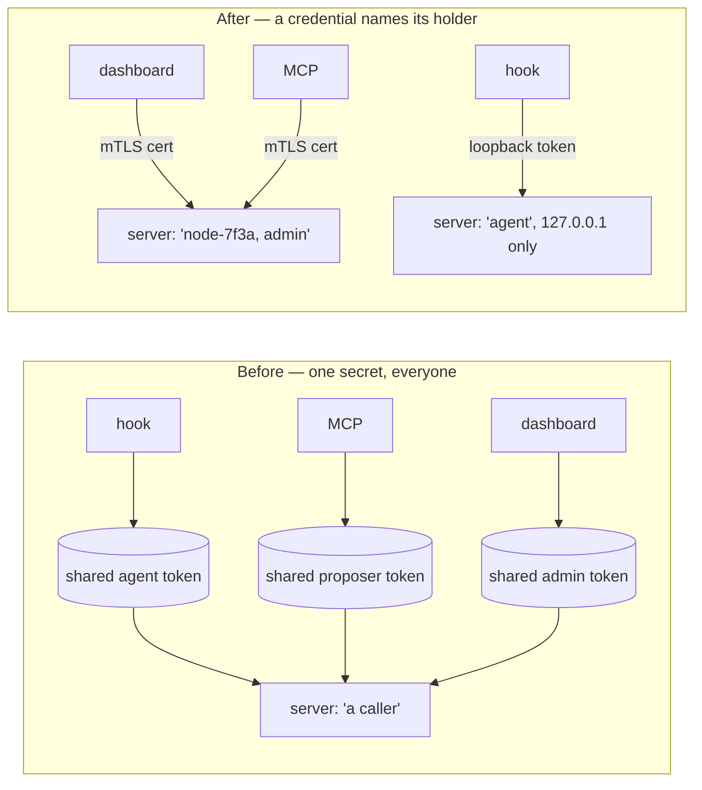

# Per-node enrollment credentials

Replaces the three fleet-wide shared bearer tokens with X.509 client certificates issued at
enrollment. Implements the credential half of the shared prerequisite in
[global-identity-and-central-db.md](global-identity-and-central-db.md) §2.5.



> [!warning]
> The old model's failure was not weak secrets, it was **unowned** ones. A shared token says
> "a caller"; it cannot say *which*. §2.5: a central ingest endpoint accepting one fleet-wide agent
> token means any node can forge any other node's usage events and any user's attribution.

```stats
Shared secrets removed: 3
New credential: X.509 EC P-256, CN=nodeId, OU=scope
Revocation window: next request
Runtime dependencies added: 0
```

## What each caller now presents

| Caller | Credential | Listener | Why |
|---|---|---|---|
| Dashboard (browser) | mTLS client cert, `admin` | HTTPS | long-lived, one handshake per session |
| MCP server | mTLS client cert, `proposer` | HTTPS | long-lived process, pools connections |
| CLI / admin scripts | mTLS client cert, `admin` | HTTPS | short-lived but not per-tool-call |
| **Hooks** | bearer token, `agent` | **plaintext, 127.0.0.1** | fresh process per tool call — see below |

## Why hooks keep a token

```bars
loopback token (today)            2 ms
fresh-process fetch() penalty    20 ms
fresh-process TLS handshake      60 ms
```

A PreToolUse/PostToolUse hook is a fresh Node process per tool call, so it can never reuse a
connection. [latency-breakdown.md](latency-breakdown.md) records ~20 ms lost merely to `fetch()`
building its agent lazily in every process; a TLS handshake has the same shape and is worse. §2.2's
own topology agrees — hooks reach the node agent over loopback and the *agent* holds the mTLS
credential onward.

> [!important]
> The agent token survives, but the thing that made it dangerous does not. It has **no
> environment-variable override**, so there is no longer any supported way to make one token valid on
> two machines. `GOVERNANCE_AGENT_TOKEN` — which `auth.js` used to document as the way to "share
> tokens across a fleet of hosts" — is gone. The credential is machine-local by construction, not by
> convention.

## Enrollment

```mermaid
sequenceDiagram
  participant A as admin
  participant N as enrolling caller
  participant S as server
  A->>S: POST /api/enrollment-tokens {scope}
  S-->>A: one-time token (shown once; stored only as SHA-256)
  N->>N: generate EC keypair — private key never leaves this machine
  N->>S: POST /api/enroll {token, publicKey}
  S->>S: consume token atomically — single use
  S-->>N: certificate CN=nodeId OU=scope
  N->>S: every later request, over mTLS
```

The caller chooses neither its nodeId nor its scope: both come from the token the admin minted. A
caller that could name its own scope could enroll as admin; one that could name its own nodeId could
enroll as somebody else's node and forge that node's events — the exact failure §2.5 describes.

First run has no admin to mint the first token, so it writes a single-use bootstrap token to a
file only its owner can read, and deletes it once an admin node exists.

## Revocation without a CRL

| Option | Window | Cost |
|---|---|---|
| CRL published on a TTL | up to the TTL | a CRL endpoint, a signer, a refresh loop |
| OCSP responder | seconds | a second service on the request path |
| **`nodes` lookup on the presented serial** | **next request** | one indexed prepared statement |

Every caller already reaches this server on every request, so the certificate serial is looked up in
`nodes` per request. That is the sub-second window §2.4 asks for with none of the machinery. An
*unknown* serial is refused, not allowed — a certificate this CA signed but that no `nodes` row
claims has no node behind it.

## Two findings from building it

> [!caution]
> **`fs.writeFileSync(path, data, { mode: 0o600 })` does not restrict anything on Windows.** NTFS
> permissions come from ACLs, not POSIX mode bits; the file lands effectively world-readable and
> `fs.statSync().mode` reports `0666` back. This is how `server/auth.js` has always written its
> bearer tokens, and its header comment described them as protected on that basis. That protection
> has never actually held on this platform.

Caught by the CA self-test asserting the property rather than the call. Fixed in
`server/enrollment/secretFile.js`, which drops inherited ACEs and grants only the current user and
SYSTEM; `auth.js` now repairs a token file that has lost its ACL rather than trusting it.

The second is smaller: mounting a guard as `app.use(requireAdmin, router)` gates **every** request
reaching that mount point, not just the router's own routes. It silently locked non-admin callers
out of unrelated endpoints. The admin router now takes its guard per route.

## Why the DER encoder is hand-rolled

Node can generate keys and sign, but cannot construct a certificate. The alternatives were an npm
cert library or the `openssl` CLI; this project has three runtime dependencies and runs as a Windows
service where an `openssl` on PATH is not a safe assumption.

> [!note]
> The encoder never **parses** anything an attacker controls. Enrollment takes a bare SPKI public key
> rather than a PKCS#10 CSR precisely so that no attacker-supplied ASN.1 reaches our code —
> `crypto.createPublicKey` does that parsing, and it is OpenSSL. Every security decision that *reads*
> a certificate (chain building, signature verification, expiry) is made by OpenSSL inside Node's
> `tls` module. A bug in the encoder produces a certificate that fails the handshake loudly.

Losing the CSR's proof-of-possession is harmless here: submitting somebody else's public key yields a
certificate the submitter cannot use, at the cost of burning their own single-use token.

## Files

| File | What |
|---|---|
| `server/enrollment/der.js` | minimal DER encoder, no parser |
| `server/enrollment/x509.js` | certificate construction and signing |
| `server/enrollment/ca.js` | root CA, server cert, client cert issuance |
| `server/enrollment/secretFile.js` | owner-only file writes that work on Windows |
| `server/enrollment/routes.js` | `/api/enroll`, admin token mint/revoke, bootstrap |
| `server/enrollment/client.js` | enrolling side: keypair, enroll, https.Agent |
| `server/auth.js` | rewritten: cert scopes, loopback-only agent token |
| `server/enrollment/selftest.js` | 15 checks — issuance, ACLs, real handshake |
| `server/enrollment/e2e-test.js` | 21 checks — enrollment, scopes, revocation, forgery |

## Verification

```stats
CA self-test: 15 checks
End-to-end (mock store): 21 checks
Integration (real store.js): 10 checks
```

The integration suite is the one that matters most, because two claims cannot be tested against a
mock: that SQLite's conditional `UPDATE` makes single-use enrollment genuinely atomic (four
concurrent enrollments on one token yield exactly one certificate), and that a `node`-scoped
certificate binds **the same id the usage-event hash chain keys on**. Both hold. It also greps the
database file to confirm no enrollment token is recoverable from it.

## The client build no longer carries a credential

`npm run build` used to bake the admin token into the bundle via `VITE_WINDROW_API_TOKEN`. It no
longer does, and the token is not merely moved — under mTLS the browser needs none, because identity
rides the handshake.

> [!important]
> That closes something the old build never justified: a **fleet-wide admin credential compiled into
> shipped JavaScript**, held by anyone who could read the bundle. Verified: `npm run build` is green
> and the bundle contains zero credential-shaped strings.

In development the Vite proxy presents a certificate on the browser's behalf, so `npm run dev` needs
nothing installed.

## Not yet landed

> [!warning]
> **A production browser still cannot authenticate.** Chrome/Edge will only present a client
> certificate installed in the OS certificate store, which needs a PKCS#12 bundle — password-based
> encryption and a MAC that Node cannot export and this encoder does not attempt. That is one OOBE
> step, and it is the last thing between this and a working dashboard outside dev.
