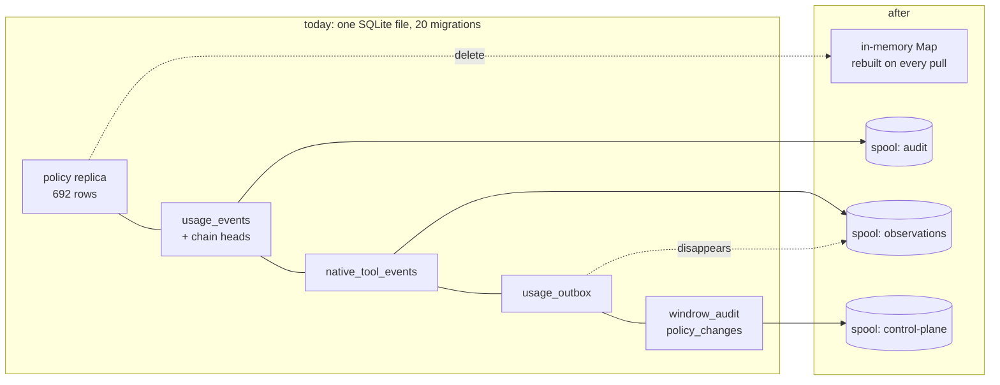
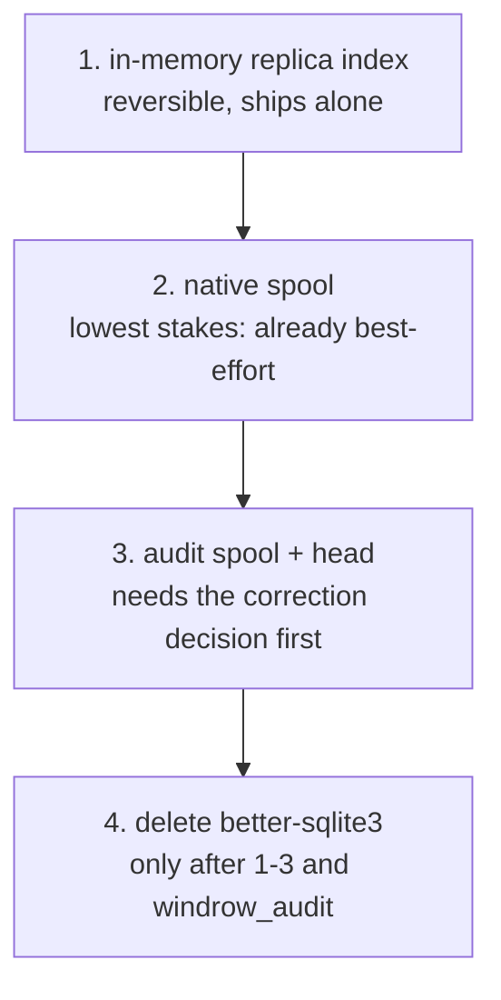
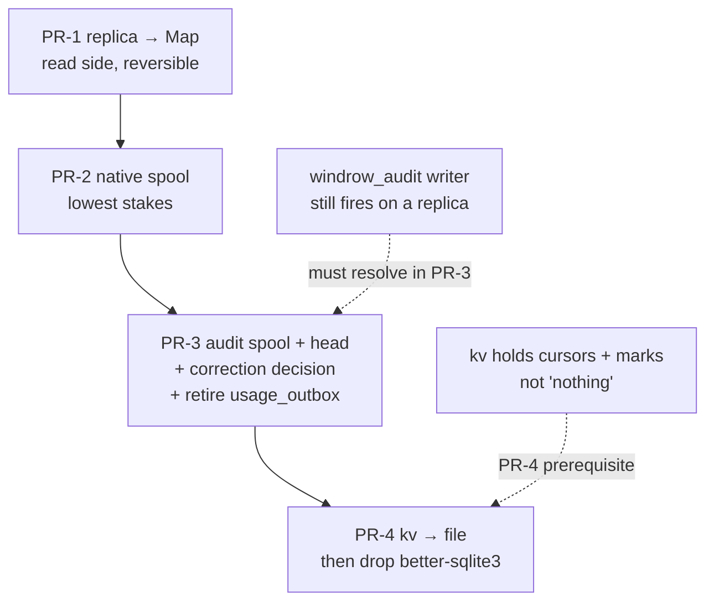
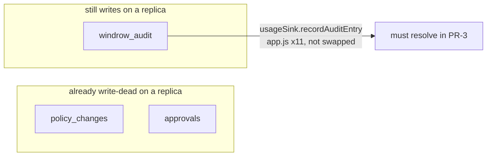

# Retiring SQLite on the node

> [!important]
> **Yes, and it is now smaller than it looks — but it is not one change, it is four, and only three
> of them are safe.** Steps 1–3 of [`dashboard-placement.md`](dashboard-placement.md) have landed,
> which is the gate that note put on this work. Measured against the code as it now stands, the
> node's durable footprint reduces to **three append-only streams and one cache**. The read side
> needs no database at all. The write side needs one thing SQLite is currently providing for free,
> and that thing is the whole risk.



## What is actually on the node, measured

```stats
Tables: 16
Rows total: 5822
Database: 3.2 MB
Migrations: 20
```

The file is small. The migration count is the number that matters — you never migrate something
you can throw away and refetch, and twenty of them is twenty pieces of code whose only job is to
carry a schema forward on a machine whose whole premise is that it can be destroyed.

| Table | Rows | After |
|---|---|---|
| `grants` | 524 | **in-memory `Map`** — replica, refetched wholesale on every policy pull |
| `capabilities` | 139 | in-memory `Map` |
| `principals` | 29 | in-memory `Map` |
| `discovery_sources` | 9 | in-memory, rescan reproduces it |
| `native_tool_events` | 2474 | **spool** — ships since item 1; `shippedAt` is already the cursor |
| `usage_events` | 1802 | **spool** + head |
| `windrow_audit` | 496 | spool |
| `policy_changes` | 293 | gone on a replica — central owns the log |
| `enrollment_tokens` | 15 | gone — central issues (item 7) |
| `kv` | 9 | shrinks to nothing; `node_id` already left (item 5) |
| `usage_outbox` | 8 | **disappears — the spool is the queue** |

## The read side needs no database, and that is already proven

Under central authority `policy/centralPolicyStore.js` splits the contract: writes proxy to
central, reads stay local and **synchronous**, on purpose —

> "`findActiveGrant` is still two prepared statements and the hot path never touches the network …
> making them async would put a microtask on the decision path of every governed tool call to no
> purpose."

That rules out reading JSON off disk per call. It does **not** rule out a `Map`. The whole replica
is 692 rows, the server is long-lived, and the replica is already refetched wholesale on every
pull — so hydrating a `Map` at pull time is synchronous, cheaper than two prepared statements, and
needs no durability at all, because losing it means refetching something central already owns.

> [!tip]
> This is the cheap half and it can ship on its own. It deletes nothing, breaks no format, and is
> reversible by reverting one file.

## The write side: what SQLite is silently providing

Three streams, all append-only, and `hook-fault-journal.jsonl` already proves the pattern in this
codebase.

| Stream | Today | Spool form |
|---|---|---|
| `usage_events` + `usage_chain_heads` | tables, hash-chained | append-only spool + head file |
| `native_tool_events` | table, `shippedAt` cursor | spool, shipped |
| `usage_outbox` | table, written in the event's transaction | **disappears** — the spool *is* the queue |

That third row is the prize. The outbox exists so an event that committed locally cannot fail to be
queued, which today needs both rows in one transaction. If the spool is the queue and shipping is a
cursor over it, there is nothing to keep in sync — one append is the event *and* its place in line.
Fewer moving parts, not weaker guarantees.

> [!caution]
> **The risk is the one thing not in that table: the re-chain.** `patchUsageEvent` rewrites a row's
> content and then recomputes `hash`/`prevHash` for that row *and every row after it*, inside one
> transaction. On a spool that is a rewrite of the tail of an append-only file — which is exactly
> what an append-only file is not for. Either corrections stop being in-place (ship a correction
> record and let central apply it, which central's ingest already does), or the spool needs a
> compaction step, which is a database with extra steps.

Corrections are the honest answer. Central's `ingestBatch` already treats
`usage_event_correction` as a second statement about an event rather than an edit of one, and the
node's own `usage_outbox` already ships it that way. Making the node's local copy append-only means
its local read of a corrected event becomes "last statement wins" rather than "the row" — a real
behaviour change, and the only one in this plan that a reader would notice.

## What it buys

```bars
better-sqlite3 removed          1
Native modules left on a node   0
```

Dropping `better-sqlite3` removes the **only** native module. That is what forces a build toolchain
into any container image: central's `Dockerfile` carries a discarded `python3 make g++` stage purely
because `npm ci` builds a dependency central never loads. A node image becomes `node:22-slim` plus
source, and a rebuild becomes `docker rm`.

## Recommended order



1. **In-memory replica index.** Reversible, no format change, deletes the largest read surface.
2. **Native observations to a spool.** Lowest stakes in the system — they are already best-effort,
   already dropped on a cap, and item 1 already gave them a cursor.
3. **Audit spool + head, and the outbox disappears.** Gated on deciding corrections. This is the
   step that needs a design of its own.
4. **Drop `better-sqlite3`.** Only once `windrow_audit`, `policy_changes` and `approvals` have gone
   too — all three are node-local control-plane history that a replica should not be keeping.

> [!warning]
> **Not started. This document is the assessment `dashboard-placement.md` item 9 asks for, not the
> implementation.** Items 1–8 and 10 of that note are built; this one is a rewrite of the node's
> persistence layer, and half-migrating a storage engine is worse than not starting. Step 1 above is
> the piece worth doing next and is safe on its own.

---

# Implementation plan

Everything above is the assessment; everything below is the build. The four steps of the
recommended order become four independently shippable PRs, each with its own tests, its own
rollback, and an acceptance bar it has to clear before the next one starts. The order is a
dependency order, not a preference — **step 4 cannot merge until steps 1–3 have, plus the audit
writer is dealt with**, and that gate is the last section.



## What each step actually changes

| PR | Adds | Deletes | Format touched |
|---|---|---|---|
| 1 | in-memory `Map` replica in `store.applyPolicyReplica`'s read path | the SQLite read of `grants/capabilities/principals/approvals` on a replica | none — reversible |
| 2 | `native.spool.jsonl` + `shippedAt` cursor as a file mark | `native_tool_events` table + its outbox-free queue | new spool, no chain |
| 3 | `audit.spool.jsonl`, `usage.spool.jsonl` + `usage.head.json` | `windrow_audit`, `usage_events`, `usage_chain_heads`, **`usage_outbox`** | append-only re-chain (the risk) |
| 4 | `node-marks.json` (was `kv`) | `better-sqlite3`, all 20 node migrations, the Docker build stage | native module gone |

---

## Step 1 — In-memory replica index

**Change.** On a central-authority node, `store.applyPolicyReplica(snapshot)`
(`server/policy/policyClient.js:308`) writes into a `Map` per entity instead of into SQLite, and the
read exports (`listGrants`, `findGrant`, `findActiveGrant`, `listCapabilities`, `listPrincipals`,
`listApprovals`, …) read the `Map`. Node-authoritative installs are untouched: they still hold
authority and still use SQLite. The switch is the same `policyAuthority === CENTRAL` branch that
`server/index.js:48` already uses to bind `centralPolicyStore`.

**Tests.**

- `server/policy/replicaIndex-test.js` (exists, 50) — extend: after `applyPolicyReplica`, a
  `findActiveGrant` returns the same row the SQLite path returned, for the live/revoked/expired
  cases the current test seeds.
- New: **hot-path is synchronous** — `findActiveGrant` returns a value, not a promise, on a
  Map-backed replica. This is the §2.8 invariant `centralPolicyStore`'s header stakes the whole
  phase on; a regression here is the only way step 1 does harm.
- New: **wholesale replace rebuilds the Map** — two successive `applyPolicyReplica` calls with
  disjoint snapshots leave only the second's rows, matching today's `store.save` semantics
  (`store.js:1584` — the replica path appends to no log).
- New: **approvals survive the switch** — `listApprovals` reads the Map. Today approvals are read
  off SQLite (`centralPolicyStore.js:243`) but **no delta writes them** (the delta carries only
  capability/principal/grant — `replica.js:187`, `policyClient.js:300`), so on a replica the table
  is already effectively empty. This test makes that pre-existing gap explicit and is the hook for
  the approvals decision in the pre-drop audit below.

**Migration.** None. Nothing on disk changes; the `Map` is hydrated from the same delta pull that
already runs. First pull after deploy rebuilds it wholesale.

**Rollback.** Revert the one file. The SQLite tables are still present and still written by the
node-authoritative path, so a downgrade finds them exactly as it left them.

**Acceptance.** `findActiveGrant` stays synchronous and returns identical verdicts to the SQLite
path across the smoke suite (`server/policy/smoke.js`); `distribution-test.js` still passes
unchanged (it asserts the *authority* seam, not the storage); no new async on any governed-call
path.

---

## Step 2 — Native observations to a spool

**Change.** `native_tool_events` becomes `native.spool.jsonl`, one JSON object per line, appended by
`server/nativeObservations.js`. `shippedAt` stops being a column and becomes a **cursor file**
(`native.cursor.json` — a byte offset + count), the same shape `server/nodeHealth.js`'s fault-journal
cursor already uses via `getNodeMark`. Retention (`pruneNativeToolEvents`, `store.js:2882`) becomes a
compaction that rewrites the spool minus rows older than the cutoff, preserving the
`sparingUnshipped` rule (never drop an unshipped line on a timer — the outage-backlog guarantee).

**Tests.**

- Port the shipping tests: `listUnshippedNativeToolEvents` reads from the cursor forward;
  `markNativeToolEventsShipped` advances the cursor and is idempotent under a doubled ack
  (`store.js:2906` — the at-least-once tolerance).
- **Trim drops loudly** — `trimUnshippedNativeToolEvents` returns a real count, matching today's
  contract (`store.js:2932`); no silent truncation.
- **Compaction spares unshipped** — a spool with a line older than the cutoff but past the cursor is
  kept; a shipped line older than the cutoff is dropped.
- **Crash-mid-append leaves a readable spool** — a truncated final line is skipped on read, not
  fatal (jsonl append can tear on power loss).

**Migration.** One-shot on boot: if `native_tool_events` has rows and the spool does not exist,
stream the table to the spool in `ts` order and set the cursor to the count of `shippedAt IS NOT
NULL` rows. Idempotent — guarded by the spool's existence, so a re-run is a no-op.

**Rollback.** The table is not dropped in this PR (that waits for step 4). A downgrade reads the
table; it will be stale by the un-migrated rows, which for best-effort observations is acceptable and
is why this step is "lowest stakes" — the data is already droppable on a cap.

**Acceptance.** `nativeShipStats` reports the same pending/oldest numbers off the spool as off the
table for a fixture; a full ship→ack→prune cycle leaves the spool and cursor consistent; the
dashboard's native-tools summary renders identically (verify in the app, not just the test).

---

## Step 3 — Audit + usage to spools, and `usage_outbox` disappears

This is the step with a design decision inside it. Three streams move at once because they share the
re-chain machinery and the outbox retirement couples them.

### 3a. The canonical-form re-chain on an append-only spool

The assessment named the risk; here is the mechanism. Today `patchUsageEvent`
(`store.js:2976`) calls `rechainNodeFrom(node, inc, seq)` (`store.js:774`), which **rewrites
`hash`/`prevHash` on the corrected row and every row after it, in place, inside one transaction**.
There are three callers of a re-chain, and only one is a correction:

| Re-chain trigger | Today | On a spool |
|---|---|---|
| fresh insert (chain of one new tail) | `rechainNodeFrom(node, inc, tailSeq)` | **append one line** — no rewrite, natural fit |
| hash-column backfill on first boot (`store.js:981`) | re-chain every chain from seq 1 | **runs once at migration time**, writing the spool fresh — not a steady-state rewrite |
| canonical-form change on an already-chained db (`store.js:1004`) | re-chain every chain from seq 1 | **the problem** — rewrites the whole tail |
| `patchUsageEvent` correction (`store.js:2949`) | re-chain from the corrected seq to head | **the problem** — rewrites the tail |

The two problem rows both want to rewrite an append-only file, which is what it is not for. The
decision, stated plainly:

> [!important]
> **Corrections stop being in-place. A `patchUsageEvent` appends a `usage_event_correction` record
> to the spool; it does not rewrite the corrected line or anything after it.** The node's local read
> of a corrected event becomes "last statement wins" — fold corrections over base events at read
> time, keyed by event id. Central already ingests it exactly this way: `ingestBatch` treats
> `usage_event_correction` as a second statement about an event, and the node's own `usage_outbox`
> already ships it as its own shipment (`store.js:2951–2968`), not as an edited row. **The only
> behaviour a reader notices is that the node's local `findUsageEvent` now returns the folded view
> instead of the mutated row** — which is the one behaviour change the assessment flagged, and it
> matches what central has always seen.

That leaves the **canonical-form change**. On SQLite it re-chains the whole table when the hash
input format moves (adding `incarnation` was the last such move — `store.js:887`). On an append-only
spool you cannot rewrite shipped lines: doing so would silently rewrite hashes central holds copies
of, the exact fleet-wide-`divergent` false alarm `store.js:889` was written to prevent. So the
spool inherits the **per-chain form fallback that already exists** (`verifyUsageEventChain`,
`store.js:887`): each chain keeps the hashes it was written with, the verifier walks it under the
form it was actually written with (current or any `LEGACY_CANONICAL_FORMS` entry), and a form change
is a **new segment appended under the new form**, never a rewrite of the old one. The head file
records `(seq, hash, form)` per `(nodeId, incarnation)` so the verifier knows where each form
boundary is without re-deriving it.

Net: `rechainNodeFrom`'s in-place UPDATE is deleted. Inserts append. Corrections append a correction
record. Form changes append under the new form. Nothing rewrites a shipped line — which is the whole
reason an append-only spool is safe where a re-chained table was not.

### 3b. `usage_outbox` retires into the spool

The outbox exists so a committed event cannot fail to be queued — today two rows in one transaction
(`store.js:2149`). With the spool as the queue, **one append is the event and its place in line**:
`listOutboxBatch`/`ackOutbox` become a cursor over `usage.spool.jsonl` (offset + seq), exactly as
step 2 did for native. A correction is a second line in the same spool with kind
`usage_event_correction`, shipped from the cursor like any other. The `usage_chain_heads` table
becomes `usage.head.json`.

**Tests.**

- **Correction folds, does not mutate** — after `patchUsageEvent`, the spool has +1 line (the
  correction), the base line is byte-for-byte unchanged, and `findUsageEvent` returns the folded
  outcome. Port `server/usage-correction-test.js`.
- **Chain verifies across a form boundary** — a spool with a legacy-form segment and a current-form
  segment verifies clean; tamper one line and `verifyUsageEventChain` reports *that* line, at the
  right seq, under the right form (the deepest-failure rule, `store.js:910`).
- **Foreign-node rows are not shipped** — a correction on a row belonging to another node (arrived by
  merge) is not enqueued into this node's stream (`store.js:2958` — one writer per stream). Port the
  relevant `usage-outbox-test.js` case.
- **Outbox-is-the-queue** — no separate outbox artifact exists; ship→ack advances one cursor;
  `usageOutboxStats` reports the same numbers off the cursor as off the old table.
- **Head desync is caught** — truncate the spool tail; the head file's recorded seq exceeds the
  spool's, and the verifier reports a truncation (the case a row-only read cannot see, `store.js:864`).
- **Crash between append and head-write** — the head lags the spool by one; on next boot the spool is
  the authority and the head is recomputed forward, never backward.

**Migration.** One-shot on boot, ordered: stream `usage_events` per `(nodeId, incarnation, seq)` into
`usage.spool.jsonl`, carrying each row's existing `hash`/`prevHash` and its form (do **not** re-hash —
re-hashing shipped rows is the false-alarm trap); write `usage.head.json` from `usage_chain_heads`;
fold any `usage_outbox` rows still pending into the cursor position; stream `windrow_audit` into
`audit.spool.jsonl` in `createdAt` order. Guarded by spool existence; idempotent.

**Rollback.** Tables not dropped until step 4, so a downgrade reads them — but any event written to
the spool after the cutover is invisible to the reverted table. **This is the first step with a
one-way data window**, so it ships behind a flag (`WINDROW_NODE_SPOOL=1`) held off for one release
after the migration lands, giving a clean revert path until the spool is trusted.

**Acceptance.** `GET /api/usage/verify` returns `ok` across a fixture spanning two incarnations and
two canonical forms; a correction round-trips to a stub central as a `usage_event_correction` with
re-derived hashes in the envelope (`store.js:2954`); the audit log and usage summary render
identically in the app; no `usage_outbox` artifact remains.

---

## Step 4 — Drop `better-sqlite3`

Only after 1–3 have merged **and** the audit writer and `kv` are resolved (next section).

**Change.** `kv` becomes `node-marks.json` (see below), the 20 node migrations
(`server/schema/nodeMigrations.js`) and the SQLite driver (`server/schema/sqliteDriver.js`) are
deleted from the node path, `better-sqlite3` leaves `server/package.json`, and central's `Dockerfile`
loses the `python3 make g++` stage it carries only to build a dependency it never loads
(`server/central/Dockerfile`). A node image becomes `node:22-slim` + source; a rebuild becomes
`docker rm`.

**Tests.**

- **No `require('better-sqlite3')` reachable from a node boot** — a static check, sibling to
  `distribution-test.js`'s source-grep style (`distribution-test.js:91`): grep the node entrypoint's
  transitive requires, fail on a hit.
- **Node boots with no SQLite file present** — smoke the full startup on a clean dir; every read
  export answers from Map/spool/marks.
- **Central still uses SQLite/Postgres unchanged** — this PR touches the *node* path only; a central
  smoke (`server/central/policy-smoke.js`) must pass untouched.

**Migration.** The step-2/3 one-shots have already emptied the tables of anything the node reads. This
PR's migration is deletion: on first boot without the driver, if a legacy `windrow.db` exists and the
spools/marks do not, run the step-2/3/kv migrations one final time, then rename the db aside
(`windrow.db.migrated`) rather than delete it — a disposable node has nothing to lose, but a
mis-configured one should be recoverable by hand.

**Rollback.** Re-adding `better-sqlite3` restores the driver, but **spool/marks writes since the drop
are not in any table** — so this is the point of no return, and it must not merge until the flag from
step 3 has been on in production for a release with zero divergence alerts.

**Acceptance.** `npm ci` on a node needs no compiler; the node image builds from `node:22-slim` with
no build stage; native-module count is **0** (the assessment's target bar); every dashboard page a
node serves renders against Map/spool/marks with no SQLite file on disk.

---

## The pre-drop audit: no node writers to `windrow_audit` / `policy_changes` / `approvals`

Step 4 is gated on these three control-plane tables being genuinely write-dead on a replica, because
a replica keeping node-local control-plane history is the thing the whole exercise removes. Verified
against the code as it stands:



| Table | Node writer on a replica? | Evidence |
|---|---|---|
| `policy_changes` | **No.** | `createPolicyRouter` mounts only when `policyAuthority !== CENTRAL` (`app.js:587`); `seedPolicyChangesOnce` runs only when `!== CENTRAL` (`index.js:136`); `recordPolicyChange` is called only by the guarded policy mutators, which throw `PolicyReadOnlyError` on a replica (`store.js:3785`). |
| `approvals` | **No.** | Writes proxy to central (`centralPolicyStore.insertApproval`/`decideApproval`, `:246`/`:251`); the delta does not carry approvals (`replica.js:187`), so `applyPolicyReplica` never writes the table; the local `insertApproval`/`decideApproval` are reachable only under node authority. *Caveat:* this means replica approval **reads** are already empty today — step 1's Map must carry approvals from central by some channel, or the approvals surface stays node-authority-only by design. Decide this in PR-1. |
| `windrow_audit` | **Yes — this is the blocker.** | `usageSink.recordAuditEntry` fires on every grant/revoke/approve route in `app.js` (11 call sites: `758, 946, 998, 1010, 1032, 1274, 1325, 1344, 1438, 1459, 1534`) **regardless of authority**, because `setBackends` swaps only `policyStore`, never `usageSink` (`index.js:50`). So a replica writes its own audit trail to SQLite even though the grant itself went to central. |

**Resolution (in PR-3, before PR-4 can merge).** Two options, pick one:

1. **Audit → spool** (the assessment's step 3): `recordAuditEntry` appends to `audit.spool.jsonl` and
   ships up like usage. The node keeps a local audit trail; it just isn't in SQLite. Lowest-friction,
   already scoped by step 3.
2. **Audit → central**: swap `usageSink` too on a replica (a `centralUsageSink` that proxies audit
   writes), so the audit trail lives only where the grant does. Cleaner ownership, but adds a WAN
   write to a path (`recordAuditEntry`) that is today synchronous and never fails — regressing that
   is the same class of harm step 1 guards against, so **option 1 is recommended.**

**Verification test that gates PR-4:** a static assertion — on a central-authority boot, no code path
reachable from a grant/revoke/approve route calls `store.insertAuditEntry`, `store.recordPolicyChange`
or the local `store.insertApproval`/`decideApproval`. Same source-grep shape as
`distribution-test.js`. **PR-4 does not merge while this test can find a writer.**

## The `kv` table is not "nothing"

The assessment's mermaid shows `kv` shrinking to nothing; measured, it holds state that must land
somewhere before SQLite goes:

| `kv` key | Holds | On loss | Home after |
|---|---|---|---|
| `mark.*` (e.g. fault-journal cursor) | spool cursors | re-ship idempotent lines | `node-marks.json` |
| `hook_integrity.everInstalled` | which adapters were installed | a missing hook reads as *unknown* — a real leak (`store.js:3018`) | `node-marks.json` (durable) |
| `packages_enabled` | which integrations are on | every package reverts to default — a real leak | `node-marks.json` (durable) |
| `discovery` | last scan result | rescan reproduces it | `node-marks.json` (derivable) |

So step 4 carries a small `node-marks.json` read/write pair (the same `getNodeMark`/`setNodeMark`
surface, `store.js:3027`) — a flat JSON file, no schema, no migration engine. Two of these keys are
`disposable-nodes.md` §3 leaks precisely because they are **not** derivable; the file has to be
durable, not a cache. Calling `kv` "nothing" hides that, which is why it is called out here as a
step-4 prerequisite rather than a footnote.

---

## Acceptance criteria, whole-effort

```bars
Native modules on a node (target)   0
One-way data windows introduced     2
```

The effort is done when, on a central-authority node: **(1)** `better-sqlite3` is absent and `npm ci`
needs no compiler; **(2)** every read a node serves answers from a `Map` (policy), a spool (usage,
native, audit) or `node-marks.json` (cursors, marks); **(3)** `GET /api/usage/verify` returns `ok`
across incarnations and canonical forms with no in-place re-chain anywhere; **(4)** the gating static
test finds no node writer to `windrow_audit`, `policy_changes` or `approvals`; **(5)** every dashboard
page renders identically to the SQLite build, verified in the running app, not only in tests. The two
one-way data windows (steps 3 and 4) each ship behind a flag held for one release, because the only
irreversible thing here is trusting the spool before it has earned it.
