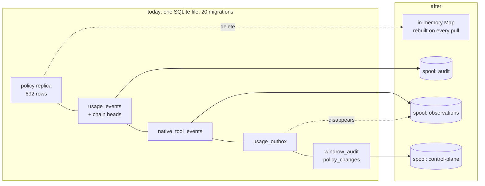
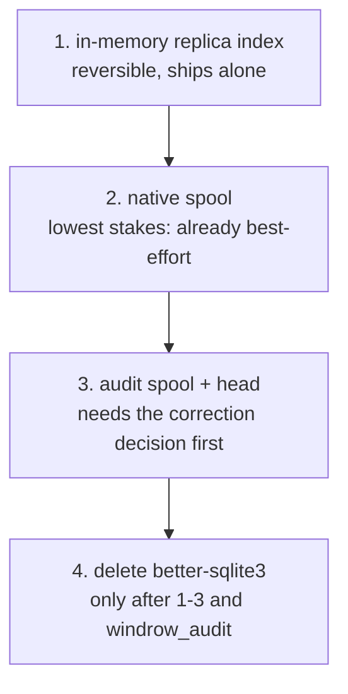

# Retiring SQLite on the node

> [!important]
> **Yes, and it is now smaller than it looks — but it is not one change, it is four, and only three
> of them are safe.** Steps 1–3 of [`dashboard-placement.md`](dashboard-placement.md) have landed,
> which is the gate that note put on this work. Measured against the code as it now stands, the
> node's durable footprint reduces to **three append-only streams and one cache**. The read side
> needs no database at all. The write side needs one thing SQLite is currently providing for free,
> and that thing is the whole risk.



## What is actually on the node, measured

```stats
Tables: 16
Rows total: 5822
Database: 3.2 MB
Migrations: 20
```

The file is small. The migration count is the number that matters — you never migrate something
you can throw away and refetch, and twenty of them is twenty pieces of code whose only job is to
carry a schema forward on a machine whose whole premise is that it can be destroyed.

| Table | Rows | After |
|---|---|---|
| `grants` | 524 | **in-memory `Map`** — replica, refetched wholesale on every policy pull |
| `capabilities` | 139 | in-memory `Map` |
| `principals` | 29 | in-memory `Map` |
| `discovery_sources` | 9 | in-memory, rescan reproduces it |
| `native_tool_events` | 2474 | **spool** — ships since item 1; `shippedAt` is already the cursor |
| `usage_events` | 1802 | **spool** + head |
| `windrow_audit` | 496 | spool |
| `policy_changes` | 293 | gone on a replica — central owns the log |
| `enrollment_tokens` | 15 | gone — central issues (item 7) |
| `kv` | 9 | shrinks to nothing; `node_id` already left (item 5) |
| `usage_outbox` | 8 | **disappears — the spool is the queue** |

## The read side needs no database, and that is already proven

Under central authority `policy/centralPolicyStore.js` splits the contract: writes proxy to
central, reads stay local and **synchronous**, on purpose —

> "`findActiveGrant` is still two prepared statements and the hot path never touches the network …
> making them async would put a microtask on the decision path of every governed tool call to no
> purpose."

That rules out reading JSON off disk per call. It does **not** rule out a `Map`. The whole replica
is 692 rows, the server is long-lived, and the replica is already refetched wholesale on every
pull — so hydrating a `Map` at pull time is synchronous, cheaper than two prepared statements, and
needs no durability at all, because losing it means refetching something central already owns.

> [!tip]
> This is the cheap half and it can ship on its own. It deletes nothing, breaks no format, and is
> reversible by reverting one file.

## The write side: what SQLite is silently providing

Three streams, all append-only, and `hook-fault-journal.jsonl` already proves the pattern in this
codebase.

| Stream | Today | Spool form |
|---|---|---|
| `usage_events` + `usage_chain_heads` | tables, hash-chained | append-only spool + head file |
| `native_tool_events` | table, `shippedAt` cursor | spool, shipped |
| `usage_outbox` | table, written in the event's transaction | **disappears** — the spool *is* the queue |

That third row is the prize. The outbox exists so an event that committed locally cannot fail to be
queued, which today needs both rows in one transaction. If the spool is the queue and shipping is a
cursor over it, there is nothing to keep in sync — one append is the event *and* its place in line.
Fewer moving parts, not weaker guarantees.

> [!caution]
> **The risk is the one thing not in that table: the re-chain.** `patchUsageEvent` rewrites a row's
> content and then recomputes `hash`/`prevHash` for that row *and every row after it*, inside one
> transaction. On a spool that is a rewrite of the tail of an append-only file — which is exactly
> what an append-only file is not for. Either corrections stop being in-place (ship a correction
> record and let central apply it, which central's ingest already does), or the spool needs a
> compaction step, which is a database with extra steps.

Corrections are the honest answer. Central's `ingestBatch` already treats
`usage_event_correction` as a second statement about an event rather than an edit of one, and the
node's own `usage_outbox` already ships it that way. Making the node's local copy append-only means
its local read of a corrected event becomes "last statement wins" rather than "the row" — a real
behaviour change, and the only one in this plan that a reader would notice.

## What it buys

```bars
better-sqlite3 removed          1
Native modules left on a node   0
```

Dropping `better-sqlite3` removes the **only** native module. That is what forces a build toolchain
into any container image: central's `Dockerfile` carries a discarded `python3 make g++` stage purely
because `npm ci` builds a dependency central never loads. A node image becomes `node:22-slim` plus
source, and a rebuild becomes `docker rm`.

## Recommended order



1. **In-memory replica index.** Reversible, no format change, deletes the largest read surface.
2. **Native observations to a spool.** Lowest stakes in the system — they are already best-effort,
   already dropped on a cap, and item 1 already gave them a cursor.
3. **Audit spool + head, and the outbox disappears.** Gated on deciding corrections. This is the
   step that needs a design of its own.
4. **Drop `better-sqlite3`.** Only once `windrow_audit`, `policy_changes` and `approvals` have gone
   too — all three are node-local control-plane history that a replica should not be keeping.

> [!warning]
> **Not started. This document is the assessment `dashboard-placement.md` item 9 asks for, not the
> implementation.** Items 1–8 and 10 of that note are built; this one is a rewrite of the node's
> persistence layer, and half-migrating a storage engine is worse than not starting. Step 1 above is
> the piece worth doing next and is safe on its own.
