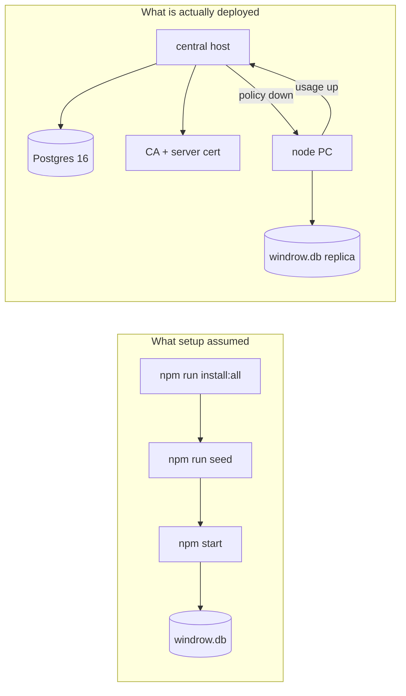
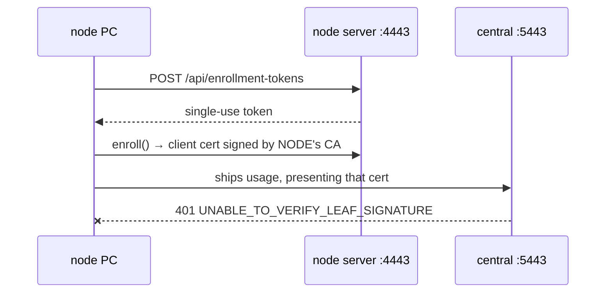
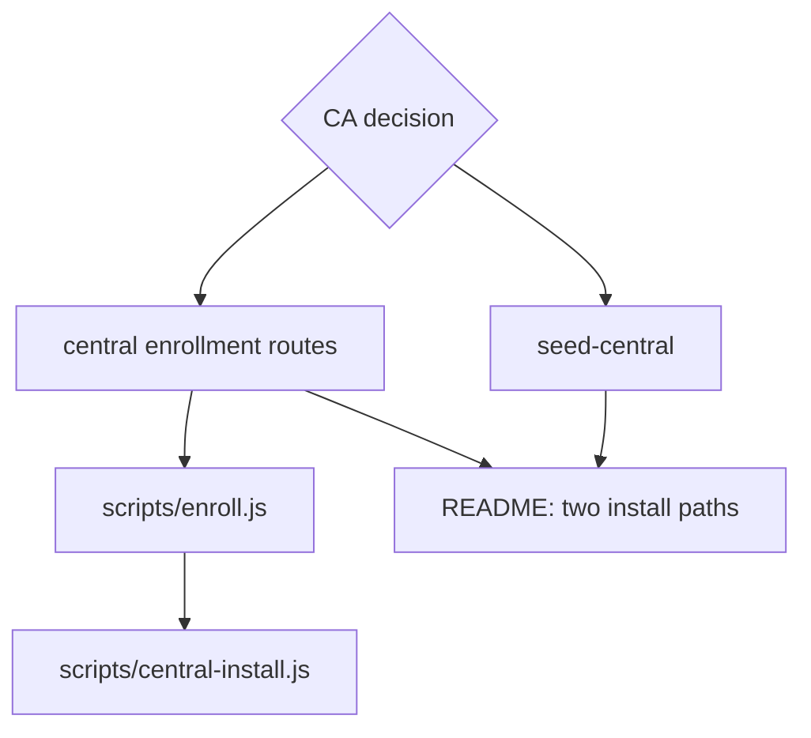

# Setup and initialization after central (phases 1–5)



```stats
Setup scripts today: 8
That know central exists: 0
WINDROW_ env vars read: 45
Documented in the README: 3
```

> [!important]
> **Yes — and the gap is not cosmetic.** Every setup script and every line of the README describes a
> single-machine SQLite install. Phases 3–5 added a second host, a second database engine, a
> certificate authority both ends must agree on, and a seed step that now belongs somewhere else.
> A fresh two-host install cannot be completed from the documentation that exists.

---

## 1. What still works untouched

Not everything moved. A **standalone node** — no `WINDROW_CENTRAL_URL` — is exactly the install the
existing scripts describe, and every one of them is still correct for it.

| Script | Standalone node | Node in a fleet | Central host |
|---|---|---|---|
| `npm run install:all` | correct | correct | installs a client nobody serves |
| `npm run seed` | correct | **refused** — see §3 | no equivalent exists |
| `npm run service:install` | correct | correct | registers the wrong entry point |
| `npm run oobe:dev` | correct | central-blind | n/a |
| `npm run build` | correct | correct | n/a |
| `scripts/upgrade.js` | correct | correct | does not know about Postgres |
| `scripts/sandbox.js` | correct | correct | n/a |
| `docker-compose.yml` | n/a | n/a | correct, and the only central provisioning that exists |

That first column is why this is a gap rather than a breakage: nothing that worked yesterday stopped
working. What is missing is every path that leads out of that column.

---

## 2. The blocking gap: a node cannot enroll with a central it does not share a disk with



Central verifies client certificates against **its own** `server/data/ca/ca-cert.pem`
(`server/enrollment/ca.js`, `WINDROW_CA_DIR`). A node enrolls against **its own** server, which has
**its own** CA. On one machine those are the same directory, which is why the phase-3 end-to-end run
passed. On two machines they are two different roots and every batch is rejected at the TLS layer.

Central mounts no enrollment routes at all — `server/central/routes.js` serves `/api/ingest/*`,
`/api/fleet/*`, `/api/policy*` and `/health`, and nothing else. So there is no endpoint at which a
node could obtain a certificate central would trust.

**Measured, not inferred.** Against the central instance running now, a structurally valid `node`
certificate issued by a second CA — exactly what a node on another machine holds — is rejected
before it reaches any route:

```
central replied HTTP 401 -> {"error":"unauthorized: a valid enrolled client certificate is
required","detail":"UNABLE_TO_VERIFY_LEAF_SIGNATURE"}
```

> [!warning]
> The naive fix — copy `server/data/ca/` to the central host — copies the **CA private key** onto a
> second machine. That key can mint an `admin`-scoped certificate for any node id in the fleet. It
> should exist in exactly one place, and the deployment question is which place.

Two shapes are available, and picking one is a decision rather than a task:

| | CA lives on central | CA lives on a node, central holds only the cert |
|---|---|---|
| Enrollment | central grows `/api/enrollment-tokens` and issues | unchanged; nodes enroll where they do now |
| Central needs | CA key + cert | CA **cert** only, plus a pre-issued server cert |
| Private key copies | 1 | 1 |
| Fits the topology | yes — central is already the control plane | no — the fleet's trust root sits on a user's PC |
| Work | mount the existing enrollment router on central | ship a cert-only load path and an issue-server-cert CLI |

The left column matches §2.2's "policy down, usage up" and reuses code that already exists. It is
the recommendation.

---

## 3. `npm run seed` is now pointed at the wrong database

`server/seed.js` ends in `store.save(db)`, and `save` is one of the mutators wrapped by
`guardPolicyWrite`. On a node with `WINDROW_POLICY_AUTHORITY=central` it throws `PolicyReadOnlyError`
— correctly, since a capability written locally is a row no delta can correct.

But the README still opens with `npm run seed` as step one, and there is no central equivalent. So
under phase 4 the catalog has to be seeded at central, and nothing does that.

```bars
Node seed paths     1
Central seed paths  0
```

The discovery half already has its answer — a node **proposes** what it found and central decides
(`/api/policy/discoveries`, the two node-scoped routes). What is missing is the first-boot bootstrap:
an empty central has no capabilities for any node to be granted anything against, and no route by
which an operator creates them other than by hand.

---

## 4. Everything else, ranked

| # | Gap | Effect on a fresh install | Size |
|---|---|---|---|
| 1 | No enrollment path between node and central (§2) | fleet cannot be assembled at all | design decision + small |
| 2 | No central seed (§3) | central starts with an empty catalog | small |
| 3 | No `service:install` for central | central runs in a terminal someone leaves open | small |
| 4 | Root `package.json` exposes no central scripts | `central`, `smoke:central`, `shadow:compare` are reachable only via `--prefix server` | trivial |
| 5 | README says "no external database to stand up" | actively wrong for any fleet install | docs |
| 6 | 45 env vars, 3 documented | `WINDROW_CENTRAL_URL`, `WINDROW_POLICY_AUTHORITY`, `WINDROW_CENTRAL_DB_URL`, `WINDROW_ROLLUP_SOURCE` and 41 others are discoverable only by grep | docs |
| 7 | `service-install.js` captures only `PORT` and `WINDROW_USER_HOME` | a node installed as a service loses its central config — the service starts standalone and looks healthy | small, and it fails silently |
| 8 | `oobe.js` sandbox has no central | the onboarding wizard cannot be exercised in a fleet shape | medium |
| 9 | `upgrade.js` does not know Postgres exists | an upgrade that adds a central migration has no staged path | medium |

> [!caution]
> **#7 is the one that fails quietly.** `scripts/service-install.js` passes two environment variables
> to the service. A node configured for a fleet in a terminal, then installed as a service, comes
> back up with no `WINDROW_CENTRAL_URL` — so it ships nothing, pulls no policy, and enforces from its
> own tables while an operator believes it is replicating. Every other gap on this list announces
> itself; this one reads as a working install.

---

## 5. What to build, in order



1. **Decide where the CA lives.** Nothing else in this list can be specified until it is answered,
   and it is a security decision, not an implementation one.
2. **`scripts/enroll.js`** — a real CLI. Enrollment is now mandatory for shipping usage *and* pulling
   policy, and the instruction printed by three separate files is a hand-assembled
   `node -e "require('./server/enrollment/client').enroll({…})"`. That is the most-used setup step in
   the new architecture and it has no front door.
3. **`npm run seed:central`** — the phase-4 counterpart to `npm run seed`.
4. **Carry the fleet config into the service** (`service-install.js`), because #7 fails silently.
5. **`scripts/central-install.js`** — the central-host counterpart to `service:install`, including
   the compose file and a `pg_isready` wait.
6. **Rewrite README §Setup as two paths** — standalone (unchanged) and fleet (new) — and replace the
   three-row configuration table with the real surface.

> [!note]
> Steps 2–6 are each small. The reason this reads as a large piece of work is step 1: it is a
> question about where a fleet's trust root lives, and answering it wrong is not recoverable by
> editing a script later.
