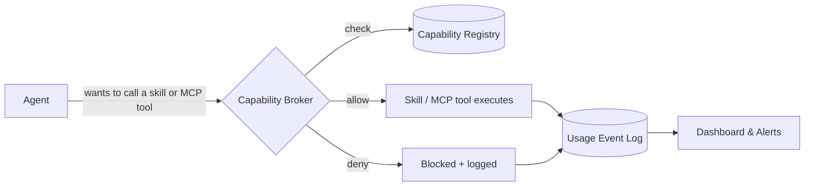
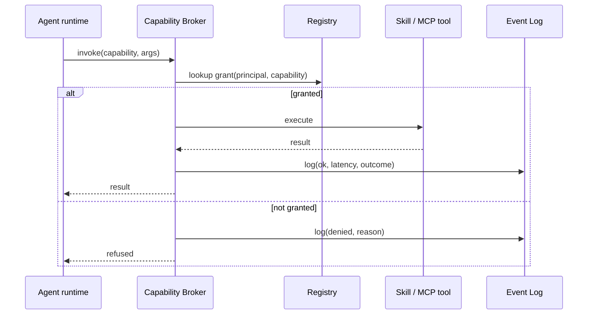
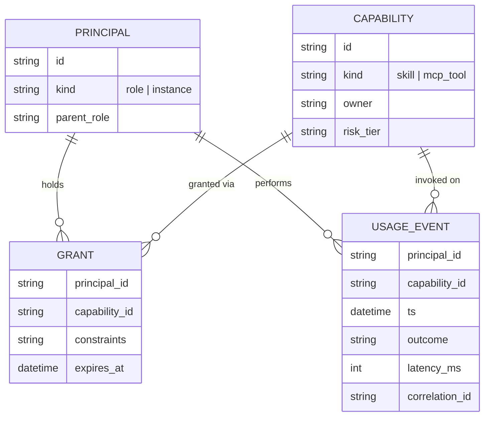

# Windrow: managing and observing agent access to skills and MCPs

> [!important]
> Today, what a skill or MCP an agent can reach is whatever its config file happens to list, and nobody
> can answer "who used the Gmail MCP last week" without grepping transcripts. This design adds one
> layer — a **registry + broker + event log** — sitting between agents and their tools, so access is
> granted on purpose and every call leaves a record.



## 1. The four things being tracked

```stats
Capability: a skill or MCP tool
Principal: an agent role or a specific agent instance
Grant: a principal's permission to use a capability
Usage event: one call, logged win or lose
```

| Entity | What it is | Example |
|---|---|---|
| **Capability** | One skill or one MCP server/tool, versioned | `mcp__claude-design__write_files`, skill `code-review` |
| **Principal** | Who is asking — an agent *role* (default grants) or a specific *instance* (instance id, session) | role `design-agent`, instance `claude-msqvb0zl-4` |
| **Grant** | A principal's permission to use a capability, with constraints | rate limit, expiry, "read-only MCP calls only" |
| **UsageEvent** | One invocation: who, what, when, outcome, latency | `denied`, `ok (240ms)`, `error` |

## 2. Enforcement: one broker, not scattered checks

The broker is the same choke point every tool call already passes through — the harness's
pre-tool-call hook (`PreToolUse` in Claude Code terms). It doesn't add a new interception layer;
it adds a policy decision *inside* the one that exists.



> [!note]
> Denials are logged with the same weight as successes. A spike in `denied` for one principal is
> either a misconfigured grant blocking real work, or an agent probing for access it shouldn't have —
> both are worth paging on, and neither shows up if only successes are recorded.

## 3. Data model



`UsageEvent` never stores full call payloads by default — just capability id, outcome, latency, and
a correlation id (task/session). A verbose debug mode can capture redacted argument digests, with a
short retention window, for the rare case someone needs to reconstruct what an agent actually sent.

## 4. Risk tiers drive how a grant is issued

| Tier | Examples | Default policy |
|---|---|---|
| **Read-only** | `list_files`, `search_threads`, most skills | Auto-granted to any role that needs it |
| **Mutating** | `write_files`, `create_draft`, `trash_message` | Explicit grant per role, visible in registry |
| **Destructive / outward-facing** | `delete_files`, `wispfield_clear_field`, push/deploy tools | Explicit grant **plus** first-use notification to the owner |

Grants are role-scoped by default (all `design` agents get the same MCP set) with instance-level
overrides for the rare one-off — mirroring how `.claude/settings.json` permissions work today, just
extended to skills and MCP tools instead of only bash commands.

## 5. What the dashboard shows

```bars
Granted, used weekly     42
Granted, used rarely      19
Granted, never used       11
```

Three views, all built from the same event log:

- **Catalog view** — every capability, which roles can reach it, risk tier, owner. This is the
  answer to "what could an agent do."
- **Usage view** — per capability: call volume over time, top principals, error/denial rate, p50/p99
  latency. This is the answer to "what did agents actually do, and by whom."
- **Drift view** — capabilities granted but unused in 90 days (prune candidates), and capabilities
  *denied* more than a threshold (either dead weight or a misconfigured principal). This is the
  answer to "what's stale or broken."

## 6. Rollout

| Phase | Delivers | Enforcement |
|---|---|---|
| 1 | Registry (scan skill dirs + MCP configs) + append-only JSONL event log per session | Log only, no denial |
| 2 | Central event store (SQLite/Postgres) + broker checks grants at call time + web dashboard | Deny on missing grant |
| 3 | Risk-tier approval workflow, unused-grant pruning report, alerting on denial spikes | Full policy engine |

> [!tip]
> Ship Phase 1 first and let it run for a couple of weeks before turning on enforcement — the
> unused/denied data from real traffic is what tells you whether the default grants you're about to
> lock in are actually right.
