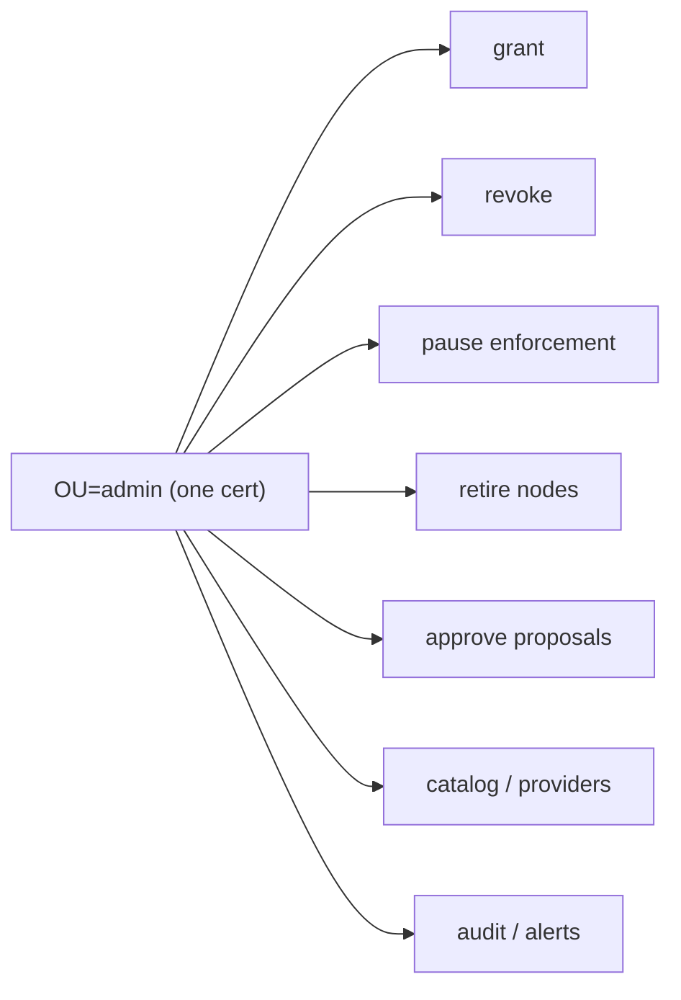
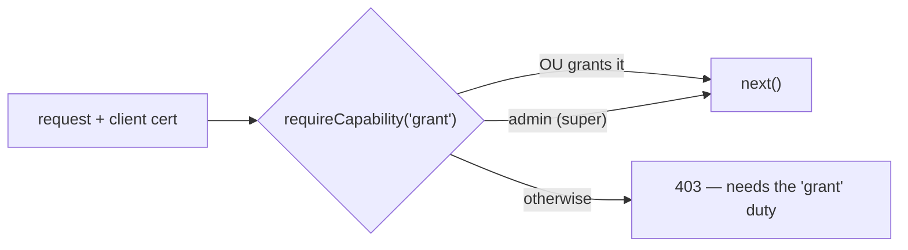

# Sub-admin RBAC — splitting the all-powerful admin certificate

> [!note]
> **Roadmap note, not built.** This proposes a direction and a target shape; nothing here is
> implemented. Today there is exactly one privileged scope, `OU=admin`, and every `requireAdmin`
> route trusts it equally. Read this as *where the admin boundary should go next*, not as current
> behaviour. See [`per-node-enrollment-credentials.md`](per-node-enrollment-credentials.md) for how
> scope is carried in a certificate today, and [`enforcement-pause.md`](enforcement-pause.md) for the
> one bypass this most affects.

## 1. The problem in one line

```stats
Privileged scopes today: 1 (OU=admin)
requireAdmin routes it unlocks: ~30
Distinct admin duties they span: grant, revoke, pause, retire, approve, catalog, audit
Ways to hold fewer of them: 0
```

One certificate grants access, revokes it, pauses enforcement, and retires nodes. There is no cert
that can do one of those and not the others — an operator who should only run a debugging pause holds
the same authority as one who can retire the whole fleet.



## 2. Why this is the next boundary

The credential redesign already moved the system from *"a caller"* to *"which caller"* — every cert
names its holder. RBAC is the same move applied to authority: from *"an admin"* to *"which admin
duty"*. The building blocks are already here.

> [!important]
> The OU field already carries scope, `requireAdmin` is already a single chokepoint, and revocation
> is already a per-request `nodes` lookup. Sub-admin RBAC is a **narrowing of an existing gate**, not
> a new subsystem — the work is defining the duties and replacing one guard, not building an authz
> engine.

## 3. The capability matrix

Rows are admin duties (each maps to a cluster of `requireAdmin` routes). Columns are the proposed
sub-admin roles. `super-admin` is exactly today's cert, kept so nothing regresses.

| Duty | routes (examples) | grant&#8209;admin | operator | fleet&#8209;admin | approver | auditor | super&#8209;admin |
|---|---|:-:|:-:|:-:|:-:|:-:|:-:|
| **grant** | `POST /api/grants`, extend-grant | ✅ | | | | | ✅ |
| **revoke** | `DELETE /api/grants/:id`, package revoke | ✅ | | | | | ✅ |
| **pause** | enforcement pause, maintenance grace | | ✅ | | | | ✅ |
| **retire** | enrollment mint/revoke, node lifecycle | | | ✅ | | | ✅ |
| **approve** | approvals + principals approve/deny | | | | ✅ | | ✅ |
| **catalog** | capabilities, providers, skills, packages | | | ✅ | | | ✅ |
| **audit** | `GET /api/audit`, alerts, usage verify | ✅ | ✅ | ✅ | ✅ | ✅ | ✅ |

Two rules make the matrix safe rather than merely granular:

> [!caution]
> **`pause` and `approve` must be separable from `grant`.** The enforcement pause suppresses even
> destructive denials, and approval is the human-in-the-loop step a proposer cannot self-serve
> ([`enforcement-pause.md`](enforcement-pause.md) §3, `auth.js` `requireProposer`). A role that both
> proposes/grants *and* approves/pauses collapses the separation those controls exist to keep.

## 4. How the cert carries the role

Three candidate encodings; the recommendation is to keep the change inside the OU field so no cert
parsing or CA change is needed.

| Option | Shape | Cost | Verdict |
|---|---|---|---|
| Sub-scoped OU | `OU=admin.grant`, `OU=admin.fleet` | prefix-match in one guard | **recommended** |
| Capability list in OU | `OU=admin:grant+revoke` | split/parse a list per request | flexible, more parsing |
| Separate SAN / extension | custom X.509 extension | touches the hand-rolled encoder | avoid |



`requireAdmin(req)` becomes `requireCapability('grant')(req)` at each mount point: admit if the cert's
OU is `admin` (super) or names the duty. `super-admin` keeps working unchanged, so this ships without
a flag day.

## 5. What to settle before building

```stats
Roles to name in the enrollment token: 6 (matrix columns)
Guards to convert: ~30 requireAdmin mounts → requireCapability(duty)
Bootstrap cert: super-admin (unchanged)
Migration risk: none — existing OU=admin still admits everywhere
```

- **Enrollment.** The admin minting a token already chooses the scope
  ([`per-node-enrollment-credentials.md`](per-node-enrollment-credentials.md) — a caller cannot name
  its own scope). Extend that mint to pick a sub-admin role from the matrix.
- **Audit rows.** `req.tokenScope` already lands on audit and approval rows; the finer role should
  land there too, so the trail shows *which duty* acted, not just "admin".
- **Dashboard.** Each admin-only control hides itself when the cert lacks the duty, the same pattern
  the enforcement-pause card already uses for non-admin certs (§4 of that note).

> [!tip]
> Ship in one slice worth building first: split **pause** and **retire** out of `admin`. Those are
> the two duties whose blast radius (suppressing denials; unenrolling nodes) least belongs in a
> day-to-day grant-management cert, and they need no new UI to be useful from the CLI.
