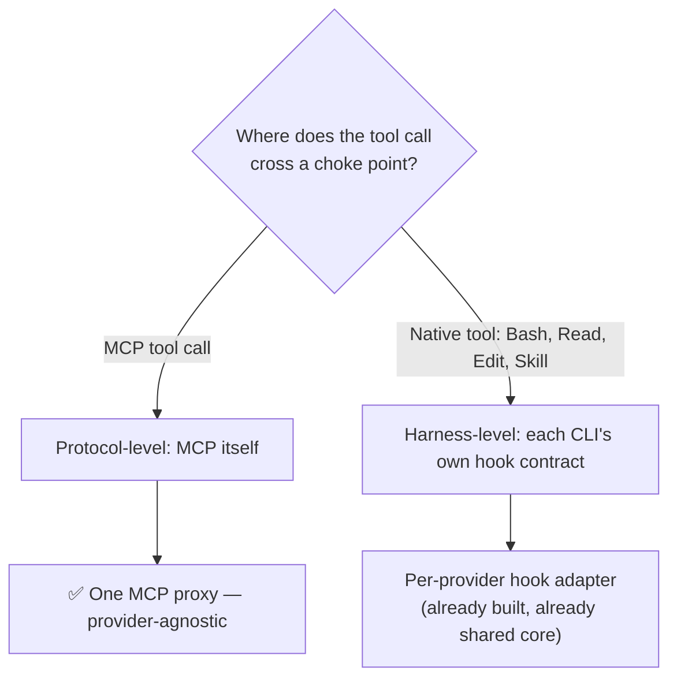
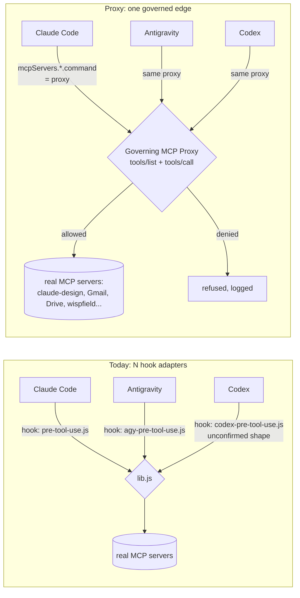

# Unified interception: is there a better way than per-provider hook JSON?

> Answers the question "is there a better way to intercept tool/MCP calls than manually editing
> the PreToolUse/PostToolUse hook configs for each agent provider?" Builds on
> [[agy-adapter]] and [[integration-todo]] item 9 (multi-backend enforcement), and the
> [[deployment-boundary-decision]] server consolidation.

## Today: three thin adapters over one shared core

This is already the good version of the "editing hook JSON per provider" approach, not the naive
one. `server/hooks/lib.js` holds every backend-agnostic piece — capability lookup, principal
resolution, the grant check, fail-open/closed policy — once. Claude Code, Antigravity (`agy`), and
Codex each get a ~40-line adapter that only translates *its own* stdin shape in and its own
decision shape out (`decide()` vs `decideAgy()`). Adding a fourth provider is "write one more
translator," not "reimplement the broker."

What's still genuinely manual, per the incidents already logged in
[[deployment-boundary-decision]]:

- **Claude Code**: consolidated to one **user-level** `settings.json` after project-level hooks
  turned out not to reach git worktrees. Fixed, but only because someone hit the bug.
- **Antigravity**: still **per-field** `.agents/hooks.json` — no confirmed user-level equivalent,
  so it doesn't inherit the worktree fix.
- **Codex**: adapter exists (`codex-pre/post-tool-use.js`) but its actual hook contract was never
  confirmed against a live process — `extractCodexToolCall()` guesses at a union of shapes.

So "one unified method" is a real gap, but it's not a single gap — it splits cleanly into two
different problems with two different right answers.

## The two kinds of tool call are not the same problem

| | Native tools (`Bash`, `Read`, `Edit`, `Skill`) | MCP tools (`mcp__server__tool`) |
|---|---|---|
| **Choke point** | Whatever hook mechanism that specific CLI shipped | The MCP protocol itself — `tools/call` |
| **Shape across providers** | Different every time (Claude's nested `hookSpecificOutput`, Antigravity's flat `{decision,reason}`, Codex's unconfirmed guess) | **Identical by spec** — MCP is the same JSON-RPC contract regardless of which CLI is the client |
| **Config surface** | A hook file path in a provider-specific settings file, at project/user/field scope depending on the provider | `mcpServers: { name: { command/url } }` — already near-identical across Claude Code's `.mcp.json`, Antigravity, and (per public docs) Codex |
| **Can be unified by one piece of code today?** | No — no shared protocol to sit inside | **Yes** |

That second row is the actual answer to "is there a better way." For the MCP half of tool calls,
yes: **an MCP proxy**, not another hook adapter.

## The better way for MCP calls: a governing proxy, not a hook

Instead of every provider's harness calling out to a governance-aware *hook process* after the
harness already decided to route a call to a real MCP server, put governance **in the routing
path itself**:

Concretely: one Node process (`mcp/proxy.js`, using the MCP SDK already vendored for
`mcp/server.js`) that is simultaneously:
- an **MCP server** each provider's config points at instead of the real servers directly, and
- an **MCP client** that holds a live connection to each real downstream server (`claude-design`,
  Gmail, Drive, `governance`, `wispfield`, ...).

On `tools/list`, it merges and re-exposes the downstream servers' tool lists (namespaced the same
way `mcp__<server>__<tool>` already works). On `tools/call`, it does exactly what
`runPreToolUse`/`runPostToolUse` do today — `findCapability` → `resolvePrincipal` → `invoke` →
forward-or-refuse → log outcome — but as **one in-process function call**, not a spawned Node
process reading stdin JSON shaped by whichever harness called it.

### Why this is strictly better for the MCP half

- **Zero adapter code per provider.** Every MCP client speaks the same `tools/call` shape by
  spec. A fifth provider (Kimi, whatever's next) needs its config pointed at the proxy — nothing
  written in this repo.
- **No config-scope foot-guns.** The `.mcp.json` a project already ships is inherently the
  project's own file, read fresh every session — there's no analogue of the "project hooks don't
  reach worktrees" bug from [[deployment-boundary-decision]], because there's no separate
  hook-file layer to fall out of sync with.
- **Can't be bypassed by curl-ing the real MCP server directly**, the way a hook can be bypassed
  by a raw `Bash` call hitting the governance API (finding #2 in
  [[governance-vulnerability-review]]) — if the real server's stdio/socket is only ever spawned
  *by* the proxy and never exposed to the agent directly, there's no direct edge to reach.
- **One process, one latency budget.** Today's per-call flow spawns a fresh Node process per hook
  invocation ([[lib.js]] comment: "every hook invocation is a fresh process"). A long-lived proxy
  keeps the capability cache warm in memory instead of re-reading a cache file every call.

### What it does not solve

Native tools have no protocol boundary to sit inside — `Bash`/`Read`/`Edit`/`Skill` are each
harness's own built-in, invoked however that harness's runtime decides to invoke them. There is no
"native tool proxy" to build; the per-provider `PreToolUse`/`PostToolUse` hook adapters
(`lib.js` + three thin shims) stay exactly as they are today — that part already *is* the unified
approach (one shared core, thin translators), it just can't be collapsed further because there's
no shared protocol underneath it.

## Recommendation

Keep both, because they're solving different halves of the same problem:

1. **MCP tool calls → build the proxy.** This is the one part of "manually editing hook JSON per
   provider" that a single piece of infrastructure genuinely replaces — for MCP calls specifically,
   it eliminates the Antigravity/Codex adapters' reason to exist and closes the Codex contract
   uncertainty entirely (Codex never needs its own MCP hook shape confirmed if it's never given a
   direct MCP edge to hook). Point every provider's MCP config at
   `mcp/proxy.js` instead of at the real servers; retire the MCP-relevant paths through
   `agy-pre/post-tool-use.js` and `codex-pre/post-tool-use.js` once confirmed working end to end.
2. **Native tool calls → keep the hook-adapter pattern**, and finish what
   [[integration-todo]] item 9 already started: confirm Codex's real hook contract against a live
   process (currently guessed), and find or build a field-wide (not per-field) equivalent of the
   user-level `settings.json` fix for Antigravity's `.agents/hooks.json`, so it inherits the same
   worktree-safety property Claude Code's hooks got.

Net effect: "manually editing JSON per provider" shrinks to *one* config line per provider (point
its MCP servers at the proxy) for the MCP half, and stays a one-time adapter file per provider —
already built, already shared-core — for the native-tool half. There's no single mechanism that
unifies both, because they don't share a choke point to unify around; there is a single mechanism
for each.

## Rollout sketch

| Phase | Delivers | Risk |
|---|---|---|
| 1 | `mcp/proxy.js`: wraps one real downstream server (start with `governance` itself — lowest stakes, already trusted), forwards `tools/list`/`tools/call`, logs but doesn't yet enforce | Low — additive, real servers still reachable directly until config is repointed |
| 2 | Wire `runPreToolUse`'s enforcement logic in-process (reuse `lib.js`'s `findCapability`/`resolvePrincipal`/`invoke`, no stdin/hook-process indirection needed since the proxy already has the call in hand) | Same fail-open/closed policy as today, just relocated |
| 3 | Repoint `.mcp.json` (and Antigravity/Codex's MCP config, wherever each keeps it) at the proxy for all downstream servers; remove direct server entries | Moderate — this is the actual cutover; keep the old hook adapters live in parallel for one cycle as a fallback |
| 4 | Retire the MCP-relevant branches of `agy-pre/post-tool-use.js` / `codex-pre/post-tool-use.js` once the proxy has run in production and the drift/usage dashboards agree with the old numbers | Low once phase 3 is verified |
