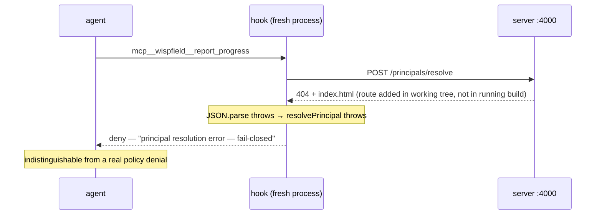
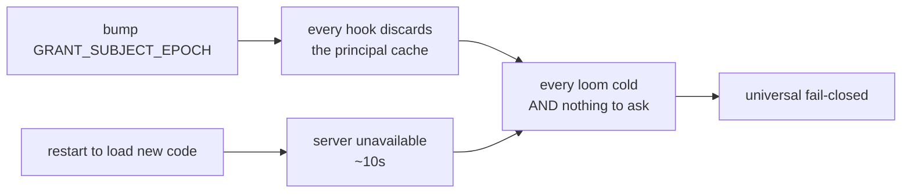
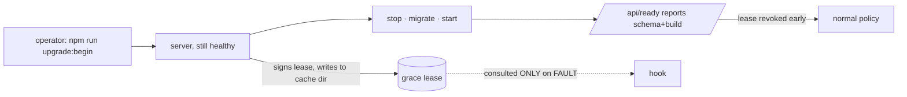
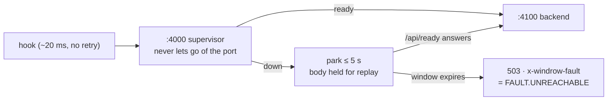
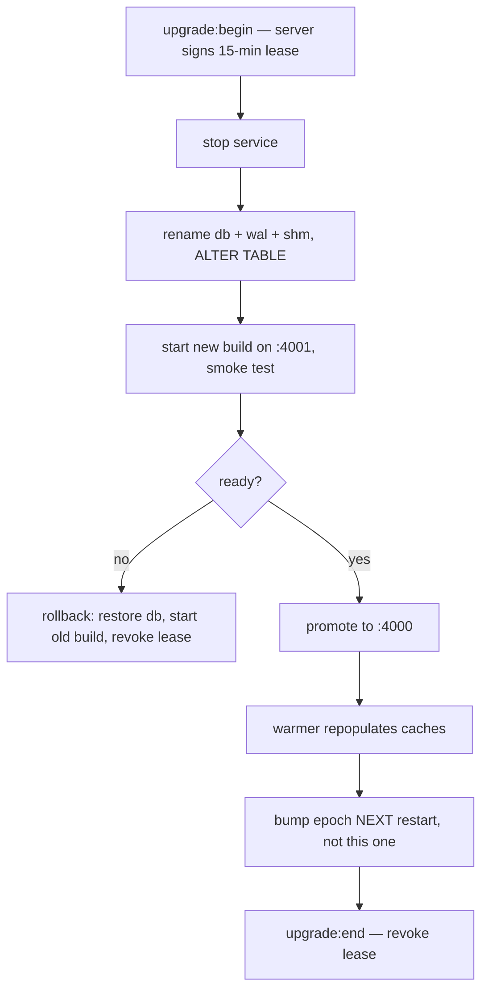

# Surviving server failure during an upgrade

> [!important]
> The hook cannot tell **"you are not allowed"** from **"I could not find out."** Both emit `deny`.
> Every proposal below follows from separating those two, and nothing else needs to change about
> the security model.



That is the 2026-08-19 incident, exactly. The server was healthy, the database was intact, every
grant was valid — and every `mutating` call on the field was denied.

## 1. What today's policy actually does

`runPreToolUse` (`server/hooks/lib.js:574`) branches on **one** variable: `capability.riskTier`.

```js
const failOpen = capability.riskTier === 'read_only';
```

| Situation | read_only | mutating | destructive |
|---|---|---|---|
| No active grant *(a real decision)* | deny | deny | **ask** |
| API unreachable | allow | deny | deny |
| Route missing / unparseable response | allow | deny | deny |
| Principal cache cold + server down | allow | deny | deny |

The bottom three rows are not policy. They are the governance system reporting its own ill health
in the vocabulary of a permission decision.

> [!note]
> This is why the incident felt total. `wispfield_view`, `get_field_status`, `await_task` and
> `read_loom_output` are `read_only` and kept working; `report_progress`, `report_task_complete`,
> `spawn_agent`, `dispatch_command` and `claim_files` are `mutating` and all died. **An agent lost
> the ability to report that governance was broken, because reporting is a mutating call.** The
> failure mode silences its own alarm.

## 2. The trap that made it structural, not unlucky

The principal cache is what makes an outage survivable — a warm loom never calls the server at all.
Two mechanisms empty it, and an upgrade fires both at once:



`loadPrincipalCache` (`hooks/lib.js:294`) discards the whole file on epoch mismatch, and only a
*running* server (`cacheWarmer.js:82`) can repopulate it. The rename plan requires an epoch bump in
the same commit as the MCP rename — so it would reproduce the incident by construction.

> [!caution]
> **Rule: cache invalidation and server unavailability must never overlap.** An epoch bump ships
> one restart *after* the change that motivated it, never in the same one. This single ordering
> constraint removes most of the blast radius for free.

## 3. The design

### 3.1 Fault is not denial

Give the hook three outcome classes internally, not two:

| Class | Meaning | Emits |
|---|---|---|
| `DECISION` | the registry answered: grant / no grant | allow · deny · ask |
| `FAULT` | could not obtain an answer | consult the degradation ladder |
| `SKEW` | server answered, but not in a contract we understand | treat as `FAULT`, log loudly |

The harness still only accepts allow/deny/ask — but the *reason string*, the log line, and the
usage record now distinguish them, so "governance is down" stops being reported to a human as
"you lack permission."

### 3.2 A grace lease, issued while healthy

This is the load-bearing piece. Fail-closed exists to stop an attacker who kills the API from
gaining write access (`governance-vulnerability-review.md` finding #3). That threat model must
survive intact — so the permission to degrade gracefully is **minted by the server while it is
still up**, signed with the agent token, and time-boxed:

```json
{ "kind": "maintenance-grace",
  "until": 1755600000000,
  "tolerate": ["read_only", "mutating"],
  "reason": "governance→windrow tier 3",
  "sig": "…" }
```



An attacker who stops the server cannot mint one; an attacker who can forge one already holds the
agent token, which is the trust boundary the review already accepts. The lease is consulted **only**
on `FAULT` — it never overrides a real `deny`.

### 3.3 The degradation ladder

Replace the boolean with a ladder keyed on *how stale* the local replica is — the same
`MAX_POLICY_AGE` shape `global-identity-and-central-db.md` §2.4 already specifies for the central
split, arriving early and for the same reason.

| State | read_only | mutating | destructive |
|---|---|---|---|
| Healthy | policy | policy | policy |
| FAULT, inside grace lease | allow | **grant check against replica** | ask |
| FAULT, no lease | allow | deny | deny |
| FAULT, leased but replica absent | allow | deny | ask |

"Grant check against replica" means the *real* check runs against the cached grant set rather than
being skipped — autoGrant, then a direct active grant, then the instance→`parentRole` fallback,
with `expiresAt` evaluated against the time of the call. A revoked or lapsed grant still denies.
That is materially different from both today's blanket deny and a blanket allow.

> [!note]
> An earlier draft of this table had a third row that allowed `mutating` from the replica with **no
> lease**, whenever the replica was younger than `MAX_POLICY_AGE`. That contradicts §4 and would
> have failed this design's own verification test 2 — a fault alone would have relaxed policy, which
> is exactly finding #3. The implemented ladder is the stricter one above: **without a lease,
> nothing changes from today's behaviour at all.**

### 3.4 Never refuse the connection — park it

A restart is ~10 seconds. A hook process lives ~20 ms and dies. Refusing its connection converts a
brief restart into a fleet-wide fault; **holding** it converts the same restart into latency.

Put a supervisor on `:4000` that owns the port across restarts and parks requests for up to
`PARK_MS` (5s) while the backend is down, then replays them. Combined with `/api/ready`, most
upgrades become invisible to agents rather than catastrophic.

Built as `server/supervisor.js`. It binds `:4000`, runs `server/index.js` as a child on a private
upstream port (`WINDROW_UPSTREAM_PORT`, 4100), and only forwards once the child has answered
`/api/ready` — "the process exists" and "it can answer" differ by the seconds SQLite spends opening
the database, and forwarding into that gap would just move the refusal inside the supervisor.



Three properties it was built to keep, each of which a simpler proxy loses:

- **Replay is bounded by safety, not by effort.** `ECONNREFUSED` means the connection was never
  established, so the upstream cannot have acted — replayable whatever the method. A reset *after*
  the request was written is not: the backend may have applied a `POST` and died before answering,
  so a non-idempotent call in that state gets a 503 rather than a silently duplicated grant.
- **Nothing relaxes.** The supervisor holds no policy, reads no body and adds no authority. §4's
  constraint is untouched because parking defers a request; it never decides one.
- **It does not hide a backend that is gone.** Past `PARK_MS` the answer is a JSON 503 that
  classifies as `FAULT.UNREACHABLE` — the same fault as today, in a much smaller window, with the
  grace lease still doing the work behind it.

The mTLS listener on `:4443` is deliberately *not* fronted: admin authority travels over a client
certificate, and the dashboard and CLI both have somewhere to wait. Hooks do not, which is the whole
asymmetry this exists for.

Restarting through it (`npm run restart`) never drops the listener, so the requests arriving during
an upgrade park instead of failing. Verified by `npm run test:supervisor --prefix server`.

> [!tip]
> The cheaper half of this ships today with no new process: the server's `API_BASE` is already
> env-derived, so a new build can be started on `:4001`, verified with the existing
> `resolve-cli.js` smoke test, and only then promoted. That is exactly the alt-port test-instance
> workflow already on the wants list.

### 3.5 Keep recording when you cannot ask

During a FAULT window the decision degrades but the *audit* must not. Usage events go to the local
outbox and ship on recovery, each tagged with the fault class and lease id — so "what ran while
governance was down" is a query afterwards, not a gap. This is the same outbox Part 2 phase 3
needs, which makes it worth building once.

## 4. What must not soften

> [!warning]
> Every relaxation above is gated on a lease **the healthy server signed**. Without a valid lease,
> an unreachable server still denies `mutating` and `destructive`. If the ladder is ever allowed to
> degrade on an unsigned local condition, killing the server becomes a privilege escalation again —
> which is precisely finding #3.

- `destructive` never auto-allows. Best case under a lease it becomes `ask`, which puts a human in
  the loop rather than a cache.
- The lease is time-boxed and short. An expired lease is no lease.
- `isWindrowSelfCallAttempt` keeps denying unconditionally — it is not a policy check and has no
  fault mode.

## 5. Applying this to the rename



The rename's tier 3 is the worst case in the whole plan — it changes capability names, the MCP
server key and the cache epoch at once. Under this design it costs a 15-minute lease and one
deferred epoch bump instead of a field-wide outage.

## 6. Verification

1. Kill the server with a valid lease present → `mutating` calls still succeed from replica; the
   reason string says `fault`, not `no grant`.
2. Kill it with **no** lease → `mutating` denies. (The security property is intact.)
3. Expire the lease mid-outage → behaviour tightens at the boundary.
4. Point a hook at a server with the route removed → classified `SKEW`, not a `JSON.parse` crash.
5. Restart behind the supervisor under load → zero denials, latency spike only.
6. Confirm the outbox replayed every call made during the window.

Test 2 is the one that matters. If it ever passes as "allowed", this design has reintroduced the
vulnerability it was built around.

## 7. Status — implemented 2026-08-19

| Piece | Where | State |
|---|---|---|
| Fault taxonomy (`FAULT.*`), skew classification | `server/hooks/lib.js` | done |
| Degradation ladder (`faultPolicy`), replaces `failOpen` | `server/hooks/lib.js` | done |
| Grant replica + real replica grant check | `server/cacheWarmer.js`, `server/hooks/lib.js` | done |
| Grace lease: mint / verify / expire / revoke | `server/maintenance.js` | done |
| `POST·GET·DELETE /api/maintenance/grace` | `server/app.js` | done |
| `GET /api/ready` + hook contract version | `server/app.js` | done |
| `upgrade:begin` · `upgrade:status` · `upgrade:end` | `scripts/upgrade.js` | done |
| Fault journal (local half of §3.5) | `server/hooks/lib.js` | done |
| Request-parking supervisor (§3.4) | `server/supervisor.js` | done |
| Journal reconciliation into `usage_events` on recovery | — | not built |

Verified against an isolated instance on `:4099` with a copied database — 11 checks, all passing,
including test 2 (no lease ⇒ `mutating` still denies) and an ungranted capability denying under a
valid lease.

Re-verified 2026-08-19 against an isolated copy of the server tree with nothing listening on the
API port — 12 checks driving the real `runPreToolUse`, all passing: read-only allows, `mutating`
and `destructive` deny with no lease, a leased `mutating` call is decided from the replica (granted
→ allow, ungranted → deny, expired grant → deny, `parentRole` grant → allow), a leased
`destructive` call asks, and an expired or forged lease is treated as no lease. That run also found
and fixed one gap: `beginGrace({tolerate: []})` fell through to the default and issued a lease
covering *every* leasable tier — an explicit empty list is now a 400, since rounding a request
upward is the one direction this must never take.

### 7.1 Supervisor verification, 2026-08-19

`server/supervisor-test.js` runs the real supervisor against a *copy* of the database on alternate
ports (`WINDROW_SANDBOX=1`, so none of the four background writers can reach the live deployment)
and drives verification test 5 directly — 27 checks, all passing:

| What was done to it | Result |
|---|---|
| Backend hard-killed under 40 req/s | **450 requests, zero refusals, zero non-200s**; 3 parked, slowest 337 ms |
| Supervised restart under the same load | 386 requests, zero refusals, new backend pid |
| `POST` issued while the backend was down | parked 296 ms, replayed, reached the backend (401 from `requireAuth`, i.e. a real answer) |
| Parking window set *shorter* than the restart | JSON 503 at 157 ms with `x-windrow-fault: backend-unavailable` — accepted then failed, never refused |
| Control surface with no credential | 401 |

The run also found one defect worth recording, because it is the failure mode this design is most
likely to reintroduce: the first implementation let the child's own exit handler race the restart
route, so a supervised restart spawned *two* backends and the loser died with `EADDRINUSE` on the
mTLS port — a crash loop that looked nothing like its cause. A deliberate stop now suppresses the
automatic restart, and `spawnChild` refuses to start a second child at all.

> [!warning]
> **The one genuine weakening.** When the fault *is* the identity lookup — the 2026-08-19 case — a
> `mutating` call under a lease is allowed **unattributed**, because there is no principal to check
> the replica against. It is bounded by the lease being signed while healthy, time-boxed, and by
> every such call being written to the fault journal with `unattributed: true`. If that trade is
> not wanted, change the `!principal` branch of `faultPolicy` to deny — the field then stays dark
> during an upgrade, which is the behaviour this work exists to remove.

None of this is live yet: the running service still needs an elevated restart to pick it up.
