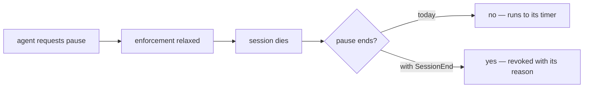

# Hook opportunities: the seven events windrow does not use

> [!important]
> **Implement `SessionEnd`.** It is the only item here that closes a live correctness gap rather
> than adding an improvement: a lease or an enforcement pause currently outlives the session that
> asked for it, so enforcement stays relaxed after everyone who wanted it relaxed has gone.

Claude Code exposes nine hook events. Windrow registers two — `PreToolUse` for the allow/deny and
`PostToolUse` to correct the UsageEvent with the real outcome and latency. Nothing in `server/`,
`scripts/` or `docs/` mentions the other seven.

```stats
Hook events available: 9
Registered by windrow: 2
Assessed here: 7
Recommended: 1
```

## The seven, ranked

| Event | Tier | What it would do |
|---|---|---|
| `SessionEnd` | **1** | Revoke leases and pauses scoped to the session; close the session row; force an outbox drain |
| `SessionStart` | **1** | Detect *silently unwired* governance from inside the session; open the session row |
| `Stop` | **1** | Give the alert engine a turn boundary instead of a 60s rolling sweep |
| `SubagentStop` | **1** | Seal attribution for Task-tool subagents, which are invisible and die with their parent |
| `UserPromptSubmit` | 2 | Inject the current grant set so agents do not attempt what they cannot do |
| `PreCompact` | 2 | Snapshot policy version and lease state at the boundary |
| `Notification` | 3 | Measure how often a denial escalates into a human interrupt |

## Two findings that shaped the ranking

**`sessionId` is a dangling foreign key.** It is written onto every usage event and forms the
correlation id (`loomLabel:sessionId`), and `nodeMigrations.js` gives it a column — but there is no
session row, no start and no end. Sessions are referenced everywhere and modelled nowhere.

**Identity is already cached, so latency is not an argument.** `hook-principal-cache.json` is a
signed, on-disk, epoch-gated cache keyed by `loomId` + `subjectId`. "A `SessionStart` hook could
pre-warm the principal" sounds right and is false; the cache already survives across the fresh
process every hook runs in.

## Tier 1

### `SessionEnd` — the live gap

`enforcementPause` is a 5–30 minute window on a heartbeat, and a maintenance grace lease expires on
a clock. Neither is tied to the thing that requested it.



The window is bounded, so this is not unbounded exposure. It is still a period where the field is
running relaxed for a reason that no longer exists, and nobody is watching for it.

`SessionEnd` is also the natural point to force a `usageShipper` drain rather than trusting the 5s
tick to beat a machine going to sleep.

### `SessionStart` — presence-based integrity

`hookWatcher` watches the config *files* and restores entries that vanish. It cannot catch the
failure `deployment-boundary-decision.md` actually records.

> [!warning]
> `theme-park-predictor` runs its work inside ~29 git worktrees, each carrying its own frozen
> `.claude/settings.json`. A real call made there **never showed up**. No watcher on the user-level
> file can see that, because the file it is watching is correct.

A `SessionStart` hook fires *inside* the session from the real cwd, so its **absence** for a known
field becomes the signal. That is integrity by presence rather than by file contents — a different
detector, catching a different failure. It also opens the row `SessionEnd` closes, recording field,
cwd and worktree directly instead of inferring them per call.

### `Stop` and `SubagentStop` — the right window

The three alert rules — `destructive-burst/node`, `denial-storm/fleet`, `subject-fanout/fleet` —
evaluate on a 60-second rolling sweep. A turn is the semantically correct window for "this agent
went haywire": twelve destructive calls in one turn is a different signal from twelve across an
hour, and the sweep cannot tell them apart.

`SubagentStop` earns its place separately. `principals/fromEnv.js` already distinguishes the
`claudecode` principal from Task-tool subagent roles (`claude`, `Explore`, `Plan`), and those
subagents are invisible to the human and die with their parent. It is the only place their
attribution can be sealed.

## Tier 2 and 3

| Event | The case for | The case against |
|---|---|---|
| `UserPromptSubmit` | The only hook that sees intent *before* any tool call. Injecting the grant set turns denials into non-attempts and cuts denial-storm noise | Tokens on every prompt, and it cannot enforce anything |
| `PreCompact` | A checkpoint for policy version and lease state, so a reader can reconstruct what was in force across a compacted span | The journal already lives outside the transcript, so the audit was never at risk |
| `Notification` | Correlates governance denials with human interrupts | Overlaps the existing alert engine and node shipper |

## The costs

Latency is not the constraint people expect. `latency-breakdown.md` measures ~20 ms lost merely to
`fetch()` building its agent in each fresh hook process — but all seven of these fire **once per
session or turn**, not per tool call. That is precisely why they are affordable where a third
hot-path hook would not be.

> [!caution]
> The real cost is **integrity surface**. Hooks are the enforcement boundary, so every new entry
> point is another file `hookWatcher` must protect and another place a silently-removed line
> disables something. Nine slots existing is not a reason to fill them.

## Recommendation

Implement `SessionEnd` alone, scoped to one job: revoke leases and enforcement pauses whose
requesting session has ended.

Add `SessionStart` only if the worktree blind spot is judged worth a second detector — the two are
a pair, and a session row with no terminator is worse than no session row at all. Leave the
remaining five unregistered until something concrete asks for them.
