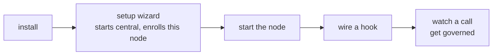
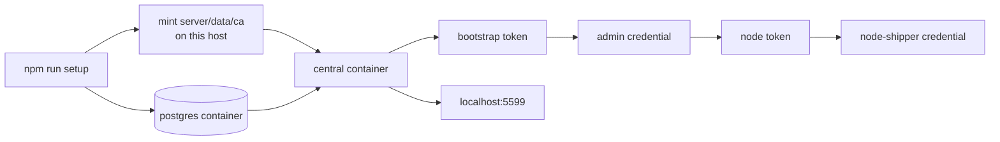
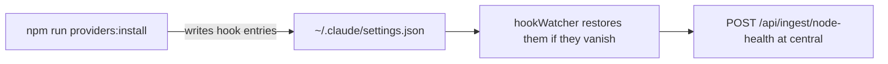

# Quickstart

Ten minutes from a clone to watching Windrow deny a tool call on purpose, with a dashboard to watch
it on. [Setup](setup.md) covers every topology; this is the one the wizard defaults to.



**What you end up with:** enforcement running on this machine as a host process, and central — the
Postgres, the fleet's certificate authority and the **dashboard** — running in Docker beside it.
That is the smallest install that has a user interface, because since
[`dashboard-placement.md`](design/dashboard-placement.md) a node serves none.

> [!note]
> **No Docker?** Choose **"A node, on its own"** at step 2. Enforcement is identical and one node is
> a complete, correct install — you just have no dashboard, and everything below that would be a
> browser is a command instead. The differences are marked as you go.

## 1. Install

```bash
git clone git@github.com:ejbrahms/Windrow.git
cd Windrow
npm run install:all
```

## 2. Run the wizard

```bash
npm run setup
```

Press enter at the first question to take the default — **"Central in a container, and a node
here"**. Eight steps, and it does the parts that used to be yours:



It starts the Postgres and central containers, mints the certificate authority **on the host** so
both halves share one root, waits for central's own healthcheck, then enrolls this node — reading
the bootstrap token out of the container, spending it on an `admin` credential, and using that to
mint the node-scoped token the node actually runs on. It ends by writing `windrow.env`.

> [!note]
> Do not run setup elevated. It writes files that the normal user then has to read.

> [!tip]
> Re-running setup is the normal case, not a recovery. It mints no authority it already has, enrolls
> nothing this machine already holds a credential for, and starting containers that are up is a
> no-op.

## 3. Start the node

```bash
npm start          # API on :4000, admin API on :4443
```

Central is already running — the containers are `restart: unless-stopped`, so they come back with
the machine. **Open the dashboard at <http://localhost:5599>.**

> [!important]
> **The node itself serves no dashboard.** `:4000` is loopback plaintext for hooks, `:4443` is
> mutual TLS for the CLI and MCP, and both say so if you point a browser at them. `:5599` is
> central's dashboard proxy, published to this machine's loopback only — which is its access
> control, because anything that reaches it has full admin. On a standalone node there is no `:5599`
> and no dashboard at all; everything below is a command instead.

## 4. Wire the hooks

Nothing is enforced until a hook is wired into an agent backend. **You do not edit any config file
by hand** — one command does it:

```bash
npm run providers            # what is installed on this machine, and where
npm run providers:install claude
```



It writes the command with an **absolute, repo-anchored path**, which matters more than it looks:

> [!important]
> A `$CLAUDE_PROJECT_DIR`-relative hook command resolves only inside this repo and dies with
> `MODULE_NOT_FOUND` in every other workspace — the hook is registered globally, but the file is
> not. Letting the CLI write the path is how you avoid that; it is the single most common way a
> hand-edited config breaks.

`hookWatcher` then keeps an eye on those files and puts the entries back if they disappear — and
reports the result to central, so *"is governance actually wired on that box"* is a fleet query
rather than a visit to the box.

Check the hook answers before relying on it:

```bash
echo '{"session_id":"t1","tool_name":"Bash","tool_input":{"command":"echo hi"}}' \
  | node server/hooks/pre-tool-use.js
```

Expect `{"hookSpecificOutput":{"hookEventName":"PreToolUse","permissionDecision":"allow"}}`. Native
tools like Bash are not in the capability registry, so they pass straight through — that is correct.

## 5. Watch a call get governed

Start a new agent session and call an MCP tool. It shows up on the dashboard: the usage event, the
principal discovered from the agent's environment, the capability catalogued on first sight. Then
revoke the grant for that capability on the **Grants** tab and call it again — the agent gets a
denial with a reason rather than a silent pass.

On a standalone node, ask the install instead:

```bash
npm run verify:topology      # is the whole install actually wired
```

> [!tip]
> The point of the exercise is the difference between the two refusals. A missing grant is a
> **decision**. A registry that did not answer is a **fault**, and Windrow treats them differently —
> read-only faults pass, mutating ones fail closed. [Architecture](architecture.md#decisions-not-denials)
> explains the ladder.

## Central in Docker, without the wizard

Step 2 does all of this for you. Do it by hand when you want central and nothing else — a dedicated
control-plane host that runs no agents:

```bash
docker compose -f server/central/docker-compose.yml up -d
```

Then open <http://localhost:5599>. No `npm install`, no wizard, no `windrow.env`: Compose pulls
`ghcr.io/ejbrahms/windrow-central:latest` (published from every commit to `main`, dashboard bundle
already inside) and `postgres:16-alpine`, starts central only once Postgres answers `pg_isready`, and
central migrates its own schema at boot.

| Container | What it is | Where it listens |
|---|---|---|
| `windrow-central-db` | Postgres 16, `usage_events` range-partitioned by month | `127.0.0.1:5432` — loopback only, because it holds every usage row |
| `windrow-central` | The control plane and the dashboard | `:5443` mutual TLS for nodes and the CLI; `127.0.0.1:5599` for the browser |

The two ports are not two views of one door. `:5443` demands a client certificate no browser holds;
`:5599` is `server/central/dashboardProxy.js`, published to the host's loopback **only** — anything
that reaches it has full admin, which is why that bind is not negotiable.

> [!caution]
> **On a host that also runs a node, use `npm run central:up`, not the bare `docker compose` above.**
> The base compose file gives the container a *private, empty* CA directory, so central mints a
> brand-new fleet root on first boot — harmless when there is no fleet yet, and on a host that
> already has one it **orphans every enrolled node at once**. `central:up` adds
> `docker-compose.host-ca.yml`, which bind-mounts the host's real `server/data/ca` read-only.
> `central:up`, `central:pull` and `central:build` all compose that overlay; the bare commands here
> do not. The wizard's default role uses the overlay, which is why it can share one authority.

> [!important]
> **Set `WINDROW_SERVER_SANS` before the first boot** if nodes on other machines will dial this host.
> The TLS certificate is minted for `localhost`, the loopback addresses, and the names in that list —
> nothing else — so a node dialling a name that is missing fails on the hostname, not on the chain.
> The container's default is `windrow-central,host.docker.internal`; add the host's LAN name and its
> IP in the shell before `up`.

### Fill the dashboard with something

A central with no nodes is empty. To see the console populated, seed the catalog once the container
reports `healthy`:

```bash
docker compose -f server/central/docker-compose.yml ps          # wait for: central ... (healthy)
docker exec windrow-central node seed-central.js
```

Seeding while central is still starting collides with the partition maintenance it runs at boot and
fails with a `duplicate key` error — wait for `healthy`, then re-run it.

### Enroll the first admin

Central's first start writes a single-use bootstrap token into the CA volume, because with no admin
enrolled there is nobody who could mint the first one:

```bash
docker exec windrow-central cat /app/server/data/bootstrap-enrollment-token
node scripts/enroll.js --name admin --url https://localhost:5443 --token <that token>
```

> [!note]
> **In Git Bash on Windows, prefix that first command with `MSYS_NO_PATHCONV=1`** — MSYS rewrites the
> leading `/app/...` into a Windows path, and `cat` reports a file nobody asked for. PowerShell and
> cmd need nothing.

`scripts/enroll.js` is the one step that runs outside the container, on the machine that will
administer the fleet — `npm run install:all` there first. From there,
`POST /api/enrollment-tokens` with that certificate mints one token per node PC; see
[Setup](setup.md#mint-a-token-for-each-node).

### Day to day

| | |
|---|---|
| Follow the logs | `docker compose -f server/central/docker-compose.yml logs -f central` |
| Stop it | `npm run central:down` (keeps the data and the CA) |
| Start it again | `npm run central:up` |
| Update to the latest image | `npm run central:pull`, then `npm run central:up` |
| Run local changes instead | `npm run central:build` — builds the image *and* the dashboard bundle the Dockerfile copies in |
| Postgres only, for a host-run `npm run central` | `npm run central:db` |

> [!warning]
> `docker compose … down -v` deletes the volumes, and one of them is the fleet's certificate
> authority. That does not reset central — it orphans every node ever enrolled against it. Safe on a
> throwaway trial, never on a fleet.

## Where to go next

| | |
|---|---|
| Run it for real | [Setup](setup.md) — fleets, a dedicated central, services |
| Understand the shape | [Architecture](architecture.md) |
| Tune it | [Configuration](reference/configuration.md) |
| Debug without denials in the way | `npm run denials:off 20m "why"` |
| Take this node out of the fleet | `npm run node:retire` — flushes what it owes central first |
