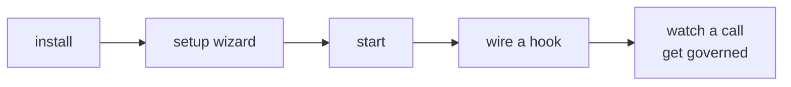
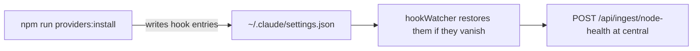

# Quickstart

Ten minutes from a clone to watching Windrow deny a tool call on purpose. This is a lesson, not a
deployment guide — it sets up the simplest possible shape (one machine, SQLite, no fleet) so the
mechanism is visible. [Setup](setup.md) covers the real topologies.



## 1. Install

```bash
git clone git@github.com:ejbrahms/Windrow.git
cd Windrow
npm run install:all
```

## 2. Answer one question

```bash
npm run setup
```

The wizard asks what this machine is. Choose **standalone node** — SQLite, its own policy, no
central host and no Postgres. It writes `windrow.env` and tells you what it decided.

> [!note]
> Do not run setup elevated. It writes files that the normal user then has to read.

## 3. Start it

```bash
npm start          # API on :4000, admin API on :4443
```

> [!important]
> **A node serves no dashboard.** It is an enforcement point and an API — there is nothing here to
> open in a browser, and both listeners say so if you try. The dashboard is served by central
> ([`dashboard-placement.md`](design/dashboard-placement.md)); a standalone install like this one
> has no dashboard at all, and everything below is a command instead.

## 4. Wire the hooks

Nothing is enforced until a hook is wired into an agent backend. **You do not edit any config file
by hand** — one command does it:

```bash
npm run providers            # what is installed on this machine, and where
npm run providers:install claude
```



It writes the command with an **absolute, repo-anchored path**, which matters more than it looks:

> [!important]
> A `$CLAUDE_PROJECT_DIR`-relative hook command resolves only inside this repo and dies with
> `MODULE_NOT_FOUND` in every other workspace — the hook is registered globally, but the file is
> not. Letting the CLI write the path is how you avoid that; it is the single most common way a
> hand-edited config breaks.

`hookWatcher` then keeps an eye on those files and puts the entries back if they disappear — and
reports the result to central, so *"is governance actually wired on that box"* is a fleet query
rather than a visit to the box.

Check the hook answers before relying on it:

```bash
echo '{"session_id":"t1","tool_name":"Bash","tool_input":{"command":"echo hi"}}' \
  | node server/hooks/pre-tool-use.js
```

Expect `{"hookSpecificOutput":{"hookEventName":"PreToolUse","permissionDecision":"allow"}}`. Native
tools like Bash are not in the capability registry, so they pass straight through — that is correct.

## 5. Watch a call get governed

Start a new agent session and call an MCP tool. On a fleet, the call shows up on central's
dashboard — usage, the principal discovered from the agent's environment, the capability catalogued
on first sight. On a standalone install, ask the API directly:

```bash
npm run verify:topology      # is the whole install actually wired
```

Now revoke the grant for that capability and call it again. The agent gets a denial with a reason
rather than a silent pass.

> [!tip]
> The point of the exercise is the difference between the two refusals. A missing grant is a
> **decision**. A registry that did not answer is a **fault**, and Windrow treats them differently —
> read-only faults pass, mutating ones fail closed. [Architecture](architecture.md#decisions-not-denials)
> explains the ladder.

## Where to go next

| | |
|---|---|
| Run it for real | [Setup](setup.md) — fleets, central, services. Central ships as a published image: `npm run central:pull` fetches it from GHCR, no local build |
| Understand the shape | [Architecture](architecture.md) |
| Tune it | [Configuration](reference/configuration.md) |
| Debug without denials in the way | `npm run denials:off 20m "why"` |
| Take this node out of the fleet | `npm run node:retire` — flushes what it owes central first |
