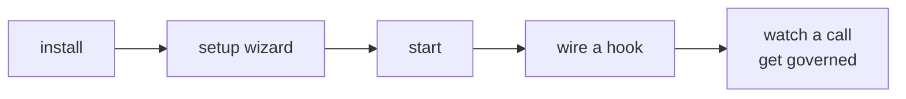
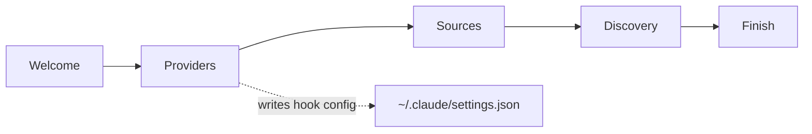

# Quickstart

Ten minutes from a clone to watching Windrow deny a tool call on purpose. This is a lesson, not a
deployment guide — it sets up the simplest possible shape (one machine, SQLite, no fleet) so the
mechanism is visible. [Setup](setup.md) covers the real topologies.



## 1. Install

```bash
git clone git@github.com:ejbrahms/Windrow.git
cd Windrow
npm run install:all
```

## 2. Answer one question

```bash
npm run setup
```

The wizard asks what this machine is. Choose **standalone node** — SQLite, its own policy, no
central host and no Postgres. It writes `windrow.env` and tells you what it decided.

> [!note]
> Do not run setup elevated. It writes files that the normal user then has to read.

## 3. Start it

```bash
npm start          # API on :4000
npm run dev:client # dashboard on :5173
```

Open **http://localhost:5173**. On a first run the onboarding wizard takes over — that is step 4,
and it is what wires the hooks. After it finishes you land on the capability catalog, populated
from the skills and MCP tools discovered on this machine.

> [!warning]
> Use `:5173`, not `:4000`. The `:4000` listener only grants `agent` scope for hooks, so a browser
> there renders the dashboard shell and then 401s on every API call. `:5173` is a Vite proxy that
> presents a client certificate for you.

## 4. Let the wizard wire the hooks

Nothing is enforced until a hook is wired into an agent backend. **You do not edit any config file
by hand** — the onboarding wizard does it for you the first time you open the dashboard.



On the **Providers** step, pick the backends on this machine — Claude Code, Antigravity — and it
installs the `PreToolUse`/`PostToolUse` entries into that backend's own config file. It writes the
command with an **absolute, repo-anchored path**, which matters more than it looks:

> [!important]
> A `$CLAUDE_PROJECT_DIR`-relative hook command resolves only inside this repo and dies with
> `MODULE_NOT_FOUND` in every other workspace — the hook is registered globally, but the file is
> not. Letting the wizard write the path is how you avoid that; it is the single most common way a
> hand-edited config breaks.

You can revisit this any time from the **Providers** page, which shows whether each backend's hook
is currently installed and lets you toggle it. `hookWatcher` then keeps an eye on those files and
puts the entries back if they disappear.

Check the hook answers before relying on it:

```bash
echo '{"session_id":"t1","tool_name":"Bash","tool_input":{"command":"echo hi"}}' \
  | node server/hooks/pre-tool-use.js
```

Expect `{"hookSpecificOutput":{"hookEventName":"PreToolUse","permissionDecision":"allow"}}`. Native
tools like Bash are not in the capability registry, so they pass straight through — that is correct.

## 5. Watch a call get governed

Start a new agent session and call an MCP tool. Then look at the dashboard:

- **Usage** — the call, with who made it, whether it was allowed, and how long each stage took
- **Principals** — the agent, discovered automatically from its environment
- **Capabilities** — the tool, catalogued on first sight

Now revoke the grant for that capability and call it again. The agent gets a denial with a reason,
and the dashboard shows the denied call rather than nothing at all.

> [!tip]
> The point of the exercise is the difference between the two refusals. A missing grant is a
> **decision**. A registry that did not answer is a **fault**, and Windrow treats them differently —
> read-only faults pass, mutating ones fail closed. [Architecture](architecture.md#decisions-not-denials)
> explains the ladder.

## Where to go next

| | |
|---|---|
| Run it for real | [Setup](setup.md) — fleets, central, services |
| Understand the shape | [Architecture](architecture.md) |
| Tune it | [Configuration](reference/configuration.md) |
| Debug without denials in the way | `npm run denials:off 20m "why"` |
