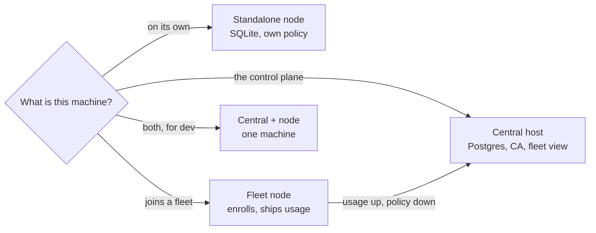
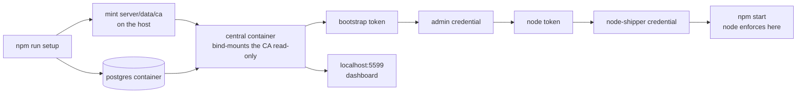
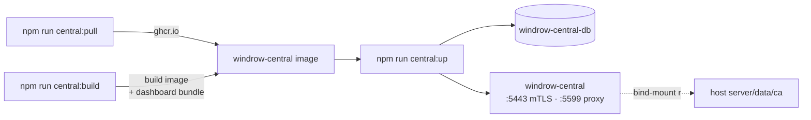
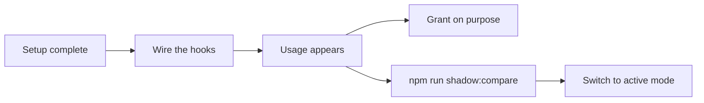

# Set up Windrow



`npm run setup` asks that one question and runs the right phases for the answer. This guide covers
the prerequisites for each answer, what the wizard does, how to confirm it worked, and what to do
when it did not.

> [!important]
> **Setup writes exactly one file: `windrow.env` at the repo root.** `server/config.js` reads it at
> startup, and `scripts/service-install.js` snapshots it into a Windows service. Configuration that
> lives only in a terminal is gone when that terminal closes — which is the one failure that leaves
> a node looking healthy while it ships nothing.
>
> [`windrow.env.example`](../windrow.env.example) is the annotated template of that file — every
> variable a `windrow.env` can hold, grouped by role, with placeholder values. Read it to see what
> the wizard is deciding; do **not** copy it into place, because `npm run setup` also probes the
> database, builds the dashboard, enrolls against central, and generates the Postgres password the
> template only stands in for.

---

## Before you begin

### Every machine

| Requirement | Why |
|---|---|
| **Node.js 18+** and npm | `better-sqlite3` needs a version that still ships prebuilt binaries. If `npm install` starts compiling from source, update Node rather than installing build tools. |
| **A clone of this repo** | Setup runs from the repo root; every script path below is relative to it. |
| **Windows**, for the node service path | The server and client are plain Node and Vite and run in dev mode on any OS. Only the node's `service:install` (and the legacy `central:install`) are Windows-only; the recommended central deployment is a Docker container that runs anywhere Docker does. |

### The central host, additionally

- **Docker Desktop.** Central's recommended deployment is a container
  ([below](#run-central-as-a-container-recommended)), and the same Compose stack carries its
  Postgres. Without Docker you can still run central as a host process against an external Postgres,
  but the container is the path that survives a reboot and serves the dashboard.
- **Postgres 16.** The Compose stack brings it up for you; or hand central the connection URL of a
  Postgres you already run. Nodes never talk to it — only central does.
- **A hostname nodes can reach it by.** It goes into central's server certificate (`WINDROW_SERVER_SANS`).
  A node that connects by a name you left out fails on the hostname, not on the certificate chain.
- **Two open ports**, `5443` (mTLS, nodes and CLI) and `5599` (dashboard, bound to `127.0.0.1`), by
  default.

### A node joining a fleet, additionally

- **A central already running**, and its base URL as this node reaches it.
- **An enrollment token minted at central.** Single-use, 24 hours. You can run setup without one and
  enroll later, but until then the node neither ships usage nor pulls policy.

### Decide the fleet mode before you start

You are asked this on both the central host and each node, and the two answers have to match.

| Mode | Central holds | Nodes | Choose it when |
|---|---|---|---|
| **Shadow** | usage, the fleet view | keep their own policy authority | Always, first. Nothing a node decides depends on central being up. |
| **Active** | the canonical capabilities and grants | read a replica, plus the deny-list | You have measured agreement with `npm run shadow:compare` and want one catalog. |

> [!note]
> In **both** modes a node keeps enforcing from its local tables when central is unreachable. A tool
> call never waits on the network. Switching modes later is a re-run of `npm run setup`, not a
> migration.

---

## Run the setup wizard

```bash
git clone <this repo>
cd windrow
npm run setup
```

On Windows you can double-click **`scripts\windows\setup.bat`** instead. Setup installs dependencies itself if
`server/node_modules` or `client/node_modules` is missing, so `npm run install:all` first is
optional.

The first question is what this machine is, and it **defaults to `dev-both`** — central in a
container plus a node here. That is the smallest install that has a dashboard, and setup starts the
containers and enrolls the node for you ([below](#set-up-central-in-a-container-and-a-node-on-one-machine)).

Skip the question by naming the role:

```bash
npm run setup -- --role dev-both      # THE DEFAULT: central in a container, and a node here
npm run setup -- --role node          # a node, on its own — no Docker, and no dashboard
npm run setup -- --role node-fleet    # a node that joins a fleet
npm run setup -- --role central       # the central host, on a machine that runs no agents
```

### Wizard options

| Flag | What it does |
|---|---|
| `--role <r>` | Skip the "what is this machine" question. One of `dev-both` (the default), `node`, `node-fleet`, `central`. |
| `--show` | Print how this machine is configured and where each value came from. Changes nothing. Also `npm run setup:show`. |
| `--dry-run` | Print every command it would run, and the `windrow.env` it would write. Runs and writes nothing. |
| `--yes`, `-y` | Take every default without asking. Stops rather than guessing when a question has no default. |
| `--help` | The script's own header comment. |

> [!tip]
> **Re-running setup is the normal case, not a recovery.** Every step is idempotent, and the wizard
> offers your last answers back as defaults. Setting up a node today and joining it to a central
> next month is two runs of the same command.

### Do not run setup elevated

`scripts\windows\setup.bat` deliberately does not request administrator rights. The wizard builds the client and
writes `windrow.env`, and doing that as Administrator leaves files your ordinary user then has to
fight. Only the last, optional step — registering a Windows service — needs elevation, so in an
unelevated shell the wizard skips that question and prints the single command to run afterwards.

---

## Set up central in a container and a node on one machine

**The default role, and the recommended install for one person.** Enforcement runs here as a host
process; central runs in Docker and serves the dashboard. One command:

```bash
npm run setup          # or: npm run setup -- --role dev-both
npm start              # the node
```



Eight steps, and the three that used to be yours to do by hand are not any more:

| Step | What it does |
|---|---|
| 1–3 | Dependencies, Docker preflight, the Postgres container, the schema |
| 4 | Fleet mode, and the catalog seeded **before** central starts — seeding a booting central races its partition maintenance and fails on a duplicate key |
| 5 | **Mints `server/data/ca` on the host**, so the container's read-only bind mount finds a real authority instead of minting a second root |
| 6 | `docker compose … up -d` with **both** compose files, then waits for the container's own healthcheck |
| 7 | **Enrolls this node**: reads the bootstrap token out of the container, enrolls an `admin` credential, mints a node-scoped token with it, and enrolls `node-shipper` |
| 8 | Writes `windrow.env` and tells you to run `npm start` |

> [!note]
> **Two enrollments, not one, and the second is the point.** The bootstrap token central writes on
> first boot is `admin`-scoped, because the first caller has to be able to mint every later token.
> Spending it directly on the shipping credential would leave the thing that ships usage holding the
> strongest scope in the fleet for a year. So setup spends it once on an `admin` credential, and
> that credential mints the node-scoped token this node actually runs on.

> [!caution]
> **This configuration cannot catch the mismatch it most matters to catch.** Both halves share this
> repo's `server/data/ca` — which is exactly what makes a one-machine fleet enrollable — so the
> two-CA failure a real two-host fleet hits is impossible here. Test that on two machines before you
> rely on it. See `docs/design/setup-after-central.md` §2.

Re-running is safe and is the normal case. Setup mints no CA it already has, enrolls nothing this
node already holds a credential for, and starts containers that are already up as a no-op.

### If the enrollment step fails

Everything else is still configured — setup says so and carries on. To finish by hand, mint a token
with an admin credential and enroll:

```bash
node scripts/enroll.js --name node-shipper --url https://127.0.0.1:5443 --token <token>
```

The bootstrap token is single-use and central **deletes it** once an admin exists, so a second
machine's worth of guessing is not available: if it is gone and no admin credential is on this
machine, mint the token from wherever the admin credential ended up.

> [!note]
> Reading that token by hand is `docker exec windrow-central cat /app/server/data/bootstrap-enrollment-token`.
> **In Git Bash on Windows, prefix it with `MSYS_NO_PATHCONV=1`** — MSYS rewrites the leading
> `/app/...` into a Windows path and `cat` reports a file that was never asked for. PowerShell and
> cmd need nothing.

### What setup writes for Compose

`server/central/.env`, holding the Postgres credentials and the two published ports. Compose reads a
`.env` beside the compose file automatically, which is what makes `npm run central:db`,
`npm run central:up` and a bare `docker compose` all agree about the database. Without it, a
`central:up` run in a shell that never saw the wizard's answers hands central the compose defaults
and gets an authentication failure against a volume initialised with a generated password. It is
`.gitignore`d and written owner-only, because it holds that password.

---

## Set up a standalone node

SQLite, its own policy catalog, no central and **no Docker**. This is what Windrow was before it
grew a control plane, and nothing about the central architecture changed it: enforcement here is
identical, and one node on its own is a complete, correct install.

What it costs is the **dashboard** — a node serves none, so every question is a command
(`npm run verify:topology`, `npm run providers`, `npm run denials:status`). Choose it on a machine
without Docker, or when a console is not worth two containers to you. The
[default role](#set-up-central-in-a-container-and-a-node-on-one-machine) is the same enforcement
with a dashboard in front of it.

```bash
npm run setup -- --role node
npm start          # http://localhost:4000 — API only; a node serves no dashboard
```

> [!important]
> **A standalone node has no dashboard, and neither does a fleet node.** Since
> [`dashboard-placement.md`](design/dashboard-placement.md) the bundle is served by central alone; a
> node is an enforcement point and an API. Everything the dashboard used to be needed for on a
> machine is a command — `npm run providers:install` to wire hooks, `npm run verify:topology` to
> check the install, `npm run denials:off` to debug, `npm run node:retire` to take it out.

The wizard walks six steps:

1. **Install dependencies** — `npm run install:all`, if `node_modules` is missing.
2. **Choose ports** — the supervisor port hooks connect to (`4000`), the private upstream port the
   API child runs on (`4100`), and the mutual-TLS port for the dashboard and CLI (`4443`). It tells
   you if the supervisor port is already taken.
3. **Set the database and paths** — `server/data/windrow.db`, and your home directory.
4. **Build the dashboard** — only on a central host. A node serves no bundle, so this step is
   skipped there entirely.
5. **Seed the catalog** — scans this environment's skill directories and MCP config. No demo data.
6. **Start the node** — offers the Windows service, or prints `npm start`.

> [!note]
> **Step 3 asks for your home directory on purpose.** A Windows service runs as `LocalSystem`, whose
> home is `C:\WINDOWS\system32\config\systemprofile` — not the one that holds `~/.claude` and
> `~/.gemini`. `WINDROW_USER_HOME` is how hooks find the real one.

---

## Set up the central host

One per fleet. It holds the Postgres, the fleet's certificate authority, and — in active mode — the
canonical capabilities and grants. **It is not a node:** it enforces nothing, and no hook ever talks
to it.

Central has no coupling to the host it runs on — its whole state is Postgres plus a CA directory —
so the deployment that survives a reboot without a terminal left open is a **container**, not a
Windows service. A central under `node-windows` crash-looped its `maxrestarts` on 2026-08-20 when
Postgres was slow to answer at boot; the container's `depends_on: service_healthy` is the ordering
guarantee whose absence caused that. Run it in Docker.

### Run central as a container (recommended)

```bash
npm run setup -- --role central   # writes windrow.env, cuts this month's partitions, seeds
npm run central:pull              # pull the published image — or central:build to build it here
npm run central:up                # Postgres + central + dashboard proxy, all up
```



Three things about this that bite if you skip them:

> [!warning]
> **`npm run central:up`, never a bare `docker compose up`.** `central:up` composes the base file
> **with** `docker-compose.host-ca.yml`, which bind-mounts the host's real `server/data/ca`
> read-only. The base file alone gives the container a *private, empty* CA volume — so central mints
> a brand-new root on first boot and **orphans every enrolled node in the fleet at once**. The base
> file's own header carries this caution; `central:up` is the command that gets it right. Use
> `npm run central:db` when you want the Postgres container *only* (it names the service, so central
> is untouched) and `npm run central:down` to stop the stack.

> [!important]
> **Pull or build — either produces the same image name, and `central:up` starts whichever you ran
> last.** `central:pull` fetches `ghcr.io/ejbrahms/windrow-central:latest`, published from every
> commit to `main` by `.github/workflows/publish-central.yml` with the dashboard bundle already
> inside — the quick start, no client toolchain needed. Pin a version with
> `WINDROW_CENTRAL_IMAGE=ghcr.io/ejbrahms/windrow-central:1.0.0` in the shell before
> `central:pull`/`central:up`. `central:build` is for running **local changes**: the Dockerfile
> copies `client/dist/` in rather than building the bundle in-image (a missing bundle is not a
> build failure but a dashboard that answers `503` with the command to run), so `central:build`
> runs `npm run build` for you and tags the result over the pulled image. Re-run it after any
> client change — the image is where the dashboard the fleet sees actually lives.

> [!important]
> **Set `WINDROW_SERVER_SANS` before first boot.** The TLS certificate is minted for the names in
> that list, and a node dialling a name that is not in it fails verification — not on the chain, on
> the hostname. The container defaults to `windrow-central,host.docker.internal`; add every name
> nodes will actually dial (the host's LAN name, its IP) in the shell before `central:up`. Changing
> it later means deleting the old `server-cert.pem` from the CA directory and restarting, because
> `ca.js` loads an existing certificate rather than reissuing it.

**Reach the dashboard at `http://localhost:5599`.** The `:5443` listener is mutual-TLS — for nodes
and the CLI, and a browser has no certificate to present it. `server/central/dashboardProxy.js`
listens on `:5599`, published to the host's `127.0.0.1` only, and forwards to central's loopback
plaintext listener, so a browser reaches the console with **no certificate import at all**. Anything
that can reach `:5599` has full admin — which is why it is loopback-only and not negotiable.

> [!note]
> The one thing loopback-only does not cover is the operator's *own* browser: any site open in it
> can aim a request at `http://127.0.0.1:5599/api/…`, which reaches admin the same way (CSRF, and
> DNS rebinding is the same hole reached again). So the proxy refuses a **mutating** request (POST /
> PUT / PATCH / DELETE) unless its `Host` — and its `Origin`, when the browser sends one — is an
> allowed dashboard origin. `localhost:5599`, `127.0.0.1:5599` and `[::1]:5599` are allowed by
> default; if you reach the console by another name (an SSH tunnel, a reverse proxy), add it with
> `WINDROW_CENTRAL_DASHBOARD_ORIGINS=https://your.name:port` (comma-separated). Reads (GET) are
> never gated.

> [!note]
> **`central:up` is written for a box that shares its CA with a node** — the single-machine
> deployment. The `host-ca.yml` overlay bind-mounts `server/data/ca` **read-only**, which assumes
> the CA is already there. On a fresh, *dedicated* central host with no node and no CA yet, a
> read-only mount blocks the first-boot mint; let central create its own CA in a volume first (base
> file, once), or pre-place the CA directory, then switch to `central:up`. See
> [`design/deployment-boundary-decision.md`](design/deployment-boundary-decision.md) and the
> `host-ca.yml` header for the reasoning.

### Or run central as a host process (development)

`npm run central` runs central as a host process against the containerised Postgres — convenient
when you are editing central's own code and want a debugger on it. It does **not** raise the `:5599`
dashboard proxy, so this path ends with no console; that is why the `dev-both` role starts the
container instead.
A legacy `WindrowCentral` Windows service still exists (`npm run central:install`) but is superseded
by the container for the reason above — prefer the container on anything that must stay up.

### What the wizard does

```bash
npm run setup -- --role central
```

The wizard walks eight steps:

1. **Install dependencies.**
2. **Set up the database** — start one with Docker Compose (it asks for user, password, database
   name and host port) or enter the URL of a Postgres you already have.
3. **Create the schema** — runs the same `server/central/store.js` `open()` that the central process
   runs at boot, so there is one definition of the schema and one migration ledger. This also cuts
   this month's `usage_events` partitions, so the first batch a node ships does not land in the
   default partition.
4. **Choose a mode** — shadow or active, as decided above.
5. **Configure the listeners** — the mutual-TLS port nodes connect to (`5443`), optionally a
   loopback plaintext listener for development, and the hostnames and IPs to bake into central's
   server certificate.
6. **Locate the certificate authority** — reports where it is, and warns about what it is.
7. **Seed the catalog** — in active mode, `server/seed-central.js`. In shadow mode there is nothing
   to seed yet; run `npm run seed:central` when you switch.
8. **Start central** — offers the `WindrowCentral` Windows service, or prints `npm run central`. For
   the recommended container deployment, skip this and run `npm run central:pull` (or
   `central:build`) then `npm run central:up` ([above](#run-central-as-a-container-recommended));
   the earlier steps still apply — they write `windrow.env`, cut the partitions, and seed the
   catalog the container reads.

> [!warning]
> **Never copy `server/data/ca/` to a second machine.** That directory holds the fleet's private
> key, and a copy can mint an `admin`-scoped certificate for any node id in the fleet. Back it up
> encrypted; keep it on the central host only. This is not recoverable by editing a config file
> later — the remedy for a leaked CA key is reissuing the whole fleet.

> [!caution]
> The plaintext listener (`WINDROW_CENTRAL_ALLOW_INSECURE=1`) attributes a batch to whatever node id
> it claims, because there is no certificate to check it against. It binds `127.0.0.1` only. Turn it
> off before this host faces a network.

### Enroll the first admin

Central's first start writes a single-use bootstrap enrollment token to
`server/data/bootstrap-enrollment-token`, because with no admin enrolled there is nobody who could
mint the first token. Under the container that path is inside the CA volume — read it out first:

```bash
docker exec windrow-central cat /app/server/data/bootstrap-enrollment-token
node scripts/enroll.js --name admin \
  --url https://localhost:5443 --token <bootstrap token>
```

Running central as a host process instead, the token is at `server/data/bootstrap-enrollment-token`
directly and central is up under `npm run central`.

### Mint a token for each node

With that admin certificate, mint one token per node PC:

```
POST https://<central>:5443/api/enrollment-tokens
{"scope": "node", "label": "eric's laptop"}
```

Scopes are `node`, `proposer` and `admin`. A token is single-use by default and expires in 24 hours.

**A join credential is the same endpoint with `maxUses`.** Ask for more than one use and you get a
token a machine can re-provision itself against — the point being that a rebuilt node keeps its
name and its place in the roster rather than arriving as a stranger:

```
POST https://<central>:5443/api/enrollment-tokens
{"scope": "node", "maxUses": 10, "ttlMs": 604800000, "label": "ci fleet"}
```

Set `WINDROW_ENROLLMENT_TOKEN` in the node's environment and it enrols itself on first boot, with
nobody typing anything. A node that already holds a certificate needs neither: it renews against its
own current one, automatically, well before the year is out.

---

## Set up a node that joins a fleet

```bash
npm run setup -- --role node-fleet
npm start
npm run verify:topology
```

The first steps are the standalone node's — dependencies, ports, database and paths — and then:

5. **Point this node at central** — central's base URL, as this node reaches it. The wizard warns if
   you give a plaintext URL for a non-loopback host, because central refuses it.
6. **Choose a mode** — shadow or active. Active sets `WINDROW_POLICY_AUTHORITY=central`.
7. **Enroll this node** — paste the token; the wizard shells out to `scripts/enroll.js` and records
   the node id it comes back with. Leave it blank to enroll later.
8. **Start the node** — offers the Windows service, which is where the fleet configuration gets
   captured.

> [!important]
> **The credential must be issued by central, not by this node's own server.** A node that enrolls
> against its own `:4443` gets a certificate signed by its own CA, which central does not trust —
> every batch is then rejected at the TLS layer with `UNABLE_TO_VERIFY_LEAF_SIGNATURE`, and the only
> symptom is a 401 in a log file on the other machine. `npm run verify:topology` diagnoses that case
> by name.

### Enroll later, or re-enroll

```bash
node scripts/enroll.js \
  --name node-shipper \
  --url https://<central>:5443 \
  --token <fresh token>
```

| Flag | Notes |
|---|---|
| `--name` | Default `node-shipper`, **and the default is load-bearing.** `server/usageShipper.js` and `server/policy/policyClient.js` both load the credential named by `WINDROW_SHIP_CREDENTIAL_NAME`, which falls back to exactly that string. Any other name produces a valid certificate that nothing ever presents. Use a second name (`admin`, `mcp`) only for a second caller. |
| `--token` | `-` reads it from stdin; `WINDROW_ENROLLMENT_TOKEN` is read when the flag is absent. Both keep a secret out of shell history, which a full Windows command line is not. |
| `--ca <path>` | Central's CA certificate, obtained out of band. Omit it and the CA is fetched over an unverified hop, which the command warns about. |
| `--force` | Enroll again over a valid credential, spending the token. This is how you replace an expired one. |
| `--json` | Print `{"nodeId","scope","notAfter","dir"}` and nothing else. |

The private key is generated on this machine and never leaves it; only a public key is uploaded.

---

## Install as a Windows service

The **node** runs as a Windows service. Setup offers it as its last step when it is running
elevated; otherwise, finish the wizard and run the installer afterwards from a terminal opened with
**Run as Administrator** — it reads `windrow.env`, so nothing is lost by doing it in two passes.

| Double-click | npm | Registers | Service name |
|---|---|---|---|
| `scripts\windows\install-service.bat` | `npm run service:install` | `server/supervisor.js` | `Windrow` |
| `scripts\windows\central-install.bat` | `npm run central:install` | `server/central/index.js` | `WindrowCentral` |

Both `.bat` files re-launch themselves under UAC. Removal is `scripts\windows\uninstall-service.bat` /
`scripts\windows\central-uninstall.bat`, and they are separate on purpose: a node and a central are different
deployments, and both may legitimately be installed on one machine.

> [!note]
> **`WindrowCentral` is the legacy central path.** It still works and refuses to register without a
> reachable database, but the container ([above](#run-central-as-a-container-recommended)) is the
> deployment central moved to — it survives a slow-Postgres boot that crash-looped the service, and
> it is the only path that raises the `:5599` dashboard proxy. Install the `WindrowCentral` service
> only where Docker is not an option.

> [!warning]
> **Put the fleet configuration in `windrow.env`, never in the shell you run the installer from.**
> The UAC re-launch starts a *fresh* elevated process, so variables you set in the calling terminal
> are gone before the installer snapshots anything. A node configured for a fleet in a shell and
> then installed without those variables comes back up standalone, ships nothing, pulls no policy,
> and reports itself perfectly healthy — because a node with no central is a valid deployment.

`service:install` prints what it captured **and what it omitted**. Read that list.

---

## Verify the setup

```bash
npm run verify:topology
```

The wizard offers to run this as its final step. Run it yourself any time you change `windrow.env`.
It looks at all three halves from outside — none of these failures is visible from inside a single
process — and prints one table.

```
  this host: node-in-fleet
             WINDROW_CENTRAL_URL=https://central.example:5443
             WINDROW_POLICY_AUTHORITY=central

  [ok  ] node :4000 /api/ready    serving
  [ok  ] node :4443 (mTLS)        listening
  [ok  ] node credential          node-shipper (node scope), valid 362 more days
  [ok  ] node id                  n-4f2c… (from the enrollment credential)
  [ok  ] policy authority         central via https://central.example:5443 — this node is a read replica
  [ok  ] central /health          reachable, authority mode
  [FAIL] central mTLS handshake   UNABLE_TO_VERIFY_LEAF_SIGNATURE: …

  7 checked, 1 failed, 0 warning(s), 0 not applicable here
```

| Check | It fails when |
|---|---|
| `node :4000 /api/ready` | The supervisor is not serving. Start it with `npm start`, or check the `Windrow` service. |
| `node :4443 (mTLS)` | The API child never bound its TLS listener — the dashboard and CLI have nothing to connect to. |
| `node credential` | No credential, an expired one, or a certificate with no matching key. |
| `node id` | `WINDROW_NODE_ID` disagrees with the id the credential was issued to — central rejects every batch. |
| `policy authority` | `WINDROW_POLICY_AUTHORITY=central` with no `WINDROW_CENTRAL_URL`. The process silently falls back to node-authoritative. |
| `central /health` | Central is unreachable, or it is in shadow mode while this node expects it to be the authority. |
| `central mTLS handshake` | Central refuses this node's certificate. |
| `central database` | This host is central and Postgres will not answer. |
| `central schema version` | The database has never been migrated, or is behind what the configured mode needs. |
| `fleet roster` | Warns at zero nodes: nothing has enrolled *and* shipped yet. |
| `stranded usage rows` | Warns when events are landing in the default partition — partition maintenance has lapsed. |

The exit code is `1` if anything failed and `0` otherwise. A skipped check (`--`) is not a failure:
"this host is not central" is a correct answer, and the count line reports skipped checks separately
as "not applicable here". Add `--json` for the same result as JSON:

```bash
npm run verify:topology -- --json
```

Two more commands worth knowing:

```bash
npm run setup -- --show    # role, policy authority, every setting and where it came from
npm run shadow:compare     # how often central would have agreed with this node
```

---

## Troubleshoot

**Start with `npm run verify:topology`.** It names what is wrong rather than leaving you to infer
it. The cases below are what it names.

### Central rejects a node with `UNABLE_TO_VERIFY_LEAF_SIGNATURE`

That node enrolled against its own server instead of against central, so it holds a certificate
signed by the wrong CA. Mint a fresh token at central and re-enroll:

```bash
node scripts/enroll.js --name node-shipper --url https://<central>:5443 --token <fresh token> --force
```

Do **not** copy `server/data/ca/` to the node to work around it.

### The node enrolled, but nothing arrives at central

Three causes, in order of likelihood:

1. **The credential is under the wrong name.** Only `node-shipper` (or whatever
   `WINDROW_SHIP_CREDENTIAL_NAME` says) is ever presented. Check
   `server/data/credentials/node-shipper-cert.pem` exists.
2. **The service lost the fleet configuration.** Re-run `npm run service:install` from an elevated
   terminal with `windrow.env` in place, and read what it prints.
3. **Nothing has been called yet.** The outbox drains on an interval; `fleet roster` warning at 0
   nodes with a healthy handshake usually just means no usage has been generated.

### `npm run seed` is refused with `PolicyReadOnlyError`

This node is in active mode, where central owns the catalog — a capability written locally is a row
no delta can correct. Seed at central instead:

```bash
npm run seed:central
```

### Postgres never accepted a connection

The wizard waits 30 seconds and then stops. See why:

```bash
docker compose -f server/central/docker-compose.yml logs
```

Usually the published host port is already taken by another Postgres. Re-run setup and choose a
different port, or point it at the Postgres you already have.

### Central starts and then keeps restarting

Central refuses to run without a database and throws inside `store.open()`. In the container this is
Postgres not being ready — `depends_on: service_healthy` should order it, so check
`docker compose -f server/central/docker-compose.yml logs central` and confirm the Postgres
container is healthy. As a host process or the `WindrowCentral` service it is `WINDROW_CENTRAL_DB_URL`
unset or wrong; put the URL in `windrow.env`. (`npm run central:install` refuses to register the
service at all in that state, for exactly this reason.)

### The enrollment token was already spent

Tokens are single-use unless minted with `maxUses`, and expire in 24 hours. Mint another at central
with an admin certificate (`POST /api/enrollment-tokens`). If no admin is enrolled yet, the
bootstrap token is at `server/data/bootstrap-enrollment-token` on the central host.

If this machine is one you expect to rebuild, mint a join credential (`maxUses` above 1) instead —
it re-provisions the same node under the same id rather than adding a new row to the roster each
time.

### Setup said it could not install a service

The terminal is not elevated, and the Service Control Manager refuses service creation from a
non-admin process. Everything else has already been written to `windrow.env`, so finish the wizard
and then run one command from an elevated terminal:

```bash
node scripts/service-install.js      # or scripts/central-install.js
```

### Port 4000 is already in use

Another instance is probably running. `npm start` offers to stop it, or set `PORT` in
`windrow.env` and re-run setup.

### A browser against a node answers "this node serves no dashboard"

That is correct, not a fault. The bundle moved to central
([`dashboard-placement.md`](design/dashboard-placement.md)); the 404 body names central's URL if
`WINDROW_CENTRAL_URL` is set, and lists the CLI for each thing the dashboard used to do on a
machine.

### The dashboard on central shows 401s against `/api/fleet`

You are hitting the `:5443` mTLS listener directly and the browser has no client certificate to
present — every `/api/fleet/*` route is admin-scoped. **Browse `http://localhost:5599` instead.**
That is the dashboard proxy the container raises (`server/central/dashboardProxy.js`): it forwards
to central's loopback plaintext listener, which grants admin to a loopback source, so the browser
needs no certificate at all. If `:5599` is unreachable, the container is down or was started as a
host process (`npm run central`) that does not raise the proxy — bring it up with
`npm run central:up`.

### The dev proxy shows 401s against `/api`

The dev proxy authenticates to the mTLS listener (`:4443`) with a **dev client certificate**, not a
bearer token. A 401 means it has none to present: `server/data/credentials/dev-cert.pem` (and its
`dev-key.pem`/`dev-ca.pem`) is missing, or Vite started before it was enrolled — `vite.config.ts`
logs `no dev credential in …` at startup when so. Enroll one and restart `npm run dev:client`:

```bash
node -e "require('./server/enrollment/client').enroll({name:'dev', \
  baseUrl:'https://localhost:4443', enrollmentToken:'<token>'})"
```

(Mint the single-use `<token>` with an admin `POST /api/enrollment-tokens {"scope":"admin"}` — the
dashboard reads admin-scoped routes like `/api/fleet`, so the dev credential must be admin-scoped.)

### Setup failed partway through

Nothing is half-applied. `windrow.env` is written once, at the end of a role's steps, so an
abandoned run leaves the previous configuration intact. Run `npm run setup` again.

---

### Hooks aren't logging any usage

Enforcement wiring is separate from running the server. Confirm the target backend's hook config
points at `server/hooks/*.js` **by absolute path** — a `$CLAUDE_PROJECT_DIR`-relative command only
resolves inside this repo and fails with `MODULE_NOT_FOUND` in every other workspace.

### The catalog is empty after seeding

Check `SKILL_DIRS` points somewhere with `SKILL.md` files, or that the default paths in
`server/config.js` exist on this machine.

### A node installed as a service stopped shipping

A service that lacks `WINDROW_CENTRAL_URL` comes back up standalone and looks healthy while
shipping nothing. Re-run `npm run service:install` with `windrow.env` in place, and read what it
prints.

> [!note]
> A service captures its environment at install time into `server/daemon/windrow.xml`, and **that
> file overrides `windrow.env`**. Changing a value in `windrow.env` alone will not move a running
> service — edit the XML and restart the service.

## Day-2 operations

### Restarting without a fleet-wide fault

`server/supervisor.js` binds `:4000` and runs the API as its own child on a private port. A
PreToolUse hook is a fresh process that lives ~20 ms and has no retry loop, so an ECONNREFUSED
during a restart reaches the agent as a *denial*. The supervisor never lets go of the port: while
the backend is down it holds incoming requests for up to 5 s and replays them against the new
process, turning a restart into latency instead of a fault
([`design/upgrade-resilience.md`](design/upgrade-resilience.md) §3.4).

```bash
npm run restart          # bounce the backend; :4000 stays bound the whole time
npm run restart:status   # what the supervisor thinks is running
```

`sc stop Windrow` still drops the port, because it stops the supervisor too — use `npm run restart`
for a code reload, and reserve the service stop for taking Windrow down deliberately.

### Upgrading without denying the fleet

Stopping the server while agents are working turns every mutating call into a fault-denial. Take a
maintenance grace lease **first**, while the server is still up to sign it:

```bash
npm run upgrade:begin    # server STILL UP — signs the lease
                         # now stop the service, migrate, start the new build
npm run upgrade:status   # confirms the new build serves the hook contract
npm run upgrade:end      # revoke early; it expires on its own regardless
```

There is no offline path that writes a lease, by design. `upgrade:begin` talks to the mTLS listener
with an admin certificate named `cli`, so it cannot work against `:4000`.

### Debugging without enforcement in the way

An enforcement layer that denies half of what you try is a second variable in an experiment that
already has one. `npm run denials:off` opens a signed, time-boxed window in which policy denials are
suppressed ([`design/enforcement-pause.md`](design/enforcement-pause.md)).

```bash
npm run denials:off 20m "repro #412"   # 5–30 minutes; 15 by default
npm run denials:status                 # how long is left, and on which tiers
npm run denials:on                     # close it early; it expires on its own regardless
```

It covers `read_only` and `mutating`; add `--tiers=read_only,mutating,destructive` to include
destructive capabilities. Revocations and direct shell access to the governance API still deny.
Every call it lets through is written to `server/data/hook-fault-journal.jsonl` with the pause id on
it, and the server logs the window once a minute until it lapses.

`WINDROW_DISABLE_DENIALS=20m` opens the same window at startup — read by the *server* as it comes
up, never by the hook, so it stays a thing only a healthy server can sign.

In the dashboard it is on **Security → Hook Integrity**. While a window is open, a banner with a
live countdown sits above every page, since a pause is invisible otherwise — nothing fails while it
is on.

## After setup



1. **Wire the enforcement hooks.** The API works standalone, but nothing is *enforced* until
   `server/hooks/` is wired into an agent backend's own hook config — Claude Code's
   `settings.json`, Antigravity's `hooks.json`. `npm run providers:install claude` does it, and the
   `deploy-capability-governance-server` skill does it as part of a wider deployment. Not
   `npm start`. See
   [`deployment-boundary-decision.md`](design/deployment-boundary-decision.md) for whether a
   workspace should point at a shared server or run its own.
2. **Check the install answers for itself** with `npm run verify:topology`, and the hook wiring with
   `npm run providers`. There is no page to open on a node — the dashboard is central's
   ([`dashboard-placement.md`](design/dashboard-placement.md)).
3. **On a fleet:** watch the node arrive at central (`GET /api/fleet/nodes`, with an admin
   certificate).
4. **In shadow mode:** run `npm run shadow:compare` until you trust the agreement, then re-run
   `npm run setup` on central and on each node to switch to active.
5. **Reload code without a fleet-wide fault:** `npm run restart` bounces the backend while the
   supervisor holds `:4000`, so an in-flight hook call becomes latency instead of a denial. Reserve
   `sc stop Windrow` for taking Windrow down deliberately.

### Where the configuration lives

`windrow.env` at the repo root, read by `server/config.js` at startup. **A real environment variable
always wins over a line in that file** — so a sandbox, a one-off `VAR=… npm start`, and the values
captured onto a Windows service all still override it. `npm run setup -- --show` prints the
effective configuration and says where each value came from.

The variable-by-variable reference is in [reference/configuration.md](reference/configuration.md); the authoritative
list is `grep -rn "envCompat(" server`.

### Further reading

- [`design/setup-after-central.md`](design/setup-after-central.md) — the audit this setup path was
  built from, including why the CA lives on central.
- [`design/global-identity-and-central-db.md`](design/global-identity-and-central-db.md) — the
  two-host architecture and the Postgres schema.
- [`design/per-node-enrollment-credentials.md`](design/per-node-enrollment-credentials.md) — what a
  credential is and what it authorises.
- [`design/upgrade-resilience.md`](design/upgrade-resilience.md) — restarts, upgrades, and why the
  supervisor holds the port.
