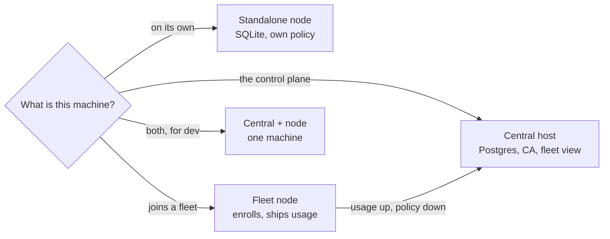
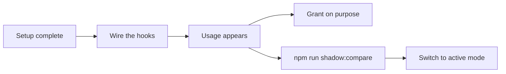

# Set up Windrow



`npm run setup` asks that one question and runs the right phases for the answer. This guide covers
the prerequisites for each answer, what the wizard does, how to confirm it worked, and what to do
when it did not.

> [!important]
> **Setup writes exactly one file: `windrow.env` at the repo root.** `server/config.js` reads it at
> startup, and `scripts/service-install.js` snapshots it into a Windows service. Configuration that
> lives only in a terminal is gone when that terminal closes — which is the one failure that leaves
> a node looking healthy while it ships nothing.

---

## Before you begin

### Every machine

| Requirement | Why |
|---|---|
| **Node.js 18+** and npm | `better-sqlite3` needs a version that still ships prebuilt binaries. If `npm install` starts compiling from source, update Node rather than installing build tools. |
| **A clone of this repo** | Setup runs from the repo root; every script path below is relative to it. |
| **Windows**, for the service paths | The server and client are plain Node and Vite and run in dev mode on any OS. Only `service:install` / `central:install` are Windows-only. |

### The central host, additionally

- **Postgres 16.** Either Docker Desktop (the wizard starts
  `server/central/docker-compose.yml` for you) or a Postgres you already run and can hand a
  connection URL for. Nodes never talk to it — only central does.
- **A hostname nodes can reach it by.** It goes into central's server certificate. A node that
  connects by a name you left out fails on the hostname, not on the certificate chain.
- **An open TLS port**, `5443` by default.

### A node joining a fleet, additionally

- **A central already running**, and its base URL as this node reaches it.
- **An enrollment token minted at central.** Single-use, 24 hours. You can run setup without one and
  enroll later, but until then the node neither ships usage nor pulls policy.

### Decide the fleet mode before you start

You are asked this on both the central host and each node, and the two answers have to match.

| Mode | Central holds | Nodes | Choose it when |
|---|---|---|---|
| **Shadow** | usage, the fleet view | keep their own policy authority | Always, first. Nothing a node decides depends on central being up. |
| **Active** | the canonical capabilities and grants | read a replica, plus the deny-list | You have measured agreement with `npm run shadow:compare` and want one catalog. |

> [!note]
> In **both** modes a node keeps enforcing from its local tables when central is unreachable. A tool
> call never waits on the network. Switching modes later is a re-run of `npm run setup`, not a
> migration.

---

## Run the setup wizard

```bash
git clone <this repo>
cd windrow
npm run setup
```

On Windows you can double-click **`setup.bat`** instead. Setup installs dependencies itself if
`server/node_modules` or `client/node_modules` is missing, so `npm run install:all` first is
optional.

Skip the question by naming the role:

```bash
npm run setup -- --role node          # a node, on its own
npm run setup -- --role node-fleet    # a node that joins a fleet
npm run setup -- --role central       # the central host
npm run setup -- --role dev-both      # central and a node here, for development
```

### Wizard options

| Flag | What it does |
|---|---|
| `--role <r>` | Skip the "what is this machine" question. One of `node`, `node-fleet`, `central`, `dev-both`. |
| `--show` | Print how this machine is configured and where each value came from. Changes nothing. Also `npm run setup:show`. |
| `--dry-run` | Print every command it would run, and the `windrow.env` it would write. Runs and writes nothing. |
| `--yes`, `-y` | Take every default without asking. Stops rather than guessing when a question has no default. |
| `--help` | The script's own header comment. |

> [!tip]
> **Re-running setup is the normal case, not a recovery.** Every step is idempotent, and the wizard
> offers your last answers back as defaults. Setting up a node today and joining it to a central
> next month is two runs of the same command.

### Do not run setup elevated

`setup.bat` deliberately does not request administrator rights. The wizard builds the client and
writes `windrow.env`, and doing that as Administrator leaves files your ordinary user then has to
fight. Only the last, optional step — registering a Windows service — needs elevation, so in an
unelevated shell the wizard skips that question and prints the single command to run afterwards.

---

## Set up a standalone node

The single-machine install: SQLite, its own policy catalog, no central. This is what Windrow was
before it grew a control plane, and nothing about the central architecture changed it.

```bash
npm run setup -- --role node
npm start          # http://localhost:4000 — API and dashboard on one port
```

The wizard walks six steps:

1. **Install dependencies** — `npm run install:all`, if `node_modules` is missing.
2. **Choose ports** — the supervisor port hooks connect to (`4000`), the private upstream port the
   API child runs on (`4100`), and the mutual-TLS port for the dashboard and CLI (`4443`). It tells
   you if the supervisor port is already taken.
3. **Set the database and paths** — `server/data/windrow.db`, and your home directory.
4. **Build the dashboard** — skipped, with an offer to rebuild, if `client/dist` already exists.
5. **Seed the catalog** — scans this environment's skill directories and MCP config. No demo data.
6. **Start the node** — offers the Windows service, or prints `npm start`.

> [!note]
> **Step 3 asks for your home directory on purpose.** A Windows service runs as `LocalSystem`, whose
> home is `C:\WINDOWS\system32\config\systemprofile` — not the one that holds `~/.claude` and
> `~/.gemini`. `WINDROW_USER_HOME` is how hooks find the real one.

---

## Set up the central host

One per fleet. It holds the Postgres, the fleet's certificate authority, and — in active mode — the
canonical capabilities and grants. **It is not a node:** it enforces nothing, and no hook ever talks
to it.

```bash
npm run setup -- --role central
```

The wizard walks eight steps:

1. **Install dependencies.**
2. **Set up the database** — start one with Docker Compose (it asks for user, password, database
   name and host port) or enter the URL of a Postgres you already have.
3. **Create the schema** — runs the same `server/central/store.js` `open()` that the central process
   runs at boot, so there is one definition of the schema and one migration ledger. This also cuts
   this month's `usage_events` partitions, so the first batch a node ships does not land in the
   default partition.
4. **Choose a mode** — shadow or active, as decided above.
5. **Configure the listeners** — the mutual-TLS port nodes connect to (`5443`), optionally a
   loopback plaintext listener for development, and the hostnames and IPs to bake into central's
   server certificate.
6. **Locate the certificate authority** — reports where it is, and warns about what it is.
7. **Seed the catalog** — in active mode, `server/seed-central.js`. In shadow mode there is nothing
   to seed yet; run `npm run seed:central` when you switch.
8. **Start central** — offers the `WindrowCentral` Windows service, or prints `npm run central`.

> [!warning]
> **Never copy `server/data/ca/` to a second machine.** That directory holds the fleet's private
> key, and a copy can mint an `admin`-scoped certificate for any node id in the fleet. Back it up
> encrypted; keep it on the central host only. This is not recoverable by editing a config file
> later — the remedy for a leaked CA key is reissuing the whole fleet.

> [!caution]
> The plaintext listener (`WINDROW_CENTRAL_ALLOW_INSECURE=1`) attributes a batch to whatever node id
> it claims, because there is no certificate to check it against. It binds `127.0.0.1` only. Turn it
> off before this host faces a network.

### Enroll the first admin

Central's first start writes a single-use bootstrap enrollment token to
`server/data/bootstrap-enrollment-token`, because with no admin enrolled there is nobody who could
mint the first token. Spend it:

```bash
npm run central                                     # in one terminal
node scripts/enroll.js --name admin \
  --url https://<this host>:5443 --token <bootstrap token>
```

### Mint a token for each node

With that admin certificate, mint one token per node PC:

```
POST https://<central>:5443/api/enrollment-tokens
{"scope": "node", "label": "eric's laptop"}
```

Scopes are `node`, `proposer` and `admin`. Tokens are single-use and expire in 24 hours.

---

## Set up a node that joins a fleet

```bash
npm run setup -- --role node-fleet
npm start
npm run verify:topology
```

The first four steps are the standalone node's — dependencies, ports, database and paths, dashboard
— and then:

5. **Point this node at central** — central's base URL, as this node reaches it. The wizard warns if
   you give a plaintext URL for a non-loopback host, because central refuses it.
6. **Choose a mode** — shadow or active. Active sets `WINDROW_POLICY_AUTHORITY=central`.
7. **Enroll this node** — paste the token; the wizard shells out to `scripts/enroll.js` and records
   the node id it comes back with. Leave it blank to enroll later.
8. **Start the node** — offers the Windows service, which is where the fleet configuration gets
   captured.

> [!important]
> **The credential must be issued by central, not by this node's own server.** A node that enrolls
> against its own `:4443` gets a certificate signed by its own CA, which central does not trust —
> every batch is then rejected at the TLS layer with `UNABLE_TO_VERIFY_LEAF_SIGNATURE`, and the only
> symptom is a 401 in a log file on the other machine. `npm run verify:topology` diagnoses that case
> by name.

### Enroll later, or re-enroll

```bash
node scripts/enroll.js \
  --name node-shipper \
  --url https://<central>:5443 \
  --token <fresh token>
```

| Flag | Notes |
|---|---|
| `--name` | Default `node-shipper`, **and the default is load-bearing.** `server/usageShipper.js` and `server/policy/policyClient.js` both load the credential named by `WINDROW_SHIP_CREDENTIAL_NAME`, which falls back to exactly that string. Any other name produces a valid certificate that nothing ever presents. Use a second name (`admin`, `mcp`) only for a second caller. |
| `--token` | `-` reads it from stdin; `WINDROW_ENROLLMENT_TOKEN` is read when the flag is absent. Both keep a secret out of shell history, which a full Windows command line is not. |
| `--ca <path>` | Central's CA certificate, obtained out of band. Omit it and the CA is fetched over an unverified hop, which the command warns about. |
| `--force` | Enroll again over a valid credential, spending the token. This is how you replace an expired one. |
| `--json` | Print `{"nodeId","scope","notAfter","dir"}` and nothing else. |

The private key is generated on this machine and never leaves it; only a public key is uploaded.

---

## Set up central and a node on one machine

For developing and demonstrating the fleet shape without a second PC.

```bash
npm run setup -- --role dev-both
# then, in two terminals:
npm run central
npm start
```

It turns on central's loopback plaintext listener, which is what makes a one-machine fleet reachable
without issuing the node a certificate for a hostname it does not have.

> [!caution]
> **This configuration cannot catch the mismatch it most matters to catch.** Both halves share this
> repo's `server/data/ca`, so the two-CA failure a real two-host fleet hits is impossible here. Test
> that on two machines before you rely on it. See `docs/design/setup-after-central.md` §2.

---

## Install as a Windows service

Setup offers this as its last step when it is running elevated. Otherwise, finish the wizard and run
the installer afterwards from a terminal opened with **Run as Administrator** — it reads
`windrow.env`, so nothing is lost by doing it in two passes.

| Double-click | npm | Registers | Service name |
|---|---|---|---|
| `install-service.bat` | `npm run service:install` | `server/supervisor.js` | `Windrow` |
| `central-install.bat` | `npm run central:install` | `server/central/index.js` | `WindrowCentral` |

Both `.bat` files re-launch themselves under UAC. Removal is `uninstall-service.bat` /
`central-uninstall.bat`, and they are separate on purpose: a node and a central are different
deployments, and both may legitimately be installed on one machine.

> [!warning]
> **Put the fleet configuration in `windrow.env`, never in the shell you run the installer from.**
> The UAC re-launch starts a *fresh* elevated process, so variables you set in the calling terminal
> are gone before the installer snapshots anything. A node configured for a fleet in a shell and
> then installed without those variables comes back up standalone, ships nothing, pulls no policy,
> and reports itself perfectly healthy — because a node with no central is a valid deployment.

`service:install` prints what it captured **and what it omitted**. Read that list.

---

## Verify the setup

```bash
npm run verify:topology
```

The wizard offers to run this as its final step. Run it yourself any time you change `windrow.env`.
It looks at all three halves from outside — none of these failures is visible from inside a single
process — and prints one table.

```
  this host: node-in-fleet
             WINDROW_CENTRAL_URL=https://central.example:5443
             WINDROW_POLICY_AUTHORITY=central

  [ok  ] node :4000 /api/ready    serving
  [ok  ] node :4443 (mTLS)        listening
  [ok  ] node credential          node-shipper (node scope), valid 362 more days
  [ok  ] node id                  n-4f2c… (from the enrollment credential)
  [ok  ] policy authority         central via https://central.example:5443 — this node is a read replica
  [ok  ] central /health          reachable, authority mode
  [FAIL] central mTLS handshake   UNABLE_TO_VERIFY_LEAF_SIGNATURE: …

  7 checked, 1 failed, 0 warning(s), 0 not applicable here
```

| Check | It fails when |
|---|---|
| `node :4000 /api/ready` | The supervisor is not serving. Start it with `npm start`, or check the `Windrow` service. |
| `node :4443 (mTLS)` | The API child never bound its TLS listener — the dashboard and CLI have nothing to connect to. |
| `node credential` | No credential, an expired one, or a certificate with no matching key. |
| `node id` | `WINDROW_NODE_ID` disagrees with the id the credential was issued to — central rejects every batch. |
| `policy authority` | `WINDROW_POLICY_AUTHORITY=central` with no `WINDROW_CENTRAL_URL`. The process silently falls back to node-authoritative. |
| `central /health` | Central is unreachable, or it is in shadow mode while this node expects it to be the authority. |
| `central mTLS handshake` | Central refuses this node's certificate. |
| `central database` | This host is central and Postgres will not answer. |
| `central schema version` | The database has never been migrated, or is behind what the configured mode needs. |
| `fleet roster` | Warns at zero nodes: nothing has enrolled *and* shipped yet. |
| `stranded usage rows` | Warns when events are landing in the default partition — partition maintenance has lapsed. |

The exit code is `1` if anything failed and `0` otherwise. A skipped check (`--`) is not a failure:
"this host is not central" is a correct answer, and the count line reports skipped checks separately
as "not applicable here". Add `--json` for the same result as JSON:

```bash
npm run verify:topology -- --json
```

Two more commands worth knowing:

```bash
npm run setup -- --show    # role, policy authority, every setting and where it came from
npm run shadow:compare     # how often central would have agreed with this node
```

---

## Troubleshoot

**Start with `npm run verify:topology`.** It names what is wrong rather than leaving you to infer
it. The cases below are what it names.

### Central rejects a node with `UNABLE_TO_VERIFY_LEAF_SIGNATURE`

That node enrolled against its own server instead of against central, so it holds a certificate
signed by the wrong CA. Mint a fresh token at central and re-enroll:

```bash
node scripts/enroll.js --name node-shipper --url https://<central>:5443 --token <fresh token> --force
```

Do **not** copy `server/data/ca/` to the node to work around it.

### The node enrolled, but nothing arrives at central

Three causes, in order of likelihood:

1. **The credential is under the wrong name.** Only `node-shipper` (or whatever
   `WINDROW_SHIP_CREDENTIAL_NAME` says) is ever presented. Check
   `server/data/credentials/node-shipper-cert.pem` exists.
2. **The service lost the fleet configuration.** Re-run `npm run service:install` from an elevated
   terminal with `windrow.env` in place, and read what it prints.
3. **Nothing has been called yet.** The outbox drains on an interval; `fleet roster` warning at 0
   nodes with a healthy handshake usually just means no usage has been generated.

### `npm run seed` is refused with `PolicyReadOnlyError`

This node is in active mode, where central owns the catalog — a capability written locally is a row
no delta can correct. Seed at central instead:

```bash
npm run seed:central
```

### Postgres never accepted a connection

The wizard waits 30 seconds and then stops. See why:

```bash
docker compose -f server/central/docker-compose.yml logs
```

Usually the published host port is already taken by another Postgres. Re-run setup and choose a
different port, or point it at the Postgres you already have.

### Central starts and then keeps restarting

`WINDROW_CENTRAL_DB_URL` is unset or wrong: central refuses to run without a database and throws
inside `store.open()`. `npm run central:install` refuses to register a service at all in that state,
for exactly this reason. Put the URL in `windrow.env`.

### The enrollment token was already spent

Tokens are single-use and expire in 24 hours. Mint another at central with an admin certificate
(`POST /api/enrollment-tokens`). If no admin is enrolled yet, the bootstrap token is at
`server/data/bootstrap-enrollment-token` on the central host.

### Setup said it could not install a service

The terminal is not elevated, and the Service Control Manager refuses service creation from a
non-admin process. Everything else has already been written to `windrow.env`, so finish the wizard
and then run one command from an elevated terminal:

```bash
node scripts/service-install.js      # or scripts/central-install.js
```

### Port 4000 is already in use

Another instance is probably running. `npm start` offers to stop it, or set `PORT` in
`windrow.env` and re-run setup.

### The dashboard shows 401s against `/api`

`server/data/api-token` may have been regenerated after the client cached an old one. Restart
`npm run dev:client` so the Vite proxy re-reads it.

### Setup failed partway through

Nothing is half-applied. `windrow.env` is written once, at the end of a role's steps, so an
abandoned run leaves the previous configuration intact. Run `npm run setup` again.

---

### Hooks aren't logging any usage

Enforcement wiring is separate from running the server. Confirm the target backend's hook config
points at `server/hooks/*.js` **by absolute path** — a `$CLAUDE_PROJECT_DIR`-relative command only
resolves inside this repo and fails with `MODULE_NOT_FOUND` in every other workspace.

### The catalog is empty after seeding

Check `SKILL_DIRS` points somewhere with `SKILL.md` files, or that the default paths in
`server/config.js` exist on this machine.

### A node installed as a service stopped shipping

A service that lacks `WINDROW_CENTRAL_URL` comes back up standalone and looks healthy while
shipping nothing. Re-run `npm run service:install` with `windrow.env` in place, and read what it
prints.

> [!note]
> A service captures its environment at install time into `server/daemon/windrow.xml`, and **that
> file overrides `windrow.env`**. Changing a value in `windrow.env` alone will not move a running
> service — edit the XML and restart the service.

## Day-2 operations

### Restarting without a fleet-wide fault

`server/supervisor.js` binds `:4000` and runs the API as its own child on a private port. A
PreToolUse hook is a fresh process that lives ~20 ms and has no retry loop, so an ECONNREFUSED
during a restart reaches the agent as a *denial*. The supervisor never lets go of the port: while
the backend is down it holds incoming requests for up to 5 s and replays them against the new
process, turning a restart into latency instead of a fault
([`design/upgrade-resilience.md`](design/upgrade-resilience.md) §3.4).

```bash
npm run restart          # bounce the backend; :4000 stays bound the whole time
npm run restart:status   # what the supervisor thinks is running
```

`sc stop Windrow` still drops the port, because it stops the supervisor too — use `npm run restart`
for a code reload, and reserve the service stop for taking Windrow down deliberately.

### Upgrading without denying the fleet

Stopping the server while agents are working turns every mutating call into a fault-denial. Take a
maintenance grace lease **first**, while the server is still up to sign it:

```bash
npm run upgrade:begin    # server STILL UP — signs the lease
                         # now stop the service, migrate, start the new build
npm run upgrade:status   # confirms the new build serves the hook contract
npm run upgrade:end      # revoke early; it expires on its own regardless
```

There is no offline path that writes a lease, by design. `upgrade:begin` talks to the mTLS listener
with an admin certificate named `cli`, so it cannot work against `:4000`.

### Debugging without enforcement in the way

An enforcement layer that denies half of what you try is a second variable in an experiment that
already has one. `npm run denials:off` opens a signed, time-boxed window in which policy denials are
suppressed ([`design/enforcement-pause.md`](design/enforcement-pause.md)).

```bash
npm run denials:off 20m "repro #412"   # 5–30 minutes; 15 by default
npm run denials:status                 # how long is left, and on which tiers
npm run denials:on                     # close it early; it expires on its own regardless
```

It covers `read_only` and `mutating`; add `--tiers=read_only,mutating,destructive` to include
destructive capabilities. Revocations and direct shell access to the governance API still deny.
Every call it lets through is written to `server/data/hook-fault-journal.jsonl` with the pause id on
it, and the server logs the window once a minute until it lapses.

`WINDROW_DISABLE_DENIALS=20m` opens the same window at startup — read by the *server* as it comes
up, never by the hook, so it stays a thing only a healthy server can sign.

In the dashboard it is on **Security → Hook Integrity**. While a window is open, a banner with a
live countdown sits above every page, since a pause is invisible otherwise — nothing fails while it
is on.

## After setup



1. **Wire the enforcement hooks.** The dashboard and API work standalone, but nothing is *enforced*
   until `server/hooks/` is wired into an agent backend's own hook config — Claude Code's
   `settings.json`, Antigravity's `hooks.json`. That is done by the
   `deploy-capability-governance-server` skill, not by `npm start`. See
   [`deployment-boundary-decision.md`](design/deployment-boundary-decision.md) for whether a
   workspace should point at a shared server or run its own.
2. **Open the dashboard** at `http://localhost:5173` (`npm run dev:client`) and check the capability catalog is populated. Not `:4000` — that listener only grants `agent` scope, so a browser gets the shell and then 401s.
   The in-app Setup guide walks the same ground interactively if anything looks empty.
3. **On a fleet:** watch the node arrive at central (`GET /api/fleet/nodes`, with an admin
   certificate).
4. **In shadow mode:** run `npm run shadow:compare` until you trust the agreement, then re-run
   `npm run setup` on central and on each node to switch to active.
5. **Reload code without a fleet-wide fault:** `npm run restart` bounces the backend while the
   supervisor holds `:4000`, so an in-flight hook call becomes latency instead of a denial. Reserve
   `sc stop Windrow` for taking Windrow down deliberately.

### Where the configuration lives

`windrow.env` at the repo root, read by `server/config.js` at startup. **A real environment variable
always wins over a line in that file** — so a sandbox, a one-off `VAR=… npm start`, and the values
captured onto a Windows service all still override it. `npm run setup -- --show` prints the
effective configuration and says where each value came from.

The variable-by-variable reference is in [reference/configuration.md](reference/configuration.md); the authoritative
list is `grep -rn "envCompat(" server`.

### Further reading

- [`design/setup-after-central.md`](design/setup-after-central.md) — the audit this setup path was
  built from, including why the CA lives on central.
- [`design/global-identity-and-central-db.md`](design/global-identity-and-central-db.md) — the
  two-host architecture and the Postgres schema.
- [`design/per-node-enrollment-credentials.md`](design/per-node-enrollment-credentials.md) — what a
  credential is and what it authorises.
- [`design/upgrade-resilience.md`](design/upgrade-resilience.md) — restarts, upgrades, and why the
  supervisor holds the port.
